# Python 中的混合效果随机森林

> 原文：<https://towardsdatascience.com/mixed-effects-random-forests-6ecbb85cb177?source=collection_archive---------0----------------------->

这篇博文介绍了一个[开源 Python 包，用于实现混合效果随机森林(MERFs)](https://pypi.python.org/pypi/merf) 。编写这个包的动机来自于我们在 [Manifold](http://manifold.ai) 建立的模型。我们遇到的大部分数据都是聚类的，例如来自个人的纵向数据、按人口统计学聚类的数据等。在许多情况下，我们发现与普通随机森林相比，使用 MERFs 提供了实质性的改进。

# TL；速度三角形定位法(dead reckoning)

如果你的模型有不可忽略的随机效应，MERFs 是很好的，例如集群有很大的特质。您可以通过输入以下命令从 PyPi 安装我们的软件包:

```
pip install merf
```

源代码可在[这里](https://github.com/manifoldai/merf)获得。投稿吧！该软件包基于 HEC 决策科学系的 Larocque 教授和 l'UQAM 营销系的 Ahlem 教授发表的优秀作品。

# 用例

大量的野外数据有一个聚集的结构。我们看到的最常见的例子是纵向聚类，在这种情况下，对于您希望建模的现象，每个个体都有多个测量值。例如，假设我们想将数学考试成绩建模为睡眠因素的函数，但我们对每个学生都有多个测量值。在这种情况下，特定的学生是一个集群。另一个常见的例子是分类变量导致的聚类。继续上面的例子，一个学生的特定数学老师是一个集群。聚类也可以是分层的。例如，在上面的示例中，有一个包含在教师集群中的学生集群，教师集群包含在学校集群中。在建立这个模型时，我们希望了解睡眠因素对数学考试成绩的普遍影响，但希望考虑学生、老师和学校的特质。

聚类数据有四种合理的建模策略:

1.  **为每个集群制作一个单独的模型。**这种策略不令人满意，原因有两个:(a)通过聚类进行分片使得任何给定的模型都没有太多的训练数据，以及(b)该模型不能在整个群体中学习。
2.  **为所有集群创建一个全局模型。**使用这种策略，模型可以学习整个群体，但不会学习特定集群的任何特质。例如，不考虑睡眠因素，一些学生可能有更高的数学能力。将这种影响明确地模型化，而不是将其归入睡眠因素，这将是一件好事。
3.  **制作一个全局模型，但是把集群 id 作为一个特征放进去。**这是一个明智的策略，但随着集群规模的增长，会出现扩展问题。具体来说，在随机森林中，在分裂决策变得难以处理之前，单个分类变量只能有很小的基数。在 R 中，大约 n_categories = 30。在 H20 中，n_categories = 64。Python Scikit-learn 中的随机森林实现甚至不支持非二进制分类变量。一个热编码集群是一个选项，但正如这篇出色的博客文章中所解释的，这种方法的性能很差(我们将在下面展示)。长话短说，在模型中直接使用高基数分类变量作为特征很糟糕。
4.  **混合效应模型。**这才是攻击集群数据的正确方法。在混合效应模型中，每个聚类获得一个随机效应，该随机效应是从先验中学习的，而先验本身是从数据中学习的。如下所述，这并不是一个新的想法，统计学家一直都在这么做。但是混合效果随机森林是新颖的——它们结合了线性混合效果模型的优点和非参数建模的能力，在这种情况下，您不需要理解问题的“物理学”。

# 混合效果建模的历史

线性混合效果(LME)建模是一个经典的技术。让我们更详细地看看这个，因为它激发了 MERF 模型。LME 模型假设一个生成模型，其形式为:

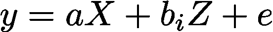

Linear Mixed Effect Model

在上面的等式中:

*   y 是目标变量。
*   x 是固定效果特征。假设 x 是 p 维的，例如有 p 个特征。
*   z 是随机效应特征。假设 z 是 q 维的，例如有 q 个特征。
*   e 是独立同分布(iid)噪声。它分布为 N(0，sigma_e)
*   a 是固定效应系数。它们对所有集群都是一样的。
*   I 是集群索引。我们假设在训练中有 k 个聚类。
*   bi 是随机效应系数。它们在每个聚类 I 中是不同的，但是被假设为来自相同的分布。在经典的 LME 问题中，这种分布被假设为 N(0，适马 _b)，其中适马 _b 从数据中学习。

LME 是更一般的分层贝叶斯模型的一个特例。这些模型假设固定效应系数是未知的常数，但随机效应系数是从一些未知的分布中提取的。使用迭代算法一起学习随机效应系数和先验。然而，本文不是关于层次贝叶斯模型的。如果你想了解更多，这是一个很好的资源。

虽然分层贝叶斯建模是一个成熟的领域，但它们要求你指定回归的函数形式，即你需要知道问题的物理性质。不幸的是，在许多情况下，特别是在复杂的系统中，很难指定一个函数形式。这就是随机森林的闪光点。由于它分割了特征空间，可以作为一个通用的函数逼近器。我们在 Manifold 的工作引导我们寻求将随机森林与混合效果的力量结合起来。

# 混合效果随机森林

我们在蒙特利尔高等商学院决策科学系拉罗克教授团队的出色工作中找到了答案。在一系列论文中，他们阐述了一种将随机森林与线性随机效应相结合的方法。更重要的是，拉罗克教授非常慷慨地提供反馈，使 MERF Python 包成为现实。

与 LME 相似，MERF 模型假设了一个生成模型，其形式为:

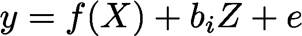

Mixed Effects Random Forest Model

注意，除了线性固定效应 a*X 被一个一般的非线性函数 f(.).在本文中，这个非线性函数是使用随机森林学习的。更一般的，f(。)可以是任何非线性回归模型，如梯度推进树或深度神经网络。

一种期望最大化(EM)技术被用于拟合 MERF。有四个参数需要拟合:

*   f(。)
*   所有已知集群的 bi。
*   适马 _b
*   西格玛 _e

我们不会在这里讨论数学——这篇论文做得更好——但 EM 算法背后的基本直觉是替代优化，例如，优化一个参数，同时保持其他参数不变。你不断重复这样做，直到收敛。具体来说，要适应 MERF，步骤如下:

1.  固定所有 bi 并将 y*计算为 y-bi * z。在所有样本中全局拟合一个随机森林，f(X)到 y*。
2.  修正 f()，适马 _b，西格玛 _e .优化找到 bi*。假设线性随机效应和高斯先验，有一个封闭形式的解决方案。
3.  修正 f()，bi。优化以找到适马 b 和西格玛 e。有一个封闭形式的解决方案，假设线性随机效应和高斯先验。

可以在每次迭代中计算的广义对数似然(GLL)是训练损失的度量。随着 GLL 的下降，合身程度提高。一旦它变平，我们通常可以停止迭代——拟合已经收敛。MERF 没有太多过度适应的危险——不会比经典的随机森林更容易过度适应。

一旦拟合出 MERF 就可以用来预测。对于 MERF 在训练中看到的“已知”聚类中的数据，预测包括随机效应校正:

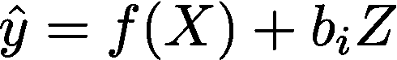

MERF prediction for known clusters

对于 MERF 在训练中没有看到的“新”聚类中的数据，预测仅包括固定效应:

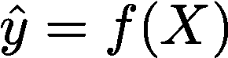

MERF prediction for new clusters

# MERF 蟒蛇皮包

我们的贡献是用 Python 实现了一个 MERF 并将其开源。我们实现了尽可能多的遵守 scikit-learn 模型接口。下面我们用一个例子来说明。这个例子可以作为一个可运行的 [Jupyter 笔记本在这里](https://github.com/manifoldai/merf/blob/master/notebooks/MERF%20Example.ipynb)下载。

我们有三个矩阵，包含我们的 n_samples =500 个训练数据:

*   X.包含三个固定效果特征的矩阵。尺寸= 500 x 3。
*   y.包含单个目标变量的向量。尺寸= 500 x 1。
*   集群。包含每个样本的 cluster_id 的向量。尺寸= 500 x1。我们在训练数据中有 k = 100 个唯一的聚类。

在这个例子中，没有明确的 Z 矩阵。我们创建一个来为每个集群建模一个随机平均值。它是一个维数为 500 x 1 的全 1 矩阵。

给定 X、y、集群和 Z 矩阵，我们可以通过实例化 MERF 模型并运行 fit 方法将 MERF 模型固定到该数据。MERF 模型目前有两个超参数:

*   n _ 估计量。为随机森林训练的树的数量。
*   max_iterations。EM 模型运行的最大迭代次数。

我们最终也计划为 EM 算法实现提前停止。这将增加一个额外的两个超级参数，即是否提前停止和应该有多大的耐心。

下面是 fit 的输出样子。请注意，拟合通常需要一些时间来运行——尤其是如果您运行多次迭代的话。这是不可避免的，因为每次 EM 迭代都需要随机森林拟合。即使对随机森林拟合进行并行化，单个 MERF 拟合也可能需要几分钟。

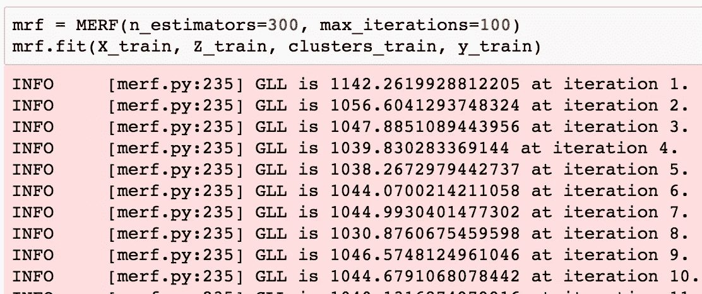

Training using MERF

一旦模型被训练，我们可以通过两个公共变量访问最终的随机森林和最终的已训练 b_is 矩阵:

```
mrf.trained_rf
mrf.trained_b
```

我们可以看看 b 的分布。它看起来像预期的方差为适马 _b 的近似高斯分布:

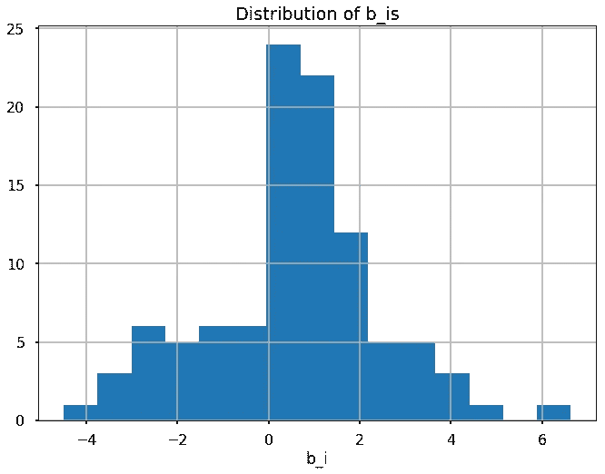

Final distribution of b_i’s

该模型还拥有 EM 迭代的历史。我们可以查看每一步的广义对数似然性(GLL ),适马 b、西格玛 e 和所有 bi 的估计值。

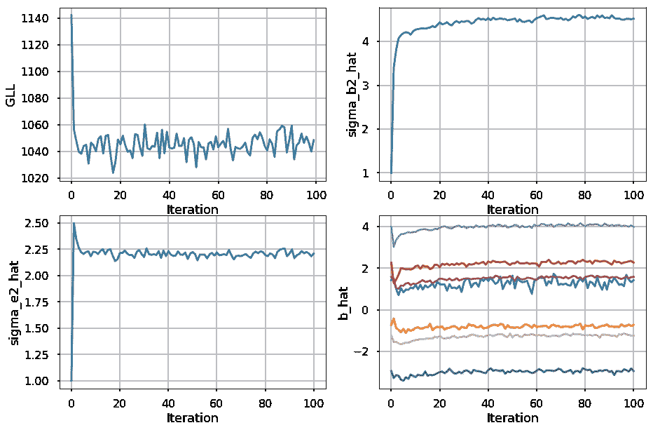

Convergence of MERF fitting

一旦拟合，该模型可用于预测给定 X、Z 和聚类的新样本。预测代码根据在训练中是否看到新样本的 cluster_id 来处理是否应用随机效应校正。

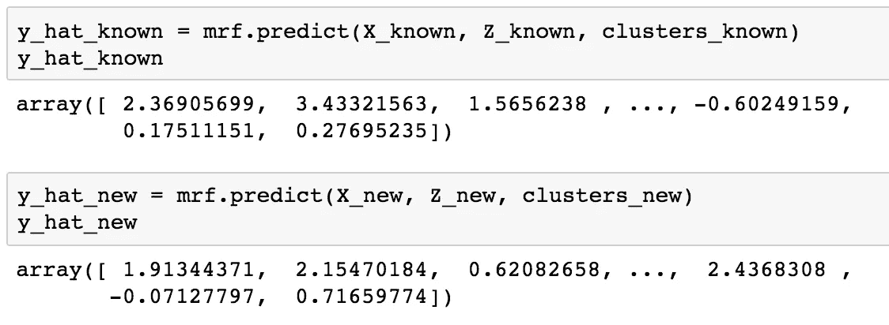

Predicting using MERF

# 合成数据性能

我们在合成数据上测试了 MERF 的性能。实验装置模仿了 MERF 发表的论文。我们从这个函数中生成数据:

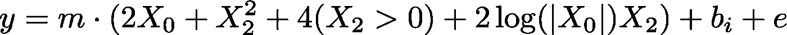

Data Generating Model

在这个等式中:

*   m 是我们选择的固定常数。
*   bi 取自正态分布 N(0，sigma_b)。对于每个簇 I，它们是常数。sigma_b 是我们选择的固定常数。
*   误差 e 是从正态分布 N(0，sigma_e)的 IID 得出的。sigma_e 是我们选择的固定常数。

在我们的实验中，我们为 m、sigma_e 和 sigma_b 选择不同的值，并从 100 个不同的不平衡集群中生成 500 个样本。我们在下表中总结了这些值，但是具体的值并不那么重要。重要的是两个派生的参数，总效应方差百分比(PTEV)和随机效应方差百分比(前一个)。本文对它们进行了详细定义，但直观上它们是:

*   PTEV =由于随机噪声导致的总方差的量是*而不是*。它越高，输出 y 越可预测。
*   PREV =由于随机效应产生的 PTEV 量。它越高，随机效应越大。

我们做了一个实验，将 MERF 与两个竞争对手进行比较:

*   不考虑随机效应的随机森林，即仅在 x 上拟合随机森林。
*   包括一个热编码簇 id 作为特征的随机森林，即我们创建 k 个新的热编码特征 X_ohe，并将其与 X 连接，并在组合的[X，X_ohe]特征矩阵上训练随机森林。

我们在实验中改变了 PTEV 和 PREV，并在两个不同的测试集上评估了性能:

*   测试集由模型训练的已知分类组成
*   测试集由模型在训练时不知道的新(未知)聚类组成

我们使用 10 次运行的平均均方误差(MSE)作为误差度量。我们将 MERF 增益定义为相对于比较算法的百分比增益:

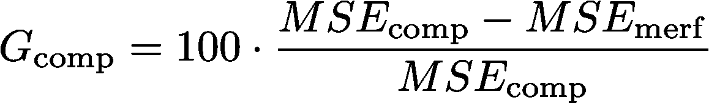

下面的表格和图表总结了结果。MERF**在两个对比车型上都有显著的性能提升**——特别是当 PREV 很高**(超过 50%！)**。此外，在预测新的聚类时，性能损失可以忽略不计。当数据中存在显著的随机效应时，MERF 是一个严格更好的模型。它是一个胜利者。

我们已经将数据生成器作为[实用模块](https://github.com/manifoldai/merf/blob/master/merf/utils.py)包含在 merf 包中。实验的源代码在 [Jupyter 笔记本里。检查一下，并运行您自己的实验！](https://github.com/manifoldai/merf/blob/master/notebooks/MERF%20Gain%20Experiment.ipynb)

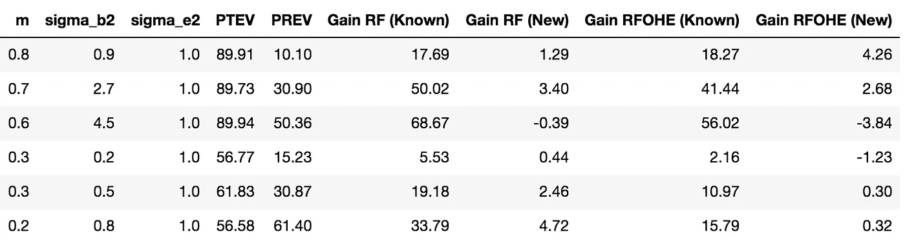

Experimental Results

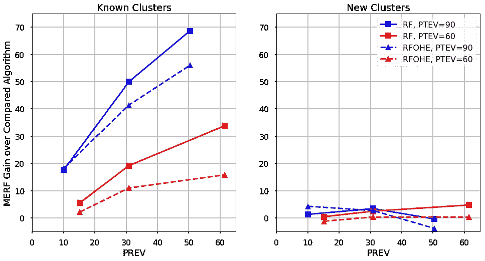

Gain of MERF over RF and RF-OHE

# 真实数据上的性能

Manifold 正在为我们的一个客户解决一个热模型问题。问题是根据许多因素，例如前一天的室外温度、室外湿度、室内温度，每天预测建筑物何时将达到其目标温度。我们有按建筑纵向分组的历史数据。集群高度不平衡。对于一些建筑，我们有多年的数据；对其他人来说，我们只有几周时间。这个问题需要一个混合效应模型。我们希望建立一个模型，它可以在整个人群中学习，但同时也要考虑到每栋建筑的特质。

与上面的实验类似，我们将 MERF 与以下对象进行了比较:

*   不考虑随机效果的随机森林，即仅在固定效果特征上拟合随机森林。
*   包括一个热编码建筑物 id 作为特征的随机森林，即我们创建 k 个新的热编码特征 X_ohe，并将其与固定效果特征连接，并在组合的[X，X_ohe]特征矩阵上训练随机森林。

由于异常值，我们将误差度量改为中值绝对误差(MAE ),而不是 MSE。我们在一个小的 N~1000 数据集上使用 5 重交叉验证来比较性能。实验结果总结如下。

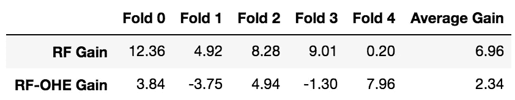

MERF Gain doing 5-fold cross validation

对于这个数据集，有一个小的 MERF 增益，但它不是那么显著。通过观察 MERF 收敛图，我们得到了一些线索。

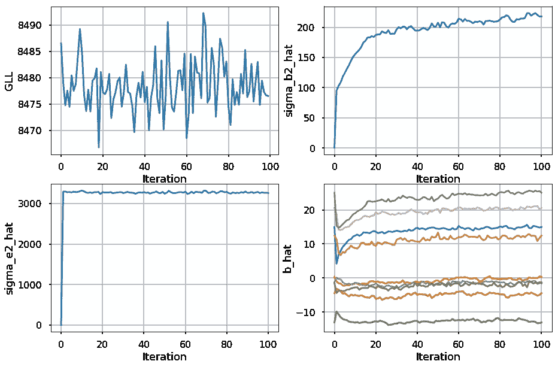

MERF Thermal Model Convergence

GLL 是平坦的，即使我们运行 100 次迭代，其他变量也在收敛。不清楚这是什么意思。此外，估计的误差方差 sigma_e 非常显著。数据似乎有一个非常低的 PTEV(因为离群值？).一个热编码(OHE)模型做得很好，因为建筑物的数量很少——k = 15。随着建筑数量的增加，OHE 模型的性能将会受到更大的影响。

所有这些因素，加上没有那么多数据的事实，让这个实验有点不确定。MERF 的表现并不比它的对手差——所以这并没有什么坏处——事实上平均来说还略有增加。这个实验需要更多的分析——当我们完成分析时，我们会在这个博客上公布它们。

# 结论

混合效应模型是强大的——而且许多数据都有适合使用它们的结构。将它们添加到您的模型清单中。混合效应随机森林(MERFs)是拼图的一部分。他们结合了最佳的随机森林和最佳的混合效果模型。我们希望它们对您有用。更重要的是，我们正在寻求帮助来扩展 MERF 套餐！我们会喜欢更多的贡献者。我们有一堆[未解决的问题](https://github.com/manifoldai/merf/issues)要处理:

*   添加提前停止。
*   添加更多学习器，例如梯度提升树、xgboost 等。
*   使用 GMERFs 向分类添加概化。参见论文[此处](http://www2.ims.nus.edu.sg/Programs/014swclass/files/denis.pdf)。
*   对使用非线性混合效果而不是纯线性效果进行新的研究。

向我们发送拉取请求！


# 关于流形


[Manifold](http://www.manifold.ai) 是一个 AI 工作室，在硅谷和波士顿都有办公室。当风险很高时，领先的公司会与我们合作开发新的人工智能解决方案。我们加快上市时间，创造新的知识产权，并培养内部能力。Manifold 的团队在**构思和部署生产机器学习系统和数据平台**方面经验丰富，这些平台位于谷歌、脸书、高通、麻省理工学院和成功的风险投资支持的初创公司。我们的专业领域涵盖**电子(消费和工业)、无线、医疗保健和营销**。我们有一个广泛的专家网络，我们利用了工业和工程子专业。

想研究这样的东西吗？向 sdey@manifold.com 伸出援手！我们正在[招聘数据科学家](http://manifold.ai/careers)。