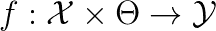
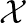
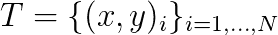
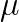
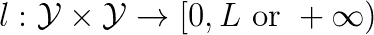
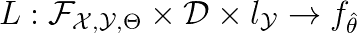

# [ML]正式框架—准备工作

> 原文：<https://towardsdatascience.com/ml-formal-framework-preliminaries-e3bb1a61a956?source=collection_archive---------6----------------------->

可以找到相当数量的机器学习论文，它们假设要理解良好的预备知识。另一方面，似乎没有那么多的出版物提供了清晰的初步介绍。

**分类器**

*   根据某些参数化将输入元素映射到输出元素的函数

Parametrizable Classifier

**输入空间、输出空间和参数空间**

Domain

Codomain

Parameters Space, where the Training is performed

典型地，在分类任务中，域的维度比共域的维度高得多，然后共域成为高度语义的空间

**数据集**

*   通过对未知分布执行 IID 采样获得的输入-输出对的集合(全球相关)

Training Set of N Elements

Latent World Related Distribution sampling which the Dataset is built

**损失函数**

使用基础真值为分类结果提供分数的函数，其中零是最高分数(即完美分类)

It compares the Classification Result with the Expected Result from the GT and assigns a score where 0 is perfect classification and it can be upper bounded to some L or go to +\infty

如果这在任何地方都是可微分的(典型地，分类器是可微分的)，那么可以使用基于梯度的方法来微调分类器参数，以便最小化训练集(可以是数据集的子集)上的损失

**学习机**

学习机是以数据驱动的方式执行给定模型的参数拟合(其选择是元参数)的算法，即依赖于训练集、要最小化的损失函数和训练/优化策略

Learning Machine performs the Parameters Fitting of the given parametric model according to the Dataset and the Loss Function