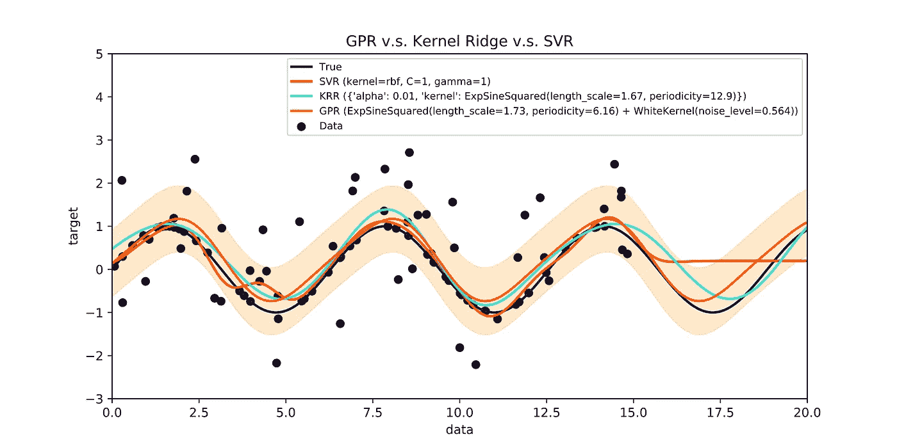
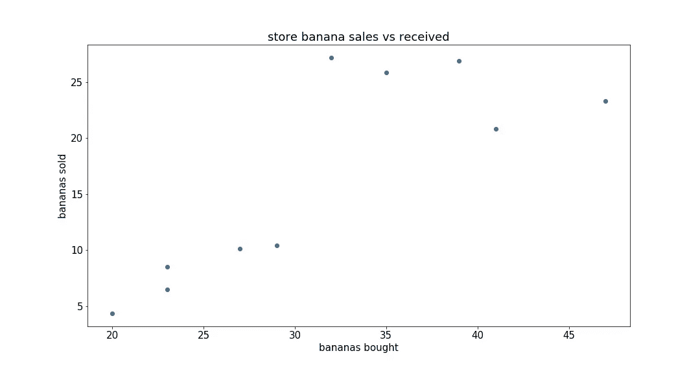
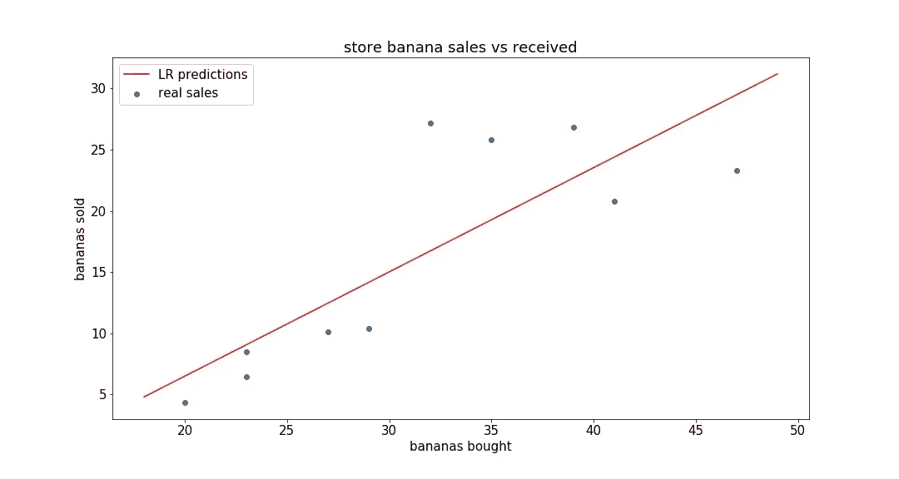
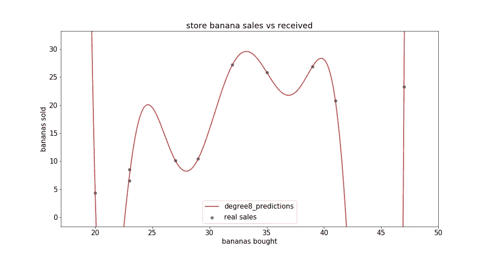
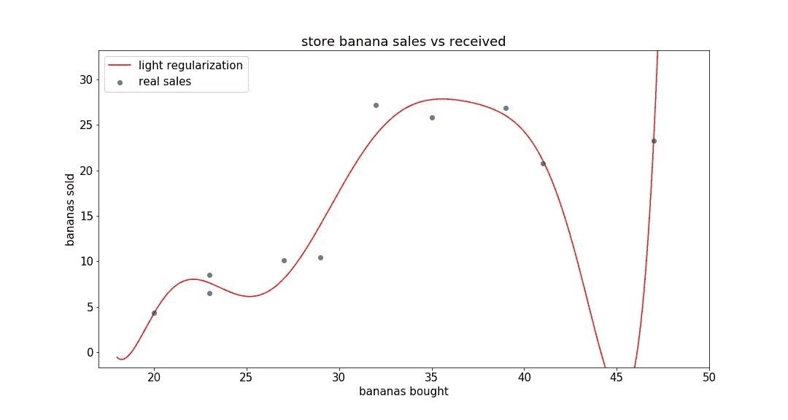
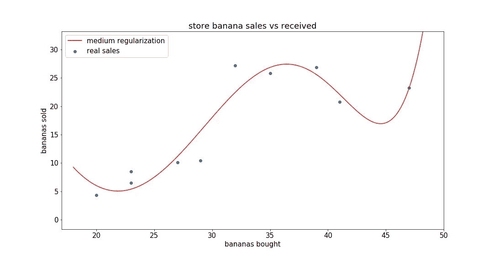
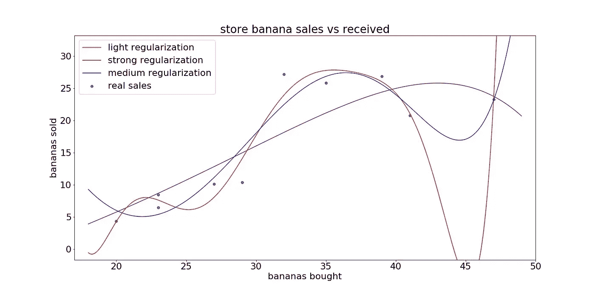
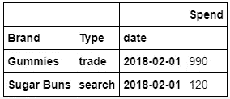
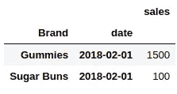
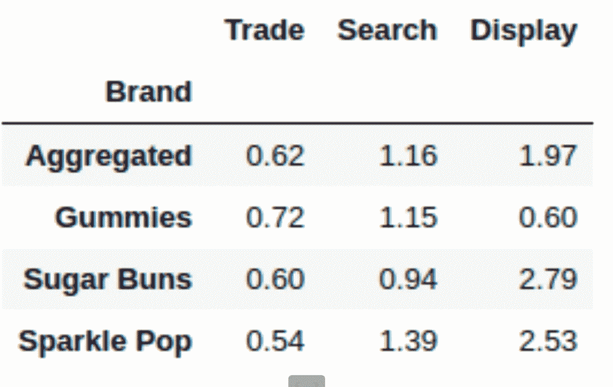

# ML 简介 4:正规化，验证和营销归因

> 原文：<https://towardsdatascience.com/ml-intro-4-performance-measuring-and-regularization-c1973d96c5b9?source=collection_archive---------7----------------------->

Fitting curves to data

本帖跟随[机器学习入门 3](https://medium.com/@leetandata/ml-intro-3-logistic-output-units-ec42cc576634) 。我们将把机器学习应用于模拟数据集，并探索如何测量机器学习的性能。然后我们将探讨正则化的数学概念。最后，我们将探讨如何在营销中使用规范化来提供有意义的见解。

本次会议的代码将张贴在[这里](https://github.com/leedtan/LeeTanData/tree/master/ML_Intro_4_Regularization)。

# 学习目标

这篇文章给出了一个真实世界的例子，如何使用**机器学习**到**获得关于**营销影响**的见解**。

听完这个讲座后，你应该明白

*   我们为什么以及如何判断机器学习系统
*   多项式回归
*   如何使用正则化
*   你如何从**读取**一个规则化的**机器学习**系统的**输出**到**做出营销决策**

*(这过于简化，但仍不是我们百事公司的做法，原因有很多，因为我们可以在很多方面做得更好。我们将在未来的会议中讨论其中的一些，其中一些将需要在没有博客帖子的情况下亲自教授。然而，这应该让你对如何解释机器学习来做决策有所体会)*

# 前言问题

我们要讨论的第一个问题是预测一家商店一周会卖出多少香蕉，前提是他们在那一周从当地农民那里购买了多少香蕉。

假设我们只有以下关于历史销售额的数据点:

你可能会认为有上升趋势，如果你买得太多或太少，货架看起来杂乱或稀疏，可能会有额外的复杂性，但也许这只是一个总体的上升趋势。理想情况下，机器应该具有相同的思想。

让我们把预测销售看作一个回归问题。线性回归可以解决这个问题:

卖的香蕉= _ *买的香蕉+_

我们的模型学习了卖出的香蕉= 0.85 *买的香蕉- 10.5，上面可视化了。

这似乎是合理的，它学到了一个积极的关系。但也许它遗漏了一些复杂的东西。

而不是学香蕉卖了= _ *香蕉买了+_:

假设 y 是卖出的香蕉，x 是买入的香蕉。接下来让我们想象一个更复杂的函数，y = _ * x + _ * x + _。这将能够学习更复杂的互动。但是为什么就此打住呢？下面，我们学习

y = _ * x+_ * x+_ * x+_ *x⁴+_ *x⁵+_ *x⁶+_ *x⁷+_ *x⁸+_

模型得知 y = x *-178667.84+x * 35887.57+x *-3375.53+x⁴* 173.71+x⁵*-5.29+x⁶* 0.1+x⁷*-0.0+x⁸* 0.0+16.0

哇哦。这些都是巨大的乘数。它完全符合我们的数据点，但对于任何超出这个范围的东西来说似乎都是不现实的。也许模型被赋予了很好地学习数据的能力，并且在预测超出正常范围的不寻常的高值或低值的未来数据点上不会很好地工作。

## 引入正规化

正则化是一个偏好简单模型的概念。在我们的多项式回归的情况下，正则化意味着我们惩罚大的乘数。有了正则化，我们将有更小的乘数，拟合数据点不那么完美，但有一个更平滑的曲线。

## 过度正则化

让我们将正则化添加到我们的模型中，乘数为 1。我们可以从 1 开始，并根据需要进行调整。

模型学习到的 y = x * 0.1638+x * 0.0038+x * 0.0001+x⁴* 0.0+x⁵*-0.0+x⁶*-0.0+x⁷*-0.0+x⁸*-0.0+16.0

肯定是小得多的乘数，但看看曲线，也许我们应用了太多的正则化，现在预测看起来太平了

## 欠正则化

现在，我们将正则化乘数从 1 改为 1e-20，以降低正则化程度。

模型学习到 y = x *-9944.37+x * 2122.76+x *-210.91+x⁴* 11.4+x⁵*-0.36+x⁶* 0.01+x⁷*-0.0+x⁸* 0.0+16.0

我们可以直观地看出，这个模型看起来需要更多的正则化，因为它的曲线似乎比我们希望的波动更大。

## 正规的

在 1.0 和 1e-20 之间，我们选择 1e-5 的正则化，这产生了下图。

这个看起来最符合数据的模型学习了

y = x *-1.5684+x *-0.0823+x * 0.0055+x⁴* 0.0001+x⁵*-0.0+x⁶*-0.0+x⁷*-0.0+x⁸* 0.0+16.0

我们还可以将这条新曲线与之前的其他正则化曲线进行比较，如下所示:

## 量化这些决策:验证

在上一节中，我们做了大量的曲线分析，以决定哪种模型最适合我们的数据。真实数据集比这更复杂，我们更喜欢自动做出这个决定的方式。

我们使用的算法称为训练和验证，工作原理如下:

假设我们有很多不同的模型，我们认为这些模型可能很好地符合数据。我们首先将数据分为训练集和验证集。我们的每个数据点都被随机映射到这些集合中的一个。

然后，我们选取每个模型，训练它们以适应训练集。一旦它学习了它的参数，我们就计算它在它的验证集上会收到的误差。误差最小的模型似乎对数据建模最好，不是基于它训练的特定数据点，而是基于看不见的数据点。

如果我们看上面，轻正则化模型似乎预测疯狂的值，所以它可能会在看不见的点上有很高的误差。强正则化也会由于忽略一些重要趋势而在看不见的点上具有高误差。因此，我们会选择具有中等正则化的模型，而不看这些曲线。

# 营销测量的规范化

既然我们已经有了数学概念，让我们谈谈学习有意义的营销见解！

## 模拟环境

对于这个例子，让我们假设我们想要了解我们的哪些营销行为是最有意义的。在这个模拟环境中，我们有多年的数据，可以了解我们在不同品牌的营销预算上花了多少钱，以及每个品牌的日销售额。

本例中我们的营销预算是“交易支出(Trade)”、“搜索支出(Search)”和“展示支出(Display)”。

我们的两个核心数据表如下所示:

一个表告诉我们什么时候进行促销，我们花了多少钱，另一个表告诉我们每个品牌每天的销售额。

## 营销归因目标

我们想要模拟的是我们营销活动的增量提升。如果我们能够理解我们的每一个营销活动是如何影响销售额的，我们就可以采取投资(促销支出)回报(增量)最高的营销活动。另一个目标可能是提出新的广告方法，但这超出了本练习的范围。

但问题是，我们不能直接测量增量升力。这是因为对于任何一天，如果我们没有进行促销，我们都不知道会有多少销售额。

## 营销归因方法

我们能做的是，如果我们没有进行促销活动，就估计销售额，然后用促销活动来估计销售额。我们通过将销售额构建为不含促销的基线预测加上促销增量的函数来实现这一点。

在现实世界的场景中，我们会更智能地模拟基线销售，但在这个场景中，让我们将每个品牌的销售模拟为一个常数，每个促销类型根据花费的金额增加一个增量。

预计销售额=基线(品牌)+提升(营销行动)

## 可能的次优方法:常数建模

我们可以模拟这些数据的一种方法是忽略不同品牌的投资回报率的差异。我们可以直接将全球销售额建模为每个不同营销领域的全球支出的函数。然而，这样一来，我们就失去了很多关于单个品牌的销售额是否与其特定的支出可变性密切相关的信息。我们看到，我们的全局模型受环境中其他噪声的影响要大得多，并且学习到的全局参数不如品牌或产品级别模型的全局聚集参数准确，这将在下面讨论。

## 促销-品牌互动

我们可能会想到的一个细节是，不同类型的促销可能对一些品牌有更大的影响，而对另一些品牌影响较小。因此，每个品牌都应该能够从每种营销类型中学习到自己的效果。

然而，如果我们为每个品牌、每个促销类型学习一个单独的乘数，在没有正规化的情况下，我们正在学习很多参数。还记得上面的回归模型吗，我们给香蕉数据集拟合了 8 个参数。如果不进行正则化，该模型很容易过度拟合并预测极值。我们的模型也能够过度拟合我们的数据集，类似于本文前半部分讨论的香蕉示例(我们肯定会在真实世界的数据中看到这种情况)。因此，我们可以假设某些类型的促销对大多数品牌应该有一致的影响，但是一些品牌可以偏离这些全球趋势。

我们通过建模来实现这一点:

提升(营销活动)=(全球投资回报率+品牌偏离)*营销支出

我们允许模型学习每种营销支出的全球投资回报率，但我们应用正则化来迫使我们的品牌水平变化接近于 0，这样大多数品牌采用全球投资回报率作为他们在该营销桶中的投资回报率。

## 模拟数据分析

如上所述运行线性回归，我们的模型学习以下系数:

现在我们正在进行营销归因测量！我们了解到每个品牌都有一个基准销售价值，并衡量了我们营销活动的投资回报。最上面一行的汇总表示表示每增加一美元的支出，您将获得多少美元的销售增量的总体影响。下面的行表示与这些全局参数的特定偏差，但大多数时候它们应该接近全局 ROI。

为了解释上述内容，我们可以看到显示通常具有最高的投资回报率，其次是搜索和交易。软糖的展示似乎非常低效，投资回报率只有 0.6%。搜索 Sparkle Pop，或显示 Sparkle Pop 或 Sugar Buns，都具有极高的 ROI。

为了生成这些数据，我们进行了回归分析。让我们讨论一下这个回归问题的数据点是什么样子的。举个例子，我们用“Gummies”这个品牌，当时我们在交易上花了 100 美元，在搜索上花了 200 美元，在展示上花了 300 美元。这一天的销售额是 1200 美元。

预计销售额=巨美基线销售额+ 100 *贸易投资回报率+ 100 *巨美贸易投资回报率+ 200 *搜索投资回报率+ 200 *巨美搜索投资回报率+ 300 *展示投资回报率+ 300 *巨美展示投资回报率。

我们尽量让预估销售额接近真实销售额，1200。

我们的目标是学习

*   全球贸易投资回报率，搜索投资回报率，并显示投资回报率
*   橡皮糖特定的巨美基线销售、巨美交易投资回报率、巨美搜索投资回报率和巨美展示投资回报率

我们会允许全球参数和基线销售容易波动，但我们应该大力规范巨美的具体投资回报率，这样我们就不会了解不切实际的变化。

如果我们在此设置中过度调整我们的参数，我们会看到所有品牌共享相同的全局 ROI，如果我们在此设置中过度调整我们的参数，我们会看到品牌具有疯狂的 ROI，如+10 甚至负值。

最后，当我们实际训练这些模型时，我们将按如下所述进行训练和验证:

*   首先，我们分离出 30%的数据作为验证数据。
*   我们使用剩下的 70%的数据来训练许多模型。
*   对于我们训练的每个模型，我们在验证数据上验证其准确性。为此，我们计算我们的预测和真实销售之间的平均误差。
*   我们挑选具有最高验证准确性的模型作为最佳模型。它有特定的正规化乘数。
*   使用来自我们最佳性能模型的参数，我们在完整数据集上训练最终模型。这些是我们用来为营销决策提供信息的参数。

# 我们(为将来的会谈)遗漏了什么

在这次会议中，我们遗漏了许多细节。

## 基线

我们没有讨论在学习 ROI 参数的同时构建智能基线估计。

这一点非常重要，因为我们可以把销售的季节性增长归因于我们在旺季花费更多的习惯。

我们需要学会表示每年和每周的季节性趋势，以及节假日和特定的年度事件，如感恩节、夏季、返校季和亚马逊优惠日。

## 产品级建模

如果可能的话，我们可以通过对产品级别的销售和支出进行建模来了解更多的价值。通过将产品级 ROI 建模为品牌级 ROI 的变体，我们可以了解产品级的洞察力，更重要的是，通过对粒度细节建模，我们可以了解更准确的品牌级洞察力。

这将是一个更细粒度的细分，类似于我们如何将全球趋势划分为品牌趋势，但现在将每个品牌划分为产品成分。

## 智能报告

我们可以智能地报告产品和品牌，可能如下:

首先，我们确定影响最大的品牌/支出组合，这些组合具有最高或最低的投资回报率，同时也有大量的支出。

然后，在我们想要增加或减少的品牌/广告类型中，我们可以确定最重要的产品来做出改变。

## 其他广告类型/渠道

我们展示了 3 个广告渠道的建模。当然，这些模型中的每一个都被模型不知道的其他广告渠道所混淆。通过添加更多的广告信息，该模型将得到改进，并且该模型还可以学习(在以后的帖子中进一步讨论)如何提出新的广告渠道。

## 时间相关性

我们可能有过去 5 年的数据。我们希望使用所有这些数据，但更关注最近的相关数据。

# 概述

在本次会议中，我们讨论了三个主题:

## 正规化

我们讨论了正则化来惩罚具有大值参数的复杂函数。这有助于我们学习简单的模型。

## 确认

我们讨论了培训与验证。验证有助于我们选择听哪个模型。

## 使用正则化进行营销归因

我们讨论了使用正则化来学习营销活动的 ROI 参数。

## 解读营销归因

我们在这节课中学到的主要东西是我们简单营销归因的数学方法背后的动机。通过理解动机，我们还学习了如何解释机器学习的输出以进行营销归因。

**这个问题展开:** [机器学习入门 3](https://medium.com/@leetandata/ml-intro-3-logistic-output-units-ec42cc576634) 。

**对于完全理解这一条的有意跟进帖子:**[https://medium . com/@ leetandata/machine-learning-engineering-1-custom-loss-function-for-house-sales-estimating-95 eec6b 12457](https://medium.com/@leetandata/machine-learning-engineering-1-custom-loss-function-for-house-sales-estimation-95eec6b12457)

**对于苦于代码或理解的人可选后续:** 本帖代码详细分析:[https://medium . com/@ leetandata/machine-learning-python-programming-introduction-for-business-people-10588 e 13 ce 9d](https://medium.com/@leetandata/machine-learning-python-programming-introduction-for-business-people-10588e13ce9d)

关于 Python 编程的免费综合课程。确保注册，但选择免费的可选项目。所有课堂内容免费提供:
[https://www . coursera . org/learn/python-programming-introduction/](https://www.coursera.org/learn/python-programming-introduction/)

一个比这个更复杂的机器学习教程，但比下面这个(不是我写的)简单:[https://www . ka ggle . com/rochelle Silva/simple-tutorial-for-初学者](https://www.kaggle.com/rochellesilva/simple-tutorial-for-beginners)

**软件工程师可选后续岗位:** 重数学、重 CS 的详解(上):[https://medium . com/@ leetandata/neural-network-introduction-for-Software-Engineers-1611d 382 C6 aa](https://medium.com/@leetandata/neural-network-introduction-for-software-engineers-1611d382c6aa)

重数学、重 CS 的详解(下):[https://medium . com/@ leetandata/neural-network-for-software-engineers-2-mini-batch-training-and-validation-46ee 0a 1269 a 0](https://medium.com/@leetandata/neural-network-for-software-engineers-2-mini-batch-training-and-validation-46ee0a1269a0)

**Cho 教授可选数学笔记:**
[https://github . com/NYU-dl/Intro _ to _ ML _ Lecture _ Note/raw/master/Lecture _ Note . pdf](https://github.com/nyu-dl/Intro_to_ML_Lecture_Note/raw/master/lecture_note.pdf)