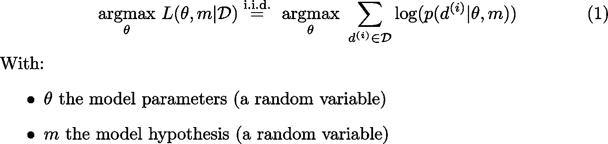
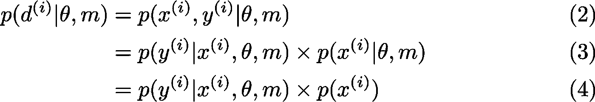
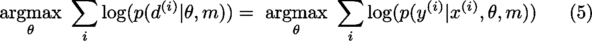
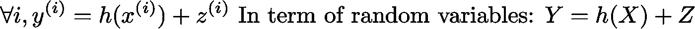
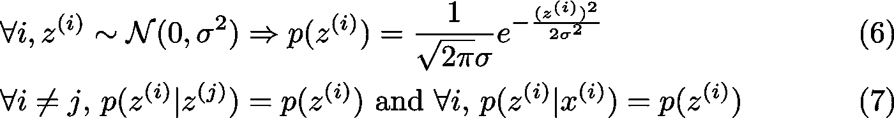
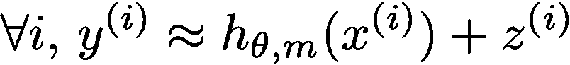
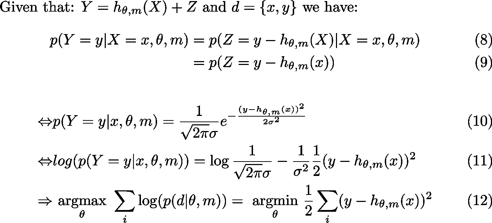
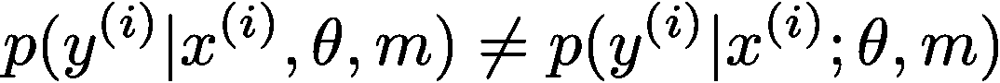
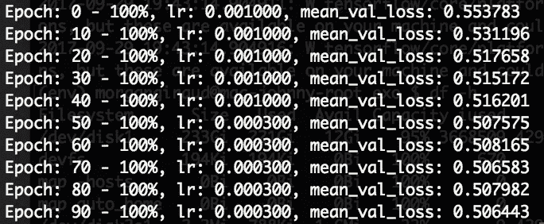
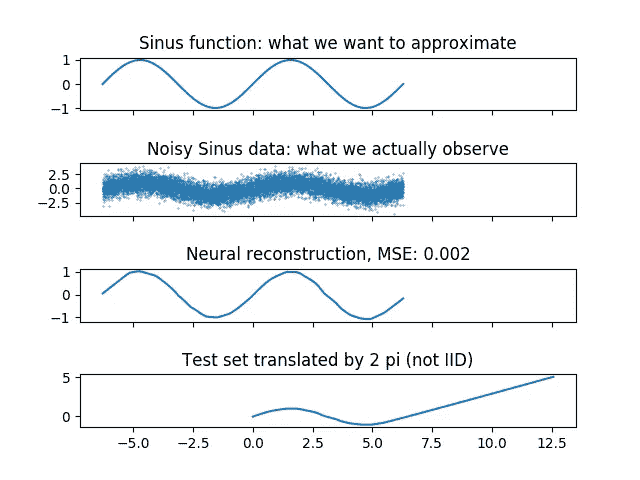

# ML 注释:为什么是最小二乘误差？

> 原文：<https://towardsdatascience.com/ml-notes-why-the-least-square-error-bf27fdd9a721?source=collection_archive---------0----------------------->

> 免责声明:
> 
> 这篇博文属于我的“ML 笔记”类别。它的目标是帮助我确保理解 ML 中使用的工具和理论。我相信，从教育学的角度解释我所学的东西，一步一步地消除任何未知，是实现这一目标的最佳方式。
> 
> 你需要什么？微积分，代数，概率，机器学习(主要是定义)的一点点数学背景。
> 
> 如果你发现任何错误，请联系。如果错误的信念留在我的脑海里，我会很难过，因为发现它们时已经太晚了，谢谢！

## 使对数似然显式化

在我的上一篇笔记中，我已经写了许多实践和理论上的原因来解释为什么对数似然法经常被用在 ML 算法中。但是我没有达到一个可以实现的显式表达式。

让我们通过探索这种对数似然思想如何在两个主要的 ML 概念下产生我们所说的最小平方误差(LSE)来进一步挖掘:监督学习(SL)和加性高斯白噪声模型(AWGN)。

我将只从概率的角度探讨 LSE(我不会探讨 LSE 如何从微积分或线性代数中产生/证明)。在文章的最后(备注 5)，你会发现一个链接，它的表亲(均方差或 MSE)的许多有趣的属性。

## 监督学习

在我的上一篇笔记中，我们最终展示了“*在给定数据集*的情况下最大化模型参数的可能性”等同于“*最大化数据记录概率的总和*”(考虑到 I.I.D .假设，请参阅上一篇笔记了解更多信息):

Maximum likelihood with log-probabilities in the general case

现在，我想把重点放在我们所谓的**监督学习**上，其中:

*   数据“d”是由输入对象“x”和所需输出值“y”组成的一对“{x，y}”
*   输出“y”取决于“x”
*   目标是建立一个模型，在给定“x”的情况下预测“y”

让我们将此设置应用于数据的概率:

The probability of a datum in supervised learning

*   (2)来自监督学习中数据的定义
*   (3)是关于条件概率的联合概率的定义
*   (4)源于输入的内在概率不依赖于模型或其参数的事实。

由于“x”的概率不依赖于“θ”,我们可以在(1)中应用(4)并获得:

Maximum likelihood with log-probabilities in supervised learning

因此，为了最大化监督学习中参数的似然性，我们可以关注在给定相应输入的情况下最大化输出对数概率的总和。这很好，因为从程序上来说，这符合函数的定义。

> 注意:为了完成优化过程，从理论的角度来看，联合概率符号是非常好的，那么为什么要关注条件符号呢？
> 
> 这也是由于工程上的限制。为了计算联合，您需要构建一个函数，将“x”和“y”作为输入，输出一个概率:联合概率。为了计算整个联合分布，你必须对给定的“x”的所有“y”进行批处理。现在，如果你想做小批量，你必须批处理这些批次的倍数…这导致了大量所需的 GPU 功率。
> 
> 实现相同结果的优化方法是直接使用我们的模型来近似条件分布:我们可以构建一个只接受一个输入“x”并立即直接计算所有“y”的函数。我们的模型正在逼近条件概率本身的分布。这大大减少了所需操作的数量，从而提高了我们算法的速度🔥

回到现实生活！我们知道我们可以在 TF 中建立一个参数化的函数来表示我们的模型族。它应该把我们的“x”作为输入，输出一些值，这些值可以解释为给定“x”的“y”的条件分布。我们现在有了模型，我们需要的最后一件事是优化(训练)函数参数的方法，这样我们的函数就可以逼近由数据集中的标签定义的分类分布。

所以，我们需要一个目标。这个目标可以是比较 1-hot 向量标签(分类分布)和我们的函数的输出，以减少它们之间对于每个数据的任何差异。但是如何证明任何比较呢？如何比较这些价值才是有效的、稳健的和实际上有助于概括的？应该用绝对差吗？平方误差？其他一些外来的规范？

有无数种可能的方法可以做到这一点，设计目标函数仍然是一个正在进行的活跃的研究领域。那么，我们如何从概率的角度证明 LSE 的使用呢？

## 加性高斯白噪声模型(**【AWGN】**

数据集只不过是来自随机过程的大量样本。无论我们的数据集中反映的随机性的原因是什么(要么来自丢失的信息，要么来自测量误差)，我们都可以用噪声对其建模。

假设我们的数据集是一致的(参见备注 1)，在问题中引入噪声有两种常见方式:

*   噪声可以独立于我们的数据，我们称之为噪声添加剂。这通常是由于贴标签时的人为错误和/或传感器不准确造成的。
*   噪声可能依赖于我们的数据，我们称之为乘法噪声。乘性噪声可以模拟丢失的信息，如丢失的感兴趣的输入特征，以预测输出。

那么，我们应该添加什么噪声呢？我们将采用最简单的可能噪声模型([这一选择是由奥卡姆剃刀](https://en.wikipedia.org/wiki/Occam%27s_razor)发起的):加性高斯白噪声模型，它表示:

*   存在一个将输入与输出相关联的函数，但我们测得的输出会受到加性噪声的影响。

The additive white Gaussian noise model

*   所有的噪声都是由白高斯分布产生的:平均值是`0`并且噪声是同分布的
*   所有噪声随机变量相互独立，并且独立于我们的数据集的数据

White Gaussian distribution

请记住，我们希望在上面的等式中模拟函数“h”。我们将假设我们选择的模型类(所有可以用我们的模型近似的函数)可以近似，以及我们想要的，这个函数“h”。

Approximation of the underlying mutual information relationship

给定我们的数据之间的关系的模型，我们可以滚动一些数学并且明确地写下给定“x”的“y”的概率:

Step by step demonstration to reach the LSE

*   (8)我们正在替换随机变量 Y 的值
*   (9)我们利用“X”给定，随机变量 Z 独立于 X，“θ”和“m”的事实
*   (10 和 11)我们应用(6)并获取日志
*   (12)我们从“argmin”中去掉任何常数。我们只保留 0.5，因为在计算导数时，数学上比较方便。

一个巨大的平方误差出现了！请注意，我们可以除以元素的数量来免费获取均方差(MSE)。

## 备注 1

**我** [**t 已经证明了**](https://arxiv.org/pdf/1611.03530.pdf) 如果你为监督学习生成一个随机数据集，你总是可以建立一个足够大的模型(就容量而言),它将过度拟合(记忆)数据并达到`*0*` 的训练损失😨

这很重要，因为这意味着对于任何数据集，你都可以欺骗自己相信你解决了一个实际上只是“硬编码”数据集关系的任务。

这对于必须严谨的数据集创建者来说更加重要:当一个人收集数据集用于监督学习时，他已经在假设**所收集的输入和输出数据具有互信息关系(相关)**。

举个例子，我可以收集一个数据集，把月亮的位置作为输入，把国家彩票的结果作为输出。即使它们明显不相关，您也可以找到一个模型来过度拟合该数据集。

## 备注 2

当使用 **AWGN** 时，我们引入了每个样本不可约的随机误差。您知道预测值**不能等于噪声输出值**，因为这意味着您过度拟合了您的训练集。

平均而言(意味着对于足够多的点)，每个预测应该具有等于加性噪声的标准偏差的误差。

特别是，如果你在“足够多的数据”上计算均方误差，我们应该接近噪声的方差(标准差的平方)。在下面的代码部分可以找到一个具体的例子。

## 备注 3

我们永远不应该忘记使用监督学习的最大似然估计程序和 **AWGN** 模型**的成本。**以下是我们为证明 LSE 培训阶段的合理性而做出的假设列表:

*   我们假设我们在训练集中的数据是独立的。
*   我们假设在我们的输入和输出之间存在一种交互信息关系
*   我们假设可以使用我们选择的模型族来近似这种关系。
*   我们假设只有一个噪声源
*   我们假设噪声在输出值上是附加的
*   我们假设这种附加噪声来自白高斯分布
*   我们假设这种加性噪声是独立的，与我们的数据无关

现在，一系列假设证明了为什么我们的模型应该能够在测试集上具有很高的准确性，并且能够预测新数据:

*   我们假设测试集中的数据(以及未来的数据)也是独立身份的
*   我们假设测试集中的数据(以及未来的数据)与训练数据分布相同。例如，现实生活中的概率分布通常不是时间独立的:它们随着时间的推移而演变，有效地打破了这些假设。
*   我们假设测试集(和未来数据)受到完全相同的噪声源的影响

假设所有这些，我们开发一些巧妙的学习算法，并假装它会工作……很多时候，它真的会工作！🍻

更严重的是，我认为记住这些假设有助于一个人在制作新数据集时非常小心，甚至更好的是，在事后测试它们。

## 备注 4

关于您可能在野外发现的符号的细微差异的说明:

Difference between conditional probability on multiple r.v. and parametrised function

第一个符号表示“theta”和“m”是随机变量，第二个符号(注意分号)表示“theta”和“m”只是参数(与概率观点无关)。两者都很好，只是解释不同，这影响了你允许自己应用的理论。

在我的例子中，我想说明的是，我们选择了一系列模型及其相应的参数，这些参数是基于一些先验知识，人们可以用概率分布，贝叶斯观点来建模。

在 ML 世界中，符号是非常复杂的，因为这是一个混合了多个数学领域的世界(至少是概率论、线性代数、微积分)。所以请，力求严谨！

## 备注 5，平方误差的更多性质

我不能在 LSE 上写一篇文章而不提到栈交换上这个关于均方误差(MSE)的可怕问题[。](https://stats.stackexchange.com/questions/127598/square-things-in-statistics-generalized-rationale/128619)

去读吧，里面包含了很多真知灼见！

## 编码时间到了

让我们用科学的方法，让理论与现实对抗吧！为此，我们将构建一个玩具示例:我们将尝试在给定的时间间隔上近似正弦函数。这在 SL 中被称为回归。

让我们深入代码，一切都在注释里。

以下是培训阶段:

Screenshot of the training phase

下面是结果图:

Results of the experiment

关于实验的一些评论:

*   我们相当成功地重建了窦功能，即使有很强的附加噪声
*   我们的优化算法损失确实在不可约误差:0.5 附近波动
*   当我们降低学习率时，我们有了更细粒度的改进
*   如果测试集与训练集不一致，它就不起作用！这个例子可能看起来很明显，但是如果您使用图像作为输入，那么当您离训练数据集流形太远时，就很难判断了。

无论如何，如果你读到这里，谢谢你！

干杯！🍺

> 感谢 [Alex Orange](https://medium.com/u/ddf05e93e794?source=post_page-----bf27fdd9a721--------------------------------) 的所有反馈！

ML 笔记系列

*   [为什么对数似然](https://blog.metaflow.fr/ml-notes-why-the-log-likelihood-24f7b6c40f83)？
*   为什么是均方差？(这个✍︎)

## 参考资料:

 [## 加性噪声和乘性噪声有什么区别？

### 回答:让我们考虑一个遵循随机微分方程的变量 x(t)。如果相应的随机…

www.quora.com](https://www.quora.com/What-is-the-difference-between-additive-and-multiplicative-noise)  [## 为什么要求差的平方而不是取标准差中的绝对值？

### 在标准偏差的定义中，为什么我们必须对平均值的差求平方才能得到平均值(E)和…

stats.stackexchange.com](https://stats.stackexchange.com/questions/118/why-square-the-difference-instead-of-taking-the-absolute-value-in-standard-devia)  [## 统计学中的正方形事物-一般原理

### 你为什么在统计中把事情平方？我在数据挖掘和统计课上遇到过很多这样的问题，但是没有人…

stats.stackexchange.com](https://stats.stackexchange.com/questions/127598/square-things-in-statistics-generalized-rationale/128619)  [## 监督学习-维基百科

### 监督学习是从标记的训练数据推断函数的机器学习任务。训练数据…

en.wikipedia.org](https://en.wikipedia.org/wiki/Supervised_learning)  [## 加性高斯白噪声-维基百科

### AWGN 经常被用作信道模型，在该模型中，对通信的唯一损害是宽带或频带的线性增加

en.wikipedia.org](https://en.wikipedia.org/wiki/Additive_white_Gaussian_noise)