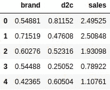
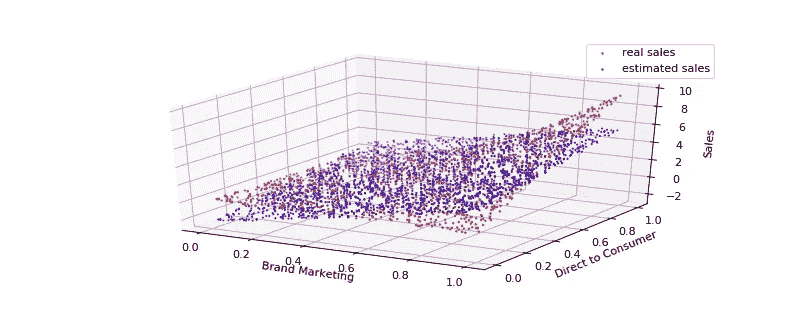
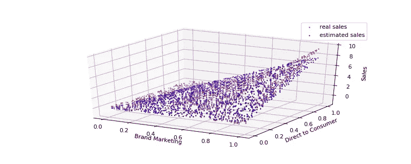
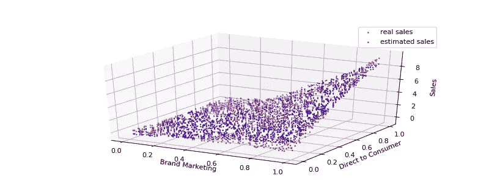
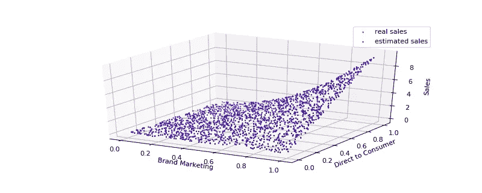

# 机器学习简介 2:我们的第一个例子

> 原文：<https://towardsdatascience.com/ml-preface-2-355b1775723e?source=collection_archive---------6----------------------->

本帖跟随[机器学习简介 1](https://medium.com/datadriveninvestor/machine-learning-preface-ba69bca4701d) 。我们将把机器学习应用于营销分析，作为一个简单的商业应用用例。我们将调查流行的机器学习方法，并将每种方法应用于市场分析。我们观察到，一些方法在衡量不同营销活动的投资回报率(ROI)时更具解释性，而其他方法提供了更准确的销售预测。参见第一堂课，了解本文中使用的每一种方法的解释。

这个内容是深度学习第一讲的后半部分。

# 学习目标

这篇文章给出了回归、特征工程和使用神经网络建模数据集的真实例子。它激励并展示了每种方法。

# 问题设置

在这个问题中，我们是一个虚构的营销组织。我们查看我们的历史支出和销售额，并将每日营销支出映射到每日销售额。

我们的环境经过简化，适合作为入门机器学习的学习工具。在这种设定下，我们有很多天的品牌销售，但是每一天品牌的销售额只取决于公司在那一天花了多少钱。

在这个例子中，有两种类型的营销支出，品牌营销(brand)创造品牌形象，直接面向消费者营销(d2c)推动销售。

我们根据这两种类型的营销都会增加销售额的规则来模拟这些数据，但是如果两者之间存在平衡，它们的贡献最大。支出与销售的图表如下:


单个结果可以像 excel 表格一样可视化，例如:



Table Visualizing Sales

## 编码活动:数据可视化

我们从导入一些我们需要的包开始

```
**import** **numpy** **as** **np
import pandas as pd
import** **matplotlib.pyplot** **as** **plt**
**from** **mpl_toolkits.mplot3d** **import** Axes3D
```

我们设置了一个随机种子，因此如果您在本地计算机上执行此操作，您将会看到与我们在这里看到的相同的随机结果。这对再现性很重要。

```
np.random.seed(0)
```

接下来，我们生成数据集

```
NUM_SAMPLES = int(2e3)
brand_spend = np.random.rand(NUM_SAMPLES)
d2c_spend = np.random.rand(NUM_SAMPLES)
individual_contributions = brand_spend * .01 + d2c_spend * .02
collaboration = np.square(brand_spend) * d2c_spend * 10
sales = individual_contributions + collaboration + np.random.rand(NUM_SAMPLES)/10
```

最后，对于线性回归部分，我们有一个执行线性回归的函数和另一个绘制结果的函数:

这里，我们将数据集包装到一个数据帧中。这让我们可以像在 python 中查看 excel 表格一样查看数据集。

```
dataset = pd.DataFrame({
    'brand': brand_spend,
    'd2c': d2c_spend,
    'sales': sales
}).round(5)
```

可以通过以下方式查看

```
dataset.head()
```


Table Visualizing Sales

接下来，我们将数据集分成 X 和 Y，并可视化这些值。

```
X = dataset.drop('sales', 1)
Y = dataset['sales']
X1 = X['brand']
X2 = X['d2c']
fig = plt.figure(dpi=80, figsize = (10, 4))
ax = fig.add_subplot(111, projection='3d')
ax.scatter(X1, X2, Y, c='r', label='real sales', s = 1)
ax.set_xlabel('Brand Marketing')
ax.set_ylabel('Direct to Consumer')
ax.set_zlabel('Sales')
plt.legend()
plt.savefig('images/data.jpg')
```

**概念检查:用 Python 自己建立一个数据集:** 用营销活动和销售之间的线性和自定义数学关系建立并可视化一个类似的数据集。

你能看到你在营销活动之间建立的互动吗？

试着在脚本的开始就参数化你的系统，以便于启用或禁用交互。

## 解决方案:

这是一个备选数据集，其特征略有不同。

```
import numpy as np
import pandas as pd
import matplotlib.pyplot as plt
from mpl_toolkits.mplot3d import Axes3D
np.random.seed(0)
NUM_SAMPLES = int(2e3)
noise_ratio= 1e-2
brand_spend = np.random.rand(NUM_SAMPLES)
d2c_spend = np.random.rand(NUM_SAMPLES)
geo_mean_mult = 10
exp_brand_spend_mult = 1
contributions =  {'brand':.01, 'd2c':.02}brand_contributions = brand_spend * contributions['brand']
d2c_contributions = d2c_spend * contributions['d2c']
geo_contribution = np.sqrt(brand_spend* d2c_spend) * geo_mean_mult
exp_brand_contribution = np.exp(brand_spend) * exp_brand_spend_multsales = brand_contributions + d2c_contributions + exp_brand_spend_mult + np.random.rand(NUM_SAMPLES) * noise_ratio
dataset = pd.DataFrame({
    'brand': brand_spend,
    'd2c': d2c_spend,
    'sales': sales
}).round(5)
X = dataset.drop('sales', 1)
Y = dataset['sales']
X1 = X['brand']
X2 = X['d2c']
fig = plt.figure(dpi=80, figsize = (10, 4))
ax = fig.add_subplot(111, projection='3d')
ax.scatter(X1, X2, Y, c='r', label='real sales', s = 1)
ax.set_xlabel('Brand Marketing')
ax.set_ylabel('Direct to Consumer')
ax.set_zlabel('Sales')
plt.legend()
plt.savefig('demo.jpg')
```

# 方法概述

为了了解营销支出的影响，我们将从使用线性回归将营销支出映射到销售额开始。然后，我们将查看我们的损失曲线，并认识到线性回归的不足，鼓励我们执行特征工程。

在手动特征工程之后，为了帮助特征生成过程，我们使用神经网络的隐藏层来提取特征，并将其用于我们的最终回归问题。我们将比较和对比可解释性和性能。

# 建模线性回归

为了了解销售和营销支出之间的关系，我们首先拟合一个线性回归模型。

这是告诉模型填充以下公式中的空白:

销售= __ *品牌营销+ __ *直接面向消费者+ __

我们的线性回归通过学习参数来近似这条曲线:

销售额= 5.11 *品牌营销+ 3.28 *直接面向消费者-2.45

这是非常有见地的，因为我们可以直接读取每种支出的投资回报率，例如，我们可以将此解读为衡量品牌营销的投资回报率为 5，d2c 的投资回报率为 3。除了我们注意到一个问题！我们可以在下面直观地看到，该模型并没有准确地表示数据。模型学习到的**预测**显示在下面的**蓝色**中，显然不适合红色的销售:



Linear Regression estimates vs Sales

以下是一些用于训练线性回归模型和可视化预测的简单代码。

```
**from** **sklearn.neural_network** **import** MLPRegressor
**from** **sklearn.linear_model** **import** Ridge
**from** **mpl_toolkits.mplot3d** **import** Axes3D
**def** model_sales_regression(dataset, model='Ridge'):
    num_samples = dataset.shape[0]
    cutoff = (num_samples * 3) // 4
    Xtrn = dataset.drop('sales', 1).iloc[:cutoff,:]
    Ytrn = dataset['sales'].iloc[:cutoff]
    Xval = dataset.drop('sales', 1).iloc[cutoff:,:]
    Yval = dataset['sales'].iloc[cutoff:]
    model = Ridge().fit(Xtrn, Ytrn)
    coefs = model.coef_.round(2)
    yhat = model.predict(dataset.drop('sales', 1))
    yhatval = model.predict(Xval)
    loss = np.square(Yval - yhatval).mean()

    print('learned coefficients', list(zip(X.columns, coefs)))
    print('loss:', loss)
    print('intercept', model.intercept_.round(2))

    **return** model, yhat, coefs, loss**def** graph_real_and_predicted(dataset, yhat, fname=**None**):
    X = dataset.drop('sales', 1)
    Y = dataset['sales']
    X1 = X['brand']
    X2 = X['d2c']
    fig = plt.figure(dpi=80, figsize=(10, 4))
    ax = fig.add_subplot(111, projection='3d')
    ax.scatter(X1, X2, Y, c='r', label='real sales', s = 1)
    ax.scatter(X1, X2, yhat, c='b', label='estimated sales', s = 1)
    ax.set_xlabel('Brand Marketing')
    ax.set_ylabel('Direct to Consumer')
    ax.set_zlabel('Sales')
    plt.legend()
    **if** fname **is** **not** **None**:
        plt.savefig('images/' + fname + '.jpg')
```

这是训练线性回归的代码。

```
model, yhat, coefs, loss = model_sales_regression(dataset)
graph_real_and_predicted(dataset, yhat, 'linear')
```

# 误差量化

为了总结我们模型的准确性，我们来看看真实销售额和我们的预测之间的平方误差。我们用这些平方误差的平均值来表示我们的性能。

## 为什么是平方误差？

这是基于最小化最坏情况的常见默认选择。假设 1 的误差是可以接受的，如果我们经常在预测中误差 1，这并不完美，但我们可以处理它。但是如果我们有一次差了 3 分，那是不可接受的。我们从来不想偏离太多，但是我们可以接受经常偏离很少。误差平方会是 1 比 1 的平方，这没问题，它会是 3 比 9 的平方，这是一个更大的误差。

平方误差是一种常见的误差度量，因为它可以最小化最坏情况下的误差(或者让我们这样想，并在后面列出其他数学原因)。

## 概念检查:提出两个可供选择的有意义的误差度量。

如果在课堂上阅读，分组讨论。

## 一些解决方案:

1-平均绝对误差(我们预测的绝对误差的平均值)是有意义的，但是不会随着你犯大的误差而迅速增加。如果我们更关心百分比误差而不是实际误差，那么 2-平均绝对百分比误差(我们平均偏离的百分比)是有意义的。
`mean(abs(Y-yhat)/Y)`

为了确保我们计算出一个现实的性能衡量标准，我们在模型没有训练的数据点上衡量我们的损失。因此，我们从一些数据开始，用其中一些数据来拟合模型的参数，用其他数据点来测试我们的性能。这接近于衡量模型在未来对未知数据的表现。

使用线性回归，我们的均方误差为 0.89。这还没有意义，但与其他模型相比，以后会有意义。

但是，我们可以清楚地看到，我们的模型没有准确地捕捉销售趋势，因为我们看到了预测和真实销售之间的可预测差异区域。

# 特征工程

作为一个聪明的专业人士，我们得出结论，从花费的线性回归不能捕捉所有的数据结构。为了扩展我们的模型，我们注意到当两个输入都很大时，显著增加，所以我们可能需要一个特征来捕捉两种花费类型的组合。因此，我们产生了一个特征，即品牌营销的产品*直接面向消费者的营销支出。要让这个功能变大，需要品牌和 d2c 支出都很高。

## 查看我们的新功能

让我们快速检查一下这个新特性，brand * d2c。

当我们没有钱花的时候会发生什么？该值为 0。如果 brand 是 1，d2c 是 1 呢？值是 1 * 1 = 1。所以它衡量营销支出？

但是如果我们有 10 美元可以花，我们在 d2c 上花了 1 美元，在品牌上花了 9 美元呢？我们有 1 * 9 = 9。好吧，但是如果我们拿同样的一美元，把它分成两类消费，每类 5 美元。我们有 5 * 5 = 25！该特征检测“两种花费类型都有投资的平衡”。

现在，我们的模型学习使用函数更好地逼近曲线:

销售额= 0.68 *品牌— 1.01 * d2c + 8.74 *品牌* d2c — 0.29

## 概念检查:特征工程

在运行线性回归和可视化预测之前，尝试在熊猫数据框架中构建特征品牌* d2c。在过去，这是一项非常有意义、深思熟虑的任务，是 ML 的一大部分。

## 解决方案:特征工程

以下解决方案:

```
dataset['brand * d2c'] = dataset['brand'] * dataset['d2c']
model, yhat, coefs, loss = model_sales_regression(dataset)
graph_real_and_predicted(dataset, yhat, 'feature_engineering')
```



Feature Engineering Approximation

这看起来不错。我们的预测现在更好地跟踪销售，但我们仍然不完美。我们的误差现在是 0.2，低于纯线性回归的 0.9。

看我们的参数，可以看到品牌和 d2c 营销的组合是最强的影响者，系数为 8.74。这只是真实销售额的近似值，但该参数可以这样解释:如果品牌支出为 0，那么增加 d2c 支出将无济于事，因为无论如何，品牌* d2c 都将为 0。

***如果品牌为 0，那么从 d2c 到组合期限的投资回报率为 0。***

但是，如果品牌支出为 1(千美元)，那么随着我们增加 d2c 支出，我们每支出 1 美元将获得 8.74 美元的投资回报。

***如果品牌为 1，那么从 d2c 到组合期限的投资回报率为 8.74。***

这听起来不太合理，但作为一个近似值，它告诉我们，增加销售的最佳方式是在品牌和 d2c 营销之间取得平衡，因为组合是最大的因素。

此时，我们认识到我们仍然有 0.2 的显著损失，并且仍然有可预测误差的可见区域，并且认为我们仍然可以改进我们的模型。

# 用于特征提取的小型神经网络

为了添加更多生成的特征而不必定义它们应该是什么，我们考虑一个小型神经网络，它生成 6 个特征，然后使用这些特征来预测销售。

## 概念检查:编写一个 sklearn 神经网络代码

使用 sklearn.neural_network 中的 MLPRegressor 生成特征，并用 6 个隐藏单元对销售进行建模，然后显示模型学习到的特征。

## 解决方案:编写一个 sklearn 神经网络

下面是像以前一样分割数据集的代码，但是使用了神经网络。然后，它将系数组合在一起，以报告模型表示。

```
**def** model_sales_MLP(dataset, hidden, print_coefs = **True**, max_iter= 10000):
    num_samples = dataset.shape[0]
    cutoff = (num_samples * 3) // 4
    Xtrn = dataset.drop('sales', 1).iloc[:cutoff,:]
    Ytrn = dataset['sales'].iloc[:cutoff]
    Xval = dataset.drop('sales', 1).iloc[cutoff:,:]
    Yval = dataset['sales'].iloc[cutoff:]
    model = MLPRegressor(hidden, validation_fraction = 0, solver='lbfgs', max_iter= max_iter).fit(Xtrn, Ytrn)
    coefs = model.coefs_
    yhat = model.predict(X)
    yhatval = model.predict(Xval)
    loss = np.square(Yval - yhatval).mean()
    hiddens = coefs[0].T
    final_mlp = coefs[1].flatten()

    coefs = list(zip([dict(zip(X.columns, h)) **for** h **in** hiddens],
                     [['output mult:', m] **for** m **in**  final_mlp.flatten()], 
                     [['intercept:', i] **for** i **in**  model.intercepts_[0]]))
    print('loss:', loss)
    **if** print_coefs:
        **for** idx, c **in** enumerate(coefs):
            f1, o, i = c
            print('feature', idx, '=', f1['brand'].round(2), '* brand +', 
                  f1['d2c'].round(2), '* d2c', '+', i[1].round(2))
        output = 'yhat = '
        **for** fidx, v **in** enumerate(final_mlp):
            output = output + str(v.round(2)) + ' * feat ' + str(fidx) + ' + '
        output = output + str(model.intercepts_[1][0].round(2))
        print(output)
    **return** model, yhat, coefs, loss
```

我们从我们的数据集中创建模型并绘制它，用一个 6 个单元的隐藏层

```
model, yhat, coefs, loss = model_sales_MLP(dataset, [6])
graph_real_and_predicted(dataset, yhat, 'neural_network')
```

在训练好我们的神经网络之后，我们考察模型的特征:
特征 0 = 2.85 * brand + 1.83 * d2c -2.79
特征 1 = 1.62 * brand -2.15 * d2c -0.03
特征 2 = 0.08 * brand -0.54 * d2c -0.77
特征 3 = 0.55 * brand + 0.16 * d2c -0.81
特征 4 = 3.83 *

**然后，在用于如下预测 yhat 之前，对特征进行剪裁以将任何负值设置为零:**

如果特征[i]是正的:特征[i]=特征[I]

如果特征[i]为负:feat[i] = 0

Yhat = 3.0 *专长[0] -1.48 *专长[1] + 0.82 *专长[2] -0.2 *专长[3] + 1.6 *专长[4] -1.82 *专长[5]–0.56

哇有那么难解读吗！在后面的讲座中，我们将开始解释神经网络，但我们肯定不会试图去解读每一个单独的特征，那会太乏味了。

但是看看我们的损失，我们下降到 0.12 的损失！此外，我们的图表现在看起来与真实销售额非常接近。



Neural Network Approximation

# 深度神经网络

最后，让我们假设我们不是试图通过衡量投资回报率来为营销决策提供信息，而只是试图预测每日销售额。在我们的神经网络中，不是 6 个隐藏单元(6 个特征)，而是使用 100 个隐藏单元，并使用该隐藏层来计算 100 个单元的新隐藏层，最终用于执行线性回归。

这进一步减少了我们的损失，现在我们几乎完全符合数据集，损失为 0.001。现在想想，这甚至不是训练数据。这不是模型与训练数据的吻合程度，而是模型与训练过程中从未见过的数据的吻合程度。

但是如果我们想解释这个模型呢？我们有一个 100 单位的隐藏层，然后又有一个 100 单位的隐藏层。因此，为了计算第二隐藏层，我们从第一隐藏层为第二隐藏层中的 100 个单元中的每一个计算 100 次乘法。那是它学过的一万次乘法！我们永远无法概念化这么多的相互作用，但我们认识到神经网络已经开发出这些特征来精确地拟合数据。



Deep network appears to fit dataset perfectly

# 包扎

让我们回顾一下。初始线性回归对数据集进行了建模，但它显然有不太适合的区域。我们执行了一些特征工程，因为我们从对问题的思考中猜出了一些有价值的特征。这帮助我们更好地拟合数据集，我们的模型更准确，但有点难以理解。

接下来，我们在网络中引入了一个隐藏层来学习我们的特征，我们提出了六个特征，以某种方式为我们解决了问题。这些变得更加难以解释，但我们知道这些特征在某种程度上比我们最初的两三个特征更好地理解了模型。

我们最后让一个深度神经网络来解决这个问题。我们观察到这个模型更加精确，但是解释成千上万的乘法运算是不可行的。

# 代码分析

下面我们将快速重新执行上面的所有分析，同时只报告代码和简要总结。首先，我们导入一些将在以后对我们有帮助的库

```
**import** **numpy** **as** **np**
**import** **pandas** **as** **pd**
**import** **matplotlib**
%matplotlib notebook
**import** **matplotlib.pyplot** **as** **plt**
**from** **sklearn.neural_network** **import** MLPRegressor
**from** **sklearn.linear_model** **import** Ridge
**from** **mpl_toolkits.mplot3d** **import** Axes3D
```

我们设置了一个随机种子，因此如果您在本地计算机上执行此操作，您将会看到与我们在这里看到的相同的随机结果。这对再现性很重要。

```
np.random.seed(0)
```

接下来，我们生成数据集

```
NUM_SAMPLES = int(2e3)brand_spend = np.random.rand(NUM_SAMPLES)
d2c_spend = np.random.rand(NUM_SAMPLES)
individual_contributions = brand_spend * .01 + d2c_spend * .02
collaboration = np.square(brand_spend) * d2c_spend * 10
sales = individual_contributions + collaboration + np.random.rand(NUM_SAMPLES)/10
```

最后，对于线性回归部分，我们有一个执行线性回归的函数和另一个绘制结果的函数:

```
**def** model_sales_regression(dataset, model='Ridge'):
    num_samples = dataset.shape[0]
    cutoff = (num_samples * 3) // 4
    Xtrn = dataset.drop('sales', 1).iloc[:cutoff,:]
    Ytrn = dataset['sales'].iloc[:cutoff]
    Xval = dataset.drop('sales', 1).iloc[cutoff:,:]
    Yval = dataset['sales'].iloc[cutoff:]
    model = Ridge().fit(Xtrn, Ytrn)
    coefs = model.coef_.round(2)
    yhat = model.predict(dataset.drop('sales', 1))
    yhatval = model.predict(Xval)
    loss = np.square(Yval - yhatval).mean()

    print('learned coefficients', list(zip(X.columns, coefs)))
    print('loss:', loss)
    print('intercept', model.intercept_.round(2))

    **return** model, yhat, coefs, loss**def** graph_real_and_predicted(dataset, yhat, fname=**None**):
    X = dataset.drop('sales', 1)
    Y = dataset['sales']
    X1 = X['brand']
    X2 = X['d2c']
    fig = plt.figure(dpi=80, figsize=(10, 4))
    ax = fig.add_subplot(111, projection='3d')
    ax.scatter(X1, X2, Y, c='r', label='real sales', s = 1)
    ax.scatter(X1, X2, yhat, c='b', label='estimated sales', s = 1)
    ax.set_xlabel('Brand Marketing')
    ax.set_ylabel('Direct to Consumer')
    ax.set_zlabel('Sales')
    plt.legend()
    **if** fname **is** **not** **None**:
        plt.savefig('images/' + fname + '.jpg')
```

这里，我们将数据集包装到一个数据帧中。这让我们可以像在 python 中查看 excel 表格一样查看数据集。

```
dataset = pd.DataFrame({
    'brand': brand_spend,
    'd2c': d2c_spend,
    'sales': sales
}).round(5)
```

可以通过以下方式查看

```
dataset.head()
```


Table Visualizing Sales

接下来，我们将数据集分成 X 和 Y，并可视化这些值。

```
X = dataset.drop('sales', 1)
Y = dataset['sales']
X1 = X['brand']
X2 = X['d2c']
fig = plt.figure(dpi=80, figsize = (10, 4))
ax = fig.add_subplot(111, projection='3d')
ax.scatter(X1, X2, Y, c='r', label='real sales', s = 1)
ax.set_xlabel('Brand Marketing')
ax.set_ylabel('Direct to Consumer')
ax.set_zlabel('Sales')
plt.legend()
plt.savefig('images/data.jpg')
```

这是训练线性回归的代码。

```
model, yhat, coefs, loss = model_sales_regression(dataset)
graph_real_and_predicted(dataset, yhat, 'linear')
```

接下来，我们添加一个要素，并从扩充的数据集执行线性回归。

```
dataset['brand * d2c'] = dataset['brand'] * dataset['d2c']
model, yhat, coefs, loss = model_sales_regression(dataset)
graph_real_and_predicted(dataset, yhat, 'feature_engineering')
```

转到神经网络，我们定义我们的多层感知器(神经网络的另一个术语)功能。

```
**def** model_sales_MLP(dataset, hidden, print_coefs = **True**, max_iter= 10000):
    num_samples = dataset.shape[0]
    cutoff = (num_samples * 3) // 4
    Xtrn = dataset.drop('sales', 1).iloc[:cutoff,:]
    Ytrn = dataset['sales'].iloc[:cutoff]
    Xval = dataset.drop('sales', 1).iloc[cutoff:,:]
    Yval = dataset['sales'].iloc[cutoff:]
    model = MLPRegressor(hidden, validation_fraction = 0, solver='lbfgs', max_iter= max_iter).fit(Xtrn, Ytrn)
    coefs = model.coefs_
    yhat = model.predict(X)
    yhatval = model.predict(Xval)
    loss = np.square(Yval - yhatval).mean()
    hiddens = coefs[0].T
    final_mlp = coefs[1].flatten()

    coefs = list(zip([dict(zip(X.columns, h)) **for** h **in** hiddens],
                     [['output mult:', m] **for** m **in**  final_mlp.flatten()], 
                     [['intercept:', i] **for** i **in**  model.intercepts_[0]]))
    print('loss:', loss)
    **if** print_coefs:
        **for** idx, c **in** enumerate(coefs):
            f1, o, i = c
            print('feature', idx, '=', f1['brand'].round(2), '* brand +', 
                  f1['d2c'].round(2), '* d2c', '+', i[1].round(2))
        output = 'yhat = '
        **for** fidx, v **in** enumerate(final_mlp):
            output = output + str(v.round(2)) + ' * feat ' + str(fidx) + ' + '
        output = output + str(model.intercepts_[1][0].round(2))
        print(output)
    **return** model, yhat, coefs, loss
```

我们对原始销售和支出数据使用我们的函数，没有增强功能。

```
dataset = pd.DataFrame({
    'brand': brand_spend,
    'd2c': d2c_spend,
    'sales': sales
}).round(5)model, yhat, coefs, loss = model_sales_MLP(dataset, [6])
graph_real_and_predicted(dataset, yhat, 'neural_network')
```

最后，我们再次调用函数，但是使用更深的神经网络。

```
model, yhat, coefs, loss = model_sales_MLP(dataset, [100, 100], max_iter = 1000, print_coefs=**False**)
graph_real_and_predicted(dataset, yhat, fname = **None**)
```

这是从市场归因和评估的实用角度对机器学习的介绍！

**上面的代号是:** [这里的](https://github.com/leedtan/LeeTanData/blob/master/MachineLearningPrefaceCode/ML_Preface_2.ipynb)

**此问题展开:** [ML 前言](https://medium.com/datadriveninvestor/machine-learning-preface-ba69bca4701d)。

**本系列预期跟进**:[https://towards data science . com/ml-intro-3-logistic-output-units-EC 42 cc 576634](/ml-intro-3-logistic-output-units-ec42cc576634)

**对于完全理解这一条的有意跟进帖子:**[https://medium . com/@ leetandata/machine-learning-engineering-1-custom-loss-function-for-house-sales-estimating-95 eec6b 12457](https://medium.com/@leetandata/machine-learning-engineering-1-custom-loss-function-for-house-sales-estimation-95eec6b12457)

**对于苦于代码或理解的人可选后续:** 本帖代码详细分析:[https://medium . com/@ leetandata/machine-learning-python-programming-introduction-for-business-people-10588 e 13 ce 9d](https://medium.com/@leetandata/machine-learning-python-programming-introduction-for-business-people-10588e13ce9d)

关于 Python 编程的免费综合课程。确保注册，但选择免费的可选项目。所有课堂内容免费提供:
[https://www . coursera . org/learn/python-programming-introduction/](https://www.coursera.org/learn/python-programming-introduction/)

一个比这个更复杂的机器学习教程，但比下面的(不是我写的)更容易[https://www . ka ggle . com/rochelle Silva/simple-tutorial-for-初学者](https://www.kaggle.com/rochellesilva/simple-tutorial-for-beginners)

**软件工程师可选后续岗位:** 重数学、重 CS 的详解(上):[https://medium . com/@ leetandata/neural-network-introduction-for-Software-Engineers-1611d 382 C6 aa](https://medium.com/@leetandata/neural-network-introduction-for-software-engineers-1611d382c6aa)

重数学、重 CS 的详解(下):[https://medium . com/@ leetandata/neural-network-for-software-engineers-2-mini-batch-training-and-validation-46ee 0a 1269 a 0](https://medium.com/@leetandata/neural-network-for-software-engineers-2-mini-batch-training-and-validation-46ee0a1269a0)

**Cho 教授可选数学笔记:**
[https://github . com/NYU-dl/Intro _ to _ ML _ Lecture _ Note/raw/master/Lecture _ Note . pdf](https://github.com/nyu-dl/Intro_to_ML_Lecture_Note/raw/master/lecture_note.pdf)