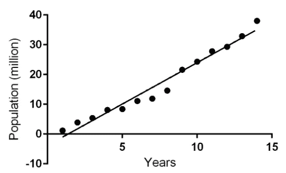
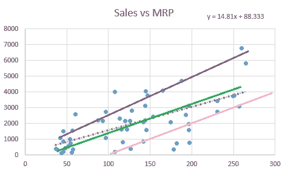
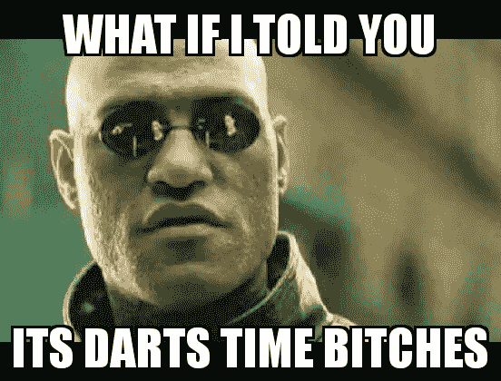
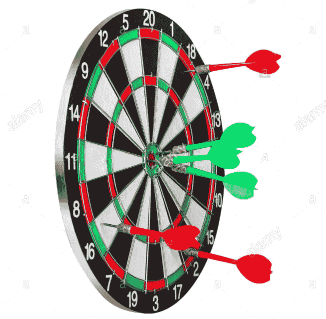
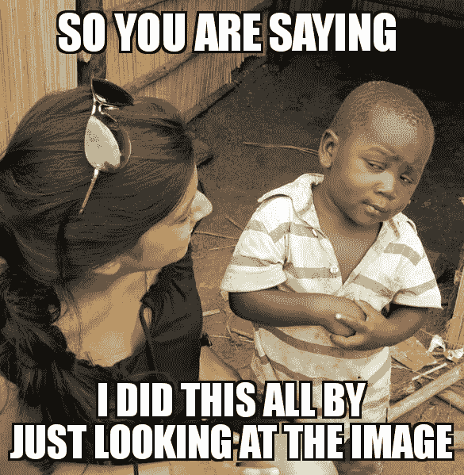
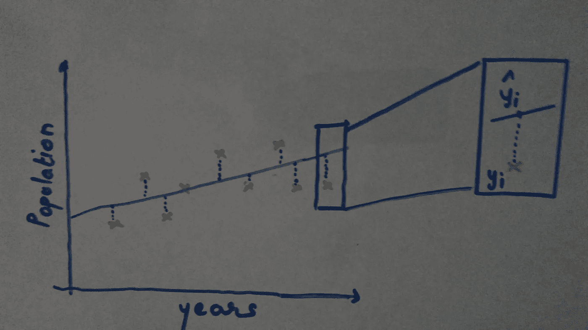
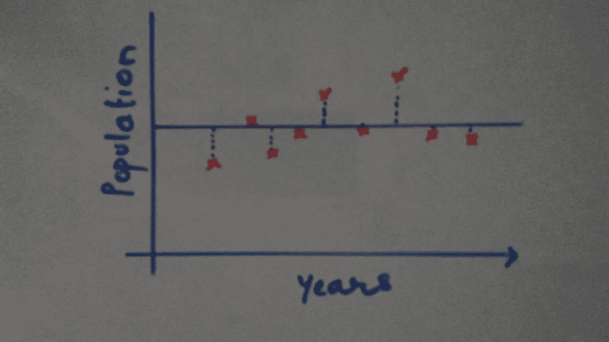

# m 文学:回归评估(R 平方)

> 原文：<https://towardsdatascience.com/mliterature-regression-evaluations-r-squared-ffa48717c56d?source=collection_archive---------4----------------------->

**警告**:正如在之前的帖子中提到的，标题也很清楚，这个系列只是为了给你一个主题的直觉，让你开始。我将很快添加数学和代码帖子！

当你说“我认为这是最佳解决方案”时，你的经理会有什么反应

所以，当你说一个模型是最优的或者几乎接近最优时，你应该能够评估它并给出一些证明。

一条线性回归拟合线，看起来像下图所示！

给一条直线，“回归线更符合趋势”。我的意思是，在上面的图像中，这条线(通过最大点)几乎完美地捕捉到了人口随时间推移而增长的趋势。

如何做到这一点不是我想在这篇文章中回答的问题。我们要揭开的是为什么一条给定的线比其他可能的线更好。

因此，可以在二维空间中画出无限多条线，如下图所示，但我们想找出为什么一条给定的线最适合显示趋势。

We are not pretty sure which one is correct!

那么，我们如何衡量哪一个更能代表我们的数据呢？

让我们试着理解使用飞镖游戏。

假设给你下图，描绘了一个“绿色”球员和一个“红色”球员拍摄的照片，问题是谁是赢家？

答案似乎很简单。玩家“绿”赢了！

> 如果我们再深入一点，你实际上做的是找到飞镖与圆心接触点的距离。关键是，你对所有的点都这样做了，然后取平均值。最后你证明了，绿色飞镖的最终平均距离小于红色，因此绿色是赢家！

你在不到一秒的时间内完成了这一切，甚至不知道你做了什么！很酷吧！

记住上面的原则，让我们借助一个图转移到我们想要解决的回归问题！

现在是重新确定我们目标的时候了。

**目的**:评估所选回归线是否最优。

**指标**:这是我们用来决定一条线是否最好的标准。(记住，在飞镖的情况下，我们计算每个飞镖离中心的距离并取平均值)

**程序:**对于回归线，我们不能执行与镖靶相同的程序。不用担心太多的数学证明，让我们理所当然地认为，我们需要一个回归线的图像，我们将使用它作为参考来评估我们的回归线。

上面这条线是用人口的平均值画出来的。

要评估的公式，

> R = 1 -(最佳拟合线距离值/平均拟合线距离值)

请记住，在飞镖游戏中，我们试图尽可能地缩短距离，也就是说，离中心的距离越小，结果越好(赢家)。

类似地，这里我们试图最小化" **R** "也读作 **R 的平方**，这样我们可以说，这条线是最佳拟合线。

因此，总结这篇文章 w.r.t 到回归线，如果你看上面的公式，我们可以说，**‘距离 _ 值 _ 最佳 _ 拟合 _ 线’的值越小，R 的值越接近 1，拟合越好**。

> **重要提示**:我在上面提到过，我们通过对距离求和并取平均值来找到“最佳拟合线的值”。事实证明，这不是最好的方法，另一个版本称为 SSE(误差平方和是首选)。

这就是这篇文章的内容。我们将在后面的文章中继续数学部分，我们将通过一个例子来看看所有这些是如何工作的。

机器学习快乐！

# 参考

 [## 平方和:残差和、总和、解释和

### 统计定义>残差平方和，总计和解释残差平方和是用来帮助你…

www.statisticshowto.com](http://www.statisticshowto.com/residual-sum-squares/)  [## 决定系数-维基百科

### R 2 有几种定义，只是有时等价。一类这样的情况包括…

en.wikipedia.org](https://en.wikipedia.org/wiki/Coefficient_of_determination)  [## 剩余平方和-维基百科

### 在统计学中，残差平方和(RSS)，也称为残差平方和(SSR)或残差平方和。

en.wikipedia.org](https://en.wikipedia.org/wiki/Residual_sum_of_squares)  [## 为什么我们在计算方差和标准时用平方而不用绝对值…

### 答案(第 1 题，共 20 题):你已经得到了技术性的答案。在迈克尔·霍克斯特的要点中，有一个关键点是最后一点。所以…

www.quora.com](https://www.quora.com/Why-do-we-square-instead-of-using-the-absolute-value-when-calculating-variance-and-standard-deviation)  [## 如何计算误差平方和(SSE)

### 误差平方和(SSE)是一个初步的统计计算，可以得出其他数据值。当你…

www.wikihow.com](http://www.wikihow.com/Calculate-the-Sum-of-Squares-for-Error-%28SSE%29)