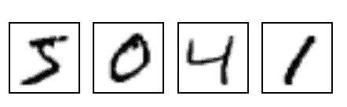
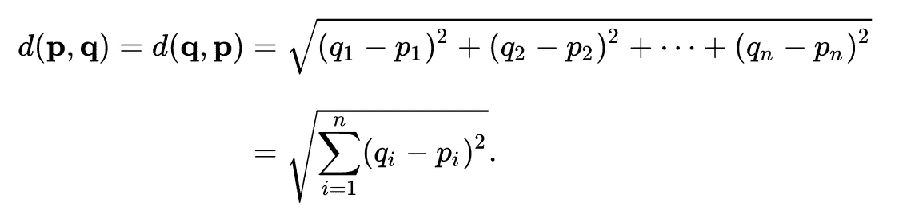

# 数字识别

> 原文：<https://towardsdatascience.com/mnist-with-k-nearest-neighbors-8f6e7003fab7?source=collection_archive---------0----------------------->

# 介绍

就像在传统编程中，我们首先学习打印`"Hello, world!"`，类似地，在机器学习中，我们首先理解识别手写数字图像的解决方案。此类任务的著名数据集是 [MNIST](http://yann.lecun.com/exdb/mnist/) (简称“修改后的[国家标准与技术研究院](https://en.wikipedia.org/wiki/National_Institute_of_Standards_and_Technology)数据库”)。

在这篇文章中，我将使用一个最简单的机器学习算法来解决这个著名的识别手写数字的问题。

# MNIST 数据集

MNIST 由 6 万张手写数字图像组成，包括从 0 到 9 的所有数字。每个图像都有其对应的标签号，代表图像中的编号。例如，下图中第一个图像的标签为 5，第二个图像的标签为 4，依此类推。该数据集通常分为三个子集:40，000 个用于训练，10，000 个用于验证，另外 10，000 个用于测试。在本文中，我们将只关注培训和测试。

在 MNIST，每幅图像都包含一个手绘的灰度数字。每个图像都是一个 784 维的浮点数向量(高度和宽度都是 28 个像素),其中每个值代表一个像素的亮度。

# 那么，KNN 是什么？

k 近邻是一种分类算法。它将新数据点(测试数据)分类到某个类别中。为此，它主要查看新数据点与训练集中所有其他数据点的距离。然后，在 *k* 个最接近的训练数据点中，大多数类被分配给该新的测试数据点。

距离度量的选择取决于为分类任务选择的问题。因为，举例来说，两个程序员的技能之间的距离(比赛中的分数)将不同于两个风筝在空中飞行的距离(3D 空间中的欧几里德距离)，等等。我们选择使用由以下公式给出的图像之间的欧几里德距离。

Euclidean distance between two n-dimensional points p and q. [Source](https://en.wikipedia.org/wiki/Euclidean_distance)

这个等式描述了两个 n 维点 p 和 q 之间的欧几里德距离。在我们的例子中，n = 784，因为 MNIST 的每个图像是 784 维的。

这就是关于 k 个最近邻居的全部内容！算法非常简单。现在让我们开始编程

## 寻找距离

两幅图像之间的距离可以用许多不同的方法计算。但是这里我用了欧几里德距离。其计算方法(此处为图像)是对两幅图像的相应像素之间的 L2 范数求和。

Euclidean Distance

相应像素距离的平方也消除了负距离。另一种方法是找到相应欧几里得距离的绝对值。

## 多数表决

找到距离并排序后(我们稍后将对其进行排序),是时候在最近的 *k* 训练点中找到多数类来测试数据点。这里，我们采用最接近的训练点的标签/类别，并找到出现最多的一个，并将其分配给新的测试数据点。这就是分类是如何发生的。

下面的代码描述了多数算法。

Voting for majority

# 分类手写数字

我们有了对手写数字进行分类所需的一切。我们剩下要做的就是我们在这里的真正目的。

下面的分类代码描述了它自己。

Classifying handwritten digits

我运行我的代码对前 2500 张测试图像进行分类，并获得了 **95.32%** 的分类准确率，对于这样一个简单的机器学习模型来说，这真的不算太差。可以通过使用分类过程的所有测试图像来检查完整的准确性，但这将花费很长时间(甚至可能一天)。

## 结论

所以， *k 近邻*是一种简单的分类任务算法。我们用它来对手写数字进行分类，取得了 9**5.32%**T8w 的准确率，对于这样一个简单的分类算法来说已经很不错了。