# 移动广告点击率预测

> 原文：<https://towardsdatascience.com/mobile-ads-click-through-rate-ctr-prediction-44fdac40c6ff?source=collection_archive---------2----------------------->


Photo credit: Pixabay

## 在线广告，Google PPC，AdWords 活动，移动广告

在互联网营销中，[点击率(CTR)是一种衡量广告客户在每一次展示中获得的点击量的指标](https://www.wordstream.com/click-through-rate)。

移动已经与所有渠道无缝连接，移动是推动所有商业的驱动力。[预计今年移动广告收入将达到 10.8 亿美元，比去年增长 122%。](https://www.digitalcommerce360.com/2018/07/27/how-big-is-amazons-ad-business/)

在这项研究分析中，Criteo Labs 分享了 10 天的 [Avazu 数据](https://www.kaggle.com/c/avazu-ctr-prediction)，供我们开发预测广告点击率(CTR)的模型。给定用户和他(或她)正在访问的页面。他(或她)点击给定广告的概率是多少？此分析的目标是为 CTR 估计的最精确 ML 算法设定基准。我们开始吧！

# 数据

数据集可以在[这里](https://www.kaggle.com/c/avazu-ctr-prediction/data)找到。

## 数据字段

*   id:广告标识符
*   单击:0/1 表示非单击/单击
*   小时:格式为 YYMMDDHH，因此 14091123 表示 UTC 2014 年 9 月 11 日 23:00。
*   C1——匿名分类变量
*   横幅 _ 位置
*   站点 id
*   站点 _ 域
*   站点 _ 类别
*   app_id
*   app_domain
*   app _ 类别
*   设备 id
*   设备 _ip
*   设备型号
*   设备类型
*   设备连接类型
*   C14-C21-匿名分类变量

## EDA 和特征工程

训练集包含超过 4000 万条记录，为了能够在本地处理，我们将随机抽取其中的 100 万条。

```
import numpy as n
import random
import pandas as pd
import gzipn = 40428967  #total number of records in the clickstream data 
sample_size = 1000000
skip_values = sorted(random.sample(range(1,n), n-sample_size))parse_date = lambda val : pd.datetime.strptime(val, '%y%m%d%H')with gzip.open('train.gz') as f:
    train = pd.read_csv(f, parse_dates = ['hour'], date_parser = parse_date, dtype=types_train, skiprows = skip_values)
```

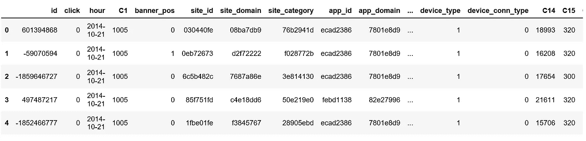

Figure 1

由于匿名化，我们不知道每个特性中的每个值意味着什么。此外，大多数特征是分类的，并且大多数分类特征具有很多值。这使得 EDA 不太直观更容易混淆，但我们会尽力而为。

**特性**

我们可以将数据中的所有特征分为以下几类:

*   目标特征:单击
*   站点特征:站点 id，站点域，站点类别
*   应用功能:应用 id、应用域、应用类别
*   设备特征:设备标识、设备 ip、设备型号、设备类型、设备连接类型
*   匿名分类特征:C14-C21

```
import seaborn as sns
import matplotlib.pyplot as pltsns.countplot(x='click',data=train, palette='hls')
plt.show();
```

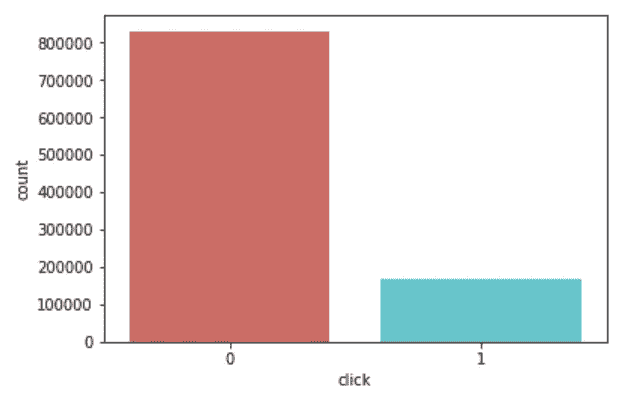

Figure 2

```
train['click'].value_counts()/len(train)
```

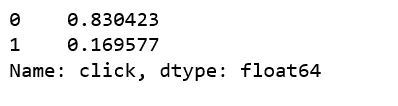

Figure 3

整体点击率约为。17%，而大约。83%没有被点击。

```
train.hour.describe()
```

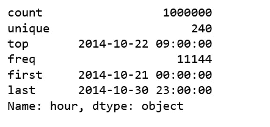

Figure 4

该数据涵盖了从 2014 年 10 月 21 日到 2014 年 10 月 30 日的 10 天点击流数据，即 240 个小时。

```
train.groupby('hour').agg({'click':'sum'}).plot(figsize=(12,6))
plt.ylabel('Number of clicks')
plt.title('Number of clicks by hour');
```

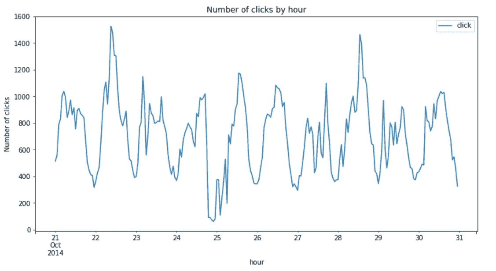

Figure 5

每小时的点击模式每天看起来都很相似。然而，有几个高峰时间，一个是在 10 月 22 日中午，另一个是在 10 月 28 日中午。10 月 24 日午夜时分，点击量非常低。

## **日期时间特征的特征工程**

**小时**

从日期时间特征中提取小时。

```
train['hour_of_day'] = train.hour.apply(lambda x: x.hour)
train.groupby('hour_of_day').agg({'click':'sum'}).plot(figsize=(12,6))
plt.ylabel('Number of clicks')
plt.title('click trends by hour of day');
```

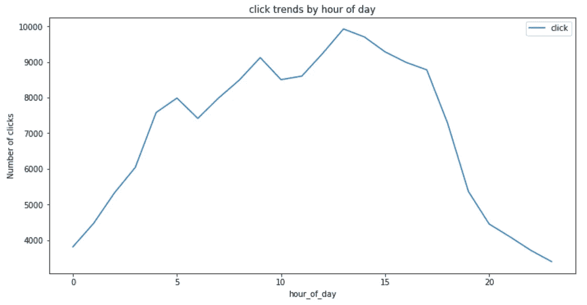

Figure 6

一般来说，点击数最高的是 13 和 14 小时(下午 1 点和 2 点)，点击数最低的是 0 小时(午夜)。对于粗略估计，这似乎是一个有用的特性。

让我们考虑一下印象。

```
train.groupby(['hour_of_day', 'click']).size().unstack().plot(kind='bar', title="Hour of Day", figsize=(12,6))
plt.ylabel('count')
plt.title('Hourly impressions vs. clicks');
```

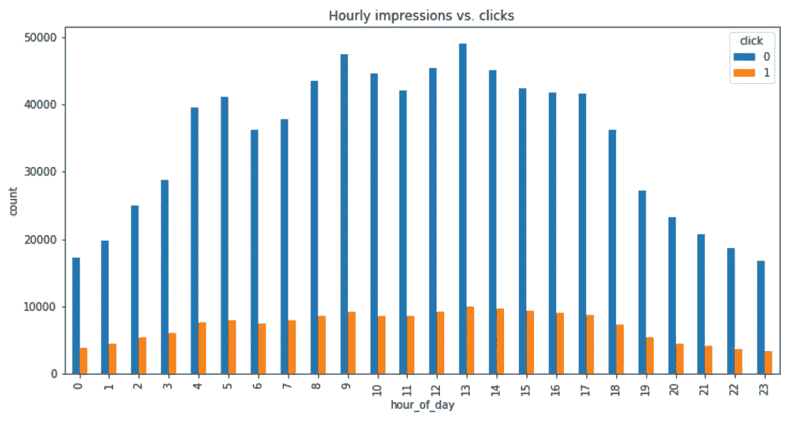

Figure 7

这里没有什么令人震惊的。

既然我们已经看了点击和印象。我们可以计算点击率(CTR)。CTR 是广告点击与印象的比率。它衡量每个广告的点击率。

**每小时一次**

```
import seaborn as snsdf_click = train[train['click'] == 1]
df_hour = train[['hour_of_day','click']].groupby(['hour_of_day']).count().reset_index()
df_hour = df_hour.rename(columns={'click': 'impressions'})
df_hour['clicks'] = df_click[['hour_of_day','click']].groupby(['hour_of_day']).count().reset_index()['click']
df_hour['CTR'] = df_hour['clicks']/df_hour['impressions']*100plt.figure(figsize=(12,6))
sns.barplot(y='CTR', x='hour_of_day', data=df_hour)
plt.title('Hourly CTR');
```

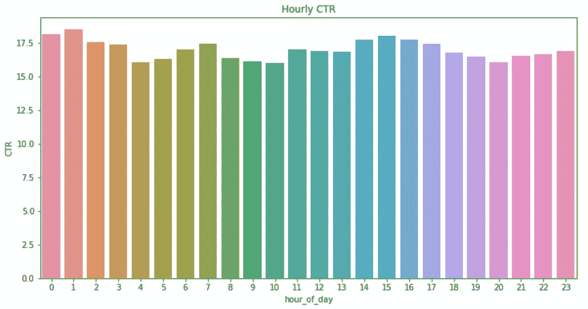

Figure 8

这里一个有趣的观察是最高的点击率发生在午夜，1，7 和 15。如果你记得的话，午夜前后的浏览量和点击量最少。

**星期几**

```
train['day_of_week'] = train['hour'].apply(lambda val: val.weekday_name)
cats = ['Monday', 'Tuesday', 'Wednesday', 'Thursday', 'Friday', 'Saturday', 'Sunday']
train.groupby('day_of_week').agg({'click':'sum'}).reindex(cats).plot(figsize=(12,6))
ticks = list(range(0, 7, 1)) # points on the x axis where you want the label to appear
labels = "Mon Tues Weds Thurs Fri Sat Sun".split()
plt.xticks(ticks, labels)
plt.title('click trends by day of week');
```

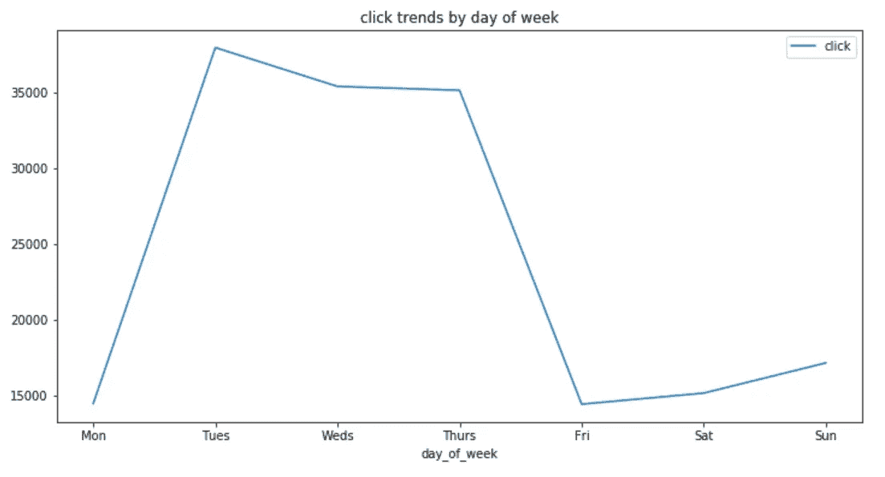

Figure 9

```
train.groupby(['day_of_week','click']).size().unstack().reindex(cats).plot(kind='bar', title="Day of the Week", figsize=(12,6))
ticks = list(range(0, 7, 1)) # points on the x axis where you want the label to appear
labels = "Mon Tues Weds Thurs Fri Sat Sun".split()
plt.xticks(ticks, labels)
plt.title('Impressions vs. clicks by day of week');
```

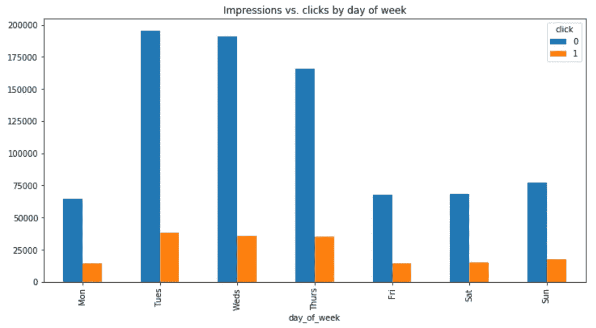

Figure 10

周二的浏览量和点击数最多，周三次之，周四次之。周一和周五的浏览量和点击量最少。

**星期几中心**

```
df_click = train[train['click'] == 1]
df_dayofweek = train[['day_of_week','click']].groupby(['day_of_week']).count().reset_index()
df_dayofweek = df_dayofweek.rename(columns={'click': 'impressions'})
df_dayofweek['clicks'] = df_click[['day_of_week','click']].groupby(['day_of_week']).count().reset_index()['click']
df_dayofweek['CTR'] = df_dayofweek['clicks']/df_dayofweek['impressions']*100plt.figure(figsize=(12,6))
sns.barplot(y='CTR', x='day_of_week', data=df_dayofweek, order=['Monday', 'Tuesday', 'Wednesday', 'Thursday', 'Friday', 'Saturday', 'Sunday'])
plt.title('Day of week CTR');
```

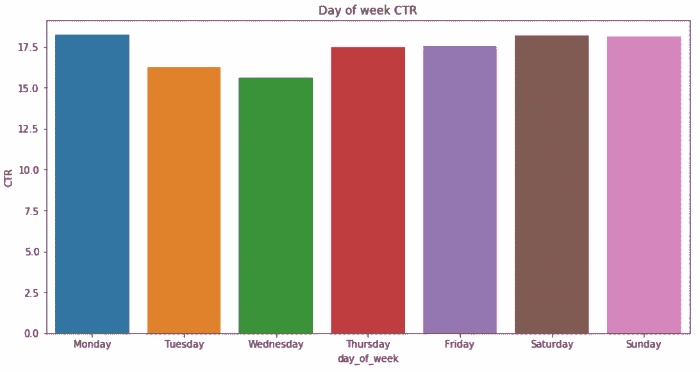

Figure 11

虽然周二和周三的点击数和点击数最高，但它们的点击率却是最低的。周六和周日享受最高的 CTR。显然，人们在周末有更多的时间点击。

**C1 专题**

C1 是匿名分类特征之一。虽然我们不知道它的意义，但我们还是想看看它的分布。

```
print(train.C1.value_counts()/len(train))
```

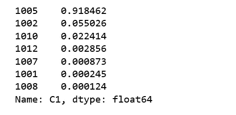

Figure 12

C1 值= 1005 拥有最多的数据，几乎是我们正在使用的所有数据的 92%。让我们看看 C1 的值是否能说明一些关于 CTR 的东西。

```
C1_values = train.C1.unique()
C1_values.sort()
ctr_avg_list=[]
for i in C1_values:
    ctr_avg=train.loc[np.where((train.C1 == i))].click.mean()
    ctr_avg_list.append(ctr_avg)
    print("for C1 value: {},  click through rate: {}".format(i,ctr_avg))
```

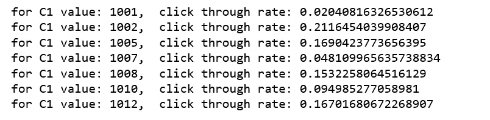

Figure 13

```
train.groupby(['C1', 'click']).size().unstack().plot(kind='bar', figsize=(12,6), title='C1 histogram');
```

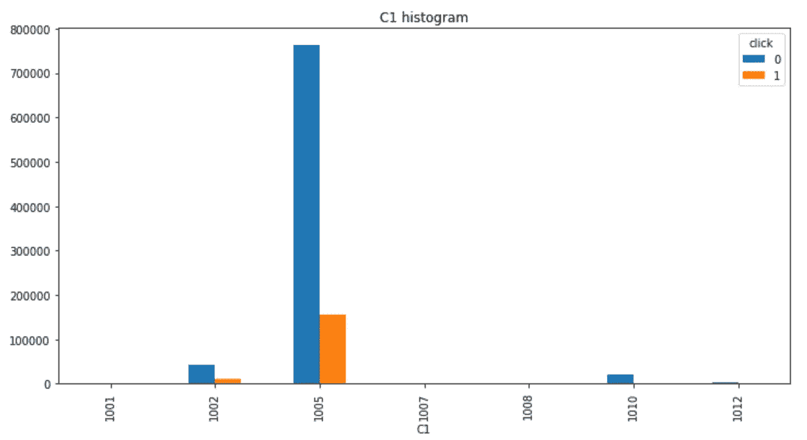

Figure 14

```
df_c1 = train[['C1','click']].groupby(['C1']).count().reset_index()
df_c1 = df_c1.rename(columns={'click': 'impressions'})
df_c1['clicks'] = df_click[['C1','click']].groupby(['C1']).count().reset_index()['click']
df_c1['CTR'] = df_c1['clicks']/df_c1['impressions']*100plt.figure(figsize=(12,6))
sns.barplot(y='CTR', x='C1', data=df_c1)
plt.title('CTR by C1');
```

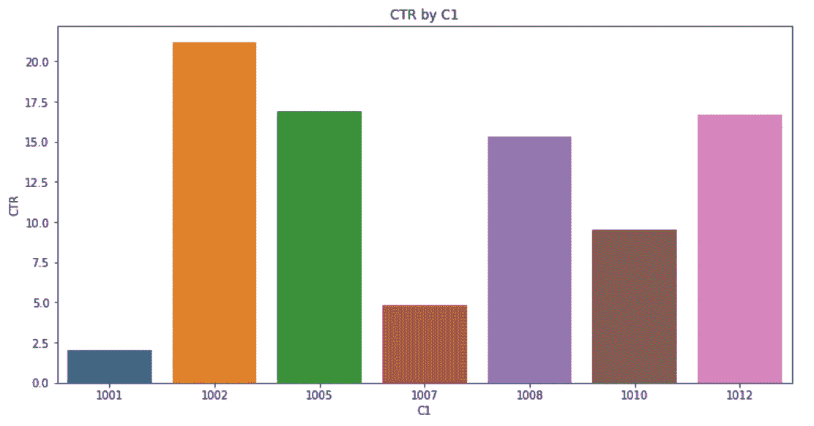

Figure 15

重要的 C1 值和 CTR 对有:

C1=1005: 92%的数据和 0.17%的点击率

C1=1002: 5.5%的数据和 0.21%的点击率

C1=1010:数据的 2.2%和 0.095 的点击率

C1 = 1002 比平均 CTR 高得多，C1=1010 比平均 CTR 低得多，这两个 C1 值似乎对预测 CTR 很重要。

**横幅位置**

听说[影响你横幅广告效果的因素有很多，但最有影响的还是横幅位置](https://www.wikihow.com/Position-Ads-on-Your-Website)。让我们看看这是不是真的。

```
print(train.banner_pos.value_counts()/len(train))
```

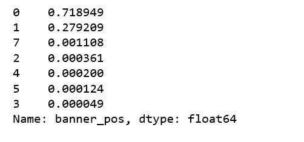

Figure 16

```
banner_pos = train.banner_pos.unique()
banner_pos.sort()
ctr_avg_list=[]
for i in banner_pos:
    ctr_avg=train.loc[np.where((train.banner_pos == i))].click.mean()
    ctr_avg_list.append(ctr_avg)
    print("for banner position: {},  click through rate: {}".format(i,ctr_avg))
```

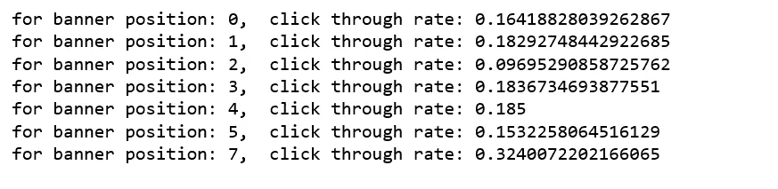

Figure 17

重要的横幅位置有:

位置 0:数据的 72%和 0.16 CTR

位置 1: 28%的数据和 0.18%的 CTR

```
train.groupby(['banner_pos', 'click']).size().unstack().plot(kind='bar', figsize=(12,6), title='banner position histogram');
```

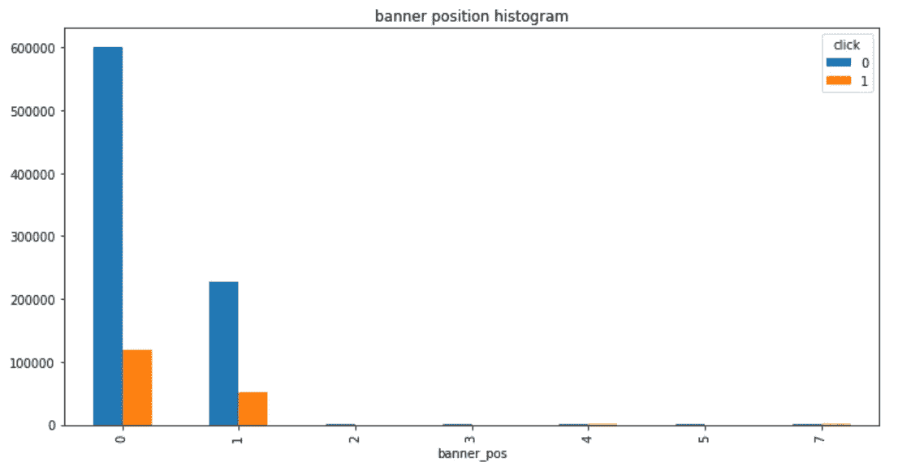

Figure 18

```
df_banner = train[['banner_pos','click']].groupby(['banner_pos']).count().reset_index()
df_banner = df_banner.rename(columns={'click': 'impressions'})
df_banner['clicks'] = df_click[['banner_pos','click']].groupby(['banner_pos']).count().reset_index()['click']
df_banner['CTR'] = df_banner['clicks']/df_banner['impressions']*100
sort_banners = df_banner.sort_values(by='CTR',ascending=False)['banner_pos'].tolist()
plt.figure(figsize=(12,6))
sns.barplot(y='CTR', x='banner_pos', data=df_banner, order=sort_banners)
plt.title('CTR by banner position');
```

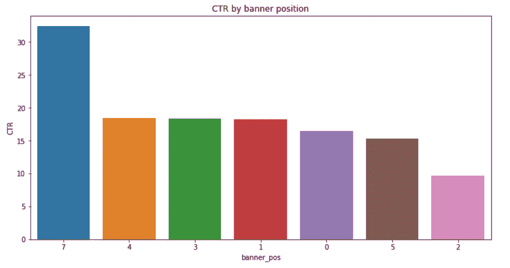

Figure 19

虽然横幅位置 0 具有最高的印象和点击量，但横幅位置 7 享有最高的点击率。增加横幅位置 7 的广告数量似乎是一个好主意。

**设备类型**

```
print('The impressions by device types')
print((train.device_type.value_counts()/len(train)))
```

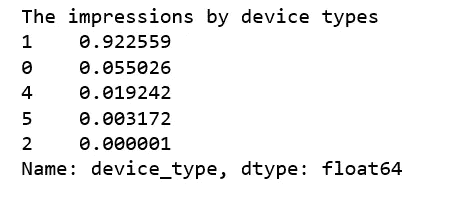

Figure 20

```
train[['device_type','click']].groupby(['device_type','click']).size().unstack().plot(kind='bar', title='device types');
```

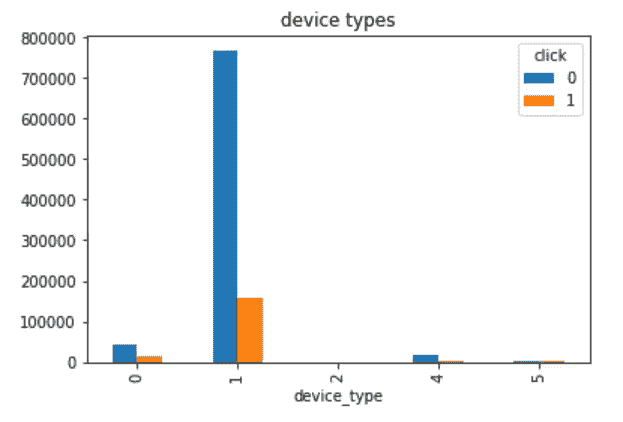

Figure 21

设备类型 1 获得最多的展示和点击，其他设备类型仅获得最少的展示和点击。我们可能想要查看关于设备类型 1 的更多细节。

```
df_click[df_click['device_type']==1].groupby(['hour_of_day', 'click']).size().unstack().plot(kind='bar', title="Clicks from device type 1 by hour of day", figsize=(12,6));
```

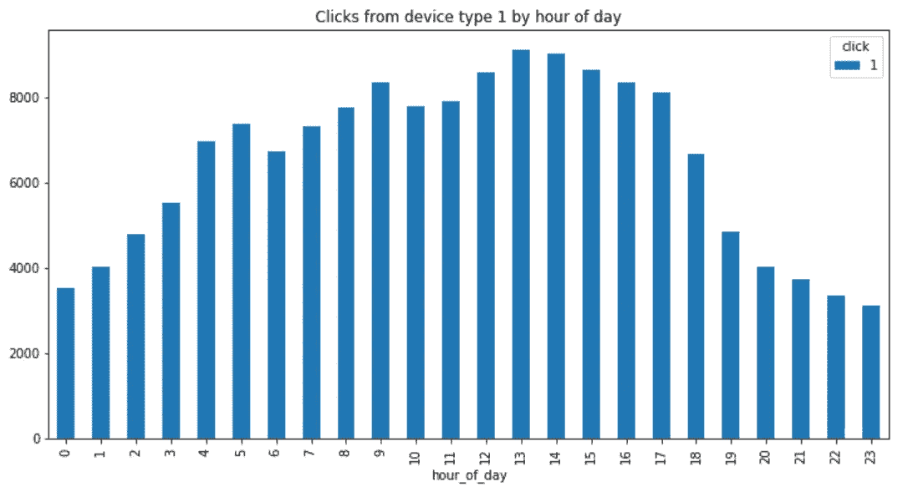

Figure 22

正如所料，大多数点击发生在营业时间，来自设备类型 1。

```
device_type_click = df_click.groupby('device_type').agg({'click':'sum'}).reset_index()
device_type_impression = train.groupby('device_type').agg({'click':'count'}).reset_index().rename(columns={'click': 'impressions'})
merged_device_type = pd.merge(left = device_type_click , right = device_type_impression, how = 'inner', on = 'device_type')
merged_device_type['CTR'] = merged_device_type['click'] / merged_device_type['impressions']*100merged_device_type
```

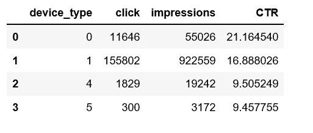

Figure 23

最高的 CTR 来自设备类型 0。

用同样的方法，我探索了所有其他分类功能，如网站功能，应用程序功能和 C14 C21 功能。探索的方式大同小异，详细内容可以在 [Github](https://github.com/susanli2016/Machine-Learning-with-Python/blob/master/Click-Through%20Rate%20Prediction.ipynb) 上找到，在此不再赘述。

# 建筑模型

## 哈希简介

一个[散列函数](https://en.wikipedia.org/wiki/Hash_function)是一个将一组对象映射到一组整数的函数。当使用散列函数时，这种映射将任意长度的键作为输入，并输出特定范围内的整数。

我们的精简数据集仍然包含 100 万个样本和～2M 特征值。哈希的目的是最小化功能的内存消耗。

如果你想了解更多，这里有一篇由[卢卡斯·伯纳蒂](https://medium.com/u/fe16abb58a96?source=post_page-----44fdac40c6ff--------------------------------)撰写的关于杂凑技巧的优秀文章[。](https://booking.ai/dont-be-tricked-by-the-hashing-trick-192a6aae3087)

Python 有一个内置函数，它执行一个名为`hash()`的散列。对于我们数据中的对象，散列并不奇怪。

```
def convert_obj_to_int(self):

    object_list_columns = self.columns
    object_list_dtypes = self.dtypes
    new_col_suffix = '_int'
    for index in range(0,len(object_list_columns)):
        if object_list_dtypes[index] == object :
            self[object_list_columns[index]+new_col_suffix] = self[object_list_columns[index]].map( lambda  x: hash(x))
            self.drop([object_list_columns[index]],inplace=True,axis=1)
    return self
train = convert_obj_to_int(train)
```

## LightGBM 模型

lightGBM_CTR.py

训练后的最终输出:

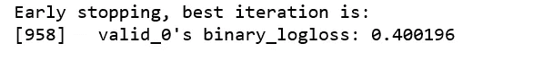

Figure 24

## Xgboost 模型

Xgboost_CTR.py

它将训练到 eval-logloss 在 20 轮中没有改善。最后的输出是:

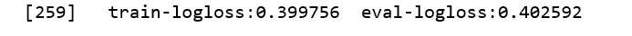

Figure 25

[Jupyter 笔记本](https://github.com/susanli2016/Machine-Learning-with-Python/blob/master/Click-Through%20Rate%20Prediction.ipynb)可以在 [Github](https://github.com/susanli2016/Machine-Learning-with-Python/blob/master/Click-Through%20Rate%20Prediction.ipynb) 上找到。周末愉快！