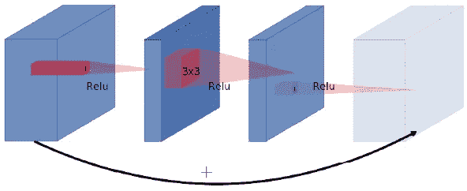
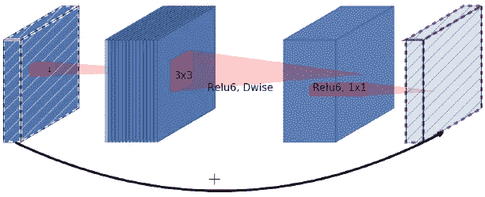
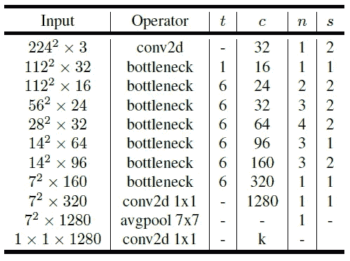
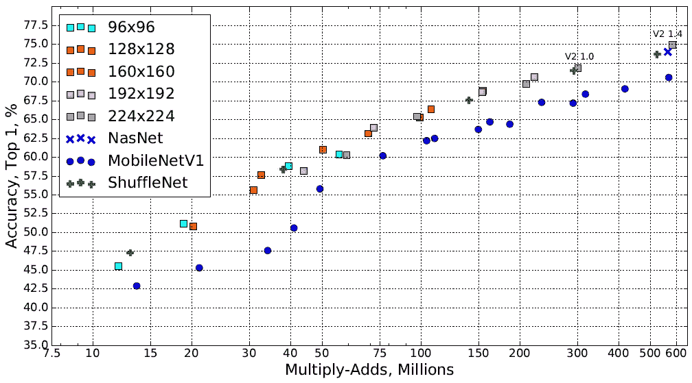

# MobileNetV2:反向残差和线性瓶颈

> 原文：<https://towardsdatascience.com/mobilenetv2-inverted-residuals-and-linear-bottlenecks-8a4362f4ffd5?source=collection_archive---------0----------------------->

2017 年 4 月，谷歌的一组研究人员发表了一篇论文，介绍了一种针对移动设备优化的神经网络架构。他们努力寻求一种模型，在保持参数和数学运算尽可能低的同时提供高精度。为了给智能手机带来深度神经网络，这是非常必要的。

被称为 [MobileNet](https://arxiv.org/abs/1704.04861) 的架构围绕着使用深度方向可分离卷积的思想，它由一个深度方向卷积和一个点方向卷积组成。如果你对这个操作的细节有点模糊，请随意查看我的另一篇[文章](/types-of-convolutions-in-deep-learning-717013397f4d)，它详细解释了这个概念。 [MobileNetV2](https://arxiv.org/abs/1801.04381) 用两个主要想法扩展了它的前身。

# 反向残差

残余块用跳过连接来连接卷积块的开始和结束。通过添加这两种状态，网络有机会访问在卷积块中未被修改的早期激活。事实证明，这种方法对于构建深度网络至关重要。



A residual block connects wide layers with a skip connection while layers in between are narrow

当稍微靠近观察跳过连接时，我们注意到[原始残差块](https://arxiv.org/abs/1512.03385)遵循关于通道数量的宽- >窄- >宽方法。输入具有大量通道，这些通道通过廉价的 1x1 卷积进行压缩。这样，下面的 3×3 卷积的参数就少得多。为了最终增加输入和输出，使用另一个 1x1 卷积再次增加通道的数量。在喀拉斯，它看起来像这样:

```
def residual_block(x, squeeze=16, expand=64):
  m = Conv2D(squeeze, (1,1), activation='relu')(x)
  m = Conv2D(squeeze, (3,3), activation='relu')(m)
  m = Conv2D(expand, (1,1), activation='relu')(m)
  return Add()([m, x])
```

另一方面，MobileNetV2 遵循窄->宽->窄的方法。第一步使用 1×1 卷积来加宽网络，因为接下来的 3×3 深度方向卷积已经大大减少了参数的数量。之后，另一个 1x1 卷积挤压网络，以便匹配初始的信道数量。



An inverted residual block connects narrow layers with a skip connection while layers in between are wide

在喀拉斯，它看起来像这样:

```
def inverted_residual_block(x, expand=64, squeeze=16):
  m = Conv2D(expand, (1,1), activation='relu')(x)
  m = DepthwiseConv2D((3,3), activation='relu')(m)
  m = Conv2D(squeeze, (1,1), activation='relu')(m)
  return Add()([m, x])
```

作者将这种想法描述为反向剩余块，因为在网络的狭窄部分之间存在跳跃连接，这与原始剩余连接的工作方式相反。当您运行上面的两个代码片段时，您会注意到反向块的参数要少得多。

# 线性瓶颈

我们在神经网络中使用非线性激活函数的原因是多个矩阵乘法不能简化为单个数值运算。它允许我们建立多层神经网络。同时，通常在神经网络中使用的激活函数 ReLU 丢弃小于 0 的值。这种信息丢失可以通过增加信道数量来解决，以便增加网络的容量。

对于反向残差块，我们做相反的事情，并挤压跳跃连接所链接的层。这损害了网络的性能。作者引入了线性瓶颈的概念，其中剩余块的最后卷积在被添加到初始激活之前具有线性输出。将它写入代码非常简单，因为我们只需丢弃卷积模块的最后一个激活函数:

```
def inverted_linear_residual_block(x, expand=64, squeeze=16):
  m = Conv2D(expand, (1,1), activation='relu')(x)
  m = DepthwiseConv2D((3,3),  activation='relu')(m)
  m = Conv2D(squeeze, (1,1))(m)
  return Add()([m, x])
```

# ReLU6

上面的片段显示了一个卷积块的结构，它包含了反向残差和线性瓶颈。如果您想尽可能地匹配 MobileNetV2，您还需要另外两个部分。第一个方面只是在每个卷积层后面增加了批量归一化，这是你现在可能已经习惯的。

第二个附加项不太常见。作者使用 ReLU6 而不是 ReLU，这将激活值限制在最大值…嗯…6。只要在 0 到 6 之间，激活就是线性的。

```
def relu(x):
  return max(0, x)def relu6(x):
  return min(max(0, x), 6)
```

这在你处理定点推理时很有帮助。它将小数点左边的信息限制为 3 位，这意味着我们可以保证小数点右边的精度。这也在最初的 MobileNet 论文中使用。最后一个构建块看起来像这样:

```
def bottleneck_block(x, expand=64, squeeze=16):
  m = Conv2D(expand, (1,1))(x)
  m = BatchNormalization()(m)
  m = Activation('relu6')(m)
  m = DepthwiseConv2D((3,3))(m)
  m = BatchNormalization()(m)
  m = Activation('relu6')(m)
  m = Conv2D(squeeze, (1,1))(m)
  m = BatchNormalization()(m)
  return Add()([m, x])
```

# 建筑



The MobileNetV2 architecture

现在我们已经了解了 MobileNetV2 的构建块，我们可以看一下整个架构。在表格中，您可以看到瓶颈块是如何排列的。 *t* 代表通道的膨胀率。如您所见，他们使用了系数 6，而不是我们示例中的系数 4。 *c* 表示输入通道的数量， *n* 表示该块重复的频率。最后, *s* 告诉我们块的第一次重复是否为下采样过程使用了步幅 2。总而言之，这是一个非常简单和常见的卷积块集合。



Performance of MobileNetV2 and other architectures on ImageNet

# 总结想法

我特别高兴的是 MobileNetV2 提供了与 NASNet 类似的参数效率。NASNet 是几项图像识别任务的最新技术。它的构建模块相当复杂，这使得它为什么工作得这么好变得相当不直观。NASNet 的构建模块不是由人类设计的，而是由另一个神经网络设计的。引入一个简单的架构，比如 MobileNetV2，它表现出了相当的效率，这让我更加相信下一个大的架构可能也是由人类设计的。