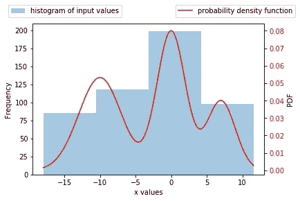
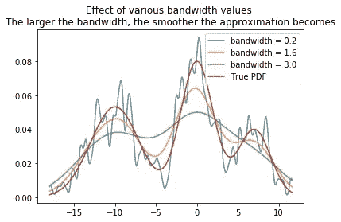
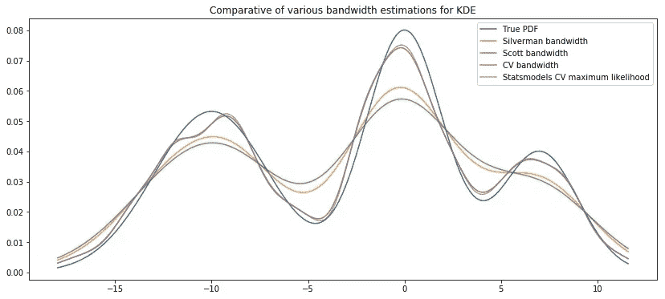
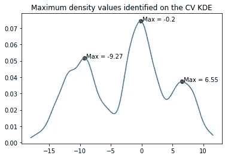

# 模态测试和核密度估计

> 原文：<https://towardsdatascience.com/modality-tests-and-kernel-density-estimations-3f349bb9e595?source=collection_archive---------6----------------------->

## python 中的多模态测试


当处理大量可能具有不同数据分布的数据集时，我们面临以下考虑因素:

*   数据分布是单峰的吗？如果是，哪种模型最接近它(均匀分布、T 分布、卡方分布、柯西分布等)？
*   如果数据分布是多模态的，我们能否自动识别模态的数量并提供更细粒度的描述性统计？
*   如何估计一个新数据集的概率密度函数？

本[笔记本](https://github.com/ciortanmadalina/modality_tests/blob/master/kernel_density.ipynb)处理以下主题:

*   直方图与概率密度函数近似
*   核密度估计
*   最佳带宽的选择:Silverman/ Scott/ Grid 搜索交叉验证
*   单峰分布的统计检验
*   单峰性倾斜试验
*   基于核密度估计的数据分布模式数识别

# 直方图和 pdf

正如这篇博文[中所解释的，https://mgl Lerner . github . io/posts/histograms-and-kernel-density-estimation-kde-2 . html](https://mglerner.github.io/posts/histograms-and-kernel-density-estimation-kde-2.html)直方图的缺点是在不合适大小的容器中隐藏了实际数据分布的一些细节。

```
def plotHistogramAndPdf(data, x, pdf):
    ax = plt.gca()
    plt.hist(data, bins = 4, alpha = 0.4, label = 'histogram of input values');
    plt.ylabel('Frequency')
    plt.xlabel('x values')
    ax2 = ax.twinx()
    plt.plot(x, pdf, c = 'red', label = 'probability density function');
    plt.ylabel('PDF')
    [tl.set_color('r') for tl in ax2.get_yticklabels()]
    ax.legend(bbox_to_anchor=(0.4, 1.15))
    ax2.legend(bbox_to_anchor=(1.15,1.15))
    plt.savefig('figures/hist.jpg', bbox_inches='tight')

plotHistogramAndPdf(data, x, true_pdf)
```



# 核密度估计

核密度估计依赖于任意带宽，该带宽决定了返回的近似的平滑程度。以下示例说明了各种带宽值的影响:

```
def getKernelDensityEstimation(values, x, bandwidth = 0.2, kernel = 'gaussian'):
    model = KernelDensity(kernel = kernel, bandwidth=bandwidth)
    model.fit(values[:, np.newaxis])
    log_density = model.score_samples(x[:, np.newaxis])
    return np.exp(log_density)for bandwidth in np.linspace(0.2, 3, 3):
    kde = getKernelDensityEstimation(data, x, bandwidth=bandwidth)
    plt.plot(x, kde, alpha = 0.8, label = f'bandwidth = {round(bandwidth, 2)}')
plt.plot(x, true_pdf, label = 'True PDF')
plt.legend()
plt.title('Effect of various bandwidth values \nThe larger the bandwidth, the smoother the approximation becomes');
plt.savefig('figures/bw.jpg', bbox_inches='tight')
```



# 核密度估计最佳带宽的选择方法

为了确定最佳带宽，有几种方法:

*   Silverman 的经验法则:假设未知密度为高斯分布。它不是最佳带宽选择器，但可以用作非常快速、相当好的估计器，或者用作多级带宽选择器中的第一估计器。更精确的求解方程插件规则使用积分平方密度导数泛函的估计来估计最佳带宽。它们需要大量计算来使用迭代方法求解非线性方程。他们用腐烂作为第一估计
*   Scott 的经验法则:对于正态分布数据的随机样本是最佳的，在某种意义上，它最小化了密度估计的积分均方误差。

这两种方法具有计算速度快的优点，但是它们通常给出太少的面元，并且很可能对底层数据分布进行欠拟合。这两种方法都已经在 statsmodels 包中实现，如下图所示。

*   基于交叉验证的方法:statsmodels 带有一个 cv 带宽参数。或者，我们可以实现网格搜索交叉验证。与前两种方法不同，执行网格搜索可能需要更多的计算，尤其是对于较大的数据集

```
from statsmodels.nonparametric.bandwidths import bw_silverman, bw_scott, select_bandwidthsilverman_bandwidth = bw_silverman(data)# select bandwidth allows to set a different kernel
silverman_bandwidth_gauss = select_bandwidth(data, bw = 'silverman', kernel = 'gauss')scott_bandwidth = bw_scott(data)def bestBandwidth(data, minBandwidth = 0.1, maxBandwidth = 2, nb_bandwidths = 30, cv = 30):
    """
    Run a cross validation grid search to identify the optimal bandwidth for the kernel density
    estimation.
    """
    from sklearn.model_selection import GridSearchCV
    model = GridSearchCV(KernelDensity(),
                        {'bandwidth': np.linspace(minBandwidth, maxBandwidth, nb_bandwidths)}, cv=cv) 
    model.fit(data[:, None])
    return model.best_params_['bandwidth']cv_bandwidth = bestBandwidth(data)print(f"Silverman bandwidth = {silverman_bandwidth}")
print(f"Scott bandwidth = {scott_bandwidth}")
print(f"CV bandwidth = {cv_bandwidth}")
```

正如预期的那样，第一个 Silverman 和 Scott 返回了更大的带宽值，这导致了更大的箱，从而丢失了关于数据分布的信息。

Statsmodels 允许基于交叉验证和最大似然运算符自动搜索最佳带宽:

```
from statsmodels.nonparametric.kernel_density import KDEMultivariate
stats_models_cv = KDEMultivariate(data, 'c', bw = 'cv_ml').pdf(x)
```

# 画出不同的近似值

```
plt.figure(figsize= (14, 6))
plt.plot(x, true_pdf, label = 'True PDF')kde = getKernelDensityEstimation(data, x, bandwidth=silverman_bandwidth)
plt.plot(x, kde, alpha = 0.8, label = f'Silverman bandwidth')kde = getKernelDensityEstimation(data, x, bandwidth=scott_bandwidth)
plt.plot(x, kde, alpha = 0.8, label = f'Scott bandwidth')kde = getKernelDensityEstimation(data, x, bandwidth=cv_bandwidth)
plt.plot(x, kde, alpha = 0.8, label = f'CV bandwidth')plt.plot(x, stats_models_cv, alpha = 0.8, label = f'Statsmodels CV maximum likelihood')plt.legend()
plt.title('Comparative of various bandwidth estimations for KDE');
plt.savefig('figures/comp_bw.jpg', bbox_inches='tight') 
```



# 单峰分布的统计检验

有许多统计测试可以解决数据形态问题:

*   倾斜试验
*   过量质量测试
*   地图测试
*   模式存在测试
*   矮小测试
*   跨度测试
*   马鞍试验

不幸的是，在 python 开源库中实现的并不多。

# 倾斜试验

以下 python 包[https://github.com/BenjaminDoran/unidip](https://github.com/BenjaminDoran/unidip)提供了倾角测试的实现，以及利用单峰性的哈迪根倾角测试在数据中广泛提取密度峰值的功能。

```
from unidip import UniDip
import unidip.dip as dipdata = np.msort(data)
print(dip.diptst(data))
intervals = UniDip(data).run()
print(intervals)
```

# 确定并绘制 KDE 的局部最大值

一旦我们有了核密度函数的估计，我们就可以确定该分布是否是多峰的，并识别对应于这些模式的最大值或峰值。
这可以通过识别一阶导数改变符号的点来实现。默认情况下，getinflexinpoints 方法可以返回所有拐点(最小值+最大值)，或者只返回一个选择(typeOfInflexion = 'max'/ 'min ')。
下图描绘了可能对应于多种数据分布模式的最大值。可以通过基于峰的高度设置阈值来继续分析，以便过滤掉一些不太重要的值。

```
def getExtremePoints(data, typeOfExtreme = None, maxPoints = None):
    """
    This method returns the indeces where there is a change in the trend of the input series.
    typeOfExtreme = None returns all extreme points, max only maximum values and min
    only min,
    """
    a = np.diff(data)
    asign = np.sign(a)
    signchange = ((np.roll(asign, 1) - asign) != 0).astype(int)
    idx = np.where(signchange ==1)[0]if typeOfInflexion == 'max' and data[idx[0]] < data[idx[1]]:
        idx = idx[1:][::2]

    elif typeOfInflexion == 'min' and data[idx[0]] > data[idx[1]]:
        idx = idx[1:][::2]
    elif typeOfInflexion is not None:
        idx = idx[::2]

    # sort ids by min value
    if 0 in idx:
        idx = np.delete(idx, 0)
    if (len(data)-1) in idx:
        idx = np.delete(idx, len(data)-1)
    idx = idx[np.argsort(data[idx])]
    # If we have maxpoints we want to make sure the timeseries has a cutpoint
    # in each segment, not all on a small interval
    if maxPoints is not None:
        idx= idx[:maxPoints]
        if len(idx) < maxPoints:
            return (np.arange(maxPoints) + 1) * (len(data)//(maxPoints + 1))

    return idx
```



我们注意到获得的值对应于生成的分布的初始锚。

# 资源

*   [https://jakevdp . github . io/blog/2013/12/01/kernel-density-estimation/](https://jakevdp.github.io/blog/2013/12/01/kernel-density-estimation/)
*   [https://mglerner . github . io/posts/histograms-and-kernel-density-estimation-kde-2 . html](https://mglerner.github.io/posts/histograms-and-kernel-density-estimation-kde-2.html)
*   [https://en.wikipedia.org/wiki/Multimodal_distribution](https://en.wikipedia.org/wiki/Multimodal_distribution)