# Titanic 数据集上的模型比较

> 原文：<https://towardsdatascience.com/model-comparison-on-the-titanic-data-set-867a62ef8bb5?source=collection_archive---------3----------------------->

在为期 12 周的训练营中，我刚刚接触了数据科学的服务，我最喜欢的练习之一是查看模型比较。开始模型选择和 EDA 需要深思熟虑，并为我提供任何合理的见解执行。随着我成为一名数据科学家，我认为划分哪些模型最适合哪些类型的数据非常重要。这需要我自己进行大量的分析和探索。在这一点上，让我们看看泰坦尼克号数据集作为一个例子。

我应该提到，我正试图根据上面列出的几个因素来确定谁幸存了下来。在我深入研究之前，我想通过上面的表格指出，我们可以把性变成一个虚拟变量。接下来，我们应该执行和 EDA 定义我们想要的 X 和 y。

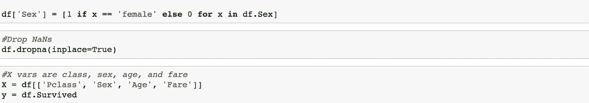

现在，我们应该导入并准备一个训练测试分割，并创建一个名为模型评估的功能，该功能查看准确性分数、混淆矩阵和分类报告。

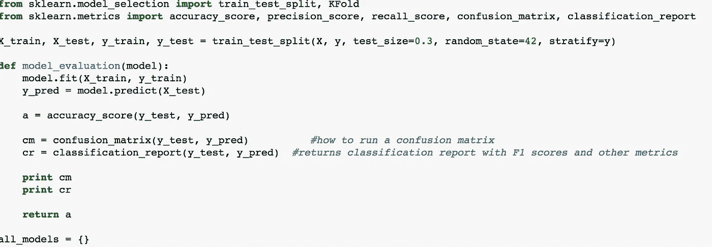

现在让我们从 K 个最近的邻居开始。

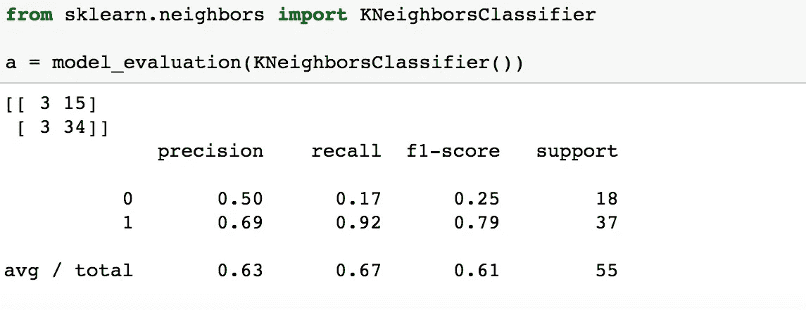

现在 KNN 使用网格搜索。

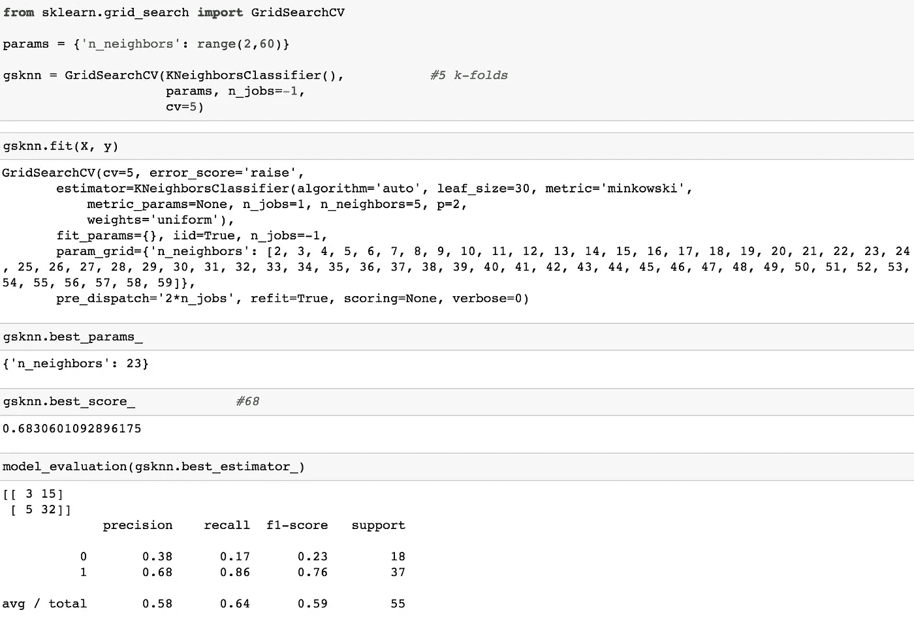

这给了我们一个 0.636363636363635 的最终分数。现在让我们试试 KNN 装袋！

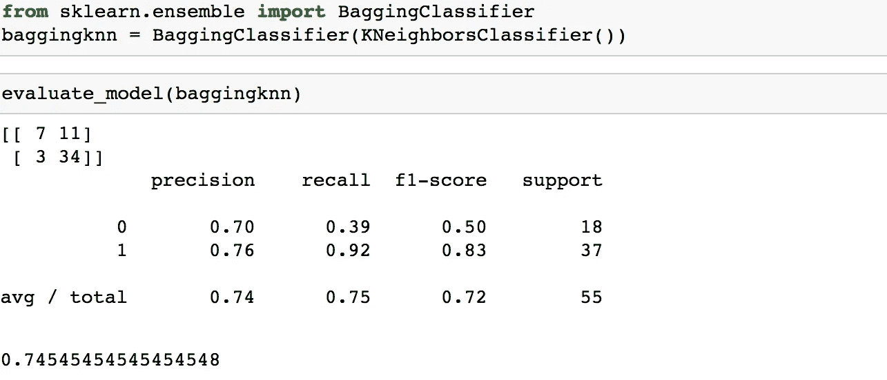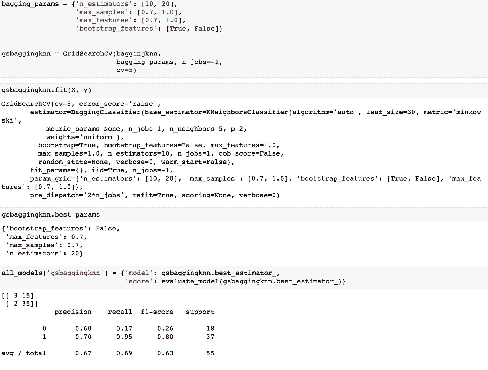

现在，逻辑回归

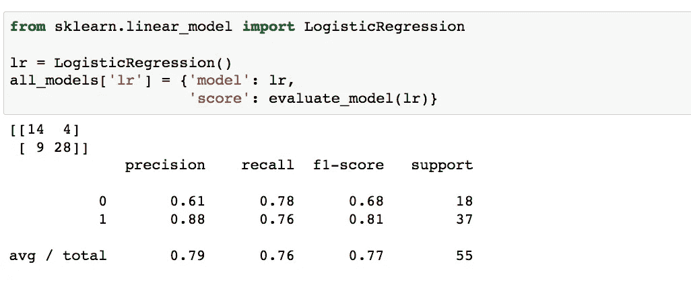

现在我们将运行一个决策树，但首先我们要运行一个网格搜索。

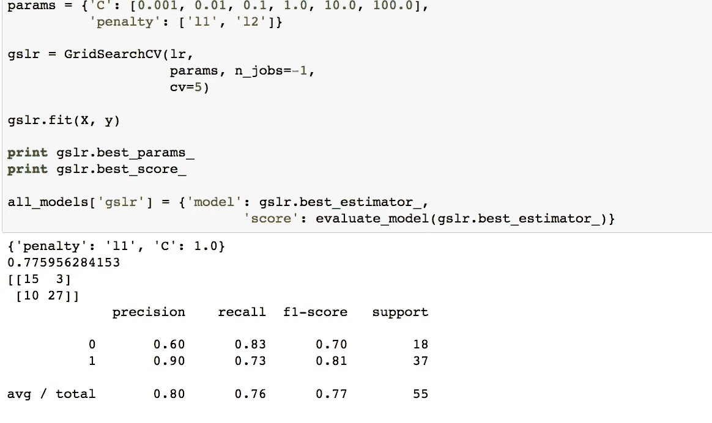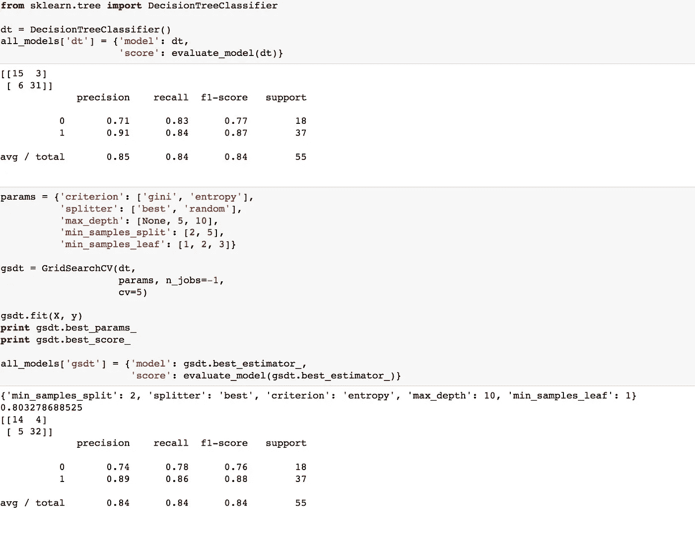

在这之后，我们应该在 DT 上使用装袋。

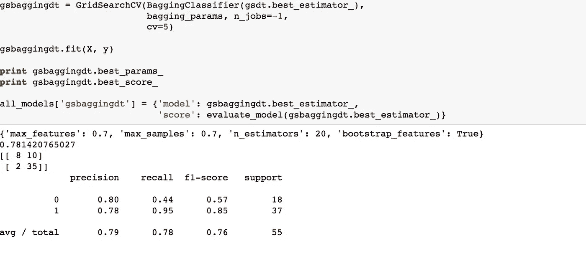

最后是随机森林和多余的树。

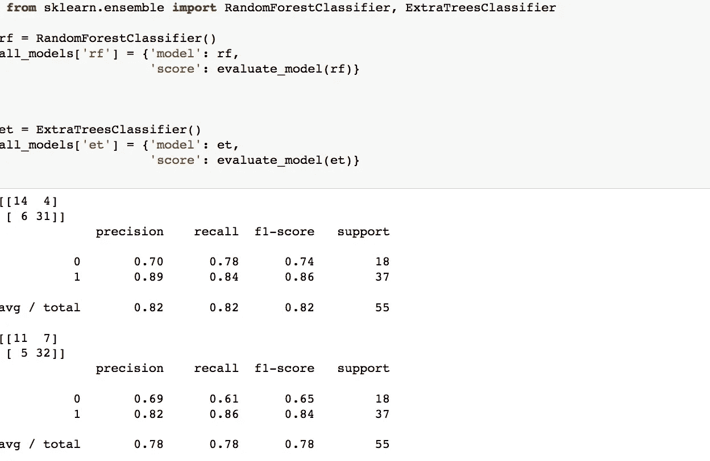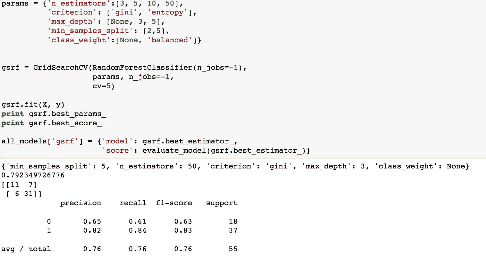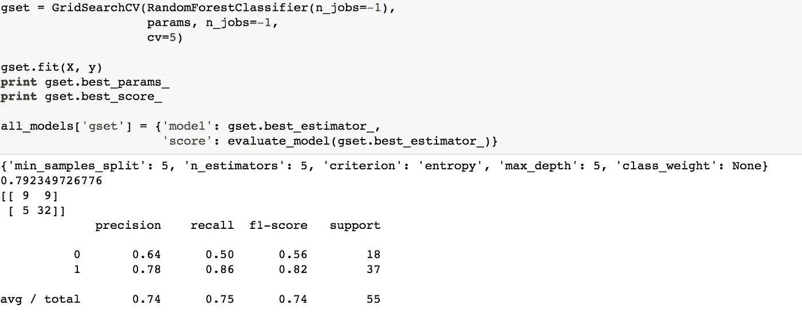

现在我们可以开始比较我们的模型了！首先，我们可以使用训练/测试分割来确定哪个模型执行得最好:

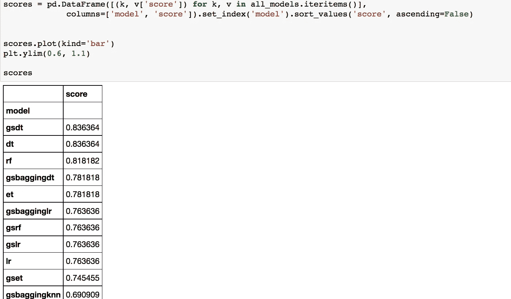

代替训练测试分割，我们可以看一个分层的 K 折叠来看模型在那里如何排列。

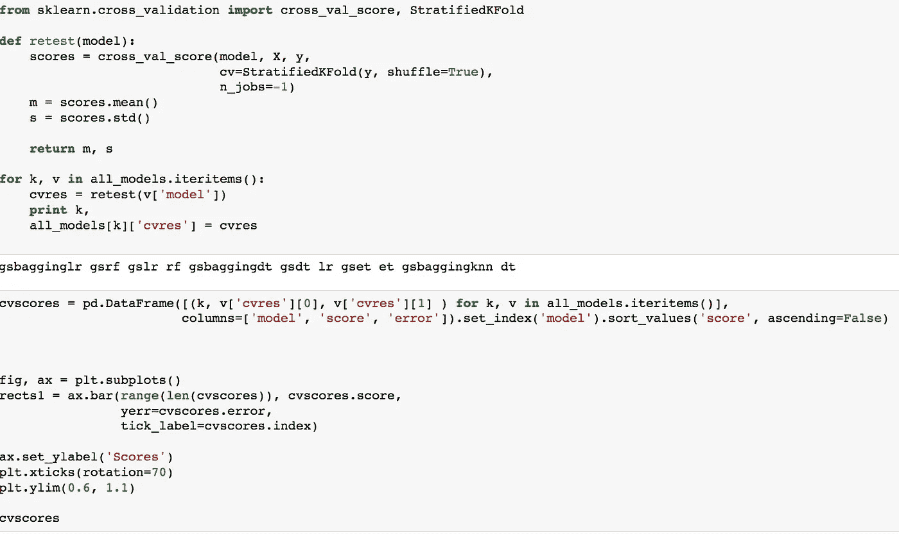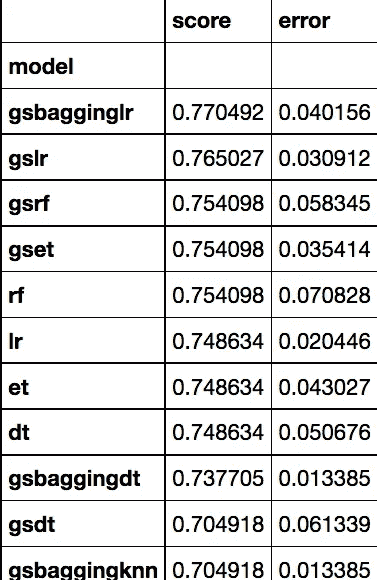

在这两方面，我认为决策树上的网格搜索包做得最好。使用训练测试分割，它排名很高，虽然它接近分层 k-fold 的下端，但它的误差比一些更高的预成型模型低得多！