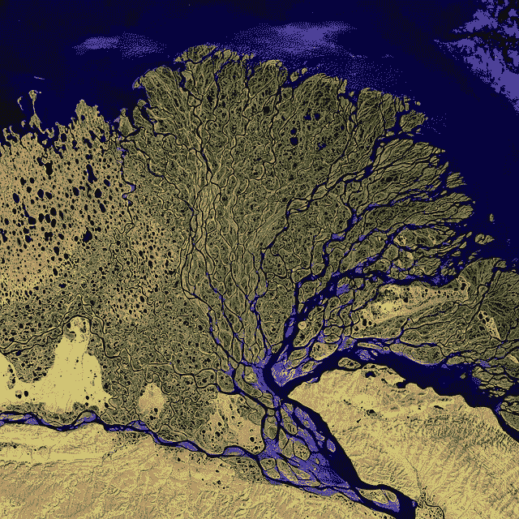
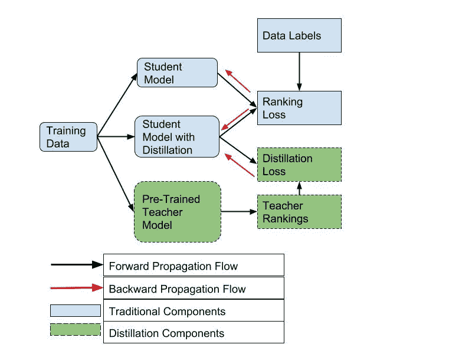
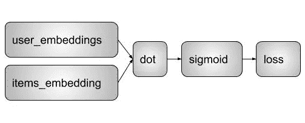
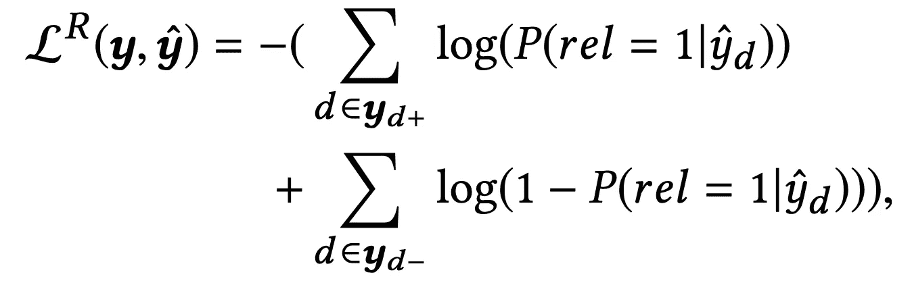

# 通过师生知识蒸馏介绍 PyTorch 模型压缩

> 原文：<https://towardsdatascience.com/model-distillation-and-compression-for-recommender-systems-in-pytorch-5d81c0f2c0ec?source=collection_archive---------11----------------------->

## 通过知识蒸馏的模型压缩可以节省推理时间、功率效率和模型大小。

Knowledge River Delta

在资源受限的移动和实时系统中服务 ML 模型可能是一个真正的问题。ML 社区一直在开发解决方案来压缩由较大的服务器集群生成的模型的大小。模型压缩承诺节省推理时间、功率效率和模型大小。所有这些都可以让飞行救援无人机在一次充电后覆盖更多的土地表面，同时不会耗尽移动应用用户的电池。

> **模型知识提炼是一种在不损失太多预测能力的情况下减少模型规模的方法**。

Geoffrey Hinton 在 2018 年[深度学习峰会](https://www.re-work.co/events/deep-learning-summit-toronto-canada-2018/schedule#)上关于使用 [**【知识蒸馏】**](https://arxiv.org/abs/1503.02531) (KD)的演讲让我去寻找另一类问题的当前技术状态:推荐系统(RecSys)。

这让我想到了唐嘉熙在 2018 年 KDD 发表的关于 [**排名蒸馏**](https://arxiv.org/abs/1809.07428) (RD)的优秀作品，他在其中讨论了他将知识蒸馏应用于排名任务的相关方法。

在这篇博客中，我在 [**Movielens 100K 数据集**](https://grouplens.org/datasets/movielens/) 上复制了这个排名提炼工作的一小部分。在这方面工作是一种领悟。即使 KD 是一个从一个模型到一个小模型提取知识的坚实的概念框架，将它应用于推荐系统的排序任务也不是一个简单的任务。

**第一个挑战**是我们在一个比常见的 fit/predict API 更低的抽象层次上工作，这些 API 存在于 Scikit-learn 和 Keras 等更高层次的库中。这是因为实现这个 KD 所需的改变是在**损失函数公式**本身。为了解决这个问题，我跟随第三篇论文的脚步，使用优雅的 PyTorch API 在 RecSys 中构建这个 KD。

第二个挑战是，即使 PyTorch 是一个优雅的库，我们也需要一个更高层次的框架，专门研究带有 PyTorch 的 RecSys。这些天的选择框架似乎是来自库拉的[聚焦。我强烈推荐它，API 设计易于使用，它让用户自定义我们这个实验需要的大多数方面。](https://github.com/maciejkula/spotlight)

我们走吧！

# 定制分级蒸馏反向传播流

目标是从 Movielens 100K 数据集生成 3 个模型:学生模型、带蒸馏的学生模型和教师模型，并比较它们的 MAP@K 指标以及物理磁盘大小。

我们需要解释我们将要使用的策略，从教师模型到学生模型，用蒸馏来教授一些**黑暗知识**。以下是对培训过程中将要发生的事情的解释:

Flow of data and forward/backward propagation during the knowledge distillation method

在上图中，我们展示了培训流程:

*   对于学生模型，我们使用传统的方法，使用带有数据标签和单个排名损失的训练数据。
*   对于教师模型，我们与学生模型类似地对其进行预训练，但我们使用更大的网络规模来实现更高的 K (MAP@K)平均精度。在完成较大模型的训练之后，我们存储预先训练的教师模型。
*   对于带有蒸馏的学生模型，我们使用带有标签和排名损失的训练数据。然而，在这个例子中，我们使用了教师模型对我们提供给学生模型的数据的预测。更准确地说，除了学生的损失之外，我们还使用教师的损失来计算和反向传播学生模型网络中的梯度。这些额外的信息应该可以提高学生模型的预测能力，同时保持模型大小与没有经过提取的学生模型相同。

# 结果比较

首先，我们需要一些培训数据，我们用这些数据来建立一个预培训教师模型。我们使用 movielens 100K 数据集，并且只使用电影/用户交互。我们将尝试预测用户最有可能评价的前 5 部电影。

为此，我们将使用 Spotlight 库提供的**implicit factorization model**。该模型使用基于**嵌入的**模型结构:

Implicit Factorization Model with a Bi-Linear model structure

对于损失，我们使用类似于下面负对数似然函数的方法。我们对正对和负对进行采样，并要求优化器提高正对中的排序项目(d+)并减少负对中的项目(d-):

Loss function related to the negative logarithmic of the likelihood function.

使用 **200** 作为 movielens 数据集上每个嵌入层的大小来训练“大型”教学模型，这为我们提供了以下指标:

让我们用一个小得多的模型做同样的尝试，用 **2** 作为每个嵌入层的大小:

**2 次观察:**

*   第一，学生模型本身序列化后的大小更小(0.10 mb vs 6.34)。这与网络的大小一致，因为嵌入的大小要小 100 倍。
*   第三，学生模型的 MAP@5 低于教师模型(0.050 vs 0.073)。较小的网络可以远离较大的网络。挑战是:**我们能在保持模型尺寸不变的情况下做得更好吗？**

这是我们接下来要尝试的。我们培训第三个模型，这是一个学生模型，由预先培训的教师模型推动。

为此，我们需要在损失函数中混合从两个模型中获得的两个损失。这就是 PyTorch 闪耀的地方。我们所要做的就是定义一个修正的损失函数，它总结了学生和老师的损失，让梯度下降发挥它的魔力。其核心是，如果您对使用对数 sigmoid 损失的正负损失有所了解，我们通过教师网络传递当前一批数据，获得候选预测，并使用它们来生成教师损失值。我们用于优化的最终损失是 pos/neg/teacher 这三个损失的总和。下面是组合损失函数的一个片段:

我们表现如何？

*   首先，提取模型的 MAP@5 值更接近教师模型的值，仅使用 2 作为嵌入层的大小(0.070 比 0.073)
*   第二，大小仍然是 0.10mb，类似于非蒸馏的学生模型。

这里有一个表格，列出了所有这些值以供比较

## 我们从这次冒险中学到了什么？

*   我很高兴看到 PyTorch 能够灵活地复制 KDD2018 论文的一小部分。
*   知识蒸馏真的很酷，也为推荐系统工作。
*   总的来说，每当两个或更多的人工智能模型之间有互动时，我对它们的结果非常感兴趣。

如果您对这种类型的跨模型交互感兴趣，我邀请您深入研究 KDD2018 论文。我们没有讨论如何通过加权教师的模型损失或仅考虑教师模型的 top-k 建议来改进这种设置。大概是以后的帖子吧。

直到那时！

谢了。

# 参考资料:

唐佳夕，还有王柯。排名提取:为推荐系统学习高性能的紧凑排名模型。*第 24 届 ACM SIGKDD 知识发现国际会议论文集&数据挖掘*。ACM，2018。

辛顿·杰弗里、奥里奥尔·维尼亚尔斯和杰夫·迪恩。**在神经网络中提取知识。***arXiv 预印本 arXiv:1503.02531* (2015)。

2017 年【https://github.com/maciejkula/spotlight】库拉**聚光灯**T2

2018 年 **PyTorch** ，[https://pytorch.org/](https://pytorch.org/)