# 型号选择 101，使用 R

> 原文：<https://towardsdatascience.com/model-selection-101-using-r-c8437b5f9f99?source=collection_archive---------3----------------------->

## 使用 R 对简单模型选择进行快速标记


## 我们在做什么？

由于这是一个非常入门的模型选择，我们假设你已经获得的数据已经被清理，擦洗和准备好了。数据清理本身就是一个完整的主题，实际上是任何数据科学家的主要时间接收器。如果您想自己下载数据并跟随学习，请阅读本文末尾！

**编辑**:我为这篇文章做了一个*续集*，关于可视化和绘制我们找到的模型，如果你想在读完这篇文章后看看的话！：

[](https://medium.com/@peter.nistrup/visualizing-models-101-using-r-c7c937fc5f04) [## 可视化模型 101，使用 R

### 你已经有了一个模型，现在呢？

medium.com](https://medium.com/@peter.nistrup/visualizing-models-101-using-r-c7c937fc5f04) 

如果你喜欢这篇文章并想看更多，请务必关注我的简介。

## 让我们看看管道:

这是我用来创建一个简单的 LM 或 GLM 的框架:

1.  **使用所有可用变量和数据创建一个基础模型**
2.  **如果 R 不工作，分解分类变量**
3.  **增加相关的电力变换**
4.  **添加相关变量交互**
5.  **删除无关紧要的变量**和相关的测试标准
    ——重复第 3-5 步，直到你用尽所有选择
6.  **删除任何异常数据点**
7.  **评估你的模型**
8.  将你的发现可视化

# 1.创建基础模型

让我们从建立一个工作空间和加载我们的数据开始。在本例中，我们正在处理一个描述**女性就业状况的数据集，该数据集基于您是否是外国人、政府补贴金额(对数转换)、年龄、受教育年限和子女数量**(分布在两个分类变量*【young . children】*和 *school.children* ):

```
rm(list=ls()) # “Clear current R environment”setwd(“C:/R/Workspace”) # Setting up your workspace
dat <- read.table(“employment_data.txt”, header=T) # Load that data
str(dat)
summary(dat)
```

哪些输出:

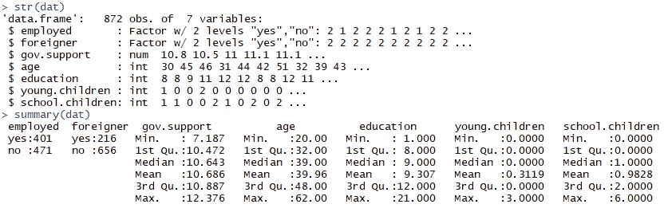

我们注意到的第一件事是，我们的响应变量是二项式的(显然),这表明我们有一个二项式分布，这意味着我们必须拟合一个 **GLM** 而不是传统的 **LM** :

```
fit.1 <- glm(employed == "yes" ~ ., data = dat, family = binomial)
summary(fit.1)
```

默认情况下，这种拟合是我们可以使用的最通用的拟合，它使用数据集中的每个变量( *~)来拟合二项式模型( *family = binomial* )关于具有值“yes”的响应变量“employed”。*)给出如下输出:

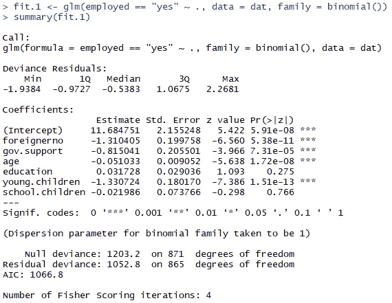

好的，那么马上就有几个问题，我们不喜欢看到 **p 值**高于 **0.05** ，更不喜欢高于 **0.1** ，但是在我们不顾一切地删除它们之前，让我们先检查变量交互和幂变换！

# 2.分解分类变量

让我们考虑没有任何孩子和实际上有大于零的任何数量的孩子之间存在分类差异的可能性，因此我们添加分类变量，用于有 **0 个孩子** : *'因子(young.children == 0)'* ，*'因子(school.children == 0)'* 和根本没有任何孩子的组合因子*'因子(young . children+school . children = = 0)'*

我们可以用新的变量更新我们的拟合:

```
tempfit <- update(fit.1, .~. + factor(young.children == 0) 
                             + factor(school.children == 0)
                             + factor(young.children + 
                               school.children == 0))
summary(tempfit)
```

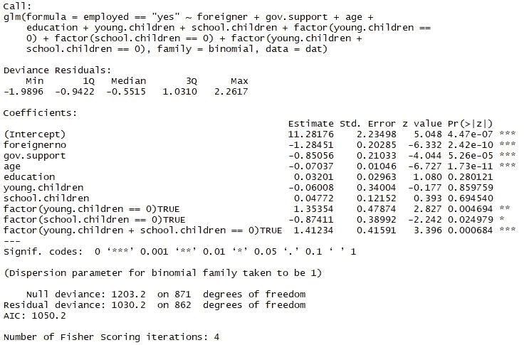

所以我们已经在 **AIC** 方面对我们的模型进行了一点改进，从 **1066.8** 到 **1050.2** ！让我们看看连续变量，观察可能的幂变换:

# 3.添加相关的电源转换

寻找二项分布的潜在幂变换的一个简单方法是使用这个自定义函数:

```
logit.plot <- function(x, y, h, link=’logit’, xlab=deparse(substitute(x)), yname=deparse(substitute(y)), ylab, rug=T, data, …){
    if(!missing(data)){
        call <- match.call()
        dataPos <- match(“data”,names(call))
        return(invisible(with(data, eval(call[-dataPos]))))
    }
    if (length(levels(factor(y)))!=2) stop(‘y must be binary’)
    succes <- levels(factor(y))[2]
    if (missing(ylab)) ylab <- paste(binomial(link)$link,’ P{‘,yname,’=’,succes,’|’,xlab,’}’, sep=’’, collapse=’’)
    if (is.factor(y)) y <- as.numeric(y==levels(y)[2])
    x.seq <- seq(min(x),max(x),length=101)
    smooth <- binomial(link)$linkfun(ksmooth(x, y, ’normal’, h, x.points=x.seq)$y)
    plot(smooth~x.seq, ylab=ylab, xlab=xlab, type=’l’,…)
    if (rug) rug(x)
    invisible(xy.coords(x = x.seq, y = smooth, xlab = xlab, ylab = ylab))
}
```

这实际上相当简单，它绘制了**链接(E[y|x])** 与 **x** 的关系，其中 E[y|x]使用 **Nadaraya-Watson** 内核回归估计进行估计:

这需要以下参数:
**x** —您的解释变量
**y** —二元结果变量
**h**—Nadaraya-Watson 核回归估计的带宽
**数据** —自我解释
**…** —您想要传递给 plot()的任何附加参数

使用该函数在不同带宽上迭代，我们得到以下类型的图:

```
for(i in seq(2.5,10,length.out = 6))
    logit.plot(x = age, y = employed == ‘yes’, h = i, data = dat, main = paste0(“bandwidth = “,i))
```

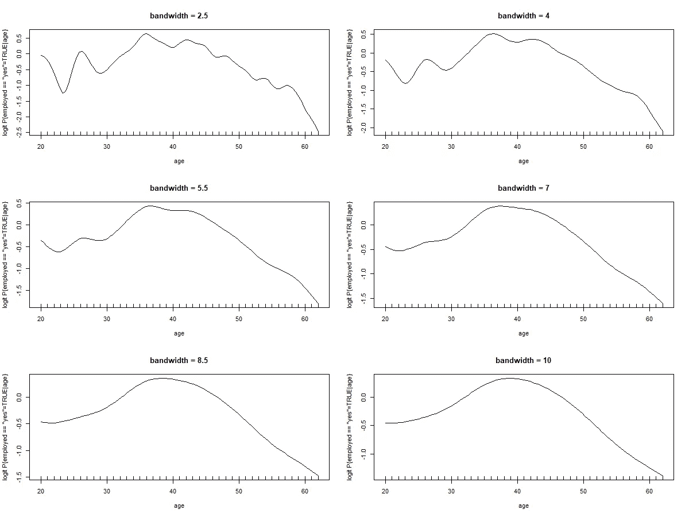

在这个带有“年龄”的例子中，我们可以看到，该函数在大约 7 的带宽附近开始变得平滑，该图可以近似为 2。或者 3 年。次数多项式，对于“education”和“gov.support”也是如此，但为了简单起见，我们将考虑所有三者的形状都为 2 的情况。次数多项式:

```
tempfit <- update(tempfit, .~. + I(age^2) 
                               + I(education^2)
                               + I(gov.support^2))
summary(tempfit)
```

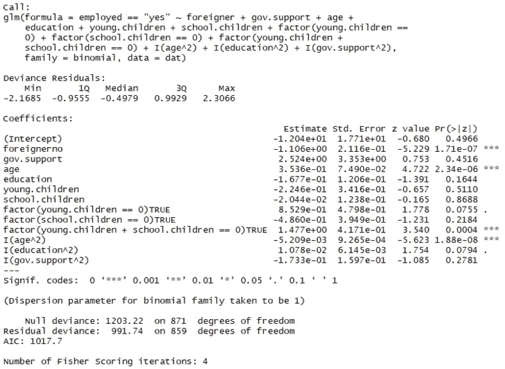

就 **AIC** 而言，改进相当大，从 **1050.2** 到 **1017.7** ！尽管有许多无关紧要的变量！

这是我们对“完整”模型的第一次尝试，所以让我们将其定义为“fit.2 ”,然后继续。

```
fit.2 <- tempfit
```

# **4。添加变量交互**

检查变量相互作用的最简单的方法是使用 R 函数'**add 1【T1]'，这只是定义一个测试范围以及相对于原始模型测试时使用哪个测试的情况。f 检验通常只与 **LM** 和 **AOV** 车型相关，因此我们可以“安全地”忽略该检验标准，我们将使用***χ*-检验** (Chisq 或 Chi):**

```
add1(fit.2, scope = .~. + .^2, test=”Chisq”)
```

这个范围仅仅是要求测试当前的模型(。~.)加上现有变量之间的相互作用(+。^2)，这将输出许多交互，一些具有统计上显著的 p 值，但是手动排序可能会很烦人，所以让**对列表**进行排序，这样我们就可以在顶部得到最低的 **P 值**:

```
add1.test <- add1(fit.2, scope = .~. + .^2, test=”Chisq”)
add1.test[order(add1.test$’Pr(>Chi)’),]
```

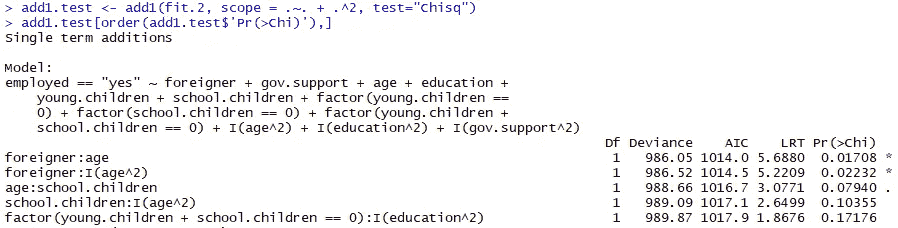

是的，所以看起来外国人和年龄变量之间可能会有交互作用。在简单地添加具有最低 P 值的交互之前，要考虑的一件事是，这在我们当前的模型中是否有意义，现在**年龄**实际上是我们模型中最重要的变量，因此我们可能会认为添加**外国人**和**年龄**之间的交互更直观，为了简单起见，我们将坚持使用**外国人:年龄**交互。

在添加变量交互**外国人:年龄**之后，让我们测试更多的交互**:**

```
add1.test <- add1(update(fit.2, .~. + foreigner:age), scope = .~. + .^2, test=”Chisq”)
add1.test[order(add1.test$’Pr(>Chi)’),]
```

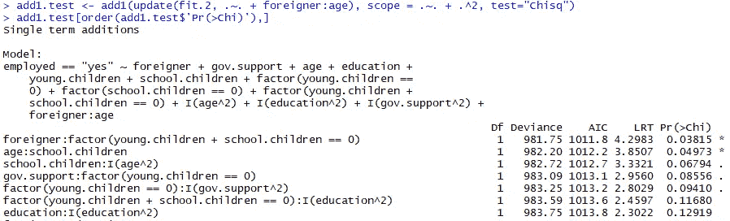

现在看来在**外国人:因素(young . children+school . children = = 0)**中有一个重要的互动

经过几轮后，我们最终没有看到新的具有统计意义的交互，到最后我们添加了以下交互:
+ **外国人:年龄**
+ **外国人:因素(young . children+school . children = = 0)**
+**年龄:school.children**
+ **政府支持:因素(young.children == 0)**

因此，让我们用新的变量交互来更新我们的拟合，如下所示:

```
fit.3 <- update(fit.2, .~. 
+ foreigner:age 
+ foreigner:factor(young.children + school.children == 0) 
+ age:school.children 
+ gov.support:factor(young.children == 0))summary(fit.3)
```

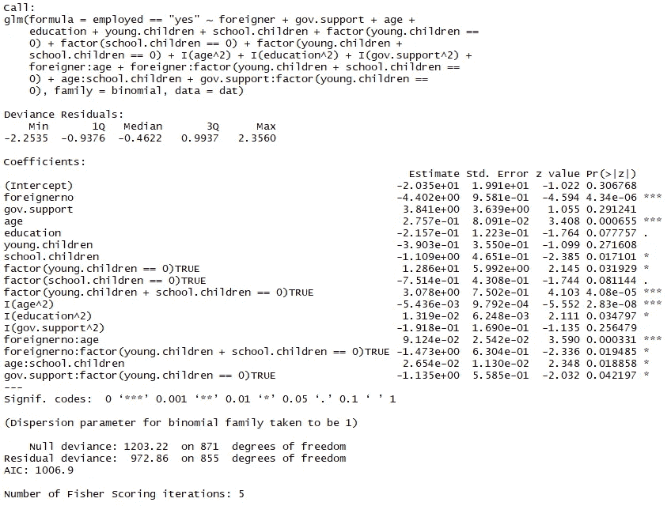

再次对 **AIC** 进行小改进，从 **1017.7** 变为 **1006.9** 。

# **5。移除无关紧要的变量**

这个过程与步骤 4 中的最后一个非常相似。我们现在将简单地使用 R 中的 **drop1** 函数，而不是 **add1、**，并且由于我们寻求移除而不是追加变量，我们寻求最高的 **P 值**而不是最低的(我们仍将使用 ***χ* -test** 作为我们的标准):

```
drop1.test <- drop1(fit.3, test=”Chisq”)
drop1.test[rev(order(drop1.test$’Pr(>Chi)’)),]
```

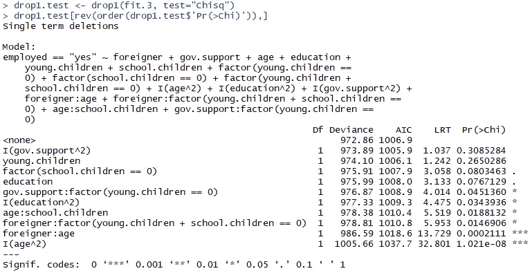

这和我们的模型告诉我们的大部分是一样的——总结，**政府支持**肯定没有统计上的显著性，所以我们将首先移除它，以此类推，我们最终移除以下变量:
- **政府支持**
- **青少年**
- **教育**
- **教育**

移除这些变量后，我们看到所有剩余变量都具有统计显著性，因此让我们通过移除上面列出的变量来更新我们的拟合:

```
fit.4 <- update(fit.3, .~. 
— I(gov.support^2) 
— young.children 
— education 
— I(education^2))summary(fit.4)
```

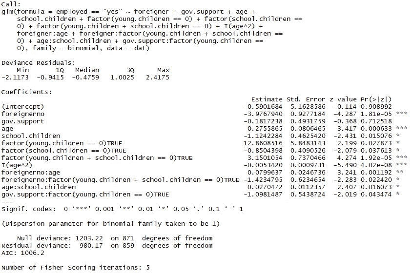

不错， **AIC** 的另一个改进虽然**微不足道，但这个模型相对于我们之前的模型的主要优势是**增加了解释变量数量减少所固有的简单性**！**

有人可能会问*“为什么我们不删除****gov . support****变量？在看我们模型的总结时，这显然是微不足道的！”*这是因为**边际原则**禁止我们移除一个无关紧要的变量，如果该变量与另一个变量有显著的相互作用，如**gov . support:factor(young . children = = 0)。**

鉴于**明显不重要**，并且与 young.children == 0 变量的交互仅**略微重要( *p* = 0.435)** ，您可能会认为移除 *gov.support* 将有利于模型的简单性，然而，当进一步检查从模型中移除 ***gov.support*** 时，变量交互**分裂为两个变量 因此，没有给我们任何额外的简单性， **AIC** 、**所有其他系数**以及**零** -和**剩余偏差**保持**完全相同**，因此，我关闭它，将其留在模型中。**

对我们新改进的模型进行 **add1** 和 **drop1** 测试表明，没有新的显著交互，所有当前变量都是显著的，所以我们完成了！**最终拟合为**:

```
glm(employed == “yes” ~ foreigner 
+ gov.support 
+ age 
+ school.children 
+ factor(young.children == 0) 
+ factor(school.children == 0) 
+ factor(young.children + school.children == 0) 
+ I(age^2) 
+ foreigner:age 
+ foreigner:factor(young.children + school.children == 0) 
+ age:school.children 
+ gov.support:factor(young.children == 0), family = binomial, data = dat)
```

# **6。移除异常值**

现在我们有了一个满意的模型，我们可以寻找对模型有负面影响的异常值。

使用“汽车”包[https://www.rdocumentation.org/packages/car/versions/1.0-2](https://www.rdocumentation.org/packages/car/versions/1.0-2)我们可以使用 influencePlot()和 outlierTest()函数来查找潜在的异常值:

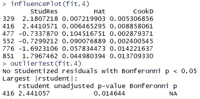

我们看到数据点 416 在两个测试中都被归类为异常值，我们可以查看一些图中的点，以判断是否要将其移除:

```
par(mfrow = c(2, 2)) # 2 row(s), 2 column(s)plot(fit.4, col=ifelse(as.integer(rownames(dat))==416, “red”, “black”), pch=20)
```

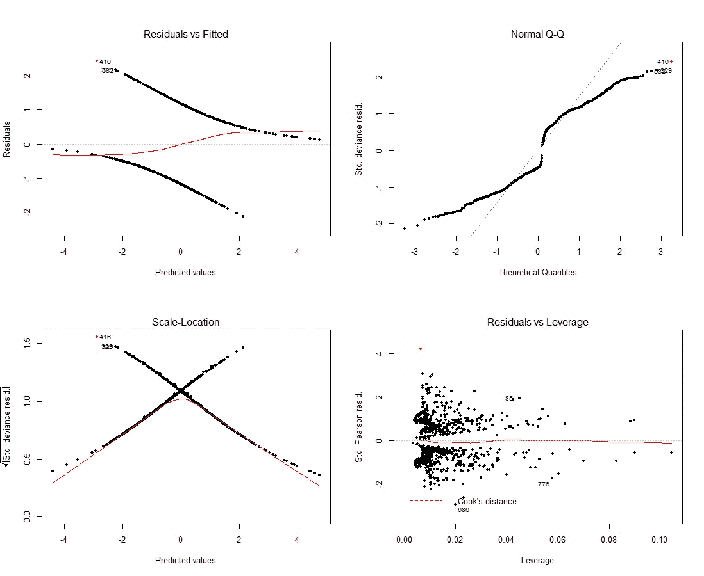

这似乎很可能会对我们的模型造成一点影响，请注意，我们实际上应该使用**皮尔逊残差**来衡量我们的模型拟合度，因此，左上角的图中没有任何接近直线的东西是好的， **Q-Q 图**也与这种模型无关。

让我们试着去掉这一点，看看新的合身程度:

```
final.fit <- update(fit.4, data = dat[-c(416),])
summary(final.fit)
```

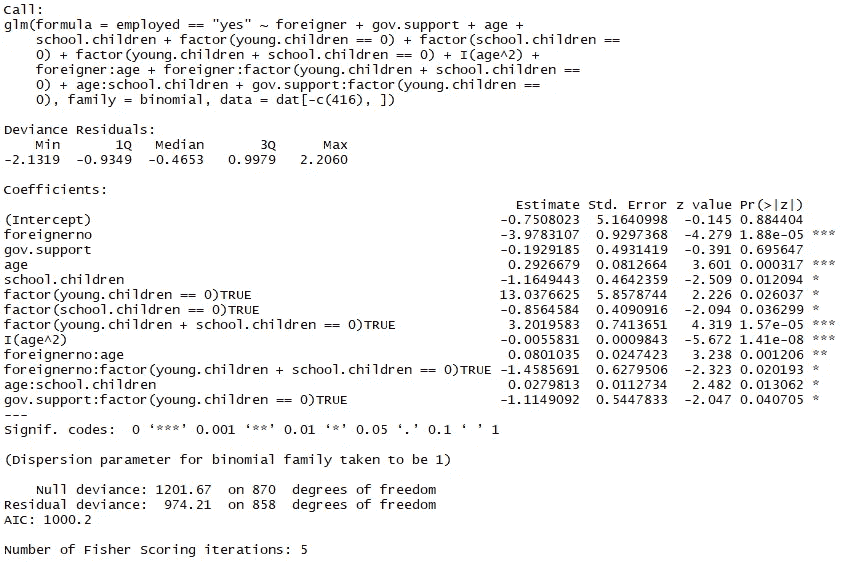

从最初的 **1067，**下降到几乎**1000**1000**AIC**当**比较两个不同数据集的 AIC**(因为我们移除了点 416)时，我们实际上必须得出结论，416 在初始模型中也是异常值，移除它，然后将没有点 416 的初始模型的 AIC 值与没有点 416 的最终拟合值**进行比较**

查看另一轮 **influencePlot()** 和 **outlierTest()** 我们发现**数据点 329** 也在发挥作用，但是查看实际的曲线图我们会发现，我们无法像使用 **416** 那样真正证明删除数据的合理性。这是我们最后的合身衣服。

# 7.模型评估

现在我们有了一个最终拟合，我们不能自信地添加或删除任何交互变量和其他转换**是时候评估我们的模型是否真正符合我们的数据，以及我们的最终拟合和第一次“天真”拟合之间是否有统计学上的显著差异。**

让我们先来看看我们的拟合值与皮尔逊残差的对比:

```
par(mfrow = c(1, 1)) # 2 row(s), 2 column(s)
plot(p.resid ~ fit.val)
lines(ksmooth(y = p.resid, x = fit.val, bandwidth=.1, kernel=’normal’), col=’blue’)
abline(h=0)
```

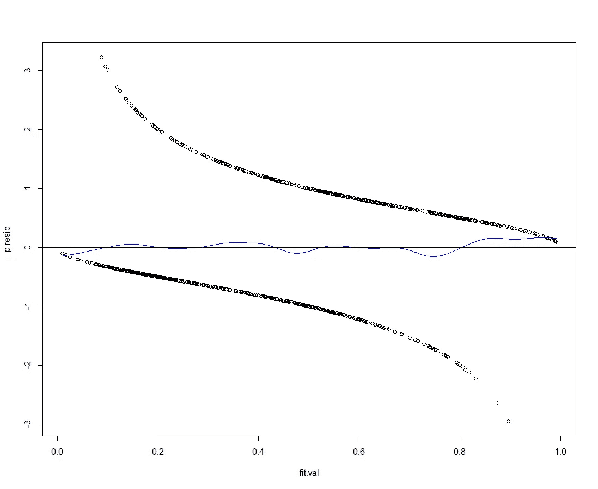

这是一个相当不错的拟合，让我们看看主要解释变量的拟合情况:

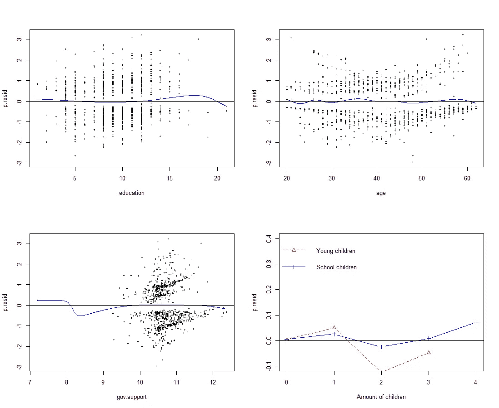

除了' *gov.support* '之外，一切看起来都很好，而且' *gov.support* '弯曲的原因似乎是一个孤立点，与我们所有其他数据点相比，某人获得的支持量要低得多。

## 检查潜在的过度拟合

过度拟合是所有统计建模的祸根，你如何确保你的模型不仅仅符合你输入的精确数据？**我们的目标是建立一个通用的模型**，而不仅仅是迎合现有的数据。那么，我们如何测试我们的模型是否过度符合我们的数据呢？

一个流行的测试指标是通过**交叉验证**生成的 delta 值，我们可以通过使用来自' **boot** '包的 **cv.glm** 函数来计算这些值，并将我们的最终拟合与我们的第一次拟合进行比较！

```
cv.glm(dat[-c(416),], final.fit, K = 13)$delta
cv.glm(dat[-c(416),], update(fit.1, data = dat[-c(416),]), K = 13)$delta
```

在上面的代码中，我们使用了 **k 倍交叉验证**和 **k = 13** (因为 13 是 871 的因数，871 是我们在去除异常值后的数据长度)这意味着我们将数据分成 13 个“块”。

delta 值是一个向量，其中第一个分量是预测误差的原始交叉验证估计值**，第二个分量是**调整后的交叉验证估计值**(设计用于补偿不使用穷举测试方法(如*)引入的**偏差*****

*运行上面的代码会产生以下增量值，请注意，这些值受一些随机变化的影响，因此您可能不会获得完全相同的值:*

*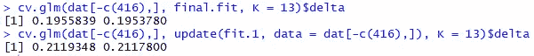*

*对于**最终拟合**，预测误差**低于**，即使在交叉验证测试时也是如此。因此，我们可以假设我们的模型没有过度拟合我们的数据！*

## *拼图的最后一块*

*因此，现在我们已经得出结论，我们的模型实际上非常适合我们的数据，但它与没有任何转换和变量交互的“天真”模型相比，在统计上有显著差异吗？为此，我们可以使用 **ANOVA** 测试，我们只需在两次拟合中删除相同的数据点:*

*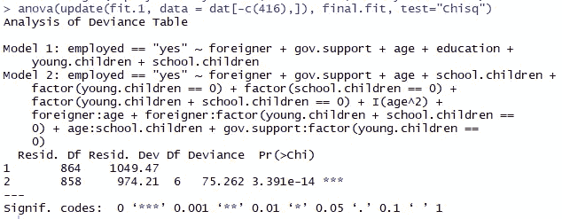*

*这两种拟合之间肯定有显著的差异，我们可以高兴地得出结论，我们的努力得到了回报！*

# *8.模型可视化*

*现在我们已经有了一个模型，我们如何真正地**可视化**和**解释**它所说的关于**我们的数据**中的关系？*

*看看下面的走线通道，它使用了与本文相同的数据和型号。：*

*[](https://medium.com/@peter.nistrup/visualizing-models-101-using-r-c7c937fc5f04) [## 可视化模型 101，使用 R

### 你已经有了一个模型，现在呢？

medium.com](https://medium.com/@peter.nistrup/visualizing-models-101-using-r-c7c937fc5f04)* 

# *结束语*

*请记住，这**纯粹是介绍性的**并且**这不是详尽的分析或结论**！如果我们在追求中更加严格，我们会在我们模型的每个新迭代中加入**交叉验证**测试和**方差分析**测试。每当我们增加一个新的变量，交互作用或能量转换。*

*如果您有任何问题，请随时给我发消息，如果您觉得我错过了什么或做错了什么，请纠正我，请记住，这是对 R 建模的介绍，我很清楚，与更高级的方法相比，这个过程是高度简化的！*

*如果你想试试这个数据集的运气，试试这里:[https://github . com/pela 15 AE/statmod/blob/master/employment _ data . txt](https://github.com/pela15ae/statmod/blob/master/employment_data.txt)*

*数据是丹麦语，因此要将标题和分类值转换为英语，请运行这段代码:*

```
*names(dat) <- c(“employed”, “foreigner”, “gov.support”, “age”, “education”, “young.children”, “school.children”)
levels(dat$employed)[1] <- “yes”
levels(dat$employed)[2] <- “no”
levels(dat$foreigner)[1] <- “yes”
levels(dat$foreigner)[2] <- “no”*
```

# *结束语*

*如果你想看和了解更多，一定要关注我的 [**媒体**](https://medium.com/@peter.nistrup) 🔍**[**碎碎念**](https://twitter.com/peternistrup) 🐦***

***[](https://medium.com/@peter.nistrup) [## 彼得·尼斯特鲁普-中等

### 阅读彼得·尼斯特拉普在媒介上的作品。数据科学、统计和人工智能...推特:@PeterNistrup，LinkedIn…

medium.com](https://medium.com/@peter.nistrup)***