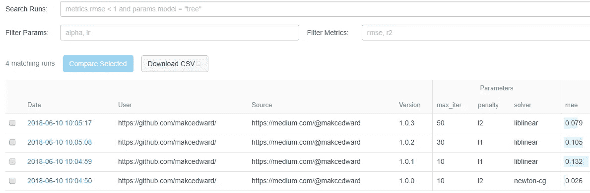

# 数据科学的模型跟踪工具(mlflow)

> 原文：<https://towardsdatascience.com/model-tracking-tools-for-data-science-mlflow-51b681f8452e?source=collection_archive---------7----------------------->


Source: [https://www.recordedfuture.com/machine-learning-cybersecurity-applications/](https://www.recordedfuture.com/machine-learning-cybersecurity-applications/)

在数据科学工作中，Jupyter 笔记本是一个众所周知的工具。除此之外，我们可能会使用 databricks 的笔记本或 Colab(由谷歌)。产品化怎么样？

如何将我们的模型部署到生产中？如果你使用 TensorFlow 库来建立模型，我们可以使用 tensorflow 服务。使用 Azure 平台的话可以用 Data Science Workbench。如果我们真的使用上面的解决方案呢？一些公司建立了内部系统，如米开朗基罗(优步)、 [FBLearner Flow(脸书)](https://code.facebook.com/posts/1072626246134461/introducing-fblearner-flow-facebook-s-ai-backbone/)。然而，那些平台是为它们的内部系统设计的。

我们有开源吗？在此之前，我们有 [modeldb](https://github.com/mitdbg/modeldb) 。我们有了新的选择，mlflow，它刚刚在上周(2018 年 6 月 5 日)发布了 alpha 版本。让我们参观一下这个产品。


Source: [https://sdtimes.com/ai/databricks-releases-mlflow-runtime-for-ml-and-databricks-delta-at-spark-ai-summit/](https://sdtimes.com/ai/databricks-releases-mlflow-runtime-for-ml-and-databricks-delta-at-spark-ai-summit/)

首先，您必须安装 mlflow，然后在命令行中执行以下命令来启动 UI 服务

```
mlflow ui
```

并执行以下命令将数据传递给服务器

```
lr = LogisticRegression(max_iter=param['max_iter'], penalty=param['penalty'], solver=param['solver'])
        lr.fit(x_train, y_train)
        y_pred = lr.predict(x_test)(rmse, mae, r2) = eval_metrics(y_test, y_pred)mlflow.log_metric("rmse", rmse)
        mlflow.log_metric("r2", r2)
        mlflow.log_metric("mae", mae)
        mlflow.log_param("max_iter", param['max_iter'])
        mlflow.log_param("penalty", param['penalty'])
        mlflow.log_param("solver", param['solver'])mlflow.sklearn.log_model(lr, "model")
```

稍后，转到 [http://localhost:5000/](http://localhost:5000/)



默认情况下，它会显示“日期”、“用户”、“源”、“版本”、“参数”和“指标”。

如需源代码，请访问 [github](https://github.com/makcedward/data_science_tool/blob/master/sample/mlflow-tracking-evaluation.md) 获取完整版本

# 估价

***用户***

系统将使用 pwd (linux 命令)来获取用户 ID。如果操作系统是 Window，它将使用“未知”的默认用户 ID。我相信他们对审计目的有所顾虑，这就是为什么他们不允许将用户 ID 作为参数传递。

```
# Copy from mlflow source code_DEFAULT_USER_ID = "unknown"def _get_user_id():
    *""" Gets the ID of the user for the current run. """* try:
        import pwd
        return **pwd.getpwuid(os.getuid())[0]**
    except ImportError:
        return _DEFAULT_USER_ID
```

那么我们能在 Window 中做些什么来“劫持”它呢？:)我们可以覆盖全局值(在 alpha 版本中有效)。但是，不建议这样做，因为这会破坏审计/安全考虑。

```
mlflow.tracking._DEFAULT_USER_ID = '[https://github.com/makcedward/](https://github.com/makcedward/)'
```

***来源***

默认情况下，带有路径的文件名将被用作源文件。强烈建议提供源代码，以便更好地使用 UI 搜索。

```
# Copy from mlflow source codedef _get_main_file():
    if len(sys.argv) > 0:
        return **sys.argv[0]**
    return None
```

***版本***

一般来说，版本号可能是“1.0.0”就可以了。但是，如果您定义的版本号是“123.456.789”或“测试”。你会有麻烦，因为用户界面显示多达 6 个字符。从源代码来看，它将版本简化为“shortVersion ”,允许最多 6 个字符。

```
# Copy from mlflow source codestatic renderVersion(run) {
  if (run.source_version) {
    **const shortVersion = run.source_version.substring(0, 6);**
    if (run.source_type === "PROJECT") {
      const GITHUB_RE = /[:@]github.com[:/]([^/.]+)\/([^/.]+)/;
      const match = run.source_name.match(GITHUB_RE);
      if (match) {
        const url = "https://github.com/" + match[1] + "/" + match[2] + "/tree/" + run.source_version;
        return <a href={url}>{shortVersion}</a>;
      }
    } else {
      return shortVersion;
    }
  }
  return null;
}
```

***储存***

记录将保存在文件系统中。换句话说，它不将数据持久化到 DB 中，并且它可能在 UI 搜索和其他系统问题中具有潜在的查询性能。相信将记录保存到数据库应该在路线图中。

**API**

API 接口由单线程的 Flask 构建。因此，它不能同时处理大量的请求。似乎在投入生产之前，必须先解决这个问题。

# 关于我

我是湾区的数据科学家。专注于数据科学、人工智能，尤其是 NLP 和平台相关领域的最新发展。

中:【http://medium.com/@makcedward/】T2

领英:【https://www.linkedin.com/in/edwardma1026 

github:[https://github.com/makcedward](https://github.com/makcedward)

https://www.kaggle.com/makcedward