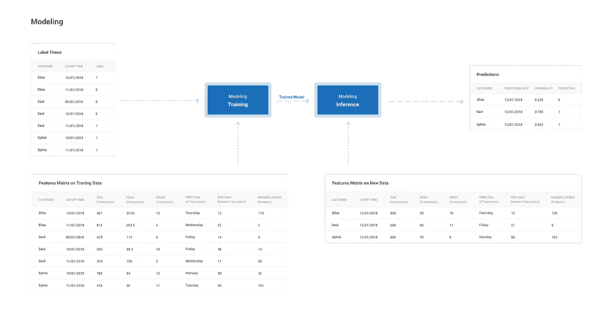
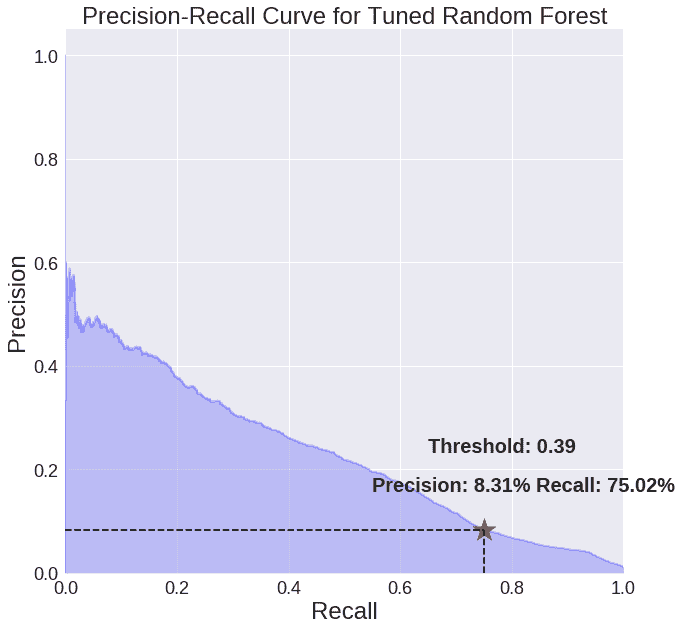
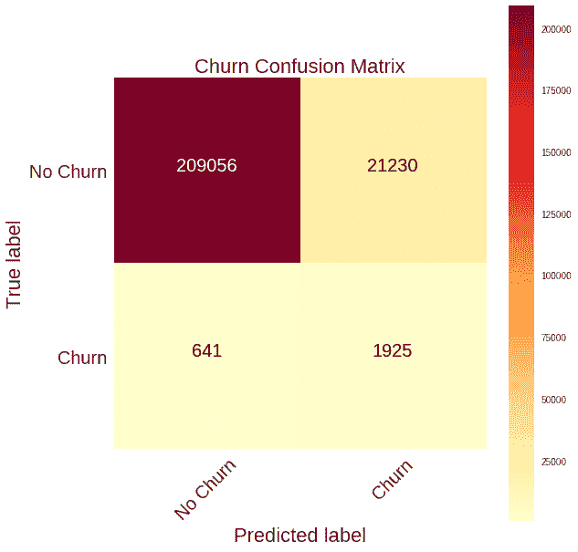
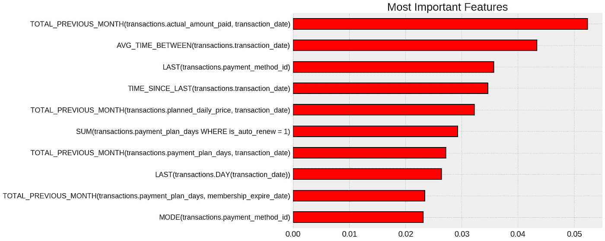
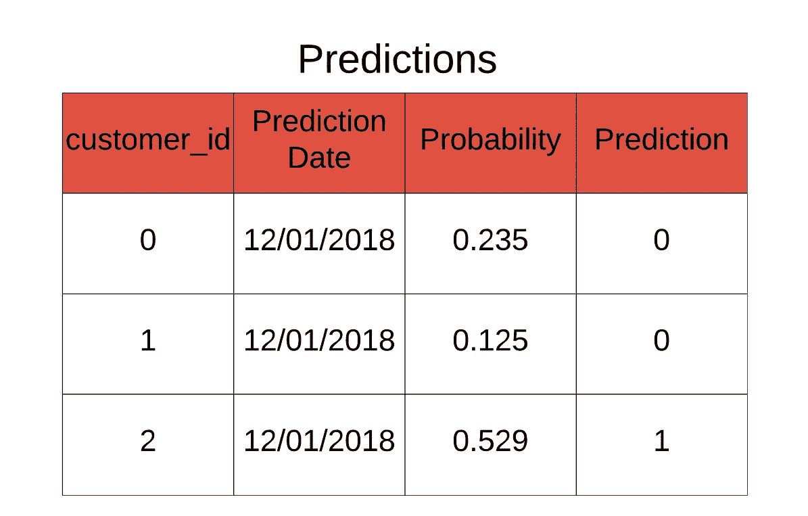
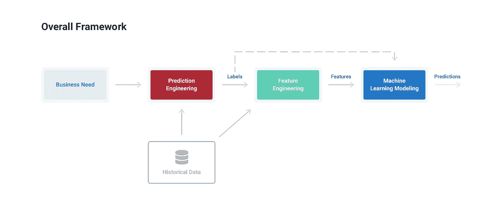

# 建模:教授机器学习算法以交付商业价值

> 原文：<https://towardsdatascience.com/modeling-teaching-a-machine-learning-algorithm-to-deliver-business-value-ad0205ca4c86?source=collection_archive---------5----------------------->

## 如何训练、调整和验证机器学习模型

这是关于我们如何在[功能实验室](https://www.featurelabs.com)进行机器学习的四部分系列中的第四部分。完整的文章集可以在下面找到:

1.  [概述:机器学习的通用框架](https://medium.com/@williamkoehrsen/how-to-create-value-with-machine-learning-eb09585b332e)
2.  [预测工程:如何设置你的机器学习问题](https://medium.com/@williamkoehrsen/prediction-engineering-how-to-set-up-your-machine-learning-problem-b3b8f622683b)
3.  [特征工程:机器学习的动力](/feature-engineering-what-powers-machine-learning-93ab191bcc2d)
4.  建模:教授算法(本文)

这些文章涵盖了应用于预测客户流失的概念和完整实现。project [Jupyter 笔记本在 GitHub](https://github.com/Featuretools/predicting-customer-churn/tree/master/churn) 上都有。(充分披露:我在 [Feature Labs](https://www.featurelabs.com) 工作，这是一家初创公司开发工具，包括 [Featuretools](https://github.com/Featuretools/featuretools) ，用于解决机器学习的问题。这里记录的所有工作都是用开源工具和数据完成的。)

# 机器学习建模过程

[预测](https://medium.com/@williamkoehrsen/prediction-engineering-how-to-set-up-your-machine-learning-problem-b3b8f622683b)和[特征工程](/feature-engineering-what-powers-machine-learning-93ab191bcc2d)的输出是一组*标签时间*，我们想要预测的历史实例，以及*特征*，用于训练模型以预测标签的预测变量。建模的过程意味着训练机器学习算法来根据特征预测标签，根据业务需求对其进行调整，并根据维持数据对其进行验证。

Inputs and outputs of the modeling process.

建模的输出是经过训练的模型，可用于*推理*，对新数据点进行预测。

> 机器学习的目标不是一个在训练数据上做得很好的模型，而是一个证明它*满足业务需求*并且可以在实时数据上部署的模型。

与特征工程类似，建模与机器学习过程中的先前步骤*无关*，并且具有*标准化输入*，这意味着我们可以改变预测问题，而无需重写我们的所有代码。如果业务需求发生变化，我们可以生成新的标签时间，构建相应的特征，并将其输入到模型中。

# 客户流失建模的实现

在这个系列中，我们使用机器学习来解决客户流失问题。有几种方法来制定任务，但我们的定义是:

> 在每个月的第一天预测这个月哪些客户会流失。使用一个月的提前期，客户流失率为 31 天，没有订阅。提前期为 1 个月，这意味着我们提前 1 个月进行预测:1 月 1 日，我们预测 2 月份的客户流失。

尽管机器学习算法听起来在技术上可能很复杂，但用 Python 实现它们很简单，这要感谢像 [Scikit-Learn](http://sklearn.org) 这样的标准机器学习库。作为一点实用的建议，经验结果已经表明机器学习模型和超参数的[选择很重要](https://psb.stanford.edu/psb-online/proceedings/psb18/olson.pdf)，但是[不如特征工程](https://homes.cs.washington.edu/~pedrod/papers/cacm12.pdf)重要。

> 因此，理性的决定是将大部分精力放在预测和特征工程上，并插入一个预先构建的机器学习解决方案。

在这个项目中，我和 Scikit-Learn 一起快速实现了一些模型。为了让数据为机器学习做好准备，我们必须采取一些基本步骤:缺失值插补、分类变量编码，如果输入维度过大，还可以选择特征选择(详细信息参见[笔记本](https://github.com/Featuretools/predicting-customer-churn/blob/master/churn/5.%20Modeling.ipynb))。然后，我们可以用标准建模语法创建一个模型:

## 指标和基线结果

在应用机器学习之前，最好建立一个*幼稚基线*来确定机器学习是否真的有帮助。对于分类问题，这可以简单到猜测保留测试数据中所有示例的训练数据中的多数标签。对于客户流失数据，猜测每个测试标签不是流失产生 96.5%的**。**

*这种高精度听起来可能令人印象深刻，但是对于不平衡的分类问题——一个类比另一个类表示得多——精度不是一个足够的度量。相反，我们希望使用*召回率、精确度、*或 *F1 分数。**

*回忆表示数据中实际搅动的百分比，我们的模型用天真的猜测记录 3.5%来识别。Precision 测量由我们的模型预测的和*实际的*的百分比，简单的分数是 1.0%。F1 分数是这些测量值的调和平均值。*

*由于这是一个分类问题，对于机器学习基线，我尝试了一个表现不佳的*逻辑回归*。这表明问题可能是非线性的，所以我的第二次尝试使用了随机森林分类器，结果更好。[随机森林](https://www.stat.berkeley.edu/~breiman/randomforest2001.pdf)训练速度快，相对可解释，高度准确，通常是可靠的模型选择。*

*无机器学习、逻辑回归和具有默认超参数的随机森林的指标如下所示:*

**

*Metrics recorded by baseline models*

*基于*时间序列分割*，使用约 30%的数据对每个模型进行了评估。(在评估时序问题中的模型时，这一点至关重要，因为它可以防止训练数据泄漏，并可以对新数据的实际模型性能提供良好的估计。)*

# *使模型与业务需求保持一致*

*尽管 ml 模型的指标比没有机器学习的要好，但我们希望根据业务需求优化给定指标的模型。在这个例子中，我们将关注召回率和精确度。我们将*调整*模型，通过调整*阈值来实现一定的召回率，阈值是*一个观察结果被分类为正面的概率——客户流失。*

## *精度和召回调整*

*在机器学习中，在召回率和精确度之间有一个基本的权衡，这意味着我们只能以减少另一个为代价来增加一个。例如，如果我们想要找到客户流失的每一个实例——100%的召回率——那么我们将不得不接受低精度——许多误报。相反，如果我们通过提高精确度来限制假阳性，那么我们将识别出更少的降低召回率的实际搅动。*

*通过调整模型的阈值来改变这两者之间的平衡。我们可以在模型的 [*精确回忆曲线*](https://machinelearningmastery.com/roc-curves-and-precision-recall-curves-for-classification-in-python/) 中形象化这一点。*

**

*Precision-recall curve tuned for 75% recall.*

*这显示了不同阈值下的*精度与召回率。Scikit-Learn 中的默认阈值是 0.5，但是根据业务需求，我们可以调整这个阈值以实现所需的性能。**

*对于客户流失，我们将调整阈值以实现 75%的召回率。通过检查预测的概率(实际值)，我们确定阈值应该是 0.39，以达到这个标准。**在阈值为 0.39 时，我们的召回率为 75%，准确率为 8.31%。***

**选择召回还是精确在于商业领域。*这需要确定哪种成本更高，*假阳性*——预测客户会流失，而事实上他们不会——或者*假阴性*——预测客户不会流失，而事实上他们会——并进行适当的调整。*

*选择 75%的召回率作为优化示例，但这是可以改变的。在这个值上，与原始基线相比，我们在召回率上实现了**20 倍的提升**，在精确度上实现了**8 倍的提升**。*

# *模型验证*

*一旦我们选择了对流失进行分类的阈值，我们就可以从维持测试集中绘制出[混淆矩阵](https://machinelearningmastery.com/confusion-matrix-machine-learning/)来检查预测。*

**

*Confusion Matrix for Tuned Random Forest*

*在这个阈值，我们识别了超过一半的搅动(75%)，尽管有大量的假阳性(右上)。根据假阴性和假阳性的相对成本，我们的模型实际上可能不是一个改进！*

> *为了确保我们的模型解决了问题，我们需要使用维持结果来计算实现模型的回报。*

# *验证业务价值*

*使用模型在保留测试集上的度量作为对新数据的性能评估，我们可以在部署这个模型之前计算部署它的价值。使用历史数据，我们首先计算*流失造成的典型收入损失*，然后使用实现 75%召回率和 8%精确度的模型计算*流失造成的减少的收入损失*。*

*对客户转化做一些假设(详见[笔记本](https://github.com/Featuretools/predicting-customer-churn/blob/master/churn/5.%20Modeling.ipynb))我们得出以下结论:*

***机器学习增加了每月活跃订户的数量，并从客户流失中挽回了 13.5%的每月损失。***

*考虑到订阅成本，这相当于每月 130，000 美元。*

> *通过这些数字，我们得出结论，机器学习已经解决了每月用户增加的业务需求，并提供了一个积极的解决方案。*

*作为模型解释的最后一部分，我们可以查看最重要的特征，以了解与问题最相关的变量。随机森林模型中 10 个最重要的变量如下所示:*

**

*Most important features from random forest model.*

*最重要的变量符合我们对问题的直觉。例如，最重要的特征是截止时间前一个月的*总支出。因为我们使用 1 个月的提前期，这代表了预测月份*前两个月的支出*。客户在此期间消费越多，他们流失的可能性就越小。我们还看到了一些顶级功能，如*平均交易间隔时间*或*支付方式 id* ，这对我们的业务监控非常重要。**

## *进行预测和部署*

*随着我们的机器学习管道的完成和模型的验证，我们已经准备好预测未来的客户流失。我们没有这个项目的实时数据，但如果有，我们可以做出如下预测:*

**

*Predictions for new data based on threshold.*

*这些预测和功能重要性可以交给客户参与团队，在那里他们将努力留住成员。*

*除了在每次获得新数据时进行预测，我们还希望*继续* [*验证*](https://docs.aws.amazon.com/machine-learning/latest/dg/evaluating_models.html) *我们的解决方案是否已经部署*。这意味着将模型预测与实际结果进行比较，并查看数据以检查[概念漂移](https://en.wikipedia.org/wiki/Concept_drift)。如果性能下降到提供价值的水平以下，我们可以收集更多的数据并对其进行训练，改变预测问题，优化模型设置，或者调整调整的阈值。*

## *建模注释*

**与预测和特征工程一样，建模阶段适用于新的预测问题，并使用数据科学中的常用工具。*我们使用的机器学习框架中的每一步都是分段的，这意味着我们能够实现众多问题的解决方案，而无需重写所有代码。此外， [API](https://en.wikipedia.org/wiki/Application_programming_interface) s — [熊猫](http://pandas.pydata.org)、[功能工具](https://featuretools.com)和 [Scikit-Learn](http://sklearn.org) —都是用户友好的，有很棒的文档，并且抽象掉了繁琐的细节。*

# *机器学习过程的结论*

*机器学习的未来不在于*一次性解决方案*，而在于 [*通用框架*](https://medium.com/@williamkoehrsen/how-to-create-value-with-machine-learning-eb09585b332e) 允许数据科学家快速开发解决他们面临的所有问题的解决方案。这种脚手架的功能与网站模板非常相似:每次我们建立一个网站时，我们不会从头开始，我们使用现有的模板并填充细节。*

> *同样的方法应该适用于解决机器学习的问题:不是为每个问题建立一个新的解决方案，而是调整现有的脚手架，并用用户友好的工具填充细节。*

*在这一系列文章中，我们介绍了用于解决现实世界机器学习问题的通用框架的概念和用法。*

*该过程总结为三个步骤:*

1.  ***预测工程:**定义业务需求，将需求转化为有监督的机器学习问题，并创建带标签的示例*
2.  ***特征工程:**使用标签时间和原始历史数据为每个标签构建预测变量*
3.  ***建模:**训练、调整业务需求、验证解决方案的价值，并使用机器学习算法进行预测*

**

*A general purpose framework for solving problems with machine learning.*

*虽然机器学习不是只对少数人开放的神圣艺术，但由于缺乏标准化的流程，它仍然远离许多组织。该框架的目标是使机器学习解决方案更容易**开发和部署，**这将让更多的组织看到利用这一强大技术的好处。*

*如果构建有意义的高性能预测模型是您关心的事情，那么请联系我们的[功能实验室](https://www.featurelabs.com/contact/)。虽然这个项目是用开源的 Featuretools 完成的，但是[商业产品](https://www.featurelabs.com/product)为创建机器学习解决方案提供了额外的工具和支持。*