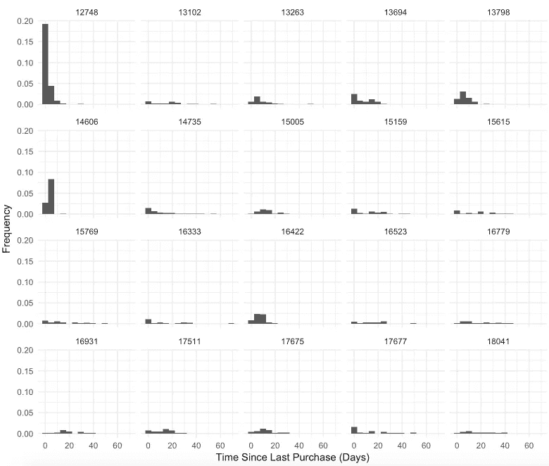
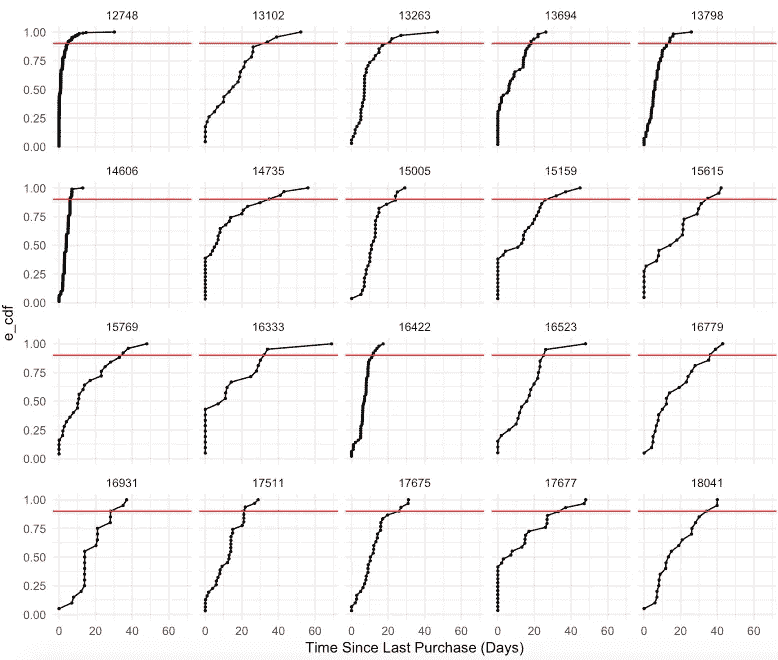
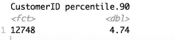
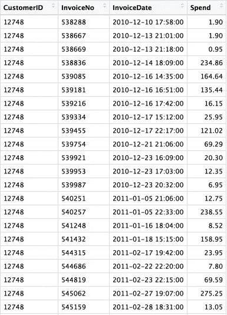
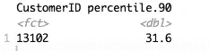
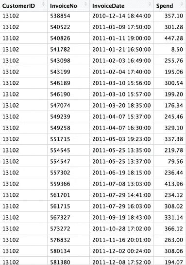

# 当没有明确观察到客户流失时，用 R

> 原文：<https://towardsdatascience.com/modelling-customer-churn-when-churns-are-not-explicitly-observed-with-r-a768a1c919d5?source=collection_archive---------0----------------------->


Photo credit: Pexels

客户流失可以分为契约性或非契约性。根据取消机制的不同，它还可以分为自愿或非自愿。

我们今天只讨论非契约性和自愿性流失。

**非合同**

*   顾客可以随时自由购买或不购买
*   未明确观察到流失事件

**自愿**

*   客户选择离开该服务

一般来说，客户流失是一个分类问题。然而，在包括亚马逊(非 prime 会员)在内非合同业务中，每一次购买都可能是顾客的最后一次，或者是一长串购买中的一次。因此，非合同业务中的客户流失建模不是一个分类问题，而是一个异常检测问题。为了确定客户何时会流失或可能流失，我们需要知道他们在购买时间间隔内何时表现出异常大的变化。

**异常检测**

异常检测是一种用于识别不符合预期行为的异常模式(称为异常值)的技术。它在商业中有许多应用，从信用卡欺诈检测(基于“消费金额”)到系统健康监控。

现在，我们使用异常检测来模拟非合同业务的客户流失。我们希望能够做出这样的声明:“十有八九，顾客 X 会在 Y 天内进行下一次购买”。如果顾客 X 在 Y 天内没有再次购买，我们知道发生这种情况的概率只有 1/10，并且这种行为是异常的。

为了做到这一点，我们将需要每个客户的购买时间之间的分布。这可能很难估计，特别是如果分布是多模态的或不规则的。为了避免这一困难，我们将采用非参数方法，并使用[经验累积分布函数](https://en.wikipedia.org/wiki/Empirical_distribution_function) (ECDF)来近似每个客户的购买间隔时间分布的分位数。一旦我们有了 ECDF，我们就可以接近第 90 个百分位数，并获得我们上面描述的性质的估计值。我们开始吧！

# 数据

我们将使用来自 UCI 机器学习库的[在线零售数据集。](http://archive.ics.uci.edu/ml/machine-learning-databases/00352/)

加载库并读取数据:

```
library(tidyverse)
library(lubridate)
library(XLConnect)
library(dplyr)
library(ggplot2)
theme_set(theme_minimal())raw.data <- readWorksheet(loadWorkbook("Online_Retail.xlsx"), sheet=1)
data <- raw.data
```

创建一个“总计”栏，显示每位顾客每次购物的花费。然后，我们可以为每位顾客每天的总支出创建一个新的数据框架。

```
data$Total <- data$Quantity * data$UnitPricetxns <- data %>% 
  mutate(CustomerID = as.factor(CustomerID),
         InvoiceDate = InvoiceDate) %>%
  group_by(CustomerID, InvoiceNo, InvoiceDate) %>% 
  summarise(Spend = sum(Total)) %>%
  ungroup() %>% 
  filter(Spend>0)
```

接下来，我们可以计算每个客户的购物间隔时间。

```
time_between <- txns %>% 
  arrange(CustomerID, InvoiceDate) %>% 
  group_by(CustomerID) %>% 
  mutate(dt = as.numeric(InvoiceDate - lag(InvoiceDate), unit=  'days')) %>% 
  ungroup() %>% 
  na.omit()
```

此时，我们只对数据中至少购买了 20 次的客户感兴趣。

```
Ntrans = txns %>% 
  group_by(CustomerID) %>% 
  summarise(N = n()) %>%
  filter(N>20)
```

创建一个随机抽样客户的小函数。

```
sample_n_groups = function(tbl, size, replace = FALSE, weight = NULL) {
  grps = tbl %>% groups %>% lapply(as.character) %>% unlist
  keep = tbl %>% summarise() %>% ungroup() %>% sample_n(size, replace, weight)
  tbl %>% right_join(keep, by=grps) %>% group_by_(.dots = grps)
}
```

在一系列数据争论之后，我们现在可以可视化随机选择的 20 个客户的购买天数分布。

```
ecdf_df <- time_between %>% group_by(CustomerID) %>% arrange(dt) %>% mutate(e_cdf = 1:length(dt)/length(dt))
sample_users <- ecdf_df %>% inner_join(Ntrans) %>% sample_n_groups(20)ggplot(data = time_between %>% inner_join(Ntrans) %>% filter(CustomerID %in% sample_users$CustomerID), aes(dt)) + 
  geom_histogram(aes(y = ..count../sum(..count..)), bins = 15) + 
  facet_wrap(~CustomerID) +
  labs(x = 'Time Since Last Purchase (Days)',y = 'Frequency')
```



Figure 1

解释:

*   大多数 CustomerID 12748 的购买间隔少于 5 天，偶尔，他(或她)的购买间隔超过 5 天甚至 10 天。
*   CustomerID 13102 是一个不经常购买的客户，他(或她)的大部分购买间隔期为 5 到 30 天。

在计算了每个客户的 ECDF 后，我们将上述客户的 ECDF 可视化。红线代表大约 90%的百分比。因此，如果 ECDF 在 20 天内越过红线，这意味着 10 次中有 9 次顾客会在 20 天内再次购买。

```
ggplot(data = ecdf_df %>% inner_join(Ntrans) %>% filter(CustomerID %in% sample_users$CustomerID), aes(dt,e_cdf) ) + 
  geom_point(size =0.5) +
  geom_line() + 
  geom_hline(yintercept = 0.9, color = 'red') + 
  facet_wrap(~CustomerID) +
  labs(x = 'Time Since Last Purchase (Days)')
```



Figure 2

创建一个函数来计算第 90 个百分位数。

```
getq <- function(x,a = 0.9){
  if(a>1|a<0){
    print('Check your quantile')
  }
  X <- sort(x)
  e_cdf <- 1:length(X) / length(X)
  aprx = approx(e_cdf, X, xout = c(0.9))
  return(aprx$y)
}percentiles = time_between %>% 
  inner_join(Ntrans) %>% 
  filter(N>5) %>% 
  group_by(CustomerID) %>% 
  summarise(percentile.90= getq(dt)) %>% 
  arrange(percentile.90)
```

查看 CustomerID 12748:

```
percentiles[ which(percentiles$CustomerID==12748), ]
```



Figure 3

该模型告诉我们:10 次中有 9 次，CustomerID 12748 将在 4.74 天内进行另一次购买，如果 CustomerID 12748 在 4.74 天内没有进行另一次购买，我们知道这种情况发生的概率只有 1/10，并且这种行为是异常的。此时，我们知道 CustomerID 12748 开始“反常地”行动。

让我们快速浏览一下 CustomerID 12748 的购买历史，看看我们的模型是否有意义:

```
txns[ which(txns$CustomerID==12748), ]
```



Figure 4

CustomerID 12748 的大部分购买发生在 1 到 4 天内。如果他(或她)在 4.74 天内没有再次购买，我们应该担心，这是有道理的。

查看 CustomerID 13102:

```
percentiles[ which(percentiles$CustomerID==13102), ]
```



Figure 5

该模型告诉我们:10 次中有 9 次，CustomerID 13102 将在 31.6 天内进行另一次购买，如果 CustomerID 13102 在 31.6 天内没有进行另一次购买，我们知道这种情况发生的概率只有 1/10，并且这种行为是异常的。此时，我们知道 CustomerID 13102 开始“反常地”行动。

同样，我们快速浏览了 CustomerID 13102 的购买历史，以了解我们的模型是否有意义:

```
txns[ which(txns$CustomerID==13102), ]
```



Figure 6

通过查看 CustomerID 13102 的购买历史，我们同意该模型！

给你！我们现在知道了每个客户开始“反常”行为的时间点。

非合同业务的客户流失非常不同。挑战在于定义一个清晰的客户流失事件，这意味着采用不同的方法来模拟客户流失。当一个顾客有所动摇时，他(或她)的购买间隔时间是异常的长，所以我们应该知道“异常”对每个顾客意味着什么。使用 ECDF，我们已经以非参数的方式估计了每个顾客在购买时间分布之间的 90 个百分点。通过检查客户最后一次购买的时间，如果从那时到现在的时间接近第 90 个百分点，那么我们可以称他们为“有流失风险”,并采取适当的措施来防止他们流失。最重要的是，随着更多的数据，我们的方法将变得越来越好，因为[ECDF 将收敛于人口](https://stats.stackexchange.com/questions/239937/empirical-cdf-vs-cdf/239969)的基本累积分布函数(CDF)。

此外，当我们实现上述模型时，我们可能要考虑季节性。

源代码可以在 [Github](https://github.com/susanli2016/Data-Analysis-with-R/blob/master/Retail%20churn.Rmd) 上找到。我期待听到任何问题。

参考资料:

[探索性数据分析:经验累积分布函数的概念基础](https://www.r-bloggers.com/exploratory-data-analysis-conceptual-foundations-of-empirical-cumulative-distribution-functions/)