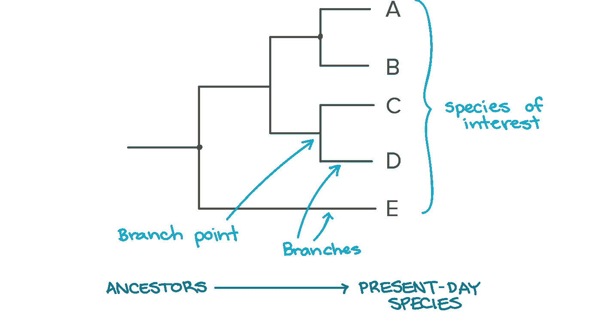
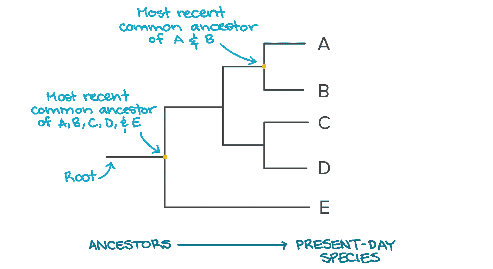
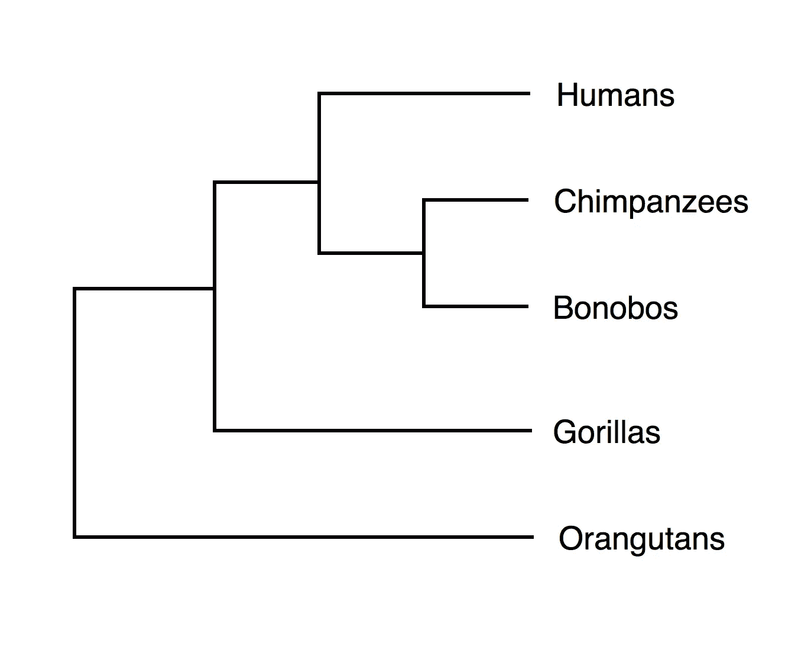
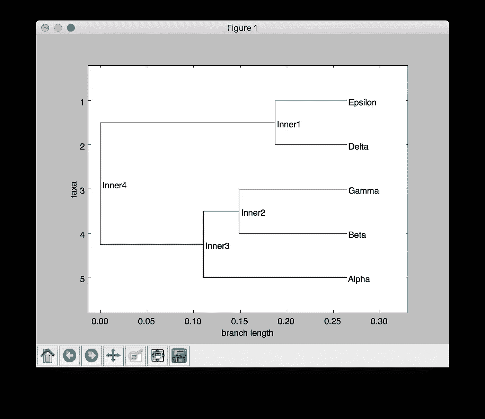
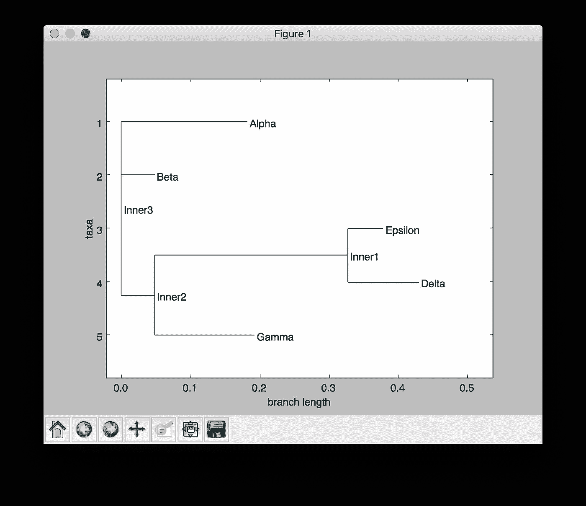
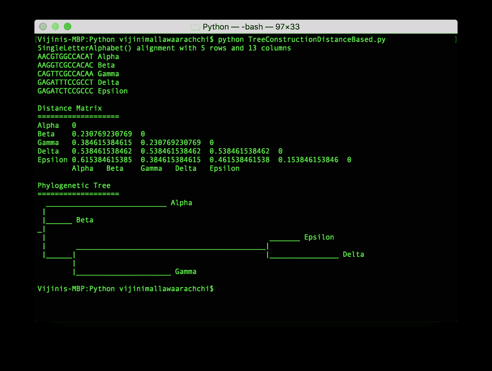

# 利用生物技术的分子系统学。菲洛

> 原文：<https://towardsdatascience.com/molecular-phylogenetics-using-bio-phylo-57ce27492ee9?source=collection_archive---------6----------------------->

你有没有想过生命是如何从原始汤形成并进化成现在可以看到的不同生命形式的？不同的物种是如何从它们的祖先进化而来的，它们之间有什么关系？这些问题可以通过对**种系发生学**的研究来解答。

本文将带您了解以下主题。

1.  什么是种系发生学？
2.  系统进化树
3.  用于系统发育推断的算法
4.  带代码的示例练习任务

# 什么是种系发生学？

根据维基百科，

> **系统发育学**是对生物个体或群体之间的进化历史和关系的研究。

通过**系统发育推断方法**发现生物之间的关系，其中可遗传的特征，如 DNA 序列或形态，可以在特定的进化模型下观察到。这些分析的结果是一个**系统发育**(也称为**系统发育树**)。它是描述一组生物或一个基因家族进化关系历史的假说的图表。

**分子系统发生学**是系统发生学的一个分支，分析某些分子，主要是 DNA 序列和蛋白质如何随时间变化，以确定一组生物或一个基因家族的进化关系。

Primates with books

# 系统进化树

系统进化树代表生物或基因之间的进化关系。进化树中的分支模式反映了物种或其他群体是如何从一系列共同的祖先进化而来的。进化树的一个例子是 [**生命树**](https://www.evogeneao.com/learn/tree-of-life) ，它表示自地球诞生以来各种生物物种是如何进化的。

在系统发育树中，感兴趣的**物种**或**类群**位于被称为**分支**的线的顶端。分支的点称为**分支点**。

Image Source: [Khan Academy](https://www.khanacademy.org/science/biology/her/tree-of-life/a/phylogenetic-trees)

如果两个物种有更近的共同祖先，那么它们就更相关；如果它们有更近的共同祖先，那么它们就更不相关。

Image Source: [Khan Academy](https://www.khanacademy.org/science/biology/her/tree-of-life/a/phylogenetic-trees)

这里给出的是基于基因数据的灵长类动物的系统进化树。大猩猩和猩猩比其他灵长类动物分化得更早。*人*血统(人类)沿着一条道路前进，而*潘*血统则沿着另一条道路前进。后来，潘的血统发生了分裂，产生了黑猩猩和倭黑猩猩。

# 用于系统发育推断的算法

有三种主要类别的算法用于从任何类型的生物数据进行系统发育推断。他们是，

1.  基于距离的方法
2.  最大简约法
3.  概率方法

## 1.基于距离的方法

基于距离的方法计算出一个**进化距离**，这是两个被认为从一个共同祖先分化出来的物种所发生的变化的数量。然而，当涉及到处理具有非常遥远关系的大量数据时，这些方法面临准确性问题。

## **2。最大简约(MP)方法**

MP 方法推断出一棵最小化变化总数的树，这种变化被称为解释数据所需的**突变**。在最大简约准则下，解释数据的最短可能树被认为是最佳树。这棵最好的树被称为最节俭的树。执行启发式搜索以快速生成最节省的树。由于这种方法认为最短的可能树是最好的树，实际发生的进化变化可能被低估。

## 3.概率方法

概率方法，如**最大似然(ML)** 和**贝叶斯推断** *、*试图找到一棵最大化观察数据的条件或后验概率的树。目前，系统发育研究广泛使用贝叶斯框架，因为它可以解释系统发育的不确定性、有效算法的可用性及其作为各种计算机程序的实现。

# 生物。phylo——练习的时间到了

既然我们对系统进化树有了一个基本的概念，现在是时候尝试一些编码了。我在之前的[文章](/pairwise-sequence-alignment-using-biopython-d1a9d0ba861f)中介绍过一套名为 **Biopython** 的 Python 工具，可以用来分析生物数据。如果你还没有浏览过，也一定要去看看。

我将使用**简历。Phylo** 模块，提供类、函数和 I/O 支持，用于处理系统进化树。你可以通过[官方文档](http://biopython.org/wiki/Phylo)来获得更多关于这个模块的细节。

## 任务—为给定的 DNA 序列构建系统发生树

假设你有五个 DNA 序列，它们的标签在每一行的开头。你可以在[官方 biopython 测试材料](https://github.com/biopython/biopython/tree/master/Tests/TreeConstruction)中名为 [*msa.phy*](https://github.com/biopython/biopython/blob/master/Tests/TreeConstruction/msa.phy) 的文件中找到这些序列。考虑的顺序如下。

1.  阿尔法 **AACGTGGCCACAT**
2.  测试版 **AAGGTCGCCACAC**
3.  伽玛 **CAGTTCGCCACAA**
4.  增量**gagatttcgcct**
5.  艾司隆 **GAGATCTCCGCCC**

我们的任务是基于基于距离的系统发育推断方法构建系统发育树来表示这些序列。

目前，生物。Phylo 模块有两种类型的树构造器:`DistanceTreeConstructor`和`ParsimonyTreeConstructor`。我们将使用`**DistanceTreeConstructor**`来完成这个任务。

此外，`DistanceTreeConstructor`支持两种启发式算法:`UPGMA`(算术平均的不加权对组方法)和`NJ`(邻居加入)。我们将使用`**UPGMA**`算法。你可以从这个[链接](https://www.pellegrini.mcdb.ucla.edu/wp-content/uploads/sites/21/2017/07/week-3c-Phylogenetic_Tree_ConstructionMai-copy.pdf)中读到更多关于 UPGMA 算法的内容。

## 解决办法

首先，确保您已经下载了包含输入序列的 *msa.phy* 文件，并将其包含在您当前的工作目录中。

下面给出的是为给定的 DNA 序列创建系统发生树的 python 代码。注意我们是如何使用 **Bio 的。Phylo** 模块及其功能。

通过运行代码，我们可以得到可视化的系统进化树，并在终端中打印出来，如下所示。

Graphical visualization of the phylogenetic tree using UPGMA

The phylogenetic tree using UPGMA printed in the terminal at the end

如果使用 NJ 算法而不是 UPGMA 算法，那么得到的树会有如下变化。

Graphical visualization of the phylogenetic tree using NJ

The phylogenetic tree using NJ printed in the terminal at the end

希望您喜欢阅读这篇文章，并了解到关于分子遗传学以及如何使用 Biopython 从一组给定的序列构建系统进化树的有用和有趣的东西。我很想听听你的想法和主意。

感谢阅读…😊