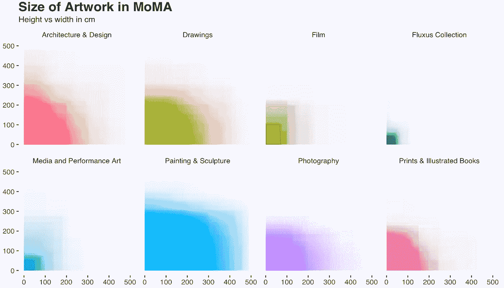
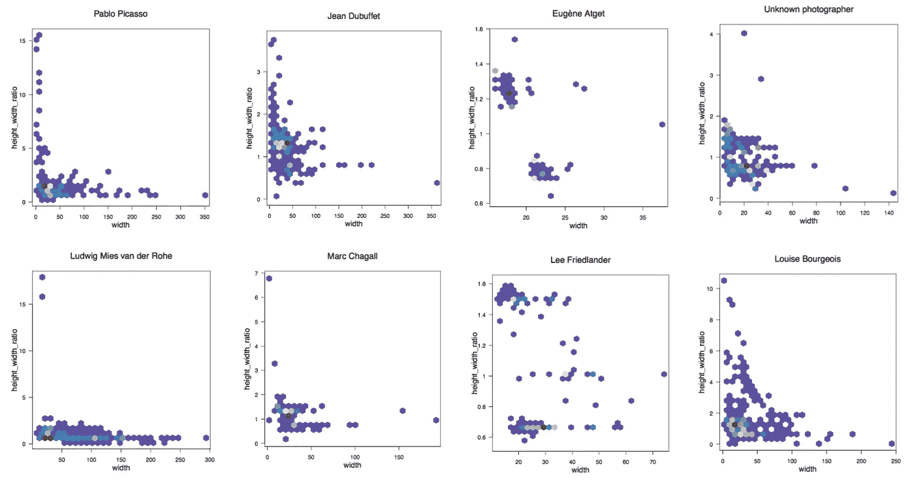
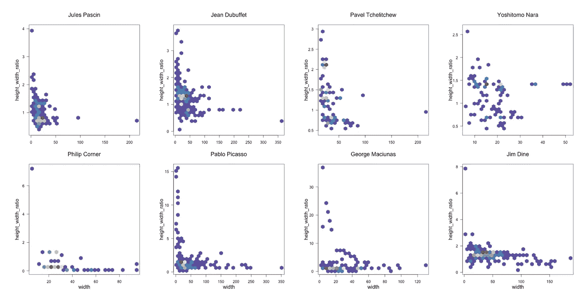

# 现代艺术博物馆及其数据艺术品

> 原文：<https://towardsdatascience.com/moma-and-its-artwork-in-data-60925c8acb7a?source=collection_archive---------7----------------------->

今天我将用 MoMA 的[数据](https://www.kaggle.com/momanyc/museum-collection/kernels)来描绘一幅 MoMA 现当代艺术收藏的图画。

为了了解艺术品的大小，我将它们绘制成上下重叠的矩形，其中 88.8%在 500 厘米 x 500 厘米(197 英寸 x 197 英寸)范围内，而平均高度和宽度约为 25 厘米(10 英寸)。

size of artwork by overlapping their actual size in rectangles

虽然大多数艺术品都小于 50 厘米 x 50 厘米，但大小各不相同，建筑收藏中一些较大的异常值达到 10 米。

我们还可以调查最具代表性的艺术家、摄影师和建筑师的作品规模。高宽比表示肖像模式或风景模式。我们可以看到法国画家和雕塑家让·杜布菲创作了许多高大的艺术品，而德裔美国建筑师路德维希·密斯·凡·德罗的作品则更为广泛。

artists and size of their canvas

对于 MoMA 收藏最多绘画作品的艺术家，我们也了解到他们对画布尺寸的不同偏好。像奈良美智这样的艺术家创作较小的波普艺术，而像吉姆·戴恩这样的艺术家创作较大和较宽的绘画。

这是我关于数据科学和视觉故事的[# 100 日项目](https://medium.com/@yanhann10)的第 36 天。我的 [github](https://github.com/yanhann10/opendata_viz) 上的全部代码。感谢阅读，欢迎反馈。