# 房地产摇钱树

> 原文：<https://towardsdatascience.com/moneyball-for-real-estate-3bca252bc2a5?source=collection_archive---------0----------------------->

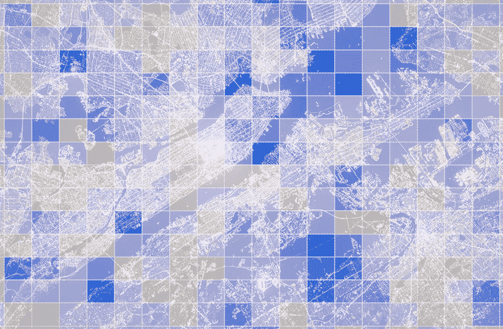

投资房地产？开餐馆？发起营销活动？你以前听说过——这都是关于*位置、位置、位置*的。它有可能成就你的事业，也有可能毁掉你的事业，然而这个关键的决定仍然常常是由直觉和直觉驱动的。

有了 [Easy Atlas](https://www.easyatlas.com) ，我们正在改变这一切。在过去的一年里，我们一直在开发一种新技术，可以为您的投资和业务确定最佳位置。**不用再猜了。**

# 怎么会？

**数据。**如今，我们可以访问大量的位置数据，而这些数据在十年前根本不存在。这也不仅仅局限于地理位置。我们可以看到我们如何移动，停留多久，付出多少，以及我们的感受。地理位置数据无处不在，无所不在，挖掘这些数据源可以揭示一种洞察力，这种洞察力可能会对我们的决策产生重大影响。

**那么，如果我们分析所有数据并跟踪随时间的变化，会发生什么呢？**

当人们搬家时，价格就会变化。新事物出现，旧事物消失。我们可以从数字中看到这一切。数据是解决位置问题的工具，我们已经组装了一个工具箱，能够回答最复杂的基于位置的查询。

Easy Atlas 是一个实时系统，允许您插入我们的任何或所有数据源，以便您可以为您选择的一个或多个城市绘制数据图层。

让我们来看看 Easy Atlas 的运行情况。我们打算 1) ***在巴黎开一家咖啡馆*** ，2)在上海投资 ***住宅房地产*** ，3)在纽约 ***开一家夜总会*** 。

# 1.在巴黎我应该在哪里开一家新的咖啡馆？

巴黎是一个咖啡馆林立的城市。为了确保我们的新咖啡馆成功，我们想找一个人流量大、咖啡馆少或档次低的地方。

> 高客户需求+不满意的客户=我们的机会

***这里是目前巴黎咖啡馆的分布***

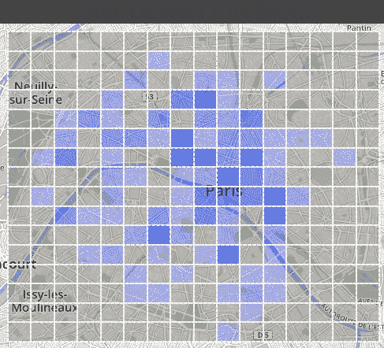

Least dense (light blue) to most dense (dark blue)

***下面是顾客对他们的评价***

Red (below city average) to green (above city average)

***这里是城市中最繁华的地方***

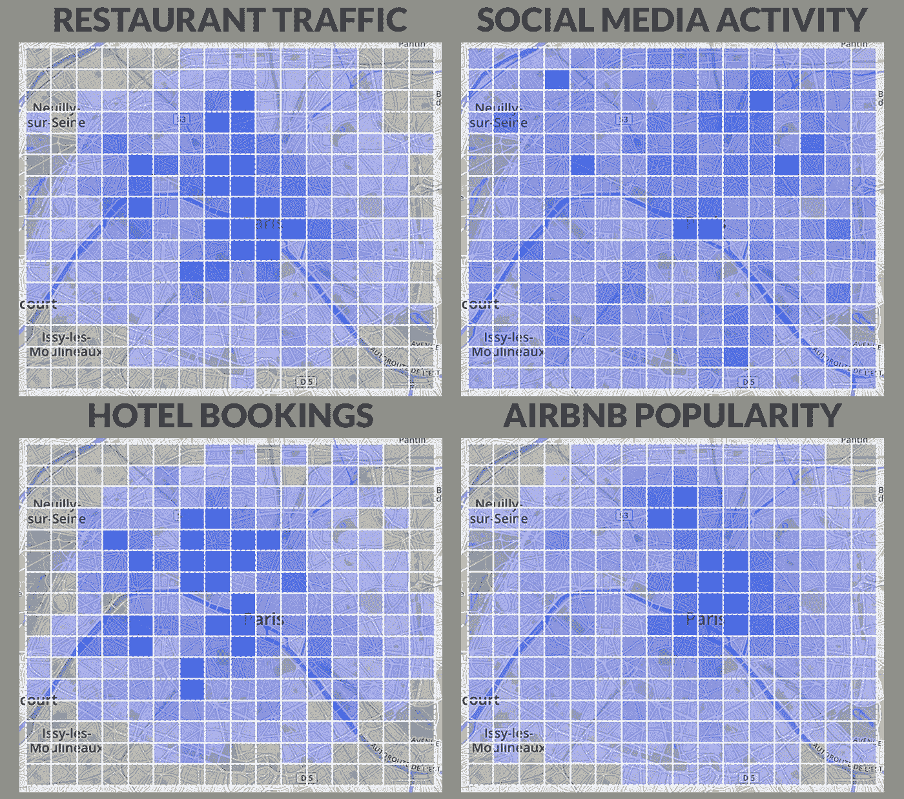

当我们将所有数据层层叠加时，我们得到了巴黎新咖啡馆最佳位置的两个明确候选人。与巴黎其他地方相比，这两个地方的咖啡馆表现不佳，数量也较少，但与巴黎其他地方相比，这里的交通和活动要多得多。

## 你知道吗？

> 星巴克在巴黎有 59 家分店。平均位置每周开放 **6.87/7** 天，每天开放 **12.82** 小时。
> 
> 一般人走进巴黎咖啡馆的时间是下午 2 点 52 分。这是**比纽约晚**25 分钟，**比多伦多晚**28 分钟**比多伦多晚**，比伦敦晚 **1 小时 21 分钟****，比香港早 **12 分钟****。****

# ****2.在上海投资住宅地产应该去哪里？****

****上海人口在最近十年增长了近 40%(涌入 1000 万+人)。随着越来越多的人涌入城市生活和工作，住宅区将继续涌现。为了准确定位我们应该在这个城市火热的房地产市场上投资哪里，我们将分析整个城市的增长趋势和价值。****

*   ******增长趋势:**通过查看所有类别流量的增长情况(如社交媒体、酒店、餐厅、Airbnb)，找出哪些社区正在崛起。****
*   ******价值差异:**通过比较 Airbnb 的 8000+房源与房地产中介的 7000+房源的价格点，定位被低估的区域。我们想揭示 Airbnb 的高价格和低房价之间的最大差异。****

> ****高增长领域+被低估的领域=我们的机会****

*******以下是 2016 年末上海最繁忙的地方*******

****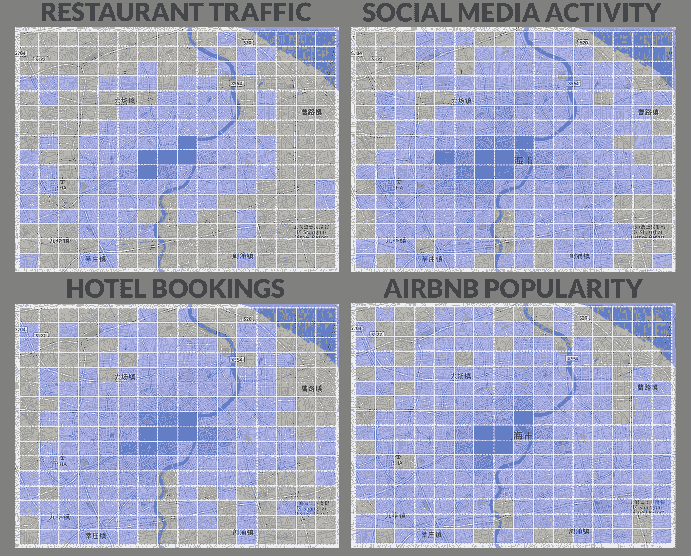****

****Least active (light blue) to most active (dark blue)****

*******这里是今天上海最繁忙的地方*******

****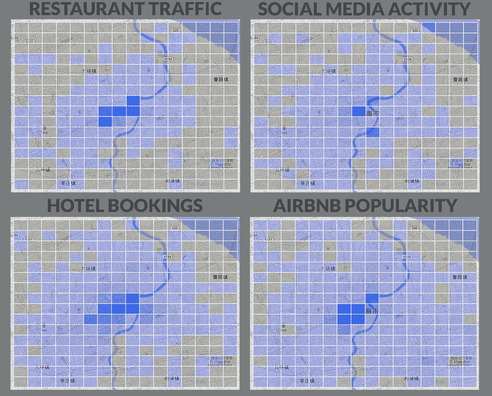****

****Least active (light blue) to most active (dark blue)****

*******这里是已经发生的流量变化*******

****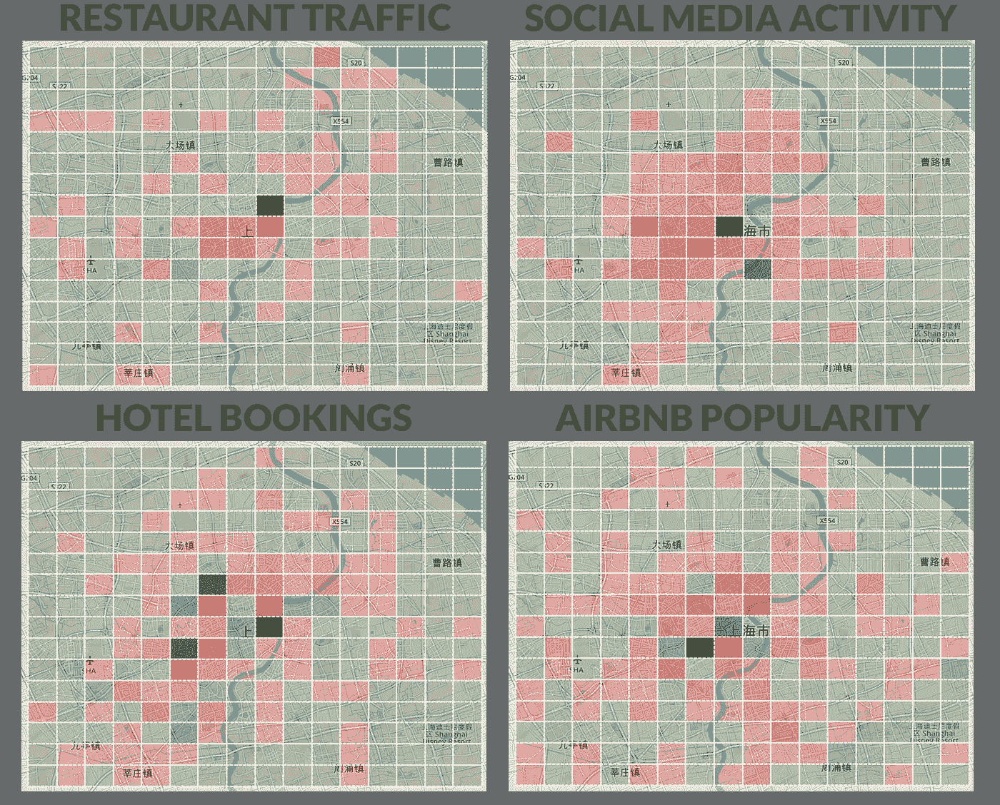****

****Red (below city average growth rates) to green (above city average growth rates)****

*******这里是上海目前的房价*******

****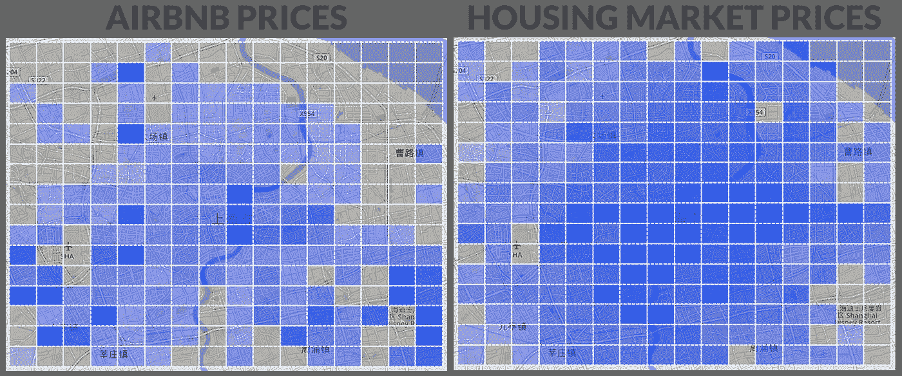****

****Least expensive (light blue) to most expensive (dark blue)****

****当我们综合这些数据时，我们发现上海有两个明显的新兴社区值得我们考虑投资。这两个城市的客流量增长都超过了纽约，而且房地产市场和 Airbnb 之间的价格差异为负。****

****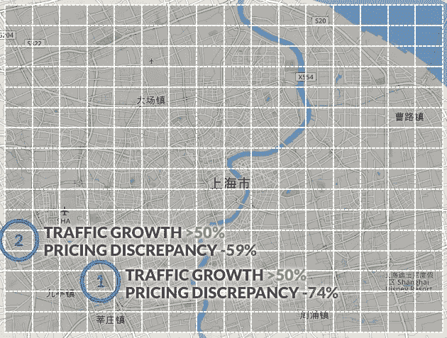****

## ****你知道吗？****

> ****上海平均建筑高度 **110.6 米**。与首尔的 130 米、东京的 109.5 米、香港的 125.6 米**相比。******
> 
> ****如果你把所有的建筑一个接一个的堆叠起来，上海将会有一个 119.9 公里长的建筑。那远远长于首尔的 **35.6 公里**和东京的 **85.5 公里**，但短于香港的 **122.6 公里**。****

# ****3.我应该把我的新夜总会设在纽约市的什么地方？****

****纽约市的夜总会竞争激烈。为了确保我们的新夜店从 18-35 岁的目标人群中获得大量客流量，我们需要找到他们经常出没的地方，以及举办大量社交活动的区域。****

*   ****以自行车份额衡量的千禧年活动:今年 3 月，纽约市使用花旗自行车系统的出行次数超过 717，300 次；其中 46%是由 18-35 岁的人拍摄的。让我们看看他们去了哪里。****
*   ******以脸书活动衡量的活动**:目前有 4550 多项脸书活动计划于下个月在纽约市地区举行。689，382，475 人表示将参加。让我们看看这些事件发生在哪里。****

> ****千禧一代流量+活动密度=我们的机会****

*******这里是纽约千禧一代使用花旗自行车的地方*******

****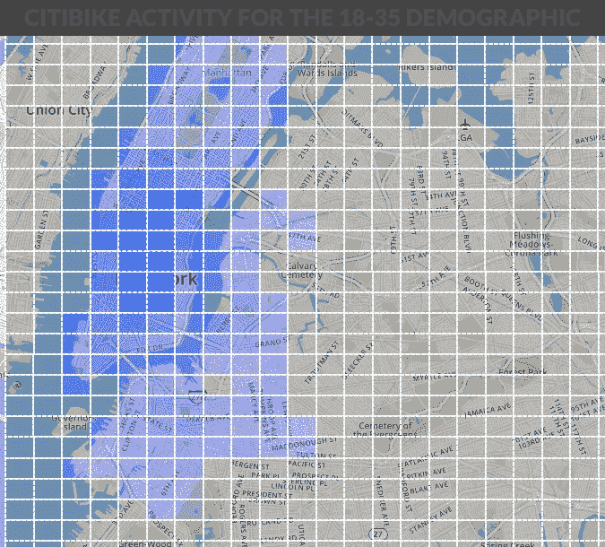****

****Least active (light blue) to most active (dark blue)****

*******这里是脸书事件发生的地方*******

****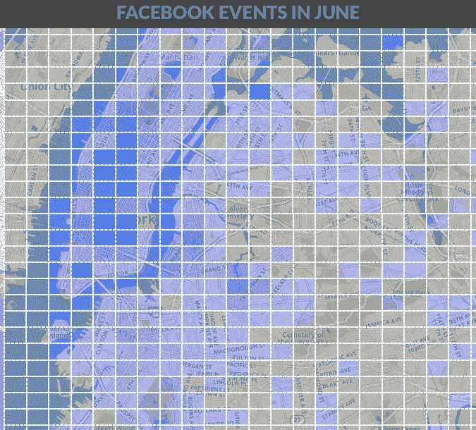****

****Fewest events (light blue) to most events (dark blue)****

****当我们对数据进行分层时，这两个区域最有希望成为新的夜总会。两者都获得了大量的千禧一代流量，并举办许多社交活动。****

****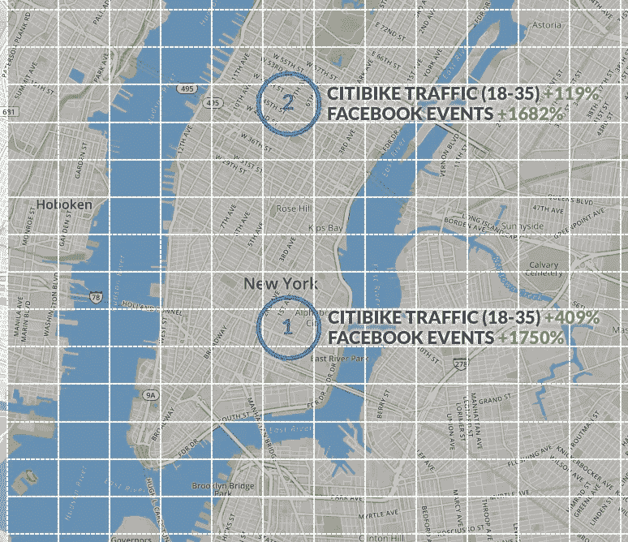****

## ****你知道吗？****

> ****纽约市自行车共享出行的平均时间是 12:57 分钟。与此同时，他们在蒙特利尔比在伦敦多了 0:13 分钟**和 5:21 分钟**。********
> 
> ******在纽约市，千禧一代完成一次旅行的平均时间比 35 岁以上的人快 38 秒。******

******谈到 Easy Atlas 的潜力，这些例子只是冰山一角。我们的系统以前所未有的方式了解城市的位置和动态特性，并实现了前所未有的发现和分析。利用 Easy Atlas 的可能性，确保您未来的所有投资和商业决策都植根于最新的数据和机器学习。******

******如果您有兴趣与我们合作，将您的位置战略提升到一个新的水平，请给我们发消息，地址是[info@easyatlas.com](mailto:info@easyatlas.com)。******