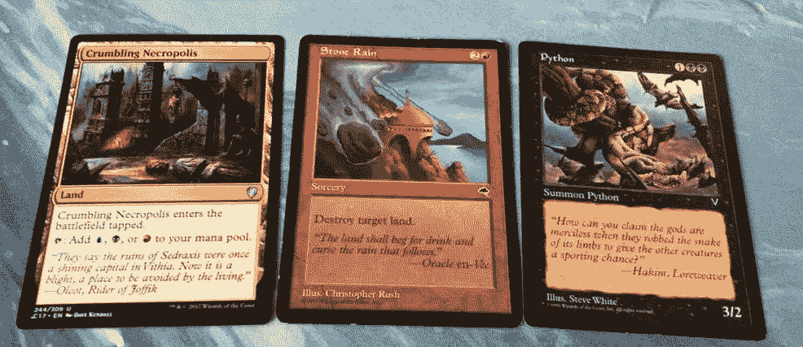
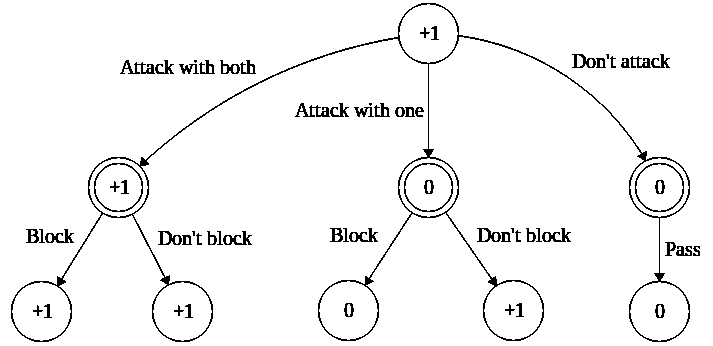
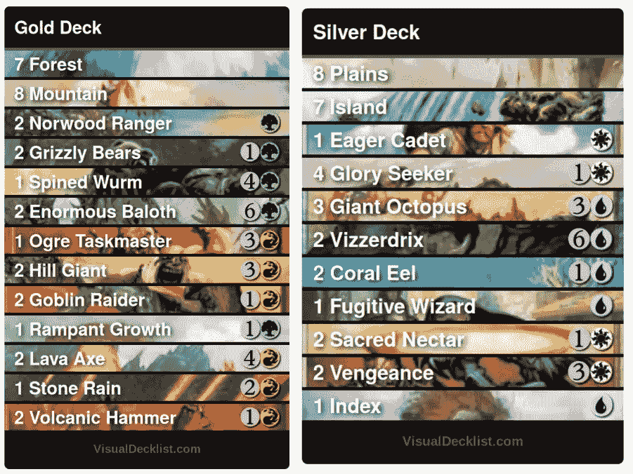
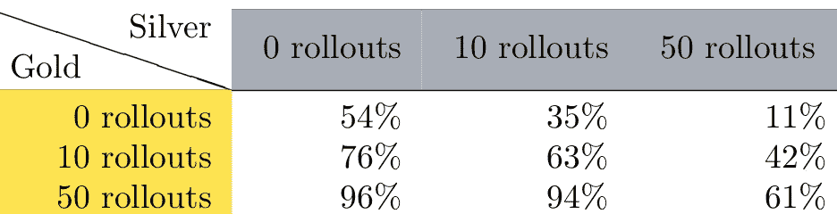

# 蒙特卡洛魔术搜索:聚会

> 原文：<https://towardsdatascience.com/monte-carlo-search-for-magic-the-gathering-6ca60750fcc6?source=collection_archive---------2----------------------->

## 探索卡牌游戏与人工智能的交集

我们最近看到了强人工智能(AI)在高难度棋盘游戏(如围棋和扑克)中的出现。还有一个超人的魔术:聚集(MTG)球员，但我相信这只是一个时间问题。一旦我们有了这样的球员，会有一些特别有趣的后果。

强大的游戏技巧将能够指导甲板建设。我们应该能够将一个强大的 MTG 玩家放在一张牌池上，允许它与自己进行数千次或数百万次游戏，并自己“破解 meta”(从可用的牌中构建最好的牌组)。

监控这些人工智能玩家将极大地有利于游戏设计者和玩家。想象一下这样一个世界，每一套都或多或少完美平衡，没有必要禁止……但是，不幸的是，这种技术对信用卡价格投机者也是有利的。

在这篇文章中，我简要描述了游戏人工智能的基础，并考虑了 MTG 最近的一种决策方法。我描述了一些测试这种方法的实验，并讨论了令人兴奋的未来工作。这些实验是在一个简单的 Python 模块 [OpenMTG](https://github.com/hlynurd/open-mtg) 中实现的，我希望它能够作为 AI MTG 玩家的基础。

# 魔法:在最小的果壳里聚集

MTG 是一种至少有两个人相互竞争的游戏。游戏的目标是通过各种手段获胜，最常见的是通过将对手的生命总数减少到 0。玩家开始游戏时除了带一叠卡片什么都没有，然后轮流抽取和使用不同类型的卡片。现在，我将集中在三种类型的牌上:地、魔法和生物。

**Magic cards:** A land, sorcery, and creature.

土地为玩家生产货币。每回合你可以将一个地放入游戏区(*战场)*，它可以用来产生*法力，*可以用来执行其他动作。这些包括使用生物或魔法。

巫术执行一个动作，然后被丢弃。例如，减少对手的总生命值或摧毁对手的土地。

生物是进入战场的牌，被允许攻击你的对手或阻挡敌方攻击者。游戏不可或缺的一部分是生物之间的*战斗*。游戏中一些最困难的决定是关于如何用你的生物攻击你的对手，以及你如何分配你的生物去阻挡你对手的生物。

如果你仍然好奇的话，这里有更详细的规则解释:[https://magic.wizards.com/en/gameplay/how-to-play](https://magic.wizards.com/en/gameplay/how-to-play)

# 一点博弈论

MTG 是一个零和游戏，这意味着一个玩家输了，另一个玩家赢了。在这种游戏中采取最优决策的算法是**极小极大** 算法。

使用极大极小算法，在游戏中的每一个状态，你都要考虑你能走的每一步，并选择最有价值的一步。如果一步棋能让你赢得比赛，它就有最高的价值。如果它导致你的损失，那它的价值可能是最低的。

如果一个移动没有导致游戏结束，你递归地考虑下一个游戏状态和与合法移动相关的值。请注意，你通常假设你的对手会采取对他们最有利的行动。

探索所有可能的游戏轨迹可能需要一段时间，因此通常会对我们希望搜索的深度设置一个限制，并构建一个衡量游戏状态承诺的函数，称为启发式函数或价值函数。这个函数在你赢的时候取最高值，在你输的时候取最低值。对于其他游戏状态，它介于两者之间，取决于你认为自己赢或输的可能性有多大。

考虑一个简单的场景，轮到你了，你有两个合格的攻击者。你的对手只剩下 1 点生命值，他们的资源也耗尽了(他们*耗尽了)，*除了一个合格的阻挡者。你对手的生物可以阻挡一个攻击者，但如果攻击者未被阻挡，那么它会对你的对手造成致命伤害。

**A minimax decision tree of depth 2:** For this scenario, the value of winning is +1, losing -1 and states where the game isn’t over yet have a value of 0.

最小最大算法建议用这两种生物攻击，因为这保证了你的胜利。你可以通过攻击一个生物来获胜，但是你假设你的对手做了对他们最有利的事情，所以用一个生物攻击的价值和根本不攻击是一样的。

## 极大极小的问题是

即使上面的场景是在游戏结束时，也要考虑八种状态。此外，我们已经知道了做出完全知情的决定所需的一切。如果我们想在游戏早期做出最小最大决策，那么我们必须考虑所有潜在的隐藏信息。也就是说，对手可能持有不同的牌，我们的牌组(牌库)可能有各种不同的排列方式，我们对手的牌库也可能有各种不同的排列方式。即使知道我们对手的甲板列表，我们也可能处于超过*十亿*种不同的游戏状态中的一种。

这使得寻找游戏的完全极大极小解在物理上是不可能的。有一些方法可以减少在极大极小中要考虑的博弈状态的数量，例如阿尔法-贝塔剪枝。然而，这些方法已经被证明对于有太多游戏状态需要考虑的游戏来说是困难的。

# 全副武装的匪徒前来救援

既然为你想做的每一步棋评估游戏的每一个可能结果是一场计算噩梦，那么最好做一个概率估计。在概率论中，多臂强盗问题是一个玩家有几个选择的问题，每个选择给出一个随机奖励。这个比喻指的是吃角子老虎机，有时被称为独臂强盗。

**One-Armed Bandits:** The gang’s getting back together for one last heist. [Photograph](https://en.wikipedia.org/wiki/Multi-armed_bandit#/media/File:Las_Vegas_slot_machines.jpg) by [Yamaguchi 先生](https://en.wikipedia.org/wiki/User:Yamaguchi%E5%85%88%E7%94%9F) / [CC BY-SA 3.0](https://creativecommons.org/licenses/by-sa/3.0/deed.en)

每个强盗都有自己的内部参数，即平均给予多少奖励。有了关于所有参数的完美信息，玩家可以选择只与有最高预期奖励输出的强盗互动。然而，玩家得到的唯一信息是他们互动的随机奖励。根据大数法则，玩家可以更好地估计他们在每一次互动中能从强盗那里得到多少。

# 蒙特卡罗搜索

我们会考虑在多兵种的土匪问题中，我们作为土匪可以做出的每一个潜在的举动。内部奖励参数是如果我们选择一步棋，我们获胜的可能性。对于每一个合法的行动，我们想象游戏的其余部分在完成后会如何发展。这可以做任意次数，给我们很好的估计每个动作的力度。这就是为什么一个方法 *Monte-Carlo:* 做一些随机的事情很多次来得到一个有用的集合结果。

缓解上述问题的一个很好的切入点是 [*一文中描述的方法蒙特卡洛搜索应用于魔术中的选卡:聚会*](http://img.4plebs.org/boards/tg/image/1396/72/1396724222144.pdf) *。他们只在主要阶段使用它，但是它可以在游戏中的任何时候使用*

算法如下，在可以做出决定的每个点:

1.  列举所有合法的移动
2.  对于每个合法的移动，在执行该移动后模拟一个完整的游戏，并记录您是赢了还是输了。这种模拟被称为*卷展栏。*
3.  重复大量的步骤:选择一个随机的合法移动，并支持获胜的移动。执行所选的移动并执行卷展栏。
4.  将上面最常选择的棋步返回为最佳棋步。
5.  在真实的游戏中表演最好的动作。

## 关于算法的注记

在每次推出之前，未知信息(即牌库中牌的顺序，对手手中的牌)被随机化。这需要很好地猜测对手的牌。

如何在 2 中模拟游戏。很重要。现在，我们会让两个玩家每次执行一个随机动作。我不认为这是最佳的，但这将给我们一个快速原型。

三分钟后。，我们可以控制选择一个好的行动而不是再次尝试一个明显错误的行动的可能性有多大。这就是所谓的探索-开发权衡:选择尝试更多的选择以获得更好的感觉，选择哪一个是最好的，或者“耕种”看起来最好的选择。对我来说，这本质上和决定晚餐再吃披萨还是最终尝试新事物的两难境地是一样的。

# 一些实验

那么，蒙特卡罗搜索的表现如何呢？我用必要的游戏机制实现了来自*第八版* *核心游戏*和的基本金银牌。

**Ready-to-play decks:** It makes it much easier not to have to worry too much about instant-speed actions and the stack — for now!

让我们允许黄金和白银玩家用不同的决策规则进行一百场比赛。每场比赛前，我们掷硬币决定谁先开始。如果我们让他们执行随机的动作，两个玩家看起来是平等的，尽管金牌可能会稍微占优势。

**The win rates from the perspective of the gold player:** In each column, we fix one search method for the Silver player and vary the number of rollouts for the Gold player— and similarly for the Gold player, per row. If there are 0 rollouts, we let the player choose any legal move at random.

请注意，在表格中，随着我们从左到右，百分比变得越来越低，从上到下，百分比变得越来越高。

增加蒙特卡洛决策会使银卡玩家更受欢迎，每次移动增加更多的滚屏会使银卡玩家更受欢迎。然而，如果允许黄金玩家执行等量的转出，则黄金玩家变得更受青睐。白银玩家在执行随机动作时，与拥有 50 甚至 10 个翻滚的黄金玩家相比，机会非常小。

结果不是决定性的，但实验表明黄金甲板更好。无论如何，蒙特卡罗搜索比随机行动要好，做更多的铺开更好。

# 下一步是什么？

在经典的人工智能方法中，这是一个有趣的练习，但是还可以做得更多！拥有一个完全开放的 MTG 是最理想的——至少包括玩家之间的即时速度互动，以及更复杂的触发和效果。我的代码可以在 github 上找到，我喜欢合作，把强大的人工智能带到 https://github.com/hlynurd/open-mtg 的 MTG:

实际上，改进不完全信息下的博弈树搜索是必要的。在上面的实验中，我们允许玩家互相认识对方的行李箱盖，但这通常不是事实。

探索不同的方式将先前的知识结合到搜索中会让玩家变得更强大，而不会给他们不公平的信息。如果你的对手玩的是山，那么你更有可能准备敌对的红色牌，而不是其他颜色的牌。根据格式或元，你可能想在游戏开始前立即考虑或放弃某些牌。

强大的围棋人工智能 [AlphaGo](https://en.wikipedia.org/wiki/AlphaGo) ，结合了关于游戏状态的手工或常识知识，以及原始游戏状态，作为神经网络的输入。这允许自动学习一种启发式函数来引导他们在游戏中寻找好的移动。一个类似的功能，衡量“什么是好的，什么时候”对 MTG 来说也很重要。

通过结合所有这些，我想象一种[强化学习](https://en.wikipedia.org/wiki/Reinforcement_learning)方法将帮助我们建立一个在构建和限制格式方面都非常优秀的代理。

作为一个成熟的人工智能 MTG 玩家，在未来的某个地方观看一些高调的人机对抗比赛会很有趣。

> *致谢*:感谢 Haukur Rósinkranz 对本文的建设性反馈。