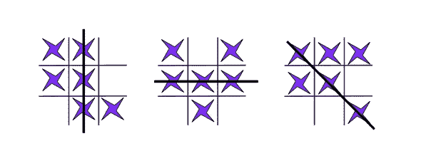
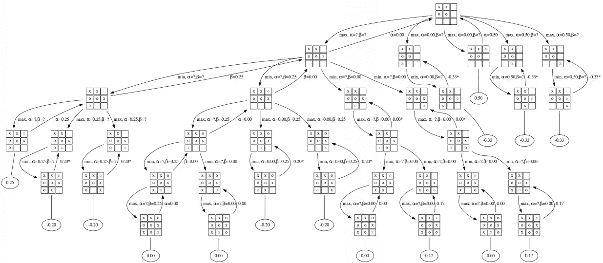
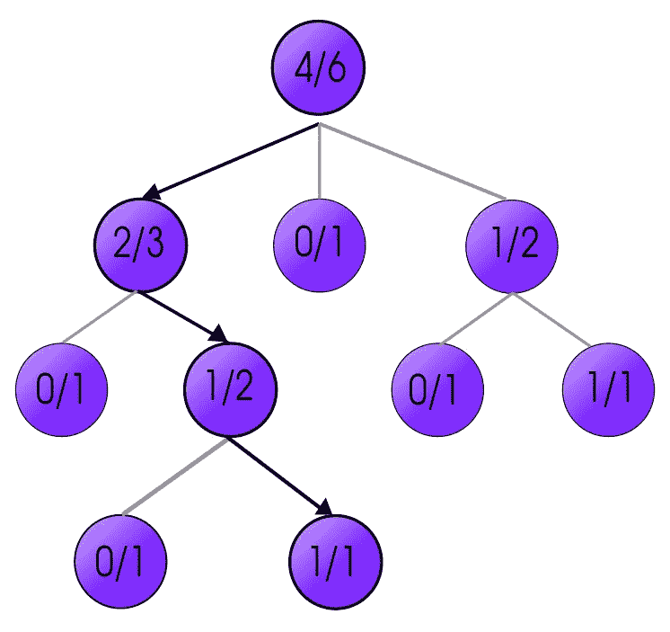
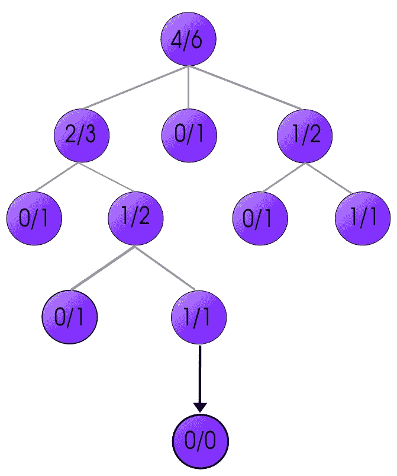
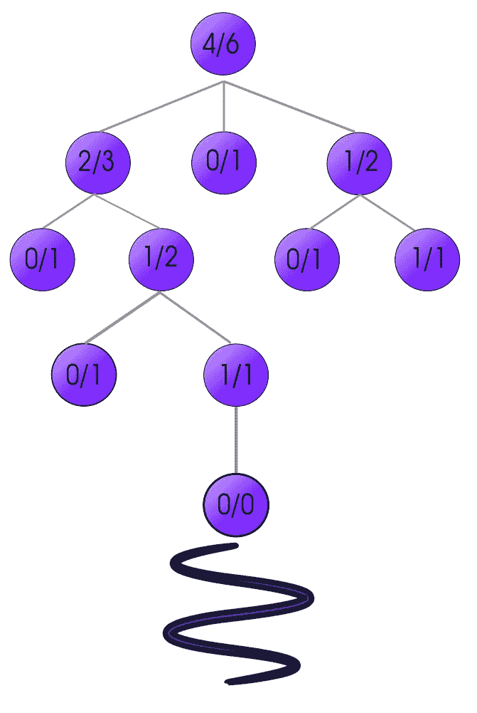
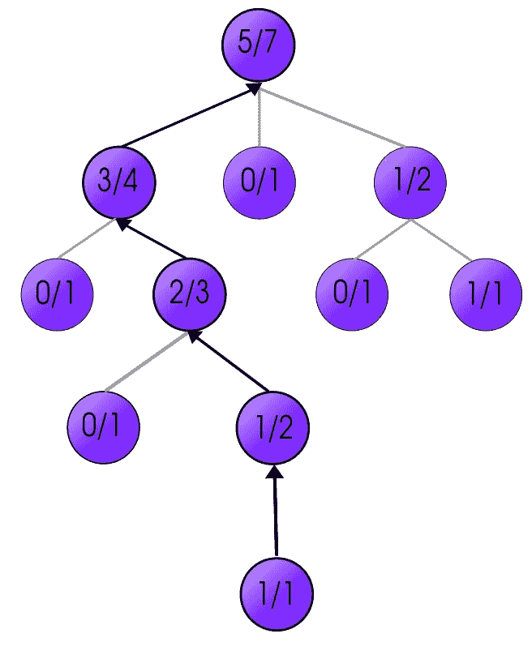

# 蒙特卡罗树搜索

> 原文：<https://towardsdatascience.com/monte-carlo-tree-search-158a917a8baa?source=collection_archive---------0----------------------->

## 每个数据科学爱好者的 MCTS

像井字游戏、魔方游戏、数独游戏、国际象棋、围棋和许多其他游戏都有一个共同的属性，那就是可以玩的动作数量呈指数增长。随着游戏的进行，这些可能的步骤会成倍增加。理想情况下，如果你能预测未来可能发生的每一个可能的举动及其结果。可以增加自己的胜算。

但是，由于移动呈指数增长，计算移动所需的计算能力也达到了顶点。

蒙特卡洛树搜索是一种通常在游戏中使用的方法，用于预测策略应该采取的路径(移动)以达到最终的获胜解决方案。

Final output could be any one of these

在我们发现引导我们走向胜利的正确道路(步骤)之前。我们首先需要安排游戏当前状态的移动。这些动作连接在一起会看起来像一棵树。因此得名*树搜索*。请参见下图，了解移动的突然指数增长。

## **树形搜索算法**

> 这是一种用于搜索游戏回合后可能存在的每一步棋的方法。例如:在井字游戏中，玩家有许多不同的选择，可以用树形图来表示。在下一轮将图表演变成树时，移动可以进一步增加。

[Source](http://cse3521.artifice.cc/adversarial-search.html)

通过考虑每个子移动/节点来强制指数增长树找到问题的最终解决方案需要大量的计算能力。导致极慢的输出。

**💡**通过制定策略可以实现更快的树搜索——给予一些节点比其他节点更大的重要性&允许首先搜索它们的子节点以获得正确的解决方案。

而是如何找到最有利于在它们子节点中具有正确解的节点。让我们来看看…

## 什么是蒙特卡罗树搜索？

> MCTS 是一种算法，它通过选择→扩展→模拟→更新树中的节点来找出一组移动中的最佳移动，以找到最终的解决方案。这个方法一直重复，直到达到解，学习到博弈的策略。

## 蒙特卡洛树搜索是如何工作的？

让我们逐一查看循环的各个部分。

**SELECTION**

**选择👆** |此过程用于选择树上最有可能获胜的节点。例如—考虑有获胜可能性的棋`2/3,` `0/1` & `1/2`在第一步`4/6`之后，节点`**2/3**`获胜的可能性最高。

从树的当前状态中搜索选定的节点，并且选定的节点位于分支的末端。由于所选节点获胜的可能性最高，因此该路径也最有可能比树中的其他路径更快地到达解决方案。

**EXPANSION**

**展开—** 选择正确的节点后。扩展用于在游戏中进一步增加选项，方法是扩展选中的节点并创建许多子节点。在这种情况下，我们只使用一个子节点。这些子节点是游戏中可以玩的未来招式。

暂时没有进一步展开的节点称为叶子。

**SIMULATION**

**模拟|探索🚀因为没有人知道哪个节点是组中最好的孩子/叶子。这一步将表现最好，并导致正确的答案。但是，**

***我们如何找到最优秀的孩子，从而引导我们找到正确的解决方案？***

我们使用强化学习在游戏中从每一个孩子节点往下随机决策。然后，奖励被给予每个子节点——通过计算他们随机决策的输出与我们赢得游戏所需的最终输出有多接近。

**比如:**井字游戏中。随机决定在游戏中的前一个十字(X)旁边做十字(X)会导致赢得游戏所需的三个连续十字(X-X-X)吗？

> 仅供参考:这可以认为是 RL 算法的策略`π`。了解有关政策&价值网络的更多信息…

 [## 强化学习中的政策网络与价值网络

### 在强化学习中，代理在他们的环境中采取随机决策，并学习选择正确的决策…

towardsdatascience.com](/policy-networks-vs-value-networks-in-reinforcement-learning-da2776056ad2) 

对每个孩子节点进行模拟，然后是他们各自的奖励。

**UPDATING | BACK-PROPAGATION**

假设节点的模拟对其未来给出了乐观的结果，并得到了 1/1 的正分数。

**更新|反向传播—** 由于环境中的新节点及其*正或负*分数。它们的父节点的总分数必须通过一个接一个地回到树上来更新。新的更新分数改变了树的状态，并且还可以改变选择过程的新的未来节点。

在更新所有节点之后，通过选择树中的最佳节点→ *扩展所选节点的*→使用 RL 进行模拟探索→ *反向传播*更新的分数→然后最终*选择*树中更靠下的新节点，这实际上是所需的最终获胜结果。

比如:解决了魔方，数独的正确解法，象棋中的杀王或者

Final Required Solution of TIC-TAC-TOE

## 结论

而不是从数百万种可能的方式中蛮力寻找正确的路径。

> 蒙特卡洛树搜索算法在强化学习的帮助下，从游戏树的当前状态中选择最佳可能的移动。

感谢您阅读这篇文章。如果你有任何疑问或者只是想谈谈数据科学，请写在下面的评论中。

## 鼓掌吧！分享一下！跟我来。

关注我的 [**中**](https://medium.com/@sagarsharma4244) 和 [**推特**](https://twitter.com/SagarSharma4244) 获取更多类似内容。

# 你会喜欢的以前的故事:

 [## 激活函数:神经网络

### Sigmoid，tanh，Softmax，ReLU，Leaky ReLU 解释！！！

towardsdatascience.com](/activation-functions-neural-networks-1cbd9f8d91d6)  [## 纪元与批量大小与迭代次数

### 了解您的代码…

towardsdatascience.com](/epoch-vs-iterations-vs-batch-size-4dfb9c7ce9c9)  [## 50 tensor flow . js API 5 分钟讲解| TensorFlow.js Cheetsheet

### TensorFlow API Cheetsheet

towardsdatascience.com](/50-tensorflow-js-api-explained-in-5-minutes-tensorflow-js-cheetsheet-4f8c7f9cc8b2)  [## 手机上的 TensorFlow:教程

### 在 Android 和 iOS 上

towardsdatascience.com](/tensorflow-on-mobile-tutorial-1-744703297267)  [## 用 6 个神经元玩雅达利|开源代码

### #2 研究论文解释

towardsdatascience.com](/playing-atari-with-6-neurons-open-source-code-b94c764452ac)