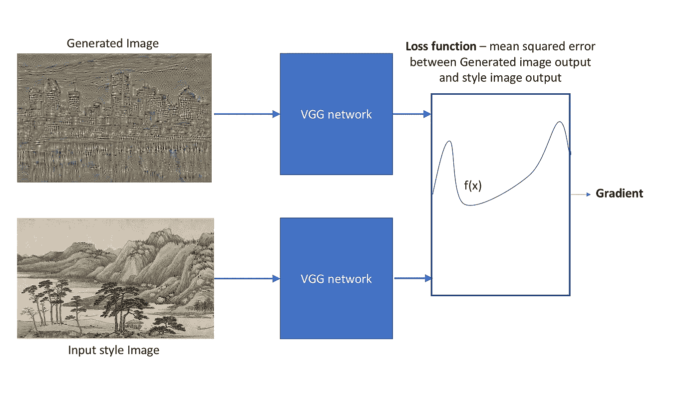
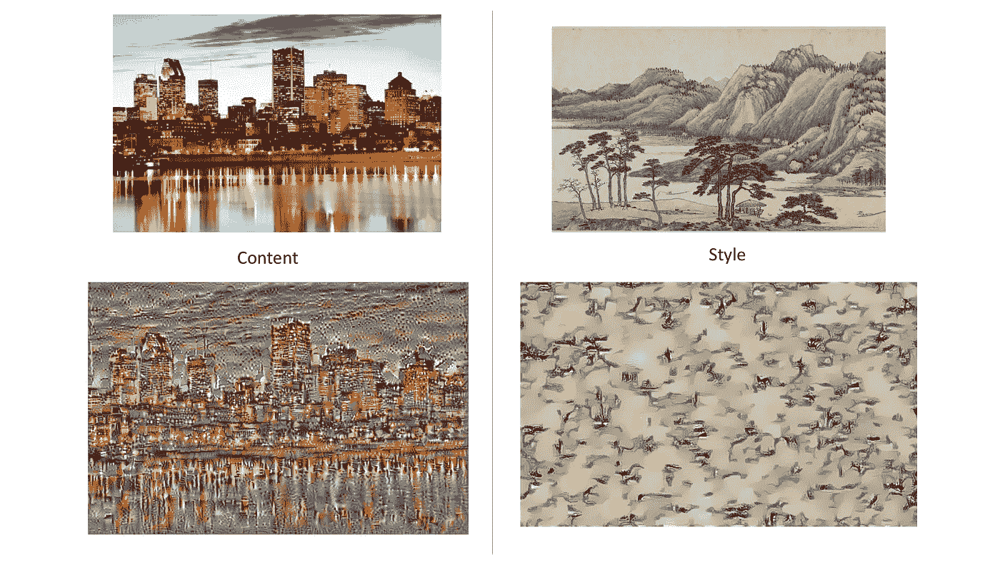
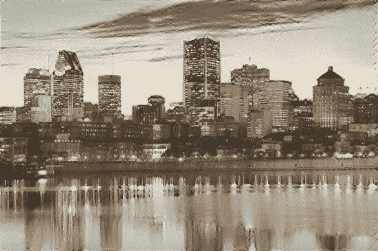
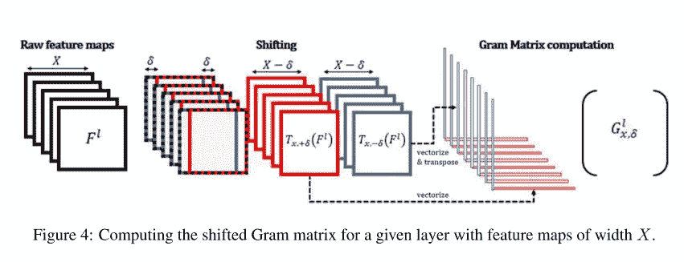
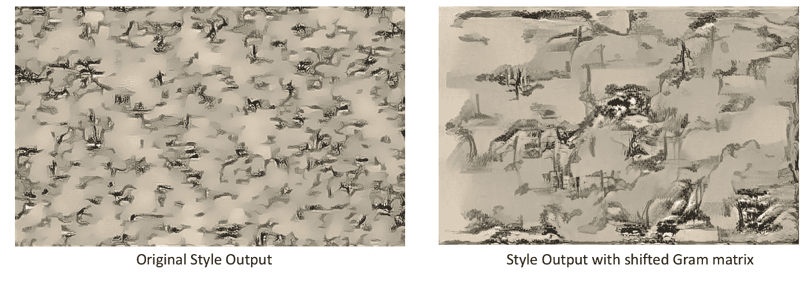
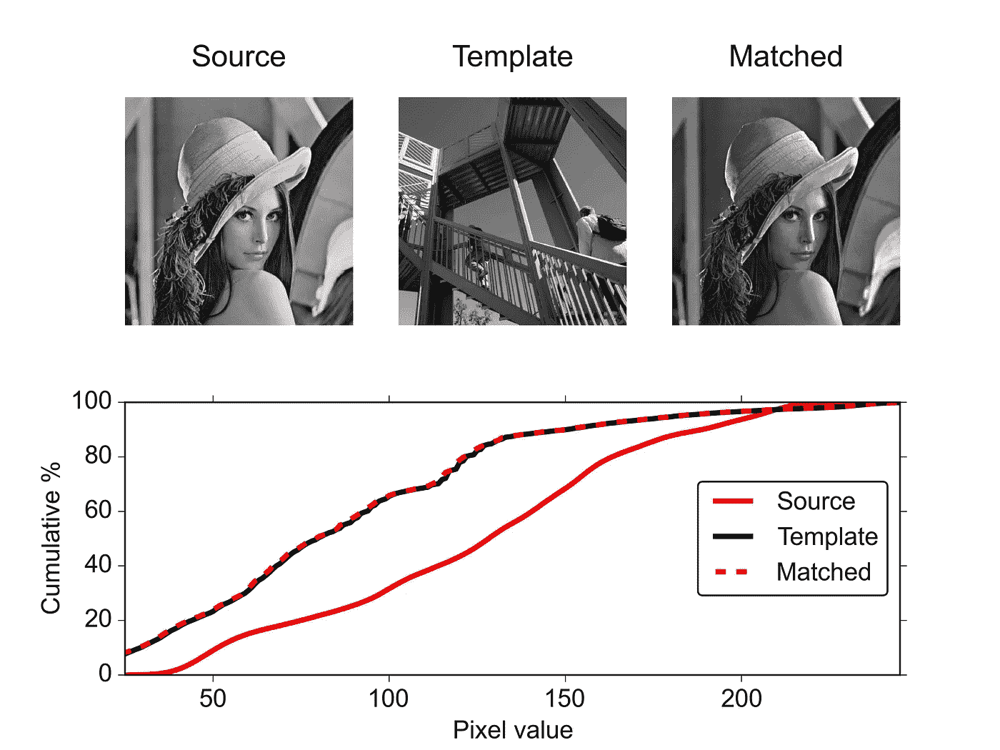
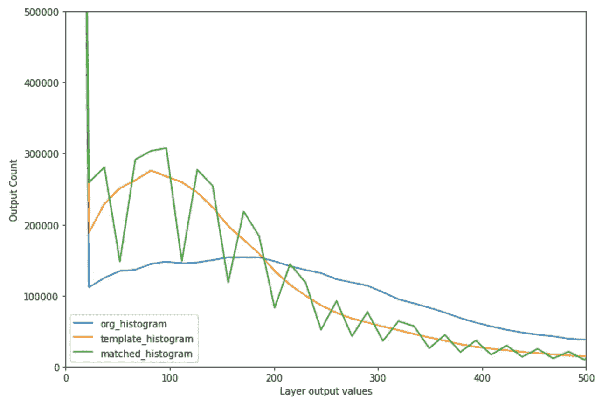
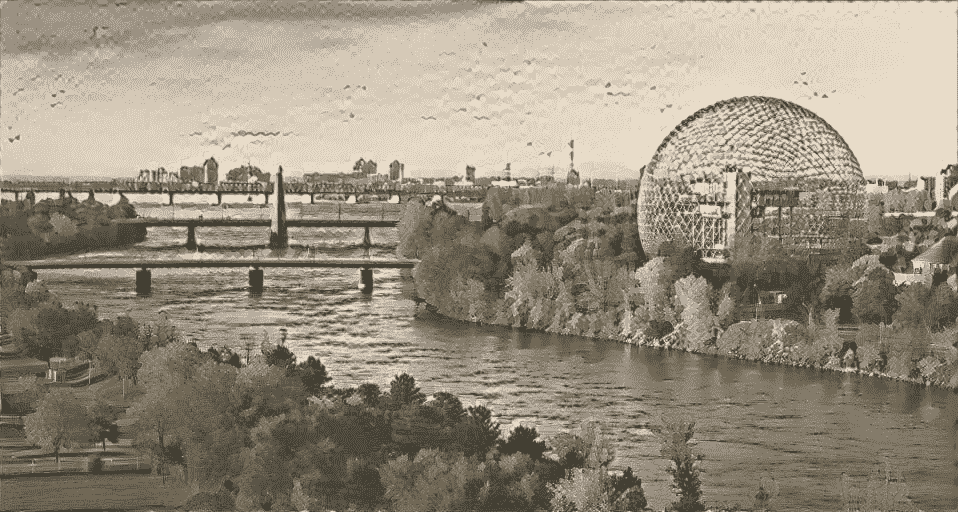

# 黄画的蒙特利尔:神经风格的网络

> 原文：<https://towardsdatascience.com/montreal-painted-by-huang-gongwang-neural-style-networks-ec1697b2ac54?source=collection_archive---------9----------------------->

最近，CNN([卷积神经网络](https://www.wikiwand.com/en/Convolutional_neural_network))的一个非常酷的应用是设计神经网络；这些包括分离一幅图像的风格和另一幅图像的内容，然后将它们组合起来:

An example of **style transfer**, from the first paper to describe it, ‘[A Neural Algorithm of Artistic Style](https://arxiv.org/abs/1508.06576)’, by Gatys et. al

这里使用的风格转换方法是基于**图像迭代**。这意味着算法将多次改变图像(即“迭代”)以获得输出图像。

因此，主要的挑战是描述一个损失函数，它可以告诉算法它正在创建的图像是更接近还是更远离我们想要的。

这是一个不小的问题；你如何告诉一个算法，你想要图像 A 中的房子的形状，但你想把它画成约瑟夫·特纳的《牛头怪的沉船》？

突破来自于使用[卷积神经网络进行图像识别](https://medium.com/@gabrieltseng/learning-about-data-science-building-an-image-classifier-3f8252952329)；当 CNN 学习识别一幅图像是否包含一所房子时，它会学习房子的形状，但它的颜色并不重要。CNN 隐藏层的输出因此可以用来定义神经类型网络的损失函数。

我将探索风格神经网络，并赶上自 [Gatys 的 2014 年论文](https://arxiv.org/abs/1508.06576)首次介绍这一想法以来，基于图像迭代的描述性风格转移的其他发展。

这篇文章附带的代码在这里:[https://github . com/Gabriel Tseng/learning data science/tree/master/computer _ vision/style _ neural _ network](https://github.com/GabrielTseng/LearningDataScience/tree/master/computer_vision/style_neural_network)

**内容:**

目录中的每个部分都基于一篇论文(每个部分下面有链接)。我的方法基本上是尝试在 Keras(和 Tensorflow)中实现每篇论文。

1.  得到风格神经网络的直觉，以及基本风格神经网络
    和艺术风格神经网络
2.  在整个图像中添加更一致的纹理
    [在基于 CNN 的纹理生成中加入长距离一致性](https://arxiv.org/pdf/1606.01286)
3.  添加直方图，消除 Gram 矩阵的可变性
    [使用直方图损失实现稳定可控的神经纹理合成和风格转换](https://arxiv.org/abs/1701.08893)
4.  结合这一切

# 基本型神经网络

[论文](https://arxiv.org/abs/1508.06576)，代码(对于一个风格神经网络的基本实现，我用了[这个](http://blog.romanofoti.com/style_transfer/)帖子)

考虑一下传统的神经网络是如何学习的:它会对它接收到的一些数据做出一些结论，然后根据它是对还是错来调整它的权重。

风格神经网络的工作方式完全不同。CNN 的权重是固定的。相反，会产生一个输出图像，网络会调整图像上的**像素**。

Starting from a random image, the pixels are gradually improved to resemble an image of the Montreal skyline painted in the style of Huang Gongwang’s [Dwelling in the Fuchun Mountains](https://www.wikiwand.com/en/Dwelling_in_the_Fuchun_Mountains).

我使用 [VGG 图像识别](http://www.robots.ox.ac.uk/~vgg/research/very_deep/)模型创建了上面的图像(我在这里探究[)。风格神经网络利用了 VGG 模型的不同层擅长识别不同事物的事实。后面的层善于识别形状和形式(内容)，而前面的层识别图案和纹理(风格)。](https://medium.com/@gabrieltseng/learning-about-data-science-building-an-image-classifier-3f8252952329)

因此，如果生成的图像在 VGG 的后续图层中具有与图像 A 相似的输出，那么它可能具有与图像 A 相似的内容

另一方面，如果生成的图像在通过 VGG 早期的图层时具有与图像 B 相似的输出，那么它们可能具有相似的风格。

有了风格，还有一个额外的转折；计算[格拉米矩阵](https://www.wikiwand.com/en/Gramian_matrix)，并以此作为比较，而不是纯粹的输出，更有效地传达风格。

通过量化生成图像的输出与输入“目标”图像(图像 A 和 B)之间的差异，我生成了一个函数。这给了我一个梯度，然后我可以用它来调整我生成的图像的像素(使用[梯度下降](https://www.wikiwand.com/en/Gradient_descent))。

我可以将差异量化为生成图像和目标图像的 VGG 模型输出之间的均方误差:

Creating a loss function. The loss function, and gradient, are recalculated at every iteration. The gradient is a matrix of the same size as the generated image (with two additional dimensions, for the RGB channels), so that each pixel is changed according to the gradient value for that pixel.

注意:从现在开始，当我说我在比较图像时(例如，比较生成的图像和样式图像)，我的意思是我在比较 VGG 输出。

神经网络的内容和风格方面的实际目标是什么？我可以通过从随机噪声开始，仅使用内容或损失函数来观察神经网络的每一侧试图生成什么图像，来对此进行可视化:

Starting from random noise, only using the content loss function with the Montreal skyline as content input yields the bottom left image. Only using the style loss function with the Fuchun mountains as style input yields the image on the bottom right. In both cases, the network was run for 10 iterations.

然后，将风格和损失函数结合在一起得到:

A combination of style and content, after 10 iterations. Note: as per [Novak and Nikulin](https://arxiv.org/abs/1605.04603)’s recommendations, I used the content image as the starting image, instead of random noise.

这是一个超级酷的组合图像的开始，但也有一些缺点。幸运的是，后来的研究人员已经做了大量的工作来解决这些问题。我现在将尝试实现这些解决方案中的一些，以获得一个很好的蒙特利尔图像，如黄所画。

# 包含长期一致性

[论文](https://www.google.ca/url?sa=t&rct=j&q=&esrc=s&source=web&cd=1&cad=rja&uact=8&ved=0ahUKEwij86eLxpXVAhWm8YMKHSA8DZwQFggoMAA&url=https%3A%2F%2Farxiv.org%2Fabs%2F1606.01286&usg=AFQjCNFH59W8FtSjSzexpbi2yaciMFrhmA)

X 的克矩阵是其自身与其转置的点积:X(X 转置)。这将 X 的每个元素与其自身进行比较，并且擅长于获得图像中正在发生的事情的全局理解。

然而，这不能捕捉图像内的局部结构。比较局部结构的一种方法是，不仅将每个元素与其自身进行比较，还将其相邻元素进行比较。有一个简单的方法来实现这一点；在计算 gram 矩阵时，只需将输出向侧面平移一点:

Credit to the [original paper](https://www.google.ca/url?sa=t&rct=j&q=&esrc=s&source=web&cd=1&cad=rja&uact=8&ved=0ahUKEwij86eLxpXVAhWm8YMKHSA8DZwQFggoMAA&url=https%3A%2F%2Farxiv.org%2Fabs%2F1606.01286&usg=AFQjCNFH59W8FtSjSzexpbi2yaciMFrhmA) for this figure.

对风格损失函数进行这种微小的改变会对输出产生显著的影响:

With the same input as before (Dwelling in Fuchun Mountains), the simple act of shifting the gram matrices leads to a very different style output; the shape of the mountain is nearly visible, showing the extent to which local image structure is conserved.

# 直方图损失

[论文](https://arxiv.org/abs/1701.08893)

使用 Gramian 矩阵来衡量风格有一个很大的问题，这就是不同的图像可以产生相同的 Gram 矩阵。因此，我的神经网络可能会以不同于我想要的风格为目标，而*碰巧*会生成相同的 Gram 矩阵。

这是一个问题。

幸运的是，有一个解决方案:[直方图匹配](https://www.wikiwand.com/en/Histogram_matching)。这是目前在图像处理中使用的技术；我获取了源图像中像素颜色的直方图，并将它们与模板图像进行匹配:

An example of grayscale histogram matching with two images. Credit to [ali_m](https://stackoverflow.com/questions/32655686/histogram-matching-of-two-images-in-python-2-x) for this image.

同样的原理也可以应用到我的图像输出中。通过将我生成的图像用作源图像，将目标样式图像用作模板图像，我可以将我的损失定义为生成的图像和目标样式图像之间的差异。

Histogram matching with the target outputs. The jitteriness of the matched histogram can be attributed to the number of histogram bins; I plotted this using 255 bins. Using every unique output layer value as a bin would have been desirable, but computationally impossible (there were about 5 million unique values). This jitteriness was therefore the tradeoff for reasonable computation times.

现在，给定我的生成图像和匹配图像，我可以将我的损失定义为两者之间的均方误差。然后，可以将这个新的直方图损失添加到 Gramian 矩阵产生的损失中，以使其稳定。

# 将所有这些结合起来，并进行额外的改进

将这两个损失与原始内容和样式损失相结合(并调整 hyper 参数),得到以下结果:

Montreal, as painted by Huang Gongwang. The input images were ‘[Dwelling in the Fuchun Mountains](https://www.wikiwand.com/en/Dwelling_in_the_Fuchun_Mountains)’ and [this](https://s-media-cache-ak0.pinimg.com/originals/00/da/42/00da429ead71426599ef22a96106542d.jpg) image of the biosphere.

天空中有一点噪音，但是考虑到我只运行了 10 次迭代(相比于一些论文中的 1000 次)，这是一个相当酷的结果！

## 外卖:

1.  **放过网络**！当生成最后一个图像时，我倾向于“微观管理”我的网络，一旦损耗停止下降就改变参数。仅仅让网络运行就能产生最好的结果，因为它往往会脱离那些常规。
2.  调整风格神经网络的参数尤其困难，因为这最终是一种主观判断，即一幅图像看起来是否比下一幅好。此外，一些图像会比其他图像做得更好。
3.  张量流很棘手。特别是，[评估](https://stackoverflow.com/questions/33610685/in-tensorflow-what-is-the-difference-between-session-run-and-tensor-eval)一个张量是确保一切正常的唯一方法；tensorflow 可能会说一个操作很好，只是在评估时抛出一个错误。

请采取代码，并作出冷静的形象！