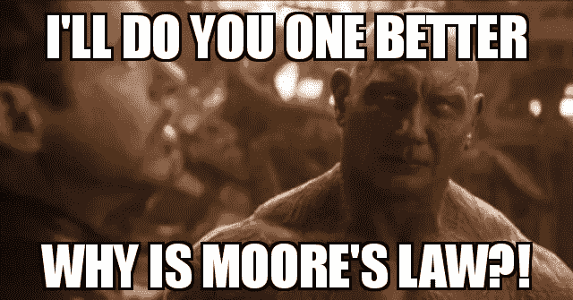
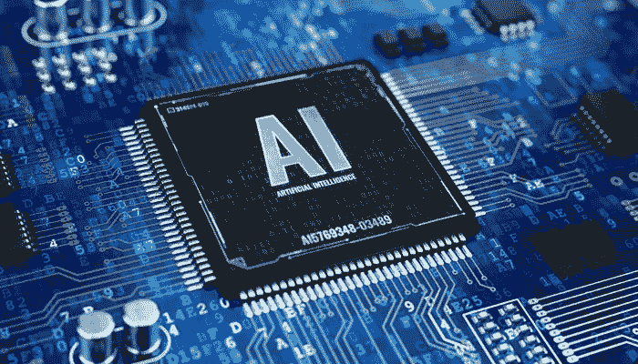
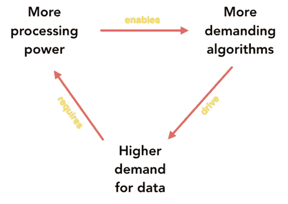

# 摩尔定律正在消亡。这就是人工智能如何让它复活的！

> 原文：<https://towardsdatascience.com/moores-law-is-dying-here-s-how-ai-is-bringing-it-back-to-life-c9a469bc7a5a?source=collection_archive---------4----------------------->

摩尔定律是表明科技行业(尤其是电子工程)指数级进步的基本定律之一，最近(更准确地说，是从 2005 年开始)放缓了，这让该行业的许多人认为这条定律不再适用。那是，直到人工智能加入了竞技场！从那以后，游戏变了，摩尔定律正在慢慢复活。

Image by author

让我们来看看人工智能是如何逆势而上的。

## 什么是摩尔定律？

Image by author

英特尔的联合创始人之一戈登·摩尔在 1965 年注意到，集成电路上每平方英寸的晶体管数量每年翻一番，而在几乎相同的速度下，成本却下降了一半。因此，他预测这种趋势将持续到可预见的未来。

我知道，我们中的一些人可能会想“仅此而已？好吧，不如我注意到下雨了，然后制定我自己的法律说每年都会下雨？?"。但是摩尔定律不仅仅是一个模糊的猜测:它也符合一个叫做[丹纳德缩放](https://www.rambus.com/blogs/understanding-dennard-scaling-2/)的技术缩放规则，即“随着晶体管尺寸的减小，它们的功率密度保持不变”。呃……什么？好了，翻译成英语，这就意味着:单位面积的晶体管数量会增加。芯片(现在有更多的晶体管)单位面积的功率需求将保持不变，而电压和电流将随着长度的增加而降低。预言果然实现了:电子行业一直在蓬勃发展！

> 晶体管不仅变得更小，而且速度更快，更节能，因此芯片现在可以在大约相同的美元和功率预算下提供至少两倍的性能。

摩尔定律成立…直到它不成立。

## 摩尔定律为什么会消亡？

正如 NovuMind 公司的陆建平在他的[论文](https://arxiv.org/ftp/arxiv/papers/1705/1705.05983.pdf)中简明扼要地指出的:

> 转折点发生在 2005 年，当时晶体管的数量继续翻倍，但速度和以前一样，既没有更快也没有更节能。

原因如下:21 世纪是电子行业将技术带给人们的时代。商业繁荣，三星和高通分别是手机和处理器的典范。但是在这个时代，科技行业的竞争对手是真实存在的！因此，一家公司提供的硬件必须继承其遗产:它必须符合规格，为每个新版本提供更好的用户体验，因此不能为了节能而进行大规模修改。

丹纳德标度方面出现了故障，因此从那时起就偏离了摩尔定律的趋势。进入人工智能，以及它如何修复情况。

## 人工智能是如何修改摩尔定律的

(Sourced from [https://artificialintelligenceimpacts.wordpress.com/2019/01/27/ai-artificial-intelligence-chip/](https://artificialintelligenceimpacts.wordpress.com/2019/01/27/ai-artificial-intelligence-chip/))

我们都知道媒体和电影业如何用机器人和过度智能的系统过度宣传人工智能。一些计算机先驱，艾伦·图灵(你可能想看模仿游戏来欣赏他的传奇)站在最前沿，开始着手一些项目，以期制造会思考的机器。然而，图灵确实意识到这将极其困难，并在 1950 年提出:

> 与其试图制作一个模拟成人思维的程序，为什么不试着制作一个模拟儿童思维的程序呢？如果这种大脑接受适当的教育，就可以获得成人的大脑。

这个想法发展成为深度学习。快进到 2018 年:我们已经并仍在收集海量数据。我们已经并仍在开发越来越多的高级算法(生成式对抗网络和胶囊网络就是很好的例子。)但是我们有硬件在合理的时间内处理所有这些计算吗？如果我们这样做了，我们能做到这一点，而不会让所有这些图形处理器因处理过程升温而导致另一场全球变暖吗？

[azeem](https://medium.com/u/83723c0aa9f9?source=post_page-----c9a469bc7a5a--------------------------------)’s diagram explains this trend perfectly in his [article](https://medium.com/s/ai-and-the-future-of-computing/when-moores-law-met-ai-f572585da1b7)

就在这里，人工智能施加了一个约束:保持功率恒定或降低功率，但提高性能……这听起来是不是有点熟悉我们刚刚看到的一些缩放规则？确切地说，通过迫使科技行业推出能够在单位时间内执行更多计算的新处理器，同时保持功耗和价格，人工智能再次强加了 Dennard 缩放，从而迫使摩尔定律复活！

如果你喜欢这篇文章，请给它一个掌声，这样其他人也可以找到它。在数据科学社区中互相帮助总是好的:)

Hans A. Gunnoo 是一名数据科学家，他的职业生涯始于电子工程，后来专攻机器学习。他还在业余时间为开源人工智能项目和关于数据科学领域最新趋势的博客做出贡献。