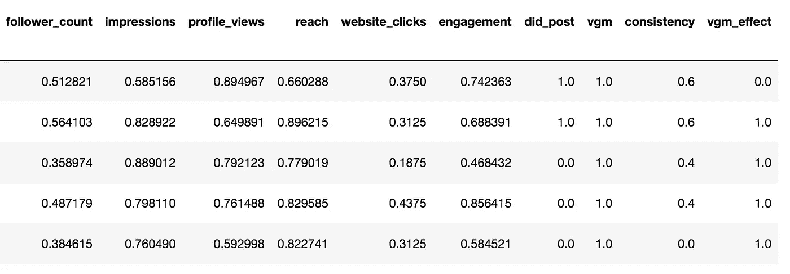
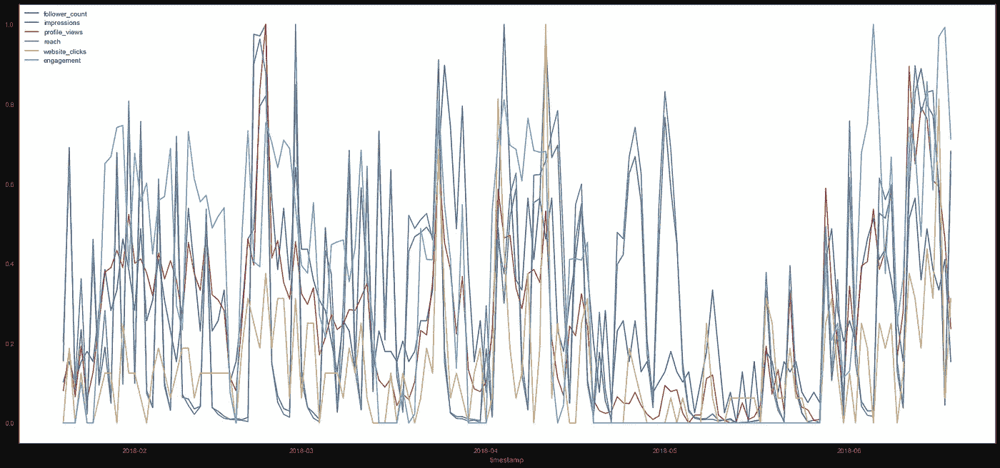
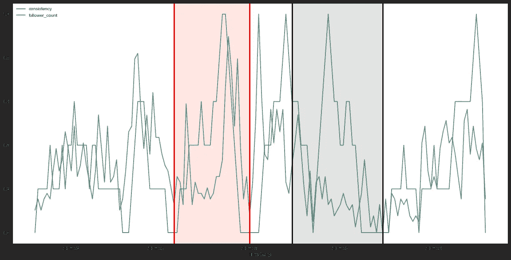
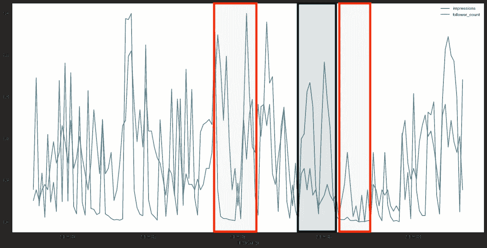
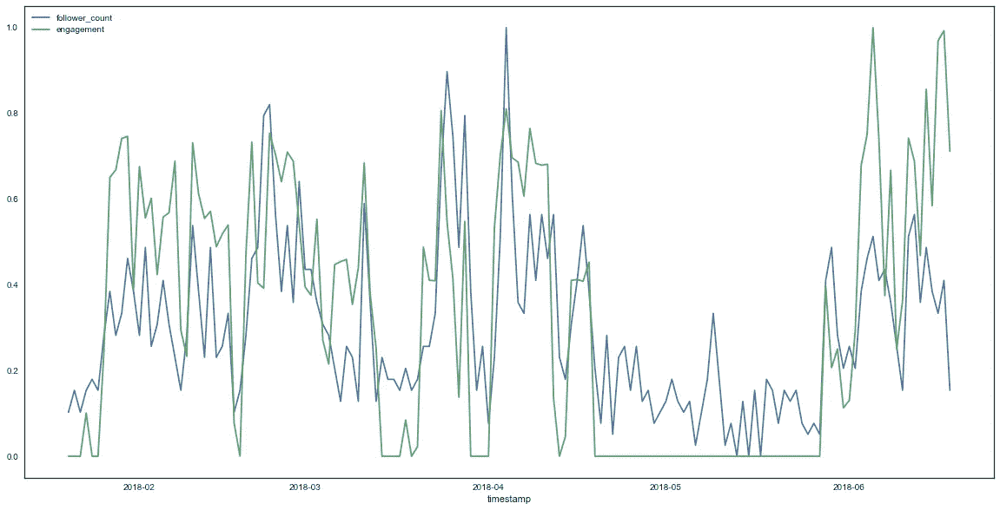
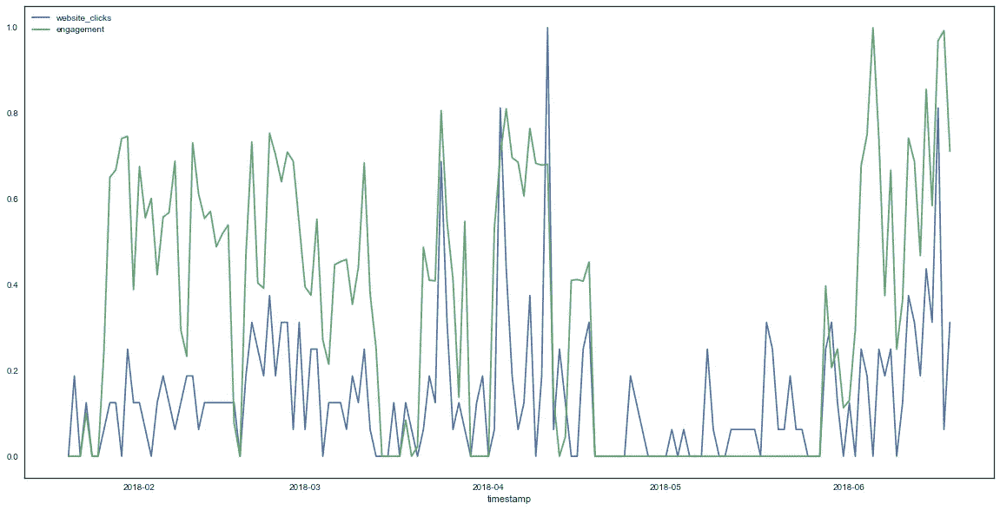
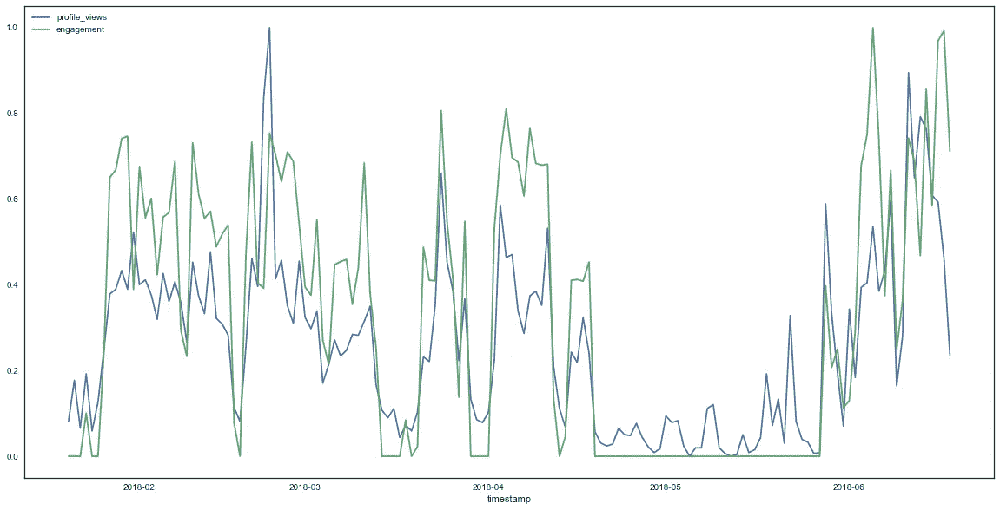
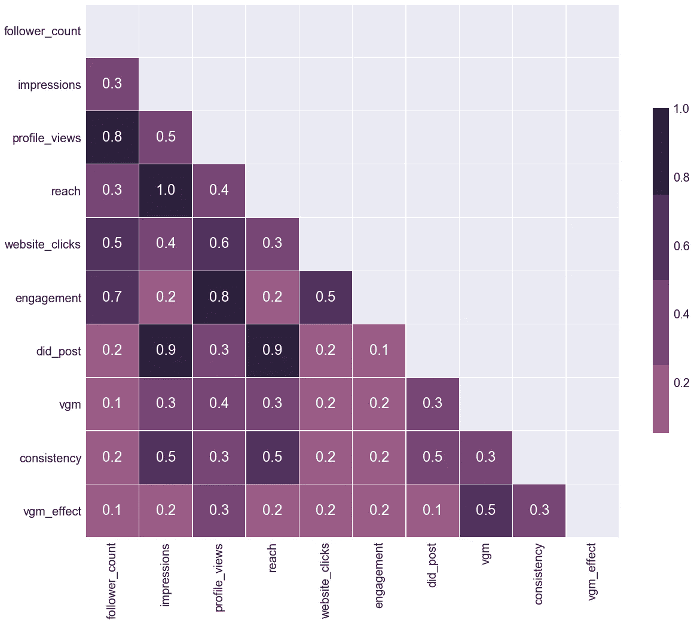

# 你读到的关于增加 Instagram 受众的大部分内容要么不相关，要么不够

> 原文：<https://towardsdatascience.com/most-of-what-you-read-about-growing-an-instagram-audience-is-either-irrelevant-or-not-enough-53e597654155?source=collection_archive---------8----------------------->

> *“帖子始终如一。使用标签。加入一个约定舱。冲洗。重复。”*

这基本上就是咒语，对吧？我在互联网上阅读或观看的每一篇博文、YouTube 视频或在线课程，要么是同时谈论所有这些事情，要么是非常垂直地谈论其中一个(类似于:“*2018 年 Instagram 标签权威指南*”)。

我决定用数据分析来检验它们的有效性。

我用我公司的 Instagram 账户`[**@uniwhere**](https://www.instagram.com/uniwhere)`和我自己的 Instagram 账户`[**@giansegato**](https://www.instagram.com/giansegato)`有条不紊地遵守了这些规则。Uniwhere 是一款面向大学生的 app，所以社区建设对我们来说是关键。
以下分析仅基于 Uniwhere 的账户。

我在过程中改变了活动——比如停止做某件事，同时引入另一件事；这样，我就有了进行比较分析所需的必要程度的变化。

然后，我将一个 Python 笔记本连接到 Instagram Graph APIs 和我们自己的数据库，并试图得出一些结论。

> **TL；DR 版本:帖子一致性、标签曝光率和参与度与追随者增长完全不相关。你可以从中受益，但不是在受众发展方面。**

让我们来看看细节。

# 数据

首先，我想指出我能够分析哪种数据。这是我最后的数据框架:

如你所见，我有一组标准化的指标，这些指标要么直接来自 Instagram，要么来自我们自己的内部 ETL 系统。
每行代表一天，从 2018 年 1 月 1 日开始，到 2018 年 6 月 10 日结束。

为了便于分析，我将数据分为三类:

## 行动

这些是跟踪为发展客户而采取的明确行动的指标:

*   `did_post`:是否在某一天我们贴了一张照片；它也有一个滞后版本，`consistency`:一个尾随值，代表当天之前一周的帖子一致性程度。
*   `vgm`:那一天，帖子后面有没有用交战吊舱推过。
    参与豆荚推动特定图片的参与度飙升(数百个赞)，通常它们会让你的照片出现在标签的`top post`部分。他们的工作非常简单:有一群人在某个约定的时间互相喜欢对方的照片。所以，大量的参与和潜在的曝光。
    这个特性也有一个滞后变量，`vgm_effect`:同样，一个 5 天的拖尾值，以考虑到在推送后的几天内接合荚有一个转移效应的可能性。
*   `engagement`:在某一天，我们对相关图片的喜爱程度，使用我们在平台上找到的用户标签。另一个常见但耗时的活动是:你试图在一系列与你的喜好相关的图片中发现有趣的图片，并且你喜欢它们；希望有喜欢的人访问你的个人资料，喜欢它，并关注你。

## 达到目的的手段

这些是间接结果:

*   `profile_views`:一天内有多少用户访问了账户页面
*   `reach`:有多少独立用户以任何方式接触到我们的页面
*   在给定的一天内，我们的一张照片被浏览了多少次

小剧透:impressions 和 reach 是完全相关的(`1.0`)，所以我们有可能将这两个术语作为同义词使用，尽管它们意味着两个不同的东西。

## 目标

最后，我们感兴趣的真正的、最终的*KPI*:

*   `followers_count`:某一天我们有多少 ***新*** 用户
*   `website_clicks`:我们在账户页面上展示的网站链接被点击了多少次

最后，它看起来像这样:

好吧，没那么有用，我懂了。

*Divide et imper*:在拼凑出全貌之前，让我们先考虑一些小的比较。

## 后期一致性

以我的愚见，我认为“*持续发帖并获得新追随者*”这一永恒的大法则非常具有误导性。坚持发帖子有用吗？嗯，不疼。对于你的 ***现有的*** 观众来说肯定很关键。但是，看看确凿的证据，很难说它有助于 ***增长它*** 。
让我们来看看这个情节:

红色竖线表示我们发布图片的日期(`did_post = 1`)。黑色的竖线表示我们不仅发布了一张图片，还使用了一个参与 pod ( `vgm = 1`)来推送它。

看起来这两件事之间没有任何规律可言。然而，很难从这幅图像中推断出一些有趣的东西，除了非常清楚的“*接合吊舱无助于*”(这仍然非常有趣)。

让我们绘制相同的数据，但这次使用后一致性(我提醒你，这是一个移动窗口总和，因此可以绘制为一条连续的线):

正如你在 3 月和 4 月之间看到的(红色区域)，关注者增长和帖子一致性之间似乎有一个有趣的关联:我发的越多(蓝线)，我的关注者就越多(绿线)。

然而，后来，在 4 月和 5 月之间(黑色区域)，新追随者的增长停滞不前，而一致性却创下新高。所以… **看起来发帖越多，或者越持续，越不会直接影响追随者的成长，使用互动豆荚也不会。**

## 行动 2:成为热门帖子的趋势

有时候，我们的页面已经成为大量标签流的趋势。我们有一些照片登上了 2000 万左右的热门帖子。然而，它并没有给我们带来多少参与，而且，可能更糟糕的是，因为它，基本上没有新的追随者。

看看下面的情节。它显示了印象数和关注数之间的关系。

正如你所看到的，一般来说，它们都朝同一个方向移动(我猜)。然而，你完全可以在没有印象的情况下获得观众增长(两个红色区域)，也可以在没有增长的情况下获得良好的印象(黑色区域)。

所以… **没有。你的照片经常被人看到与粉丝的增长没有太大关系。**

## 行动 3:疯狂地四处活动

我就给你看这个。

参与度的新关注者(小提示:`engagement`定义为一个介于 0 和 1 之间的参数，用于量化平台中其他用户的点赞会话强度——我们在某一天与其他用户互动的次数):

网站点击参与度:

参与的个人资料视图:

**轰。** 订婚。
差不多就是这样。

当你使用正确的标签喜欢周围的图片时，你的个人资料浏览量会上升，因此你的关注者数量也会随着网站点击量的增加而增加。

这是唯一一个一直被证明是成功增加 Instagram 受众的策略。

# 我们能不能别绕圈子了？

现在我们来看看数据帧相关矩阵，它基本上是我可能向您展示的每一个可能的图的总结:

这张照片非常有趣。我需要一些来自不同账户和不同领域的信息，以便进行真正的概括，但据我所知，这是一张关于 2018 年 Instagram 游戏如何运作的非常生动的图片。
换句话说，你可能想到的每一个可能的策略都应该包含在这里，至少从相关性的角度来看是这样的。

我最感兴趣的是这个紫色的小家伙:

1.  `vgm_effect` *与*无关。就像，真的，任何事。这几乎与`profile_views`无关，这是显而易见的，因为你的订婚豆荚中的那些人实际上必须访问你的个人资料才能喜欢你的上一张照片。
2.  `did_post`与`impressions`和`reach`密切相关，这也是显而易见的:当你发帖时，你留下了印象，当你不发帖时，你就没有了印象。但是和`follower_count`没有关联的迹象。
3.  而`follower_count`则与`engagement`和`profile_views`高度相关，与`website_clicks`略有相关。正如我们在之前的情节中已经看到的，投入时间喜欢周围的图片是真正吸引新粉丝的唯一方法:你喜欢图片，因此你的个人资料会被浏览，人们会接触到你的图库，然后他们会决定是否值得关注你。在决定是否关注你的过程中，他们可能会访问你的网站。
4.  公平地说，在`profile_views`和`impressions`之间存在某种形式的关联。然而，我怀疑那些在印象高峰之后出现的部分个人资料视图(因此伴随着`did_post`)是你自己的*追随者*因为你发布了一些东西而访问你的页面。因此，没有新的追随者，但现有的观众参与。

# 外卖(即。我从这里学到了什么)

最后，我认为这里要提出的主要观点如下:

**1。只为你在*现有的*受众发帖:不要指望你的帖子会吸引更多的关注者；即使他们在网上疯传也不行**

**2。使用互动平台只是为了增加你对照片的喜欢，并有一些社会证明:不要指望互动平台是增加你的观众的魔杖**

**3。喜欢，喜欢，喜欢，喜欢。
冲洗干净。
重复。**

# 追踪

*   如果你喜欢这篇文章，我会非常感激你给我一个掌声:这是我第一次写这种东西，我想知道人们是否对此感兴趣。
*   如果你想得到这篇文章更新的通知，或者关于创业、成长和数据科学的新文章，你可以订阅我的时事通讯:

*   如果您对本文有任何意见、问题或批评，请告诉我！

# 最后一个音符

为什么不考虑后续跟进策略(我四处跟踪人们，希望他们中的一部分人也能跟踪我)？嗯:我从来没有做过，所以我没有关于这种策略的数据。

我相信它在短期内非常成功，但我讨厌它，主要是因为它传达了一个非常明确的绝望信息，而且你无法扩大它:要么你保留你建立的每个联系，因此 a .你很快就达到了 7500 的限制，b .你看起来真的超级绝望，要么你不时地随机取消关注你的一些粉丝，这是非常不诚实的事情，依我看。所以，没有，没有相关数据。