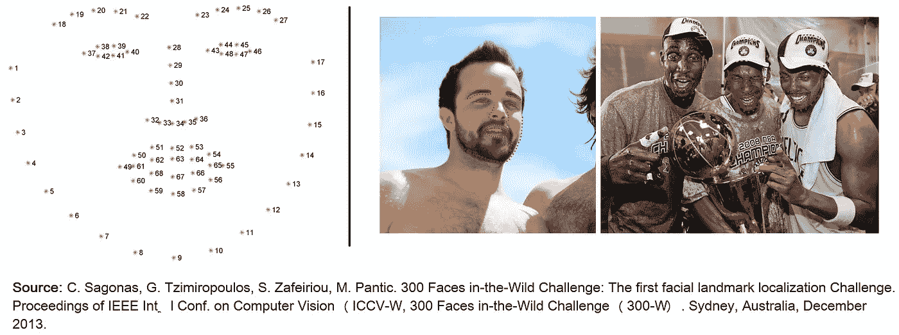
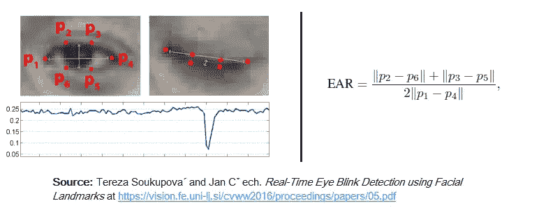
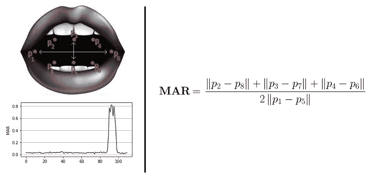
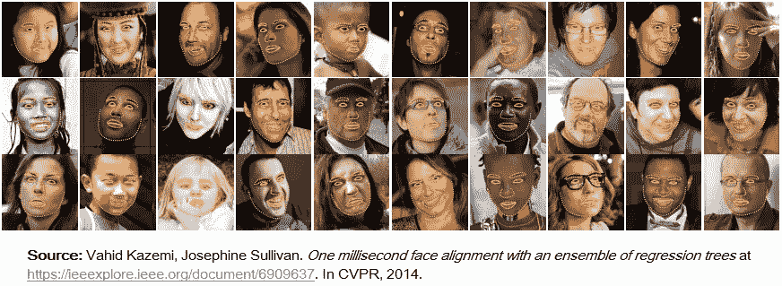

# 使用面部动作控制鼠标光标——一个人机交互应用程序

> 原文：<https://towardsdatascience.com/mouse-control-facial-movements-hci-app-c16b0494a971?source=collection_archive---------3----------------------->

这个用 Python(3.6)编写的 HCI(人机交互)应用程序可以让你通过面部动作控制鼠标光标，只需普通的网络摄像头就能工作。它是免提的，不需要可穿戴的硬件或传感器。

特别感谢**阿德里安·罗斯布鲁克**令人惊叹的博客帖子【2】【3】、代码片段和他的 [imutils](https://github.com/jrosebr1/imutils) 库【7】，它们在实现我的想法中发挥了重要作用。

# 工作示例

# 使用

现在，我完全理解这些面部动作做起来可能有点奇怪，尤其是当你在人群中的时候。作为一名[良性位置性眩晕](https://www.healthline.com/health/benign-positional-vertigo)的患者，我讨厌自己做这些动作。但我希望随着时间的推移，它们会变得更容易，不那么怪异。请随意建议一些我可以纳入该项目的公共友好行动。


# 密码

您可以在以下位置找到代码文件:

[](https://github.com/acl21/Mouse_Cursor_Control_Handsfree) [## ACL 21/Mouse _ Cursor _ Control _ 免提

### Python(3.6)中的这个 HCI(人机交互)应用程序将允许你用你的…

github.com](https://github.com/acl21/Mouse_Cursor_Control_Handsfree) 

## 使用的库

*   Numpy — 1.13.3
*   OpenCV — 3.2.0
*   PyAutoGUI — 0.9.36
*   Dlib — 19.4.0
*   Imutils — 0.4.6

repo 的 README.md 中提到了执行步骤。如果有任何错误，请随时提出问题。

# 它是如何工作的

这个项目的核心是预测给定人脸的面部标志。我们可以利用这些地标完成很多事情。从检测视频中的眨眼到预测受试者的情绪。面部标志的应用、结果和可能性是巨大而有趣的。

[Dlib](http://dlib.net/) 的预建模型，本质上是【4】的实现，不仅可以进行快速人脸检测，还可以让我们准确预测 68 个 2D 面部标志。非常方便。



使用这些预测的面部标志，我们可以建立适当的特征，这将进一步允许我们检测某些行为，如使用眼睛纵横比(下面将详细介绍)来检测眨眼或眨眼，使用嘴巴纵横比来检测打哈欠等，甚至可能是噘嘴。在这个项目中，这些动作被编程为控制鼠标光标的触发器。 [PyAutoGUI](http://pyautogui.readthedocs.io) 库用于移动光标。

## 眼睛长宽比(耳朵)

你会发现眼睛长宽比[1]是最简单也是最优雅的特征，它很好地利用了面部标志。耳朵帮助我们发现眨眼和眨眼等动作。



你可以看到，每当眼睛闭上时，耳朵值就会下降。我们可以训练一个简单的分类器来检测下落。然而，正常的 *if* 条件工作正常。大概是这样的:

```
if EAR <= SOME_THRESHOLD:
      EYE_STATUS = 'CLOSE'
```

## 嘴部长宽比

受到耳朵功能的高度启发，我稍微调整了一下公式，以获得一个可以检测张开/闭合嘴的度量。没有创意，但很管用。



与耳朵类似，当嘴张开时，MAR 值上升。类似的直觉也适用于这一指标。

# 预建模型详细信息

该模型提供了两个重要的功能。检测面部的检测器和预测界标的预测器。所使用的面部检测器是使用结合了线性分类器、图像金字塔和滑动窗口检测方案的经典梯度方向直方图(HOG)特征制成的。

面部标志估计器是通过使用 Dlib 的论文实现来创建的: [*一毫秒面部对齐与瓦希德·卡泽米和约瑟芬·沙利文*](https://www.semanticscholar.org/paper/One-millisecond-face-alignment-with-an-ensemble-of-Kazemi-Sullivan/1824b1ccace464ba275ccc86619feaa89018c0ad) 的回归树集合，CVPR 2014。并在 iBUG 300-W 人脸地标数据集上进行训练:C. Sagonas，E. Antonakos，G，Tzimiropoulos，S. Zafeiriou，M. Pantic。300 人面临野外挑战:数据库和结果。 [*图像与视觉计算(IMAVIS)，面部地标定位“野外”特刊。2016*](https://ibug.doc.ic.ac.uk/resources/facial-point-annotations/) 。



你可以从[http://dlib.net/files,](http://dlib.net/files,)点击**shape _ predictor _ 68 _ face _ landmarks . dat . bz2**获得训练好的模型文件。模型，。dat 文件必须在项目文件夹中。

**注意:**iBUG 300-W 数据集的许可不包括商业用途。因此，您应该联系伦敦帝国理工学院，了解您是否可以在商业产品中使用该模型文件。

# 参考

**【1】**。Tereza Soukupova 和 Jan Cˇ ech。 [*利用面部标志点进行实时眨眼检测*](https://vision.fe.uni-lj.si/cvww2016/proceedings/papers/05.pdf) 。2016 年 2 月，第 21 届计算机视觉冬季研讨会。
**【2】**。艾德里安·罗斯布鲁克。 [*用 dlib、OpenCV、Python*](https://www.pyimagesearch.com/2017/04/10/detect-eyes-nose-lips-jaw-dlib-opencv-python/) 检测眼睛、鼻子、嘴唇、下巴。
**【3】**。艾德里安·罗斯布鲁克。 [*用 OpenCV、Python 和 dlib*](https://www.pyimagesearch.com/2017/04/24/eye-blink-detection-opencv-python-dlib/) 进行眨眼检测。
**【4】**。瓦希德·卡泽米约瑟芬·苏利文。 [*一毫秒人脸对齐与回归树*](https://ieeexplore.ieee.org/document/6909637) 系综。2014 年在 CVPR。
**【5】**。S. Zafeiriou、G. Tzimiropoulos 和 M. Pantic。 [*野外 300 视频(300-VW)面部标志追踪野外挑战*](http://ibug.doc.ic.ac.uk/resources/300-VW/.3) 。在 2015 年 ICCV 研讨会上。
。c .萨戈纳斯、G. Tzimiropoulos、S. Zafeiriou、M. Pantic。 [*野外 300 张人脸挑战赛:首届人脸地标定位挑战赛*](https://ibug.doc.ic.ac.uk/media/uploads/documents/sagonas_iccv_2013_300_w.pdf) 。IEEE 国际会议论文集。在计算机视觉(ICCV-W)，300 面临野外挑战(300-W)。澳大利亚悉尼，2013 年 12 月
**【7】**。艾德里安·罗斯布鲁克。 *Imutils* 。[https://github.com/jrosebr1/imutils](https://github.com/jrosebr1/imutils)。


Photo by [Orysya Dibrova](https://unsplash.com/photos/28XgB4jULqg?utm_source=unsplash&utm_medium=referral&utm_content=creditCopyText) on [Unsplash](https://unsplash.com/search/photos/computer-mouse-handsfree?utm_source=unsplash&utm_medium=referral&utm_content=creditCopyText)