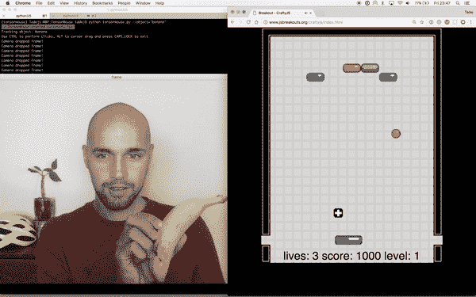
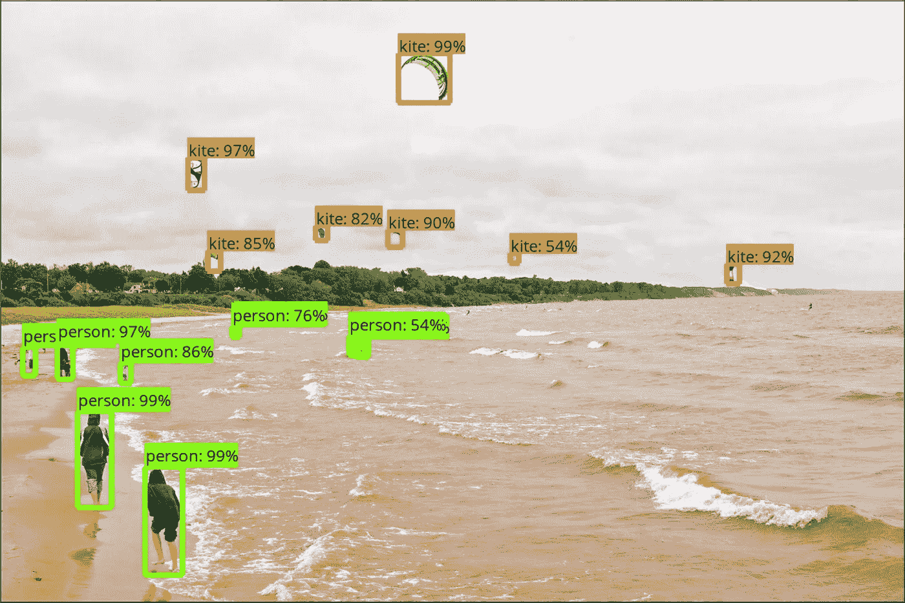

# 使用 Tensorflow 对象检测 API 通过网络摄像头移动光标

> 原文：<https://towardsdatascience.com/move-cursor-with-tensorflow-3727ed5e2795?source=collection_archive---------4----------------------->

Tensorflow 最近发布了用于对象检测的[对象检测 API](https://github.com/tensorflow/models/tree/master/research/object_detection) ，能够从图像中定位和识别对象。其快速检测图允许从视频帧甚至网络摄像头馈送中进行连续检测。它也可以用来制作鼠标。张量鼠。一个用摄像头移动光标的应用程序。

> 你是不是一直想用香蕉移动光标，却做不到？未来就是现在。

[TensorMouse](https://github.com/tadejmagajna/TensorMouse) 是一个小型开源 Python 应用程序，允许你通过在网络摄像头前移动随机的家用物体(如杯子、苹果或香蕉)来移动光标，并作为电脑鼠标或触控板的替代品。



TensorMouse allows you to play games… with bananas

# 它是如何工作的？

TensorMouse 从网络摄像头记录图像序列。然后，这些被输入 Tensorflow 对象检测 API 图形，该图形返回对象的概率和位置。然后移动鼠标光标，使光标位置与图像上对象的位置相对应。
例如，如果在图像的左上角检测到物体，光标将移动到屏幕的左上角。

应用程序的主要部分依次重复以下步骤:

1.  使用 OpenCV 从网络摄像头获取单帧图像
2.  使用 Tensorflow 对象检测 API 进行对象检测
3.  基于检测到的对象位置移动鼠标光标

## 1.帧采集

使用 Python OpenCV 模块捕获来自网络摄像头的帧。它为快速图像采集和缩放提供了一个跨平台的工具。然后将图像缩放至`360p`以提高性能。

## 2.目标检测

对象检测用于确定所需对象在网络摄像机帧中的相对位置。它使用 Tensorflow 对象检测 API 的冻结 [Mobilenet](https://github.com/Zehaos/MobileNet) 神经网络图，在 COCO 数据集上进行训练。该数据集由 80 种不同的物品组成，大部分包括杯子、苹果、餐具等家用物品。



Detected objects with corresponding probabilities

如果检测到的对象概率超过指定的阈值(当前为 85%)，TensorMouse 会将该对象视为已检测到，并计算检测到的对象的框的中心。

## 3.移动鼠标光标

Python 包 pynput 为执行鼠标光标移动提供了跨平台支持。光标移动到基于检测到的对象的相对位置的位置。这意味着如果在图像的左上角检测到物体，光标将移动到屏幕的左上角。

然后，应用程序返回到步骤 1，从网络摄像头中检索下一张图像，并重复这些步骤。

# 怎么用？

该应用程序的源代码发布在 my [Github repo](https://github.com/tadejmagajna/TensorMouse) 中。

TensorMouse 可以在任何主流(Windows、Linux 或 MacOS)平台和几乎任何机器上运行，但要实现良好的帧速率，它需要一个像样的 CPU 或支持 CUDA 的显卡。

## 装置

安装确保安装了软件包依赖项。

1.  安装 Anaconda(我推荐缩小版的 [Miniconda](https://conda.io/miniconda.html) )
2.  从 Gitlab 克隆[tensor mouse](https://github.com/tadejmagajna/TensorMouse)
3.  打开终端并导航到项目根目录
4.  `conda env create -f environment.yml` (Linux/MacOS)或`conda env create -f environment-win.yml` (Windows)
5.  `source activate tensormouse` (Linux/MacOS)或`activate tensormouse` (Windows)

## 跑步张量鼠标

一旦安装了依赖项并激活了环境(参见第 4 步和第 5 步)，我们就可以简单地运行 TensorMouse:

```
python tensormouse.py
```

然后等待大约 10-20 秒，等待绿色消息指示 Tensormouse 已成功启动。

这将运行 Tensormouse 跟踪它的默认对象-杯子。但是您可以通过提供可选参数`--obect="OBJECTNAME"`使它与 80 个 COCO 数据集对象中的任何一个一起工作

您也可以使用`CTRL`进行点击，使用`ALT`按钮进行拖动。

## 使用说明

*   确保物体光线充足(Tensormouse 在光线不好的情况下表现不佳)
*   确保物体足够远，不会占据整个网络摄像头画面，但足够近，仍然可以被检测到(需要一些尝试和错误)
*   如果你遇到物体检测性能差，尝试运行应用程序设置它来检测杯子，因为他们表现得相当好