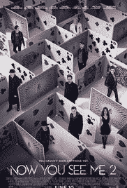
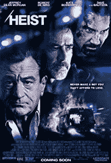
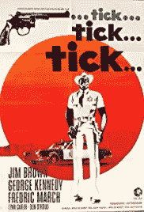
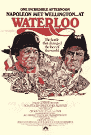
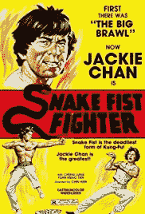
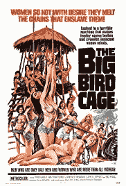

# 如何下载电影海报作为深度学习数据集

> 原文：<https://towardsdatascience.com/movie-posters-81af5707e69a?source=collection_archive---------6----------------------->

如果你对神经网络感兴趣，你可能和我在同一个地方。在某些时候，通常的数据集开始变得无聊(看看你，MNIST)。它们是开始旅程的完美之选，但在那里只有这么多东西可以发现。这就是为什么我很兴奋地在 Kaggle 上发现了一系列电影海报的链接。

在这篇文章中，你可以找到我用来收集这些海报的代码，以便对它们进行多分类实验。我以一种很容易根据你的需要进行调整的方式来编写代码。你还可以在我的 Github 页面上找到一个完整的 Jupyter 笔记本[。](https://github.com/timo-boehm/material_blog_posts)

一些背景:我收集这些数据的动机是建立一个神经网络，能够对艺术家设计电影海报的十年进行分类。当有人给你看一张电影海报时，你可能会知道它来自哪个时期。所以如果人类能做到，神经网络应该也能做到，对吧？这听起来不是比识别数字更令人兴奋吗？诚然，对电影海报进行分类的现实应用较少。但是……无论如何。

介绍够了。我们开始工作吧！作为对每一个读到最后的人的奖励:我找到的七十年代最差的三张电影海报在这篇文章的最后等着你。

Three more recent examples of movie posters. One of these movies was excellent.

## 数据准备和取样

Kaggle 数据集列出了 40，108 部电影，并有四个我感兴趣的字段:`imdbID`作为索引(以及稍后的文件名)，`Title`包含年份，`Genre`列出了一部电影所属的所有流派，`Poster`是带有相应电影海报链接的字段。有一些电影缺少值(845 部电影)和一些重复的链接(1，413)。清理完这些之后，我的数据集中还剩下 37，850 部电影。

电影的年份是`Title`字符串的一部分，例如，“朱曼吉(1995)”。我使用了一个正则表达式来提取这些信息。最老的电影是 1874 年的(！)，最近的都是 2018 年的。

由“|”划分的长字符串，例如“动作|冒险”，存储所有适用的类型。我将每个字符串拆分成一个列表，构建一个集合来获取所有唯一的值(`all_genres`)，并对其进行循环以创建每个流派的布尔变量，例如`is_action`。

我的主要目标是建立一个预测海报十年的多类分类网络。因此，我决定把重点放在 1970 年或以后制作的动作片上。这种方法有两个优点:

1.  电影海报的风格是由时期和类型决定的。对正确的十年进行分类而不保持类型不变，将使任何网络架构都很难获得正确的信号。
2.  1970 年及以后的过滤器是一个很好的平衡，在这种情况下，有足够多的十年可以看，也有足够多的海报可以建立一个网络。我一会儿会回到这一点。

这样的选择逻辑给我留下了 4614 张动作片海报。

最后，是时候添加十年作为目标变量了。因为这是一个分类问题，所以我选择将这个信息编码为一个字符串值。看了几十年来可用电影的分布，我意识到这些数据是多么不平衡:

不平衡数据集以及如何处理它们是许多真实世界机器学习应用程序的关键主题。然而，我不希望这成为我实验中的潜在问题。因此，我从每十年的海报中抽取了相同数量的样本。因为最低金额是 70 年代的 469 英镑，所以我选择了这个。

在所有这些步骤之后，我还剩下 2345 个(4 x 469)电影海报链接，我想用它们来做我的实验。

I think the second movie takes place in an airport. Please correct me if I’m wrong.

## 海报下载

我决定使用 80%的图像进行训练，20%的图像进行测试。根据目标变量对数据集进行分层始终是一种好的做法。在这种情况下，通过`decade`进行分层以保持数据集平衡至关重要。

也有例外(例如来自`autokeras`的`load_image_dataset`方法)，但是作为一个规则，你的文件夹结构应该反映训练和测试集的划分以及你想要预测的不同类:

我使用`set(df.decade)`作为`classes` 的值，但是这很容易调整，取决于你想做什么。文件夹结构就绪后，我可以开始下载电影海报了:

这些是我使用的函数的主要组成部分。在[Jupyter 笔记本](https://github.com/timo-boehm/material_blog_posts)中，代码还包括检查先前下载的海报和一些诊断输出。

当我开始建立一个网络时，我意识到的最后一个问题是，一些电影海报不是 RGB 而是黑白的。下面是我写的代码，在它们干扰我的网络之前，我会删除它们:

在这最后的清理之后，我的数据被下载并准备好了。正如我所承诺的，这里是我发现的 70 年代最糟糕的三张海报:

I wonder whether people would celebrate or burn these posters today. I’m pretty sure about two of them.

## 感谢阅读！如果你喜欢这篇文章，留下一些吧👏🏻这样其他人就可以找到它，并在 LinkedIn 或 Twitter 上分享。让我知道你在评论和推特上的想法。再次感谢，继续学习！