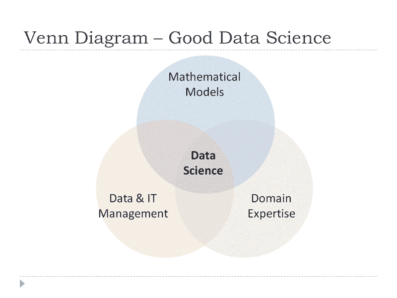

# 将数据科学作为职业(领域专长)

> 原文：<https://towardsdatascience.com/moving-into-data-science-as-a-career-domain-expertise-3e36cafad1e7?source=collection_archive---------9----------------------->

在几篇讨论有兴趣从事数据科学职业的人应该具备哪些知识的帖子([总体](https://goo.gl/hVFzdD)、[数学](https://goo.gl/tqtHng)、[数据& IT 管理](https://goo.gl/seZcef))之后，我现在将更多地讨论数据科学家应该具备哪些业务知识(领域知识)。

**1 —业务流程**

如今，每个企业或组织都有流程。这些流程始终保持高效和有效是至关重要的，尤其是那些面向客户的流程。

重要的是，数据科学家要从总体上理解这些过程以及它们是如何工作的。为什么这很重要？原因是，作为一家在数据科学方面成熟的公司，数据收集和模型实现通常会添加到业务流程中。数据科学家需要很好地理解这些业务流程是如何工作的，以便能够建议何时可以捕获某个数据元素以获得更好的质量，其次能够建议应该在业务流程中的何处放置模型，以便将模型需要的数据元素提供给模型，并且模型在流程的正确阶段生成“决策”。

例如，大多数信用记分卡需要信用局的数据。因此，在信贷申请过程中，必须将模型置于模型所需的申请人数据(尤其是申请人的信用局数据)可用于模型的阶段。该模型还应在决策阶段之前生成信用评分，因为它是一个关键的决策因素(即在决定是否授予信用时)。

由于这涉及到模型的实现，因此数据科学家必须对业务流程有很好的理解，以便为数据收集和模型实现提出可信的建议。

**2 —战略管理**

通常，数据科学家的见解需要转化为业务战略。例如，来自营销活动响应模型的洞察可用于确定哪些客户特征可能会对营销活动做出响应，并由此设计出能够触及这些客户群的合理活动。

因此，对于希望为组织提供价值的数据科学家来说，能够提供“可操作”的见解至关重要。对战略管理有很好的理解，有助于数据科学家了解什么样的见解会受到公司的高度重视，什么样的见解是可行的(也许是考虑到组织中可用的资源)，能够在提出可行的见解后思考接下来的步骤。能够战略性地思考有助于数据科学家通过提供可以采取行动的见解来持续提供价值。能够持续提供可操作且有价值的见解有助于建立可信度，因为人们更倾向于听取数据科学家提供的有用见解，而不是无法付诸行动的见解(即空话和可行的行动)。

**业务和收入模式**

[商业模式](https://en.wikipedia.org/wiki/Business_model)是一个组织如何服务于一个选定的市场，其竞争优势超过其他类似的竞争对手，而[收入模式](https://en.wikipedia.org/wiki/Revenue_model)将说明该组织如何继续从商业模式中获取价值/利润。

对于要为组织增加价值的数据科学家来说，了解组织的业务和收入模式(包括现在和未来)是至关重要的。有了一些了解，数据科学家就可以确定哪些业务目标是重要的，并能够提供支持重要业务目标的见解。这与为战略制定和执行提供相关见解的能力密切相关，以便组织能够继续运营、服务于所选市场并从中获取利润。

通过了解战略管理、业务模式和收入模式，数据科学家可以了解每个项目提供的价值量，从而能够提供可以采取行动的相关见解，因为这些见解是根据业务和收入模式改编的，所以它允许公司继续从他们的数据中提取价值，为推动组织中更多的数据科学或分析创造可持续的动力。

**3 —变更管理**

许多刚开始学习数据科学的人没有意识到数据科学家也是变革的推动者，因为我们提供的见解，变革是必要的，让我们面对它，人类不喜欢变革，但如果企业要在比几十年前更具活力的动态环境中生存，变革是必要的。

作为变革推动者的数据科学家，需要了解如何通过提供见解的过程来创造可持续的变革(即不会回到旧习惯)。数据科学家不能只是创建大量的信息/见解，然后将它们倾倒到组织中。有时，需要有一种有分寸的方法来发布见解和信息，以便能够做出有效的改变。

对于那些对变革管理感兴趣的人，我发现约翰·科特设计的流程是最好的流程之一。你可以在这里阅读维基百科关于变革管理[的文章。](https://en.wikipedia.org/wiki/Change_management)

**4 —特定领域**

随后，数据科学家需要具备的业务知识将与项目/分析所在的领域相关。例如，如果数据科学家在风险管理部门工作，则需要了解特定的业务定义、法规(尤其是银行、医疗保健、制药、航空)、会计政策和国际标准( [GAAP](https://en.wikipedia.org/wiki/Generally_Accepted_Accounting_Principles_(United_States)) 或 [IFRS](https://en.wikipedia.org/wiki/International_Financial_Reporting_Standards) )、流程等。这是数据科学家所在组织所特有的部分。

我在招聘实践中注意到的一件事是对拥有领域相关知识的员工的巨大偏好。这可能会严重限制组织能够获得的数据科学人才的供应。着眼于前景和劳动力，雇主将有更好的机会从数据科学中获得更多价值，方法是寻找那些数学能力强、能够将业务目标转换为数学模型的数据科学。根据我的观察，与编程和领域知识相比，这是一个更难找到或训练的技能。

**结论**

我的结论是，在我看来和观察中，数据科学新手应该知道、学习和理解的关键技能和知识是什么。

随着技术的变化，数据科学家的工作也将不断发展，知识和技能可能也需要相应更新，所以请继续学习！！

请务必访问我的[其他博客文章](https://medium.com/@koolanalytics)和 [LinkedIn 个人资料](https://www.linkedin.com/in/koopingshung/)以获取更多数据科学知识。

**补充说明:**作为我 2020 年新年计划的一部分，我已经建立了自己的网站，最新消息请访问[这里](http://koopingshung.com)。感谢支持！