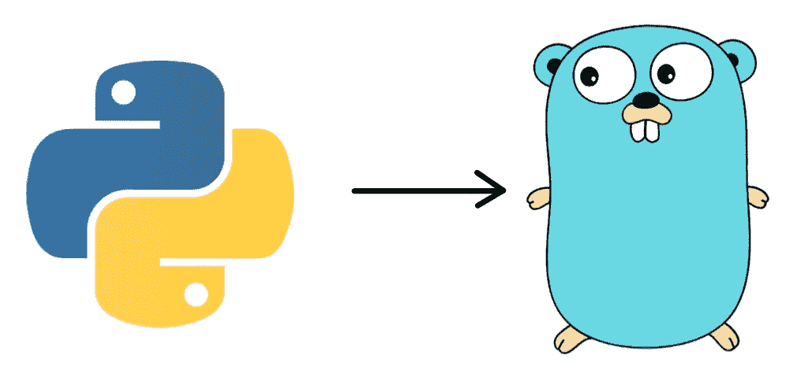
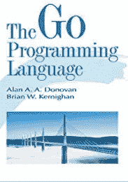
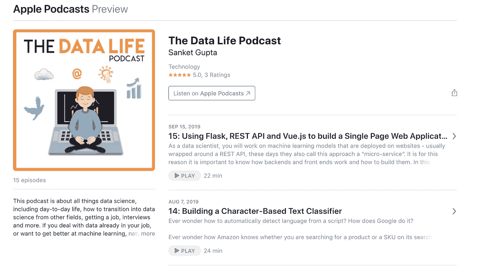

# 从 Python 迁移到 Go

> 原文：<https://towardsdatascience.com/moving-to-go-from-python-9ebbd9a8aec4?source=collection_archive---------5----------------------->

过去两年我一直在使用 Python，它在很多方面都是一种非常方便的语言。它可以用于 web 开发(使用 Flask 或 Django)、机器学习(使用 nltk 或 scikit-learn)、数据可视化(使用 seaborn 或 matplotlib)和深度学习(使用 TensorFlow、keras)。Python 是一种非常适合初学者的简洁的书面语言。然而，它也有局限性——例如速度不够快、GIL、动态类型和非内置并发支持。最近，我被要求拿起 Go 进行一个查询理解项目(我已经在我的[其他博客](https://medium.com/@sanket107)中写了这个)。



Moving from Python to Go

我对 Go 的第一印象是它有多罗嗦。铅字散落一地，没有课。已经掌握了一些 Python 语言，在 Go 中从头开始被证明是一个挑战。一些博客比较了 Python 和 Go，我将只关注语法部分。我听说过很多关于静态类型的东西，但我不知道我实际上是在做什么。事不宜迟，我们继续吧。

# 1.静态打字

令人惊讶的是 Python 对你隐藏了多少类型。你基本上是这样开始编写函数的:

```
def add_numbers(num1, num2):
     return num1 + num2 
```

现在你会期望这个函数的用户会给你发送两个整数，你可以把它们相加。但是，如果他们发送字符串呢？或者字典？对于字符串，这段代码仍然有效，但是“1”、“2”将返回“12”而不是 3。这可能会导致更复杂的程序出现许多令人痛苦的错误，这些程序可能很难调试 esp。因为 Python 只会在运行时告诉你这些。
在围棋中同样的程序是:

```
func add_numbers(num1 int, num2 int)int{
     return num1 + num2
}
```

我们不能向该函数发送两个字符串或其他数据类型。如果 Go 需要两个整数，它将确保调用这个函数的每一行都发送两个整数。当 Go 的二进制文件被编译时，这些问题就可以被捕捉到，而不是等到生产中的运行时——因此节省了很多问题！欢迎来到静态打字的魔力！

# 2.结构和 JSON 解析

对于任何数据科学项目来说，JSON 解析都是非常重要的。围棋没有课。它的传播方式是使用[结构](https://gobyexample.com/structs)以及接口和方法。对于像 Go 这样的静态类型语言来说，结构非常有用，因为结构预先明确了我们可以使用什么类型。让我们举一个例子:

```
{ "John" : {"id": 12345, "department": "Human Resources"},
  "Sarah": {"id": 3, "department": "Software Engineering"},
  "Omar": {"id": 145, "department": "Marketing"}
}
```

要从上面的 JSON 中获取所有雇员的姓名，Python 中的代码将是:

```
# Code in Python
import jsondef find_names():
   with open("example.json", "r") as outfile:
       data = json.load(outfile)
       names = [name for name, details in data.items()]
   return names
```

围棋中同样的代码是:

```
package mainimport (
     "fmt"
     "io/ioutil"
     "json"
)func find_names()[]string{
   type EmployeeDetails struct{
      Id string `json:"id"`
      Department string `json:"department"`
   } var employee_data map[string]EmployeeDetails // Go's dictionary
   data, _ := ioutil.ReadFile("example.json")
   err := json.Unmarshal(data, &employee_data) // Use of pointer
   if err!=nil{
      fmt.Println("error:", err) // Easy handling of errors
   } var names []string
   for name, _ := range employee_data{
     names = append(names, name)
   }
   return names
}
```

## Python 和 Go 在解析 JSON 方面的一些关键区别:

1.  在 Go 中，您需要**知道您在 JSON 中解析的每个字段的数据类型**。如果数据类型被混淆，Python 代码将保持不变，但是 Go 的代码将[随着`interface{}`和类型断言等的使用](https://medium.com/@nate510/dynamic-json-umarshalling-in-go-88095561d6a0)发生相当大的变化。Go 是一种强类型语言，在设计 API 时最好记住这一点。
2.  Go 提供了开箱即用的**错误处理**。如果 json 中的`Unmarshal`函数有问题，就会创建上面的`err`。在 Python 中，错误或异常处理更加谨慎，很容易被忽略。
3.  围棋中没有列表理解。Python 在这方面很容易使用，但是在 Go 中，每个片段都需要显式分配数据类型，代码也更加冗长。
4.  在 Go 中，**指针**允许用户明确控制是否要修改底层对象。在 Python 中，不清楚函数是就地修改传入的数据，还是使用数据的副本。在 Go 中，使用`&employee_data`可以清楚地表明我们想要修改底层变量。
5.  在 Go 中，**未使用的变量**和未使用的导入是不行的——不像 Python。它们需要被替换为`_`(下划线)。我觉得这使得代码可读性更好。

对于混合数据类型，您需要接口。此外，如果您不想使用 structs 来自动让 JSON 的`Unmarshal`遵循数据类型，您将需要几个类型断言，这两个我们将在接下来研究。

# 3.接口和类型断言

对于来自 Python 的我来说，接口是最棘手的部分。实际上，我更害怕指针，但是令人惊讶的是，到目前为止它们还可以，因为 Go 只是使用指针来给用户更多的变量控制。

虽然 Go 是一种强类型语言，但接口允许 Go 在数据类型上有一些模糊性。接口既可以是`type`也可以是`set of methods`。当你写一个以`interface{}`作为参数的函数时，你可以给这个函数提供任何值——这很棘手，因为这并不意味着任何类型。`interface{}`本身就是一个类型。阅读[该堆栈溢出讨论](https://stackoverflow.com/questions/23148812/whats-the-meaning-of-interface)以全面理解这一点。

```
func add_numbers(num1 interface{}, num2 interface{})interface{}{
    // num1 and num2 are of interface{} type only (not any type)
    // but any type can be converted to interface{} type
    // This is really tricky, esp. coming from Python world // Need type assertion to ensure types are as expected
    m := num1.(int)
    n := num2.(int)
    return m + n    // returns an integer
}
```

上面是一个使用`interface`作为类型的例子。`Interface`也可以作为`set of methods`为不同结构的变量提供方法。《以身作则》有一个[很好的例子](https://gobyexample.com/interfaces)。简而言之，`interface`可以用来收集与某些结构相关联的方法，比如针对`rect`或`circle`结构的`area()`或`perim()`。这就像 Python 中的类方法。

这些是我发现的 Python 和 Go 之间的一些主要区别。写 Go 代码让我重新思考如何写 Python，尤其是。我如何设计函数来接受类型和处理错误。

为了更好地学习围棋，很多人向我推荐了这本书[围棋编程语言书](https://www.amazon.com/Programming-Language-Addison-Wesley-Professional-Computing/dp/0134190440/?tag=omnilence-20):



[Go Programming Language Book](https://www.amazon.com/Programming-Language-Addison-Wesley-Professional-Computing/dp/0134190440/?tag=omnilence-20)

我可能会在未来的博客文章中涉及机器学习、自然语言处理和围棋数据可视化等主题。
**更新**2019 年 2 月:在一个新的视频课程中，我在 Go 中涵盖了机器学习、NLP、决策树、推荐系统等所有上述主题！[ [Udemy Link](https://www.udemy.com/hands-on-fundamentals-of-data-science-with-go/) ， [Packt Link](https://www.packtpub.com/big-data-and-business-intelligence/hands-fundamentals-data-science-go-video) ]请随意查看 Github 上的[公共代码库，其中涵盖了 Golang 中的 tweet bot、文本分类、推荐引擎等主题。](https://github.com/PacktPublishing/Hands-on-Fundamentals-of-Data-Science-with-Go)

附:看看我的新播客！我最近开始了一个名为“[数据生活播客](https://podcasts.apple.com/us/podcast/the-data-life-podcast/id1453716761)的新播客。如果你已经在工作中处理数据，或者想在机器学习、自然语言处理或信息检索方面做得更好，这就是适合你的播客。你可以在[苹果播客](https://itunes.apple.com/us/podcast/the-data-life-podcast/id1453716761?mt=2&uo=4)、 [Spotify](https://open.spotify.com/show/6xWi36lOBHpHRabi9eO1Bj) 或 [Anchor.fm](https://anchor.fm/the-data-life-podcast) 上听，或者在我最喜欢的播客应用之一:[阴天](https://overcast.fm/itunes1453716761/the-data-life-podcast)上听。



My New Podcast: [The Data Life Podcast](https://podcasts.apple.com/us/podcast/the-data-life-podcast/id1453716761)

祝你写 Go 代码一切顺利！