# MSE 和偏差-方差分解

> 原文：<https://towardsdatascience.com/mse-and-bias-variance-decomposition-77449dd2ff55?source=collection_archive---------0----------------------->

当我翻阅一些伟大的机器学习书籍时，如 [ISL](http://a.co/gr2tA71) 、 [ESL](http://a.co/eUPAFBx) 、 [DL](http://a.co/bTWXHcz) ，我对他们如何解释 MSE(均方误差)及其偏差-方差分解感到非常困惑。如果您想真正很好地掌握像过度拟合、欠拟合和模型容量这样的事情，偏差-方差分解是极其重要的。不幸的是，这些书要么放弃推导，要么在不同的上下文中给出，这令人困惑。在这里，我将给出两种最常见情况下的偏差-方差分解的完整推导:估计量的 MSE 和预测量的 MSE。

# 估计量的 MSE

*估计器*是数据样本上的任何函数，通常试图*估计*从中抽取样本的原始数据的一些有用质量。形式上，*估计量*是一个关于样本 ***S*** 的函数:

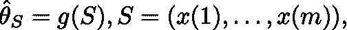

其中 ***x(i)*** 是从分布 ***D*** 中抽取的随机变量，即 ***x(i) ~ D*** 。

在统计学书籍中，通常可以方便地想象我们正在处理的数据是从某种分布中抽取的样本。想想股票市场，实际上我们只能每隔大约 10 毫秒监测一次股票价格，但实际上有一个隐藏的经济机器产生这些数据，由于其巨大的复杂性，我们无法观察到。这个机器描述了分布，我们观察到的数据是一个样本。

## 例子

我们想用这个样本来估计原始数据的一些有用的质量。例如，我们可能想知道 AAPL 股票的平均值，但由于我们无法掌握产生 AAPL 价格的整个经济机制，我们只能计算观察到的价格的平均值:

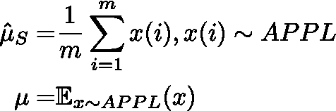

将是 AAPL 股票的*估计值* *均值*和 AAPL 股票的*真实均值*。注意*估计均值*是依赖于样本*的随机变量，样本也是随机变量，而**真实均值*是标量。**

**另一个例子是 AAPL 股票的*估计方差*:**

**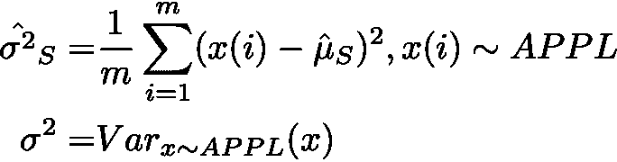**

**其中 ***σ*** 是 APPL 股票的*真实方差*。**

## **估计器属性**

**现在我们想知道我们的*估计量*有多好。有两个性质我们可以考虑: ***估计量偏差*** 和 ***估计量方差*** 。**

*****估计偏差*** 衡量我们的*估计器*在*估计*真实值时有多好。这是一个简单的区别:**

**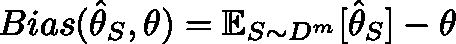**

*****估计量方差*** 衡量我们的*估计量*对采样的“跳动”程度，例如，如果我们每 100 毫秒而不是每 10 毫秒观察一次股票价格，估计量会有很大变化吗？**

**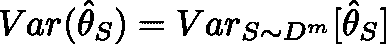**

## **例子**

**如果我们假设 AAPL 股票价格的实际分布是一个*高斯分布*，那么*估计量的偏差为零，意味着它是无偏的:***

***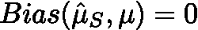***

***可惜 ***σ*** 的估计量的偏差不为零，是有偏差的:***

**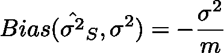**

**顺便说一下，这就是为什么下面的*无偏估计量*在文献中更常用:**

**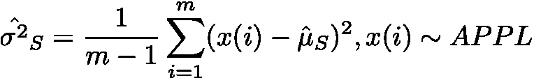**

**这些公式的证明见 [DL](http://a.co/bTWXHcz) 书中的第 5 章。**

## **估计量的偏差-方差分解**

**偏差-方差分解只是将我们最喜欢的两个属性统一在一个公式中:**

**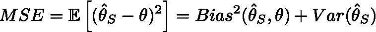**

**其中期望值是相对于 ***S*** 随机变量取的。**

**这就是证据:**

**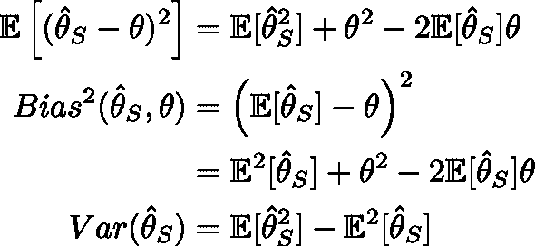**

**这里我们使用了这样一个事实，即 ***θ*** 不是一个随机变量，因此它对于任何分布都等于它自己的期望。**

# **预测值的 MSE**

**这个统计说够了，我们来谈谈机器学习吧！:)在上一节中，我们看到了如何使用*估计器*来估计数据的一些有用质量。在一个例子中，我们能够通过仅每 10ms 观察其值来估计 APPL 股票的*均值*和*方差*。**

**现在我们想赚点钱，在股票市场交易！我们需要建立一个模型，让*从现有数据 ***x*** 中预测*这只股票的未来价值 ***y*** 。这些可用的数据可以是销售数字、过去 5 天的股票价值、公告、产品发布等。所以我们建立了一个模型来描述我们的股票价格:**

*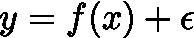*

*我们假设 ***f*** 是对我们隐藏的决定股票价格的真实模型， ***ϵ*** 是一些讨厌的观察噪声。我们想得出一个尽可能接近 ***f*** 的*预测器*。预测器在训练数据的一些样本 ***S*** 上被训练，但是我们希望它在我们还没有观察到的数据上表现良好。因此，我们希望以下内容尽可能小:*

**

*其中 ***(x，y)*** 是代表未观测数据的随机变量。 ***S*** 是我们训练预测器的数据， ***ϵ*** 是遵循某种分布 ***E*** 的噪声。注意，我们未观察到的(通常称为测试数据)与训练数据 ***S*** 中的点具有相同的分布。在 ML 中，让训练和测试数据来自同一个分布通常是非常重要的。*

*因为预测器的 MSE 也有偏差-方差分解。我们在这里推导一下。我们将使用以下公式:*

*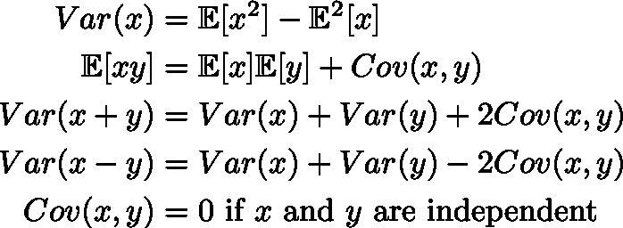*

*下面所有的期望、方差和协方差都是通过 ***(x，y)*** 、 ***S*** 、和 ***ϵ*** 随机变量计算的。*

*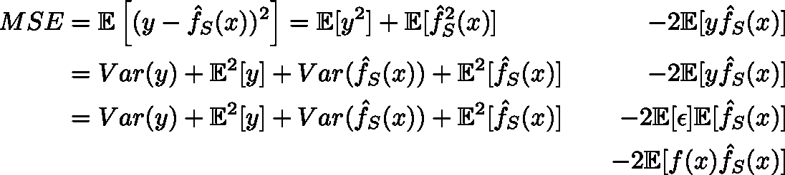*

*这里我们假设我们的噪声*是独立于****s******【x，y】***的随机变量。***

**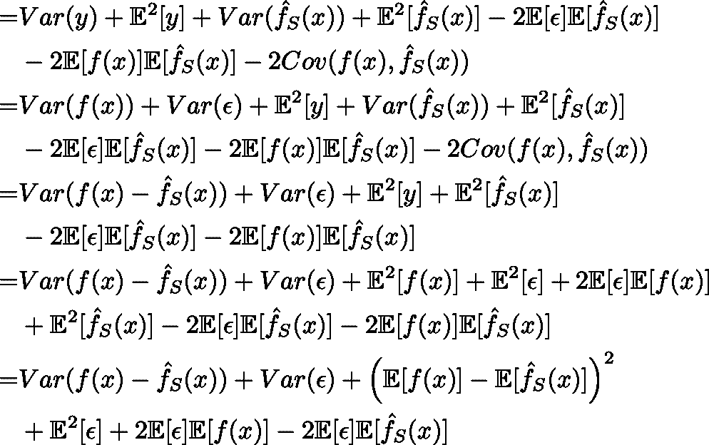**

**现在我们将假设噪声 ***ϵ*** 具有零均值。如果平均值不是零，而是某个常数 ***c*** ，那么我们可以将该常数包含在我们的模型中的 ***f(x)*** 中，并认为该噪声具有零平均值。**

**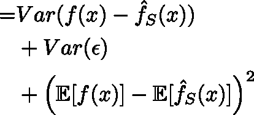**

**第一项通常称为 ***方差*** 。它显示了*真实模型*和*预测模型*之间的差距是如何“跳动”的，这取决于训练数据*和测试数据 ***(x，y)*** 。容量大的模型(如极多层的神经网络)方差*高，容量小的模型(如想线性回归)方差*低。*****

***第二个名词是 ***噪音*** 。它显示了观测噪声的影响。它不依赖于任何东西，只依赖于噪声的基本分布。我们无法减少这种噪音，它是不可减少的。***

**第三项是平方 ***偏差*** 。它显示了我们的预测器是否很好地逼近真实模型。高容量机型 ***偏置*** 低容量机型 ***偏置*** 。**

**既然 ***偏差*** 和 ***方差*** 都对 MSE 有贡献，好的模型就尽量减少这两者。这被称为偏差-方差权衡。**

# **这其实是一回事**

**正如你可能从公式中注意到的，估算器的 *MSE 和预测器*的 *MSE 非常相似。估计量*的 MSE 测量我们的 ***估计量*** 与期望量 ***θ*** 的接近程度。*预测器*的 MSE 测量我们的函数 ***预测器*** 在某些函数空间中与期望的函数 ***f*** 有多接近，其中我们测量两个函数之间的距离作为 L2 距离，这实际上是人们可以在函数空间中定义两个函数之间的距离的许多方法之一。**

**在**预测器的 MSE***部分，我们也引入了误差，但是在 **MSE 中，估计器的 MSE**部分也会有误差。在我们的股票例子中，这相当于我们对股票的观察被一些噪音扭曲了。***

***在 [DL](http://a.co/bTWXHcz) 书中找*估计量*被称为*点估计*，因为 ***θ*** 是正则空间中的一个点。而寻找*预测器*被称为*函数估计*是因为 ***f*** 是函数空间中的函数。***

# **P.S .混淆的来源**

**对于试图理解偏差-方差分解的人来说，基本上有两个混淆的来源。**

**第一个是，书籍喜欢修正一些随机变量，只计算关于*或 ***ϵ*** 的期望。它允许他们写出更短的公式。***

**第二个原因来自于这样一个事实，即从高层次的观点来看，MSE 估计量和预测量的 MSE 在技术上是一样的，在解释偏差-方差分解时，书籍喜欢将它们交替混合。**