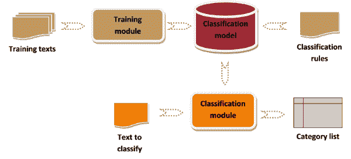
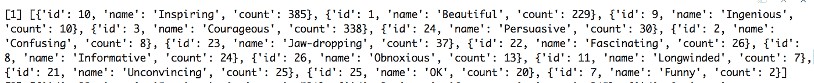
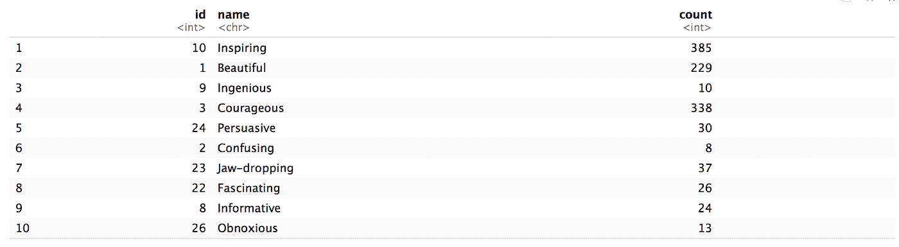
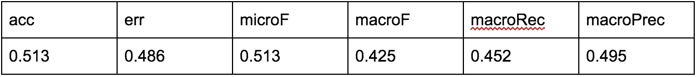

# 基于 R 的文本多类分类

> 原文：<https://towardsdatascience.com/multi-class-classification-in-text-using-r-e6cf72ef1da3?source=collection_archive---------5----------------------->

## 预测 Ted 演讲的收视率


Photo by [Hermes Rivera](https://unsplash.com/@hermez777?utm_source=medium&utm_medium=referral) on [Unsplash](https://unsplash.com?utm_source=medium&utm_medium=referral)

这个博客是我的 NLP 博客系列的延续。在之前的博客中，我讨论了 R 中的[数据预处理步骤](https://medium.com/@shubhanshugupta/data-preprocessing-in-r-2f0e25487bb)和[识别 ted 演讲中的情绪](https://medium.com/datadriveninvestor/emotions-in-ted-talks-text-analytics-in-r-1b6016f3316e)。在这个博客中，我将预测观众对 ted 演讲的评价。这将需要多类分类和相当多的数据清理和预处理。我们将在下面详细讨论每个步骤。

所以，让我们开始吧！



A way to visualize text classification

## 数据清理和解析

[ted 演讲数据集](https://www.kaggle.com/rounakbanik/ted-talks)中的评级栏看起来像`Figure 1`。



Figure 1

上面这个栏目的截图，`Figure 1`表示有多少人认为一个特定的演讲是“鼓舞人心的”、“漂亮的”、“有创意的”、“有说服力的”等等。JSON 中的 count 键表示给予谈话的评分值。例如，这个演讲被 385 个人评为“鼓舞人心”，只有 2 个人认为这个演讲“有趣”。在这里，我们的目标是获得每次谈话的最高评分。

其中一个主要问题是解析 ratings 列。我已经使用了 *gsub* 函数来用双引号替换单引号。我在这里找到了关于*gsub*的细节和解释。

```
library(jsonlite)formatted_ted_ratings <- gsub(“‘“,’”’,ted_talks$ratings)
```

下一步是解析 JSON 以获得 id、评级名称和评级计数的列表。R 中的 *jsonlite* 库提供了流、验证和美化 JSON 数据的功能。 [fromJSON 函数](https://www.rdocumentation.org/packages/RJSONIO/versions/1.3-0/topics/fromJSON)用于将 JSON 对象反序列化为 R 对象。最后， *purrr::map* 函数将一个函数(在我们的例子中是 fromJSON)应用于列表中的每个元素。文档和实现可以在这里阅读[。](https://jennybc.github.io/purrr-tutorial/ls01_map-name-position-shortcuts.html)

```
ted_ratings <- purrr::map(formatted_ted_ratings, jsonlite::fromJSON)
```

上面的代码块为我们提供了一个经过解析的评级列的简洁列表。看起来像`Figure 2`。



Figure 2: Parsed rating column

在下一步中，我将创建一个新的列“highest_rating ”,在其中我将存储每次谈话的最高评分。发布后，我会将该列转换为因子，这将有效地给我们 13 个独特的因素(评级)来处理。我希望，到目前为止，您一定已经得到了一个提示，这个具有 13 个因子变量的最高评级列将用于多类分类。在这种意义上，二元分类问题有两个类别来分类数据点，例如真和假。然而，在这个问题中，我们必须将数据点分类到 13 个类别中的一个，因此，这是一个多类别分类问题。

```
for (i in (1:length(ted_ratings))) {
 ted_ratings_df <- ted_ratings[[i]]
 highest_rating_count <- ted_ratings_df[which(ted_ratings_df$count == max(ted_ratings_df$count)), ]
 ted_talks$highest_rating[i] <- highest_rating_count$name
}ted_talks$highest_rating = as.factor(ted_talks$highest_rating)
```

完成以上步骤后，我们的数据集准备工作就完成了。

## 数据建模

我们现在将数据集分为训练和测试。我以 60:40 的比例划分了我的数据集。

```
trainObs <- sample(nrow(ted_talks), .6 * nrow(ted_talks), replace = FALSE)
testObs <- sample(nrow(ted_talks), .4 * nrow(ted_talks), replace = FALSE)train_dat <- ted_talks[trainObs,]
test_dat <- ted_talks[testObs,]
```

我现在将所有预处理步骤应用于我的训练和测试数据(分别)。不知何故，我处于双重心态:是将 DTM 分成训练和测试，还是分割数据集，然后分别准备他们的 DTM。不知何故，我选择了后者。你可以试试前一种选择，如果它对你合适，请告诉我。

我还处理了稀疏性，我在我的博客中详细讨论了这个问题。为了更直观，我还将目标变量重命名为“y ”,而不是 highest_rating。

```
train_corpus <- VCorpus(VectorSource(train_dat$transcript))##Removing Punctuation
train_corpus <- tm_map(train_corpus, content_transformer(removePunctuation))##Removing numbers
train_corpus <- tm_map(train_corpus, removeNumbers)##Converting to lower case
train_corpus <- tm_map(train_corpus, content_transformer(tolower))##Removing stop words
train_corpus <- tm_map(train_corpus, content_transformer(removeWords), stopwords(“english”))##Stemming
train_corpus <- tm_map(train_corpus, stemDocument)##Whitespace
train_corpus <- tm_map(train_corpus, stripWhitespace)# Create Document Term Matrix
dtm_train <- DocumentTermMatrix(train_corpus)train_corpus <- removeSparseTerms(dtm_train, 0.4)dtm_train_matrix <- as.matrix(train_corpus)
dtm_train_matrix <- cbind(dtm_train_matrix, train_dat$highest_rating)colnames(dtm_train_matrix)[ncol(dtm_train_matrix)] <- “y”training_set_ted_talk <- as.data.frame(dtm_train_matrix)
training_set_ted_talk$y <- as.factor(training_set_ted_talk$y)
```

现在我们已经准备好了训练数据集，我们可以训练我们的模型了。我在 caret 中使用了 *caret* 包和 *svmLinear3* 方法。 *svmLinear3* 为 SVM 的 *L2 正则化*提供*线性核*。同意，这是很多技术术语，我故意不在这里解释，因为这完全是另一个博客。同时，我会留下一些链接让你们了解 [*L2 正则化*](https://developers.google.com/machine-learning/crash-course/regularization-for-simplicity/l2-regularization) ，以及 [*带线性核的 SVM*](https://www.svm-tutorial.com/2014/10/svm-linear-kernel-good-text-classification/)。

```
library(caret)review_ted_model <- train(y ~., data = training_set_ted_talk, method = ‘svmLinear3’)Preparing our test data. It’s the same repetitive procedure.test_corpus <- VCorpus(VectorSource(test_dat$transcript))##Removing Punctuation
test_corpus <- tm_map(test_corpus, content_transformer(removePunctuation))##Removing numbers
test_corpus <- tm_map(test_corpus, removeNumbers)##Converting to lower case
test_corpus <- tm_map(test_corpus, content_transformer(tolower))##Removing stop words
test_corpus <- tm_map(test_corpus, content_transformer(removeWords), stopwords(“english”))##Stemming
test_corpus <- tm_map(test_corpus, stemDocument)##Whitespace
test_corpus <- tm_map(test_corpus, stripWhitespace)# Create Document Term Matrix
dtm_test <- DocumentTermMatrix(test_corpus)test_corpus <- removeSparseTerms(dtm_test, 0.4)dtm_test_matrix <- as.matrix(test_corpus)
```

## 模型准确性和其他指标

现在，我将根据测试数据检查我们的模型的准确性/性能。

```
#Build the prediction 
model_ted_talk_result <- predict(review_ted_model, newdata = dtm_test_matrix)check_accuracy <- as.data.frame(cbind(prediction = model_ted_talk_result, rating = test_dat$highest_rating))library(dplyr)
check_accuracy <- check_accuracy %>% mutate(prediction = as.integer(prediction) — 1)check_accuracy$accuracy <- if_else(check_accuracy$prediction == check_accuracy$rating, 1, 0)
round(prop.table(table(check_accuracy$accuracy)), 3)library(performanceEstimation)
classificationMetrics(as.integer(test_dat$highest_rating), model_ted_talk_result)most_common_misclassified_ratings = check_accuracy %>% filter(check_accuracy$accuracy == 0) %>%
 group_by(rating) %>%
 summarise(Count = n()) %>%
 arrange(desc(Count)) %>%
 head(3)##Most commong missclassified rating
levels(train_dat$highest_rating)[most_common_misclassified_ratings$rating]
```

模型指标包括:



Model metrics

前三个最常见的**错误分类**评级是:“鼓舞人心的”、“信息丰富的”、“引人入胜的”。你可以从[这里](https://blog.revolutionanalytics.com/2016/03/com_class_eval_metrics_r.html#macro)和[这里](https://datascience.stackexchange.com/questions/15989/micro-average-vs-macro-average-performance-in-a-multiclass-classification-settin/16001)阅读更多关于*微观*和*宏观 F1 分数*。

## 结束语

在本文中，我们讨论了文本的多类分类。对我来说，解决这个数据问题相当具有挑战性，主要是因为:

*   我现在只处理二元分类问题
*   数据操作步骤导致每个单独的评级列的 13 个类。单引号破坏了看起来完美的 JSON 专栏。在没有任何直觉的情况下，找出单引号引起的问题是非常困难的。我最终设法用 gsub 解析了它。

最后，上面的模型分数严重依赖于我们在训练方法中使用的方法。我使用线性核 SVM 和 L2 正则化，这本身是计算量很大。您可以尝试其他方法，但是计算资源可能是一个问题。请让我知道你用的其他方法和你得到的分数(准确性和 F1)。

目前就这些。我将在下一篇博客中讨论一个与 NLP 相关的新任务。我也写过其他与软件工程相关的[帖子](https://medium.com/@shubhanshugupta/engineering-challenges-of-streaming-a-million-concurrent-json-data-streams-from-product-to-crm-360506b29aca)。你可能想在这里查看它们[。](https://shubhanshugupta.com/blog/)