# 多类文本分类模型的比较与选择

> 原文：<https://towardsdatascience.com/multi-class-text-classification-model-comparison-and-selection-5eb066197568?source=collection_archive---------0----------------------->


Photo credit: Pixabay

## 自然语言处理，word2vec，支持向量机，词袋，深度学习

当使用给定的数据集处理[监督机器学习](https://en.wikipedia.org/wiki/Supervised_learning)问题时，我们尝试不同的算法和技术来搜索模型以产生一般假设，然后对未来实例做出最准确的预测。相同的原理适用于文本(或文档)分类，其中有许多模型可用于训练文本分类器。[问题“我应该用什么机器学习模型”的答案总是“视情况而定”即使是最有经验的数据科学家也无法在试验之前判断哪种算法的性能最佳](https://docs.microsoft.com/en-us/azure/machine-learning/studio/algorithm-choice)。

这就是我们今天要做的:使用我们在以前的文章(以及更多)中介绍的关于文本分类的所有内容，并在我们训练的文本分类模型之间进行比较，以便为我们的问题选择最准确的模型。

# 数据

我们使用的是堆栈溢出问题和标签的相对较大的数据集。这些数据可以在[的 Google BigQuery](https://bigquery.cloud.google.com/dataset/bigquery-public-data:stackoverflow) 中找到，也可以在这个云存储 URL 上公开获得:[https://Storage . Google APIs . com/tensor flow-workshop-examples/stack-overflow-data . CSV](https://storage.googleapis.com/tensorflow-workshop-examples/stack-overflow-data.csv)。

# 探索数据

explore

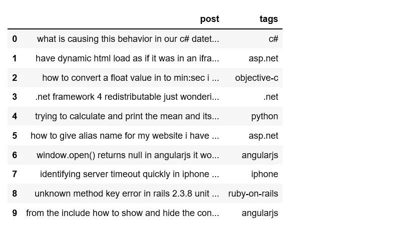

Figure 1

***10276752***

我们的数据中有超过 1000 万个单词。

```
my_tags = ['java','html','asp.net','c#','ruby-on-rails','jquery','mysql','php','ios','javascript','python','c','css','android','iphone','sql','objective-c','c++','angularjs','.net']
plt.figure(figsize=(10,4))
df.tags.value_counts().plot(kind='bar');
```

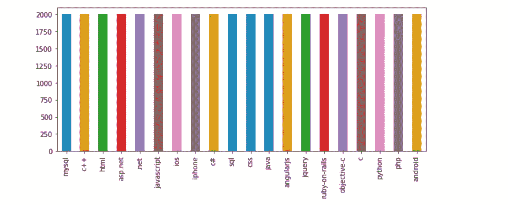

Figure 2

班级非常平衡。

我们想看看一些帖子和标签对。

```
def print_plot(index):
    example = df[df.index == index][['post', 'tags']].values[0]
    if len(example) > 0:
        print(example[0])
        print('Tag:', example[1])print_plot(10)
```


Figure 3

```
print_plot(30)
```

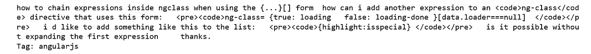

Figure 4

如你所见，文本需要清理。

# 文本预处理

到目前为止，我们看到的文本清理技术在实践中非常有效。根据您可能遇到的文本类型，可能需要包括更复杂的文本清理步骤。但是请记住，我们添加的步骤越多，文本清理需要的时间就越长。

对于这个特定的数据集，我们的文本清理步骤包括 HTML 解码、删除停用词、将文本改为小写、删除标点符号、删除不良字符等等。

clean_text

现在我们可以看看一个干净的帖子:

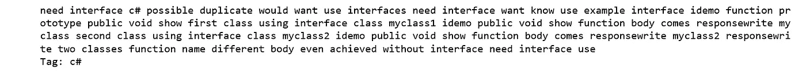

Figure 5

好多了。

```
df['post'].apply(lambda x: len(x.split(' '))).sum()
```

***3421180***

在文本清理和删除停用词后，我们只有 300 多万个单词可以使用！

分割数据集后，接下来的步骤包括特征工程。我们将把文本文档转换成令牌计数矩阵(CountVectorizer)，然后将计数矩阵转换成规范化的 tf-idf 表示(tf-idf transformer)。之后，我们从 [Scikit-Learn 库](http://scikit-learn.org/stable/)中训练几个分类器。

```
X = df.post
y = df.tags
X_train, X_test, y_train, y_test = train_test_split(X, y, test_size=0.3, random_state = 42)
```

# **多项式模型的朴素贝叶斯分类器**

有了我们的特征之后，我们可以训练一个分类器来预测一篇文章的标签。我们将从一个[朴素贝叶斯](http://scikit-learn.org/stable/modules/naive_bayes.html#naive-bayes)分类器开始，它为这个任务提供了一个很好的基线。`scikit-learn`包括该分类器的几种变体；最适合文本的是多项式变量。

为了使矢量器= >转换器= >分类器更容易使用，我们将在 Scilkit-Learn 中使用`Pipeline`类，它的行为类似于一个复合分类器。

nb

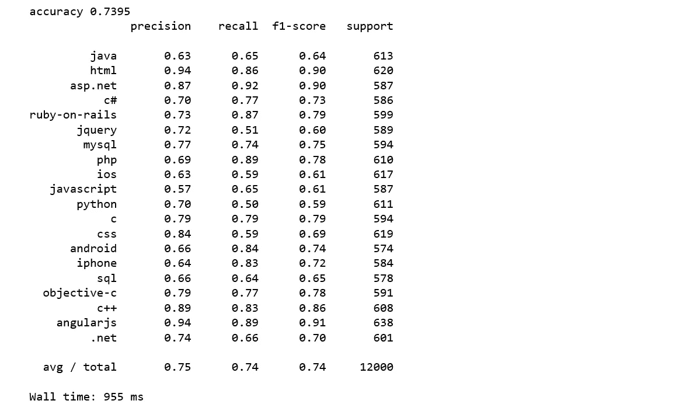

Figure 6

我们达到了 74%的准确率。

# **线性支持向量机**

[线性支持向量机](http://scikit-learn.org/stable/modules/svm.html#svm)被广泛认为是最好的文本分类算法之一。

svm


Figure 7

我们获得了 79%的更高准确率，比朴素贝叶斯提高了 5%。

# 逻辑回归

Logistic 回归是一种简单易懂的分类算法，可以很容易地推广到多个类。

logreg

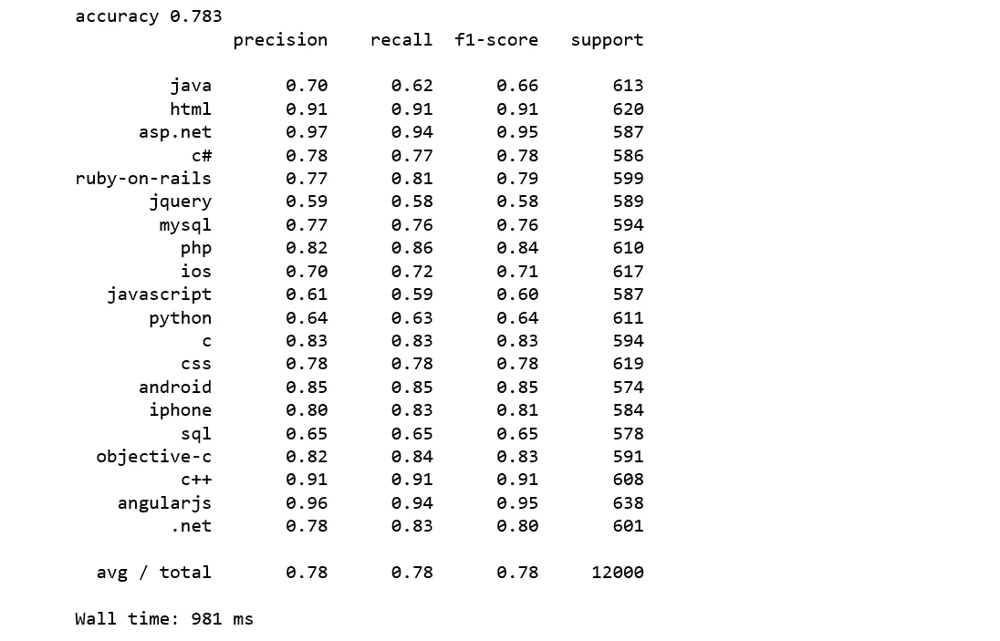

Figure 8

我们达到了 78%的准确率，比朴素贝叶斯高 4%，比 SVM 低 1%。

正如你所看到的，遵循一些非常基本的步骤并使用一个简单的线性模型，我们能够在这个多类文本分类数据集上达到高达 79%的准确率。

使用相同的数据集，我们将尝试一些高级技术，如单词嵌入和神经网络。

现在，让我们尝试一些复杂的功能，而不仅仅是简单地计算单词。

# Word2vec 和逻辑回归

[Word2vec](https://en.wikipedia.org/wiki/Word2vec) 和 [doc2vec](https://medium.com/scaleabout/a-gentle-introduction-to-doc2vec-db3e8c0cce5e) 一样，属于文本预处理阶段。特别是将文本转换成一行数字的部分。Word2vec 是一种映射类型，它允许具有相似含义的单词具有相似的向量表示。

Word2vec 背后的想法相当简单:我们希望使用周围的单词，用神经网络来表示目标单词，神经网络的隐藏层对单词表示进行编码。

首先，我们加载一个 word2vec 模型。它已经由谷歌在一个[1000 亿字的谷歌新闻语料库](https://drive.google.com/file/d/0B7XkCwpI5KDYNlNUTTlSS21pQmM/edit)上进行了预训练。

```
from gensim.models import Word2Vecwv = gensim.models.KeyedVectors.load_word2vec_format("GoogleNews-vectors-negative300.bin.gz", binary=True)
wv.init_sims(replace=True)
```

我们可能想要探索一些词汇。

```
from itertools import islice
list(islice(wv.vocab, 13030, 13050))
```

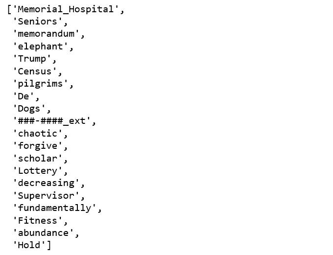

Figure 9

基于 BOW 的方法，包括平均、求和、加权加法。常见的方法是对两个字向量进行平均。因此，我们将遵循最常见的方式。

word_averaging

我们将对文本进行标记化，并将标记化应用于“post”列，并将单词向量平均应用于标记化的文本。

w2v_tokenize_text

是时候看看逻辑回归分类器在这些单词平均文档特征上的表现了。

```
from sklearn.linear_model import LogisticRegression
logreg = LogisticRegression(n_jobs=1, C=1e5)
logreg = logreg.fit(X_train_word_average, train['tags'])
y_pred = logreg.predict(X_test_word_average)
print('accuracy %s' % accuracy_score(y_pred, test.tags))
print(classification_report(test.tags, y_pred,target_names=my_tags))
```

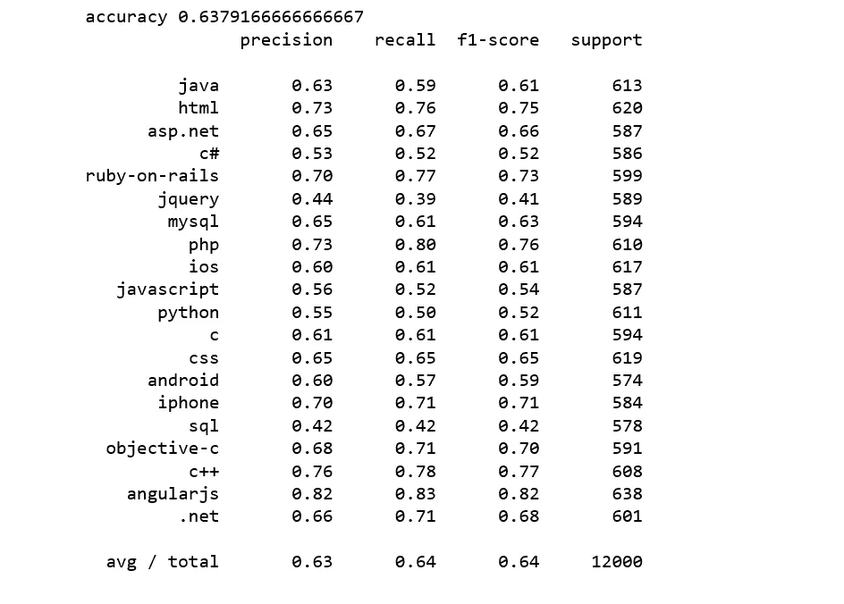

Figure 10

这很令人失望，是我们迄今为止看到的最糟糕的一次。

# **Doc2vec 和 Logistic 回归**

word2vec 的相同想法可以扩展到文档，我们不是学习单词的特征表示，而是学习句子或文档的特征表示。为了对一个 [word2vec](https://en.wikipedia.org/wiki/Word2vec) 有个大概的了解，可以把它想象成文档中所有单词的单词向量表示的数学平均值。 [Doc2Vec](https://medium.com/scaleabout/a-gentle-introduction-to-doc2vec-db3e8c0cce5e) 扩展了 [word2vec](https://en.wikipedia.org/wiki/Word2vec) 的概念，然而单词只能捕捉这么多，有时我们需要文档之间的关系，而不仅仅是单词。

为我们的堆栈溢出问题和标签数据训练 doc2vec 模型的方式与我们用 Doc2vec 和逻辑回归训练[多类文本分类时非常相似。](/multi-class-text-classification-with-doc2vec-logistic-regression-9da9947b43f4)

首先，我们给句子贴上标签。 [Gensim 的 Doc2Vec](https://radimrehurek.com/gensim/models/doc2vec.html) 实现要求每个文档/段落都有一个与之关联的标签。我们通过使用`TaggedDocument`方法来做到这一点。格式为“TRAIN_i”或“TEST_i ”,其中“I”是帖子的虚拟索引。

label_sentences

根据 [Gensim doc2vec 教程](https://github.com/RaRe-Technologies/gensim/blob/ca0dcaa1eca8b1764f6456adac5719309e0d8e6d/docs/notebooks/doc2vec-IMDB.ipynb)，它的 doc2vec 类是针对整个数据进行训练的，我们也会这样做。让我们看看带标签的文档是什么样子的:

```
all_data[:2]
```

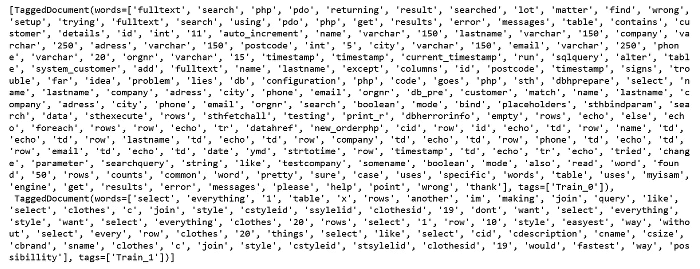

Figure 11

当训练 doc2vec 时，我们将改变以下参数:

*   `dm=0`，使用分布式单词包(DBOW)。
*   `vector_size=300`，300 个向量维特征向量。
*   `negative=5`，指定要抽取多少个“干扰词”。
*   `min_count=1`，忽略总频率低于此的所有单词。
*   `alpha=0.065`，初始学习率。

我们初始化模型并训练 30 个时期。

train_doc2vec

接下来，我们从训练好的 doc2vec 模型中获取向量。

get_vectors

最后，我们得到一个由 doc2vec 特征训练的逻辑回归模型。

```
logreg = LogisticRegression(n_jobs=1, C=1e5)
logreg.fit(train_vectors_dbow, y_train)
logreg = logreg.fit(train_vectors_dbow, y_train)
y_pred = logreg.predict(test_vectors_dbow)
print('accuracy %s' % accuracy_score(y_pred, y_test))
print(classification_report(y_test, y_pred,target_names=my_tags))
```

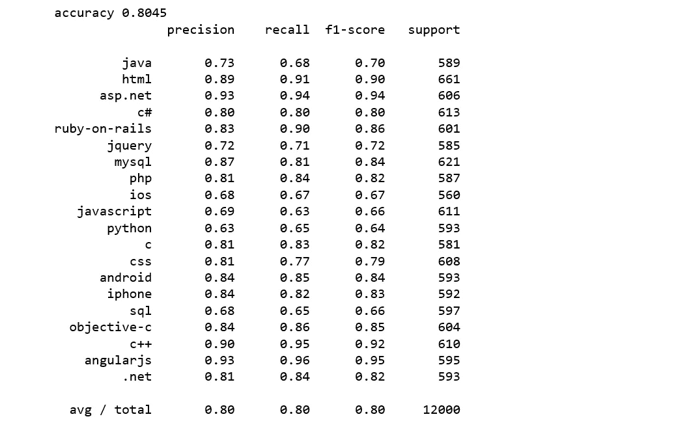

Figure 12

我们达到了 80%的准确率，比 SVM 高出 1%。

# 用 Keras 鞠躬

最后，我们将使用 Python 深度学习库 [Keras](https://keras.io/) 进行文本分类。

下面的代码很大程度上取自谷歌的一个研讨会。过程是这样的:

*   将数据分成训练集和测试集。
*   使用`tokenizer`方法来统计我们词汇中的独特单词，并给每个单词分配索引。
*   调用`fit_on_texts()`自动创建我们词汇表的单词索引查找。
*   我们通过向记号赋予器传递一个`num_words`参数来限制我们的词汇到顶部的单词。
*   有了我们的标记器，我们现在可以使用`texts_to_matrix`方法来创建训练数据，我们将通过我们的模型。
*   我们给我们的模型输入一个热点向量。
*   将我们的特征和标签转换成 Keras 可以读取的格式后，我们就可以构建我们的文本分类模型了。
*   当我们构建模型时，我们需要做的就是告诉 Keras 我们的输入数据、输出数据的形状，以及每一层的类型。keras 会照看剩下的。
*   在训练模型时，我们将调用`fit()`方法，向它传递我们的训练数据和标签、批量大小和时期。

keras_training

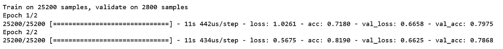

Figure 13

精确度为:

```
score = model.evaluate(x_test, y_test,
                       batch_size=batch_size, verbose=1)
print('Test accuracy:', score[1])
```

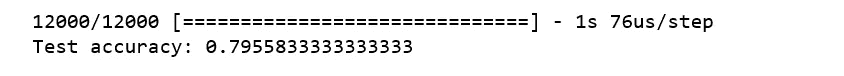

Figure 14

那么，哪个模型最适合这个特定的数据集呢？我将让你来决定。

[Jupyter 笔记本](https://github.com/susanli2016/NLP-with-Python/blob/master/Text%20Classification%20model%20selection.ipynb)可以在 [Github](https://github.com/susanli2016/NLP-with-Python/blob/master/Text%20Classification%20model%20selection.ipynb) 上找到。祝你有丰富的一天！

参考资料:

[https://github . com/RaRe-Technologies/movie-plots-by-genre/blob/master/ipynb _ with _ output/Document % 20 class ification % 20 with % 20 word % 20 embedding % 20 tutorial % 20-% 20 with % 20 output . ipynb](https://github.com/RaRe-Technologies/movie-plots-by-genre/blob/master/ipynb_with_output/Document%20classification%20with%20word%20embeddings%20tutorial%20-%20with%20output.ipynb)

[https://github . com/tensor flow/workshop/blob/master/extras/keras-bag-of-words/keras-bow-model . ipynb](https://github.com/tensorflow/workshops/blob/master/extras/keras-bag-of-words/keras-bow-model.ipynb)

[https://data science . stack exchange . com/questions/20076/word 2 vec-vs-sentence 2 vec-vs-doc 2 vec](https://datascience.stackexchange.com/questions/20076/word2vec-vs-sentence2vec-vs-doc2vec)