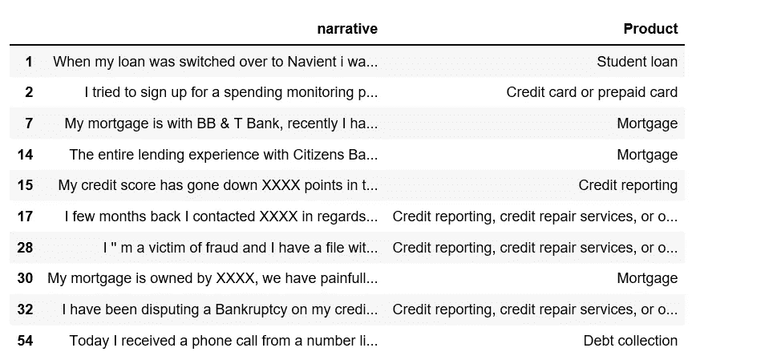
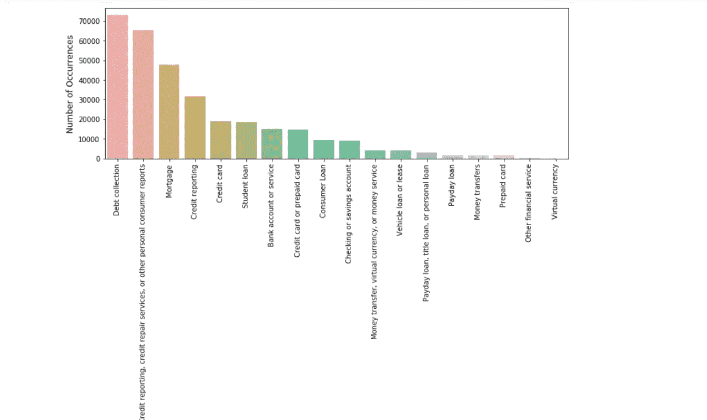
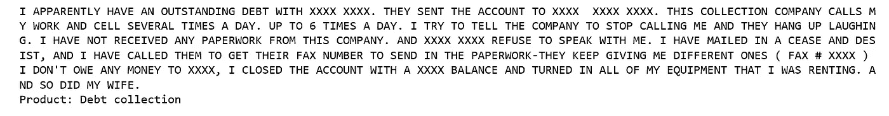
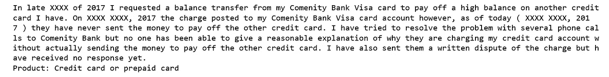
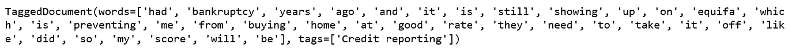
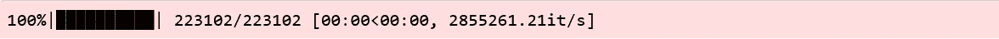
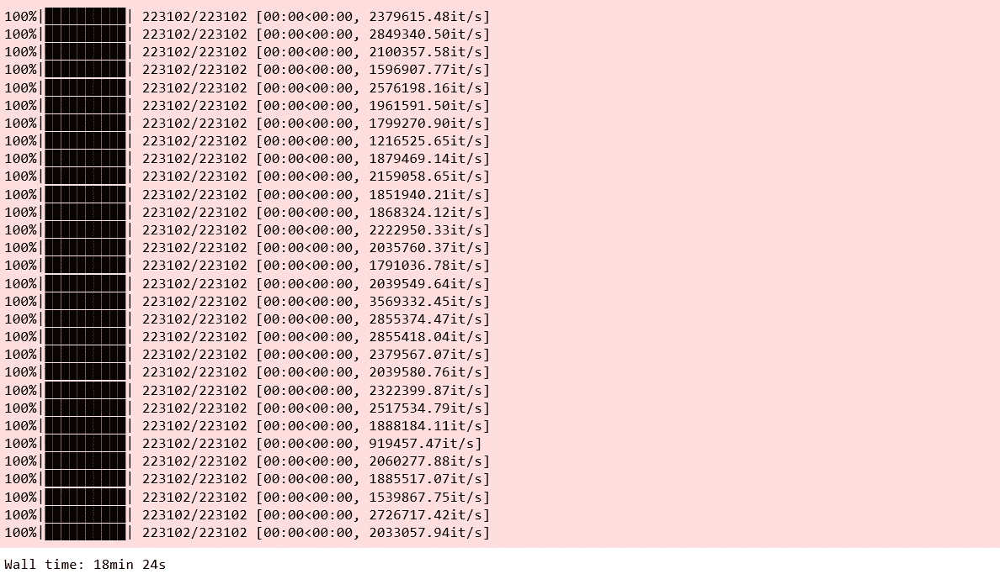
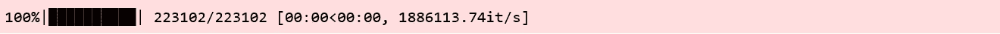
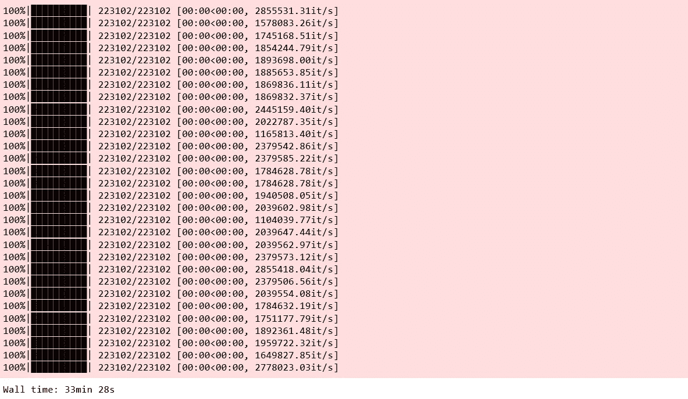

# 基于 Doc2Vec 和 Logistic 回归的多类文本分类

> 原文：<https://towardsdatascience.com/multi-class-text-classification-with-doc2vec-logistic-regression-9da9947b43f4?source=collection_archive---------1----------------------->


Photo credit: Pexels

## 目标是使用 Doc2Vec 和逻辑回归将消费者金融投诉分为 12 个预定义的类别

[Doc2vec](https://cs.stanford.edu/~quocle/paragraph_vector.pdf) 是一个 [NLP](https://en.wikipedia.org/wiki/Natural_language_processing) 工具，用于将文档表示为一个向量，并且是 [word2vec](https://en.wikipedia.org/wiki/Word2vec) 方法的推广。

为了理解 doc2vec，最好理解 word2vec 方法。然而，完整的数学细节超出了本文的范围。如果您不熟悉 word2vec 和 doc2vec，以下资源可以帮助您入门:

*   [单词和短语的分布式表示及其组合性](https://papers.nips.cc/paper/5021-distributed-representations-of-words-and-phrases-and-their-compositionality.pdf)
*   [句子和文档的分布式表示](https://cs.stanford.edu/~quocle/paragraph_vector.pdf)
*   [对 Doc2Vec 的温和介绍](https://medium.com/scaleabout/a-gentle-introduction-to-doc2vec-db3e8c0cce5e)
*   [关于 IMDB 情感数据集的 Gensim Doc2Vec 教程](https://github.com/RaRe-Technologies/gensim/blob/3c3506d51a2caf6b890de3b1b32a8b85f7566ca5/docs/notebooks/doc2vec-IMDB.ipynb)
*   [带单词嵌入的文档分类教程](https://github.com/RaRe-Technologies/movie-plots-by-genre/blob/master/ipynb_with_output/Document%20classification%20with%20word%20embeddings%20tutorial%20-%20with%20output.ipynb)

当我们使用 Scikit-Learn 进行[多类文本分类时，使用相同的数据集，在本文中，我们将使用](/multi-class-text-classification-with-scikit-learn-12f1e60e0a9f) [Gensim](https://radimrehurek.com/gensim/models/doc2vec.html) 中的 doc2vec 技术按产品对投诉叙述进行分类。我们开始吧！

## 数据

目标是将消费者金融投诉分为 12 个预定义的类别。数据可以从 data.gov 下载。

```
import pandas as pd
import numpy as np
from tqdm import tqdm
tqdm.pandas(desc="progress-bar")
from gensim.models import Doc2Vec
from sklearn import utils
from sklearn.model_selection import train_test_split
import gensim
from sklearn.linear_model import LogisticRegression
from gensim.models.doc2vec import TaggedDocument
import re
import seaborn as sns
import matplotlib.pyplot as pltdf = pd.read_csv('Consumer_Complaints.csv')
df = df[['Consumer complaint narrative','Product']]
df = df[pd.notnull(df['Consumer complaint narrative'])]
df.rename(columns = {'Consumer complaint narrative':'narrative'}, inplace = True)
df.head(10)
```



Figure 1

在删除叙述列中的空值后，我们将需要重新索引数据框。

```
df.shape
```

***(318718，2)***

```
df.index = range(318718)df['narrative'].apply(lambda x: len(x.split(' '))).sum()
```

***63420212***

我们有超过 6300 万个单词，这是一个相对较大的数据集。

## 探索

```
cnt_pro = df['Product'].value_counts()plt.figure(figsize=(12,4))
sns.barplot(cnt_pro.index, cnt_pro.values, alpha=0.8)
plt.ylabel('Number of Occurrences', fontsize=12)
plt.xlabel('Product', fontsize=12)
plt.xticks(rotation=90)
plt.show();
```



Figure 2

这些分类是不平衡的，然而，一个简单的分类器预测所有的事情都是债务收集只会达到超过 20%的准确率。

让我们看几个投诉叙述及其相关产品的例子。

```
def print_complaint(index):
    example = df[df.index == index][['narrative', 'Product']].values[0]
    if len(example) > 0:
        print(example[0])
        print('Product:', example[1])print_complaint(12)
```



Figure 3

```
print_complaint(20)
```



Figure 4

## 文本预处理

下面我们定义一个函数来将文本转换成小写，并从单词中去掉标点/符号等等。

```
from bs4 import BeautifulSoup
def cleanText(text):
    text = BeautifulSoup(text, "lxml").text
    text = re.sub(r'\|\|\|', r' ', text) 
    text = re.sub(r'http\S+', r'<URL>', text)
    text = text.lower()
    text = text.replace('x', '')
    return text
df['narrative'] = df['narrative'].apply(cleanText)
```

以下步骤包括 70/30 的训练/测试分割，删除停用词并使用 [NLTK 标记器](https://www.nltk.org/api/nltk.tokenize.html)标记文本。在我们的第一次尝试中，我们将每个投诉叙述都贴上了产品标签。

```
train, test = train_test_split(df, test_size=0.3, random_state=42)import nltk
from nltk.corpus import stopwords
def tokenize_text(text):
    tokens = []
    for sent in nltk.sent_tokenize(text):
        for word in nltk.word_tokenize(sent):
            if len(word) < 2:
                continue
            tokens.append(word.lower())
    return tokenstrain_tagged = train.apply(
    lambda r: TaggedDocument(words=tokenize_text(r['narrative']), tags=[r.Product]), axis=1)
test_tagged = test.apply(
    lambda r: TaggedDocument(words=tokenize_text(r['narrative']), tags=[r.Product]), axis=1)
```

这就是培训条目的样子——一个带有“信用报告”标签的投诉叙述示例。

```
train_tagged.values[30]
```



Figure 5

## 建立 Doc2Vec 培训和评估模型

首先，我们实例化一个 doc2vec 模型——分布式单词包(DBOW)。在 word2vec 架构中，两个算法名分别是“连续字包”(CBOW)和“skip-gram”(SG)；在 doc2vec 架构中，对应的算法是“分布式内存”(DM)和“分布式单词包”(DBOW)。

## 分布式单词包(DBOW)

DBOW 是 doc2vec 模型，类似于 word2vec 中的 Skip-gram 模型。段落向量是通过训练神经网络来获得的，该神经网络的任务是在给定从段落中随机采样的单词的情况下，预测段落中单词的概率分布。

我们将改变以下参数:

*   如果`dm=0`，使用分布式单词包(PV-DBOW)；如果`dm=1`，则使用‘分布式内存’(PV-DM)。
*   300 维特征向量。
*   `min_count=2`，忽略总频率低于此的所有单词。
*   `negative=5`，指定需要抽取多少个“干扰词”。
*   `hs=0`，且负数为非零，将使用负数采样。
*   `sample=0`，用于配置哪些高频词被随机下采样的阈值。
*   使用这些工作线程来训练模型。

```
import multiprocessingcores = multiprocessing.cpu_count()
```

## 积累词汇

```
model_dbow = Doc2Vec(dm=0, vector_size=300, negative=5, hs=0, min_count=2, sample = 0, workers=cores)
model_dbow.build_vocab([x for x in tqdm(train_tagged.values)])
```



Figure 6

在 Gensim 中训练 doc2vec 模型相当简单，我们初始化模型并训练 30 个时期。

```
%%time
for epoch in range(30):
    model_dbow.train(utils.shuffle([x for x in tqdm(train_tagged.values)]), total_examples=len(train_tagged.values), epochs=1)
    model_dbow.alpha -= 0.002
    model_dbow.min_alpha = model_dbow.alpha
```



Figure 7

## 为分类器构建最终矢量特征

```
def vec_for_learning(model, tagged_docs):
    sents = tagged_docs.values
    targets, regressors = zip(*[(doc.tags[0], model.infer_vector(doc.words, steps=20)) for doc in sents])
    return targets, regressorsdef vec_for_learning(model, tagged_docs):
    sents = tagged_docs.values
    targets, regressors = zip(*[(doc.tags[0], model.infer_vector(doc.words, steps=20)) for doc in sents])
    return targets, regressors
```

## 训练逻辑回归分类器。

```
y_train, X_train = vec_for_learning(model_dbow, train_tagged)
y_test, X_test = vec_for_learning(model_dbow, test_tagged)logreg = LogisticRegression(n_jobs=1, C=1e5)
logreg.fit(X_train, y_train)
y_pred = logreg.predict(X_test)from sklearn.metrics import accuracy_score, f1_scoreprint('Testing accuracy %s' % accuracy_score(y_test, y_pred))
print('Testing F1 score: {}'.format(f1_score(y_test, y_pred, average='weighted')))
```

***检测精度 0.6683609437751004***

***测试 F1 分数:0.651646431211616***

## **分布式内存(DM)**

分布式记忆(DM)作为一种记忆，可以记住当前上下文中缺少的内容，或者段落的主题。虽然单词向量表示单词的概念，但是文档向量旨在表示文档的概念。我们再次实例化具有 300 个单词的向量大小的 Doc2Vec 模型，并且在训练语料库上迭代 30 次。

```
model_dmm = Doc2Vec(dm=1, dm_mean=1, vector_size=300, window=10, negative=5, min_count=1, workers=5, alpha=0.065, min_alpha=0.065)
model_dmm.build_vocab([x for x in tqdm(train_tagged.values)])
```



Figure 8

```
%%time
for epoch in range(30):
    model_dmm.train(utils.shuffle([x for x in tqdm(train_tagged.values)]), total_examples=len(train_tagged.values), epochs=1)
    model_dmm.alpha -= 0.002
    model_dmm.min_alpha = model_dmm.alpha
```



Figure 9

## 训练逻辑回归分类器

```
y_train, X_train = vec_for_learning(model_dmm, train_tagged)
y_test, X_test = vec_for_learning(model_dmm, test_tagged)logreg.fit(X_train, y_train)
y_pred = logreg.predict(X_test)print('Testing accuracy %s' % accuracy_score(y_test, y_pred))
print('Testing F1 score: {}'.format(f1_score(y_test, y_pred, average='weighted')))
```

***检测精度 0.47498326639892907***

***测试 F1 分数:0.4445833078167434***

## 模型配对

根据关于 IMDB 情感数据集的 [Gensim doc2vec 教程，将来自分布式单词包(DBOW)和分布式内存(DM)的段落向量相结合可以提高性能。我们将随后将模型配对在一起进行评估。](https://github.com/RaRe-Technologies/gensim/blob/3c3506d51a2caf6b890de3b1b32a8b85f7566ca5/docs/notebooks/doc2vec-IMDB.ipynb)

首先，我们删除临时训练数据来释放 RAM。

```
model_dbow.delete_temporary_training_data(keep_doctags_vectors=True, keep_inference=True)
model_dmm.delete_temporary_training_data(keep_doctags_vectors=True, keep_inference=True)
```

连接两个模型。

```
from gensim.test.test_doc2vec import ConcatenatedDoc2Vec
new_model = ConcatenatedDoc2Vec([model_dbow, model_dmm])
```

构建特征向量。

```
def get_vectors(model, tagged_docs):
    sents = tagged_docs.values
    targets, regressors = zip(*[(doc.tags[0], model.infer_vector(doc.words, steps=20)) for doc in sents])
    return targets, regressors
```

训练逻辑回归

```
y_train, X_train = get_vectors(new_model, train_tagged)
y_test, X_test = get_vectors(new_model, test_tagged)logreg.fit(X_train, y_train)
y_pred = logreg.predict(X_test)print('Testing accuracy %s' % accuracy_score(y_test, y_pred))
print('Testing F1 score: {}'.format(f1_score(y_test, y_pred, average='weighted')))
```

***检测精度 0.6778572623828648***

***测试 F1 分数:0.664561533967402***

结果提高了 1%。

对于本文，我使用训练集来训练 doc2vec，然而，在 [Gensim 的教程](https://github.com/RaRe-Technologies/gensim/blob/develop/docs/notebooks/doc2vec-IMDB.ipynb)中，整个数据集用于训练，我尝试了这种方法，使用整个数据集来训练 doc2vec 分类器，用于我们的消费者投诉分类，我能够达到 70%的准确率。你可以在这里找到那个[笔记本](https://github.com/susanli2016/NLP-with-Python/blob/master/Doc2Vec%20Consumer%20Complaint.ipynb)，它的做法有点不同。

用于上述分析的 [Jupyter 笔记本](https://github.com/susanli2016/NLP-with-Python/blob/master/Doc2Vec%20Consumer%20Complaint_3.ipynb)可以在 [Github](https://github.com/susanli2016/NLP-with-Python/blob/master/Doc2Vec%20Consumer%20Complaint_3.ipynb) 上找到。我期待听到任何问题。