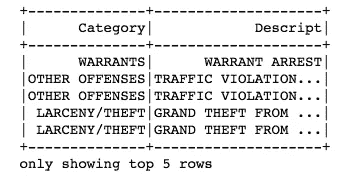
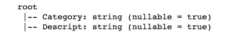
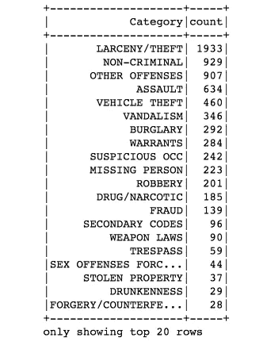
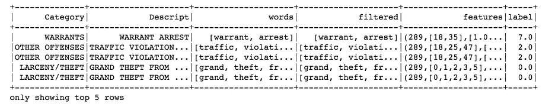
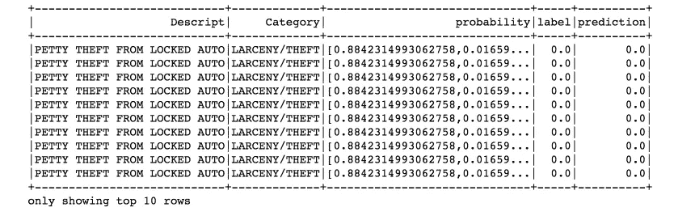
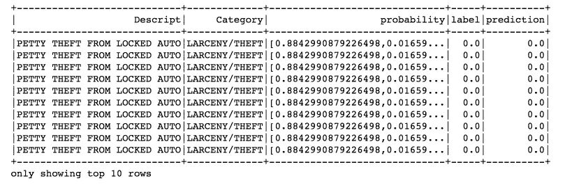
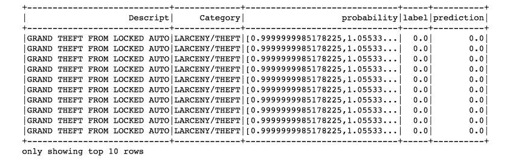
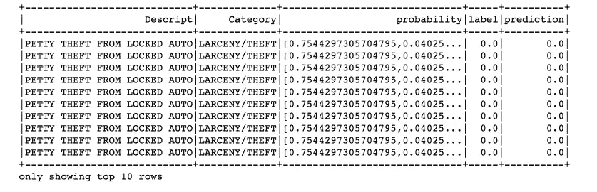

# 基于 PySpark 的多类文本分类

> 原文：<https://towardsdatascience.com/multi-class-text-classification-with-pyspark-7d78d022ed35?source=collection_archive---------2----------------------->


Photo credit: Pixabay

Apache Spark 在头条新闻和现实世界中的采用率都迅速上升，这主要是因为它处理流媒体数据的能力。由于每天都有如此多的数据需要处理，因此对我们来说，实时传输和分析这些数据变得至关重要。此外，Apache Spark 足够快，无需采样就可以执行探索性查询。许多行业专家提供了所有的理由[为什么你应该使用 Spark 进行机器学习](https://www.infoworld.com/article/3031690/analytics/why-you-should-use-spark-for-machine-learning.html)？

所以，我们现在在这里，使用 [Spark 机器学习库](https://spark.apache.org/docs/1.1.0/mllib-guide.html)来解决一个多类文本分类问题，特别是 PySpark。

如果你想看看用 [Scikit-Learn](http://scikit-learn.org/stable/) 的实现，请阅读[以前的文章](https://medium.com/@actsusanli/multi-class-text-classification-with-scikit-learn-12f1e60e0a9f)。

# 数据

我们的任务是将旧金山的犯罪描述分为 33 个预定义的类别。数据可以从 [Kaggle](https://www.kaggle.com/c/sf-crime/data) 下载。

给定一个新的犯罪描述，我们希望将其分配到 33 个类别中的一个。分类器假设每个新的犯罪描述被分配到一个且仅一个类别。这是多类文本分类问题。

*   **输入**:描述

例如:“被盗汽车”

*   **输出**:类别

示例:车辆盗窃

为了解决这个问题，我们将在 Spark 中使用各种特征提取技术以及不同的监督机器学习算法。我们开始吧！

# 数据摄取和提取

使用 [Spark csv 包](https://github.com/databricks/spark-csv)加载 CSV 文件非常简单。

```
from pyspark.sql import SQLContext
from pyspark import SparkContext
sc =SparkContext()
sqlContext = SQLContext(sc)data = sqlContext.read.format('com.databricks.spark.csv').options(header='true', inferschema='true').load('train.csv')
```

就是这样！我们已经加载了数据集。我们开始探索吧。

删除我们不需要的列，看看前五行:

```
drop_list = ['Dates', 'DayOfWeek', 'PdDistrict', 'Resolution', 'Address', 'X', 'Y']data = data.select([column for column in data.columns if column not in drop_list])
data.show(5)
```



Figure 1

对数据应用 printSchema()，这将以树格式打印模式:

```
data.printSchema()
```



Figure 2

20 大犯罪类别:

```
from pyspark.sql.functions import coldata.groupBy("Category") \
    .count() \
    .orderBy(col("count").desc()) \
    .show()
```



Figure 3

20 大犯罪描述:

```
data.groupBy("Descript") \
    .count() \
    .orderBy(col("count").desc()) \
    .show()
```


Figure 4

**模型管道**

[Spark 机器学习管道 API](https://spark.apache.org/docs/2.2.0/ml-pipeline.html) 类似于 [Scikit-Learn](http://scikit-learn.org/stable/tutorial/statistical_inference/putting_together.html) 。我们的渠道包括三个步骤:

1.  `regexTokenizer`:标记化(使用正则表达式)
2.  `stopwordsRemover`:删除停用词
3.  `countVectors`:计数向量(“文档术语向量”)

```
from pyspark.ml.feature import RegexTokenizer, StopWordsRemover, CountVectorizer
from pyspark.ml.classification import LogisticRegression# regular expression tokenizer
regexTokenizer = RegexTokenizer(inputCol="Descript", outputCol="words", pattern="\\W")# stop words
add_stopwords = ["http","https","amp","rt","t","c","the"] stopwordsRemover = StopWordsRemover(inputCol="words", outputCol="filtered").setStopWords(add_stopwords)# bag of words count
countVectors = CountVectorizer(inputCol="filtered", outputCol="features", vocabSize=10000, minDF=5)
```

**StringIndexer**

`StringIndexer`将一列标签编码成一列标签索引。索引在`[0, numLabels)`中，按照标签频率排序，因此最频繁的标签得到索引`0`。

在我们的例子中，标签列(类别)将被编码为标签索引，从 0 到 32；最频繁的标签(盗窃/偷窃)将被索引为 0。

```
from pyspark.ml import Pipeline
from pyspark.ml.feature import OneHotEncoder, StringIndexer, VectorAssembler
label_stringIdx = StringIndexer(inputCol = "Category", outputCol = "label")pipeline = Pipeline(stages=[regexTokenizer, stopwordsRemover, countVectors, label_stringIdx])# Fit the pipeline to training documents.
pipelineFit = pipeline.fit(data)
dataset = pipelineFit.transform(data)
dataset.show(5)
```



Figure 5

**分区训练&测试集**

```
# set seed for reproducibility
(trainingData, testData) = dataset.randomSplit([0.7, 0.3], seed = 100)
print("Training Dataset Count: " + str(trainingData.count()))
print("Test Dataset Count: " + str(testData.count()))
```

***训练数据集计数:5185***
***测试数据集计数:2104***

# 模型训练和评估

**使用计数向量特征的逻辑回归**

我们的模型将在测试集上进行预测和评分；然后，我们从最高概率的角度来看前 10 个预测。

```
lr = LogisticRegression(maxIter=20, regParam=0.3, elasticNetParam=0)
lrModel = lr.fit(trainingData)predictions = lrModel.transform(testData)predictions.filter(predictions['prediction'] == 0) \
    .select("Descript","Category","probability","label","prediction") \
    .orderBy("probability", ascending=False) \
    .show(n = 10, truncate = 30)
```



Figure 6

```
from pyspark.ml.evaluation import MulticlassClassificationEvaluator
evaluator = MulticlassClassificationEvaluator(predictionCol="prediction")
evaluator.evaluate(predictions)
```

***0.9610787444388802***

准确度极好！

**使用 TF-IDF 特征的逻辑回归**

```
from pyspark.ml.feature import HashingTF, IDFhashingTF = HashingTF(inputCol="filtered", outputCol="rawFeatures", numFeatures=10000)
idf = IDF(inputCol="rawFeatures", outputCol="features", minDocFreq=5) #minDocFreq: remove sparse terms
pipeline = Pipeline(stages=[regexTokenizer, stopwordsRemover, hashingTF, idf, label_stringIdx])pipelineFit = pipeline.fit(data)
dataset = pipelineFit.transform(data)(trainingData, testData) = dataset.randomSplit([0.7, 0.3], seed = 100)
lr = LogisticRegression(maxIter=20, regParam=0.3, elasticNetParam=0)
lrModel = lr.fit(trainingData)predictions = lrModel.transform(testData)predictions.filter(predictions['prediction'] == 0) \
    .select("Descript","Category","probability","label","prediction") \
    .orderBy("probability", ascending=False) \
    .show(n = 10, truncate = 30)
```



Figure 7

```
evaluator = MulticlassClassificationEvaluator(predictionCol="prediction")
evaluator.evaluate(predictions)
```

**0.9616202660247297**

结果是一样的。

**交叉验证**

现在让我们尝试交叉验证来调整我们的超参数，我们将只调整计数向量逻辑回归。

```
pipeline = Pipeline(stages=[regexTokenizer, stopwordsRemover, countVectors, label_stringIdx])pipelineFit = pipeline.fit(data)
dataset = pipelineFit.transform(data)
(trainingData, testData) = dataset.randomSplit([0.7, 0.3], seed = 100)lr = LogisticRegression(maxIter=20, regParam=0.3, elasticNetParam=0)from pyspark.ml.tuning import ParamGridBuilder, CrossValidator# Create ParamGrid for Cross Validation
paramGrid = (ParamGridBuilder()
             .addGrid(lr.regParam, [0.1, 0.3, 0.5]) # regularization parameter
             .addGrid(lr.elasticNetParam, [0.0, 0.1, 0.2]) # Elastic Net Parameter (Ridge = 0)
#            .addGrid(model.maxIter, [10, 20, 50]) #Number of iterations
#            .addGrid(idf.numFeatures, [10, 100, 1000]) # Number of features
             .build())# Create 5-fold CrossValidator
cv = CrossValidator(estimator=lr, \
                    estimatorParamMaps=paramGrid, \
                    evaluator=evaluator, \
                    numFolds=5)cvModel = cv.fit(trainingData)

predictions = cvModel.transform(testData)
# Evaluate best model
evaluator = MulticlassClassificationEvaluator(predictionCol="prediction")
evaluator.evaluate(predictions)
```

**0.9851796929217101**

性能提高了。

**朴素贝叶斯**

```
from pyspark.ml.classification import NaiveBayesnb = NaiveBayes(smoothing=1)
model = nb.fit(trainingData)predictions = model.transform(testData)
predictions.filter(predictions['prediction'] == 0) \
    .select("Descript","Category","probability","label","prediction") \
    .orderBy("probability", ascending=False) \
    .show(n = 10, truncate = 30)
```



Figure 8

```
evaluator = MulticlassClassificationEvaluator(predictionCol="prediction")
evaluator.evaluate(predictions)
```

***0.962541462988848***

**随机森林**

```
from pyspark.ml.classification import RandomForestClassifierrf = RandomForestClassifier(labelCol="label", \
                            featuresCol="features", \
                            numTrees = 100, \
                            maxDepth = 4, \
                            maxBins = 32)# Train model with Training Data
rfModel = rf.fit(trainingData)predictions = rfModel.transform(testData)predictions.filter(predictions['prediction'] == 0) \
    .select("Descript","Category","probability","label","prediction") \
    .orderBy("probability", ascending=False) \
    .show(n = 10, truncate = 30)
```



Figure 9

```
evaluator = MulticlassClassificationEvaluator(predictionCol="prediction")
evaluator.evaluate(predictions)
```

**0.6600326922344301**

随机森林是一种非常好的、健壮的和通用的方法，但是对于高维稀疏数据来说，它不是最佳选择，这并不奇怪。

显然，逻辑回归将是我们在这个实验中的模型，具有交叉验证。

这就把我们带到了文章的结尾。创建这篇文章的源代码可以在 [Github](https://github.com/susanli2016/Machine-Learning-with-Python/blob/master/SF_Crime_Text_Classification_PySpark.ipynb) 上找到。我期待听到任何反馈或问题。