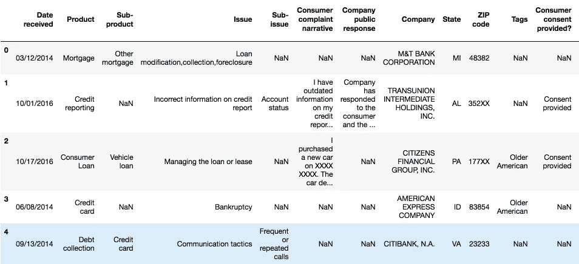
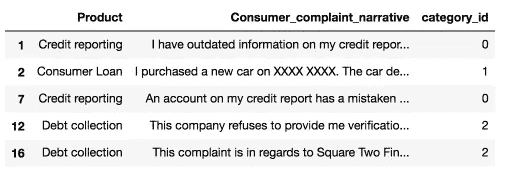
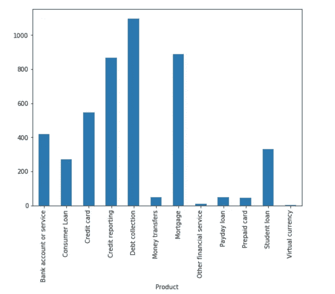
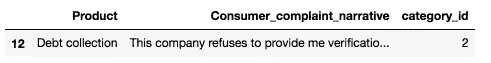
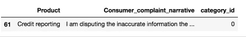
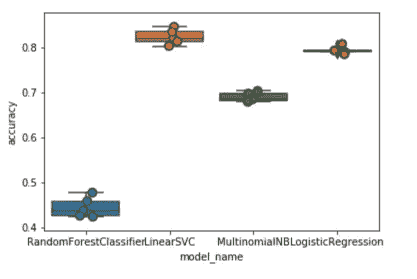
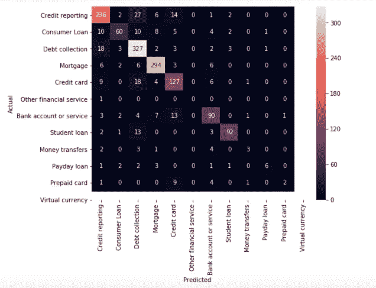
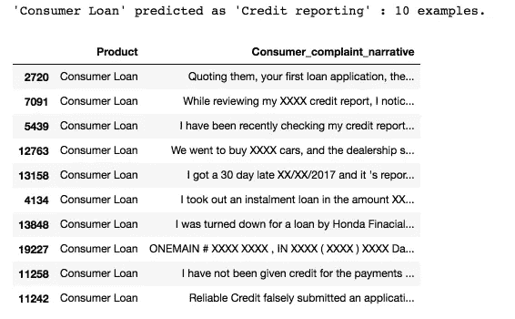
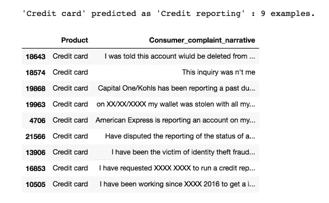
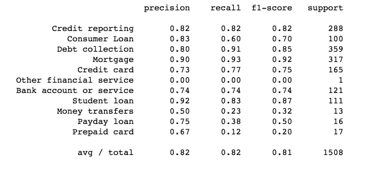

# 使用 Scikit-Learn 进行多类文本分类

> 原文：<https://towardsdatascience.com/multi-class-text-classification-with-scikit-learn-12f1e60e0a9f?source=collection_archive---------0----------------------->


Image credit: pexels

文本分类在商业领域有很多应用。例如，新闻故事通常是按主题组织的；内容或产品通常按类别进行标记；用户可以根据他们在网上谈论产品或品牌的方式进行分类…

但是网上绝大多数的文本分类文章和教程都是邮件垃圾过滤(spam vs. ham)、情感分析(正面 vs .负面)等二元文本分类。在大多数情况下，我们现实世界的问题要比这复杂得多。因此，这就是我们今天要做的事情:将消费金融投诉分为 12 个预定义的类别。数据可以从[data.gov](https://catalog.data.gov/dataset/consumer-complaint-database)下载。

我们使用 [Python](https://www.python.org/) 和 [Jupyter Notebook](http://jupyter.org/) 来开发我们的系统，依靠 [Scikit-Learn](http://scikit-learn.org/stable/) 作为机器学习组件。如果您想在 [PySpark](https://spark.apache.org/docs/0.9.0/mllib-guide.html) 中看到实现，请阅读[下一篇文章](https://medium.com/@actsusanli/multi-class-text-classification-with-pyspark-7d78d022ed35)。

# 问题定式化

该问题是有监督的文本分类问题，我们的目标是调查哪些有监督的机器学习方法最适合解决它。

假设有新的投诉进来，我们希望将其分配到 12 个类别中的一个。分类器假设每个新投诉被分配到一个且仅一个类别。这是多类文本分类问题。我迫不及待地想看看我们能实现什么！

# 数据探索

在开始训练机器学习模型之前，我们应该先看看一些例子和每个类中的投诉数量:

```
import pandas as pd
df = pd.read_csv('Consumer_Complaints.csv')
df.head()
```



Figure 1

对于这个项目，我们只需要两列—“产品”和“消费者投诉叙述”。

*   **输入**:消费者 _ 投诉 _ 叙述

例如:“我的信用报告中有过时的信息，我以前质疑过这些信息，但现在还没有删除。这些信息已经存在了七年多，不符合信用报告要求”

*   **输出**:产品

例如:信用报告

我们将删除“消费者投诉叙述”列中缺少的值，并添加一个将产品编码为整数的列，因为分类变量通常用整数表示比用字符串表示更好。

我们还创建了几个字典供将来使用。

清理之后，这是我们将要处理的前五行数据:

```
from io import StringIOcol = ['Product', 'Consumer complaint narrative']
df = df[col]
df = df[pd.notnull(df['Consumer complaint narrative'])]df.columns = ['Product', 'Consumer_complaint_narrative']df['category_id'] = df['Product'].factorize()[0]
category_id_df = df[['Product', 'category_id']].drop_duplicates().sort_values('category_id')
category_to_id = dict(category_id_df.values)
id_to_category = dict(category_id_df[['category_id', 'Product']].values)
df.head()
```



Figure 2

# 不平衡的班级

我们看到每个产品的投诉数量不平衡。消费者的投诉更偏向于催债、征信、房贷。

```
import matplotlib.pyplot as plt
fig = plt.figure(figsize=(8,6))
df.groupby('Product').Consumer_complaint_narrative.count().plot.bar(ylim=0)
plt.show()
```



Figure 3

当我们遇到这样的问题时，我们必然很难用标准算法来解决它们。传统算法往往偏向于多数类，没有考虑数据分布。在最坏的情况下，少数类被视为离群值并被忽略。对于某些情况，如欺诈检测或癌症预测，我们需要仔细配置我们的模型或人工平衡数据集，例如通过对每个类进行[欠采样或过采样](https://en.wikipedia.org/wiki/Oversampling_and_undersampling_in_data_analysis)。

然而，在我们学习不平衡数据的情况下，多数类可能是我们最感兴趣的。希望有一种对多数类给出高预测精度，同时对少数类保持合理精度的分类器。因此，我们将保持原样。

# 文本表示

分类器和学习算法不能直接处理原始形式的文本文档，因为它们中的大多数期望具有固定大小的数字特征向量，而不是具有可变长度的原始文本文档。因此，在预处理步骤中，文本被转换成更易于管理的表示。

从文本中提取特征的一种常见方法是使用单词袋模型:在该模型中，对于每个文档(在我们的情况下是投诉叙述)，考虑单词的存在(通常是频率)，但忽略它们出现的顺序。

具体来说，对于数据集中的每个术语，我们将计算一个称为术语频率的度量，即逆文档频率，缩写为 tf-idf。我们将使用`sklearn.feature_extraction.text.TfidfVectorizer` 来计算每个消费者投诉叙述的`tf-idf`向量:

*   `sublinear_df`设置为`True`以使用对数形式的频率。
*   `min_df`是一个单词必须存在的最小文档数。
*   `norm`被设置为`l2`，以确保我们所有的特征向量具有 1 的欧几里德范数。
*   `ngram_range`被设置为`(1, 2)`,表示我们既要考虑单元组，也要考虑二元组。
*   `stop_words`设置为`"english"`删除所有常用代词(`"a"`，`"the"`，...)以减少噪声特征的数量。

```
from sklearn.feature_extraction.text import TfidfVectorizertfidf = TfidfVectorizer(sublinear_tf=True, min_df=5, norm='l2', encoding='latin-1', ngram_range=(1, 2), stop_words='english')features = tfidf.fit_transform(df.Consumer_complaint_narrative).toarray()
labels = df.category_id
features.shape
```

(4569, 12633)

现在，4569 个消费者投诉叙述中的每一个都由 12633 个特征表示，代表不同单字和双字的 tf-idf 得分。

我们可以使用`sklearn.feature_selection.chi2`找到与每种产品最相关的术语:

```
from sklearn.feature_selection import chi2
import numpy as npN = 2
for Product, category_id in sorted(category_to_id.items()):
  features_chi2 = chi2(features, labels == category_id)
  indices = np.argsort(features_chi2[0])
  feature_names = np.array(tfidf.get_feature_names())[indices]
  unigrams = [v for v in feature_names if len(v.split(' ')) == 1]
  bigrams = [v for v in feature_names if len(v.split(' ')) == 2]
  print("# '{}':".format(Product))
  print("  . Most correlated unigrams:\n. {}".format('\n. '.join(unigrams[-N:])))
  print("  . Most correlated bigrams:\n. {}".format('\n. '.join(bigrams[-N:])))
```

# ' **银行账户或服务** ':
。最相关的单字:
。银行
。透支
。最相关的二元模型:
。透支费
。支票账户
# ' **消费贷款** ':
。最相关的单字:
。汽车
。车辆
。最相关的二元模型:
。车辆 xxxx
。丰田金融
# ' **信用卡** ':
。最相关的单字:
。花旗
。卡片
。最相关的二元模型:
。年费
。信用卡
# ' **征信** ':
。最相关的单字:
。experian
。equifax
。最相关的二元模型:
。跨联
。征信报告
#’**讨债**:
。最相关的单字:
。收藏
。债务
。最相关的二元模型:
。讨债
。代收机构
#’**汇款**’:
。最相关的单字:
。吴
。贝宝
。最相关的二元模型:
。西联
。转账
# ' **抵押** ':
。最相关的单字:
。修改
。抵押
。最相关二元模型:
。抵押公司
。贷款修改
# ' **其他金融服务** ':
。最相关的单字:
。牙科
。护照
。最相关二元模型:
。帮付
。声明支付
# ' **发薪日贷款** ':
。最相关的单字:
。借来的
。发薪日
。最相关二元模型:
。大图
。发薪日贷款
# ' **预付卡** ':
。最相关的单字:
。上菜
。预付
。最相关二元模型:
。存取款
。预付卡
# ' **助学贷款** ':
。最相关的单字:
。学生
。导航
。最相关的二元模型:
。助学贷款
。助学贷款
#‘**虚拟货币**‘:
。最相关的单字:
。手柄
。https
。最相关二元模型:
。xxxx 供应商
。缺钱

他们都有道理，你不这样认为吗？

## 多类分类器:特征与设计

*   为了训练监督分类器，我们首先将“消费者投诉叙述”转换成数字向量。我们研究了向量表示，如 TF-IDF 加权向量。
*   有了这种文本的向量表示后，我们可以训练监督分类器来训练看不见的“消费者投诉叙述”，并预测它们所涉及的“产品”。

在所有上述数据转换之后，现在我们已经有了所有的特征和标签，是时候训练分类器了。对于这类问题，我们可以使用许多算法。

*   **朴素贝叶斯分类器**:最适合字数统计的一个是多项式变量:

```
from sklearn.model_selection import train_test_split
from sklearn.feature_extraction.text import CountVectorizer
from sklearn.feature_extraction.text import TfidfTransformer
from sklearn.naive_bayes import MultinomialNBX_train, X_test, y_train, y_test = train_test_split(df['Consumer_complaint_narrative'], df['Product'], random_state = 0)
count_vect = CountVectorizer()
X_train_counts = count_vect.fit_transform(X_train)
tfidf_transformer = TfidfTransformer()
X_train_tfidf = tfidf_transformer.fit_transform(X_train_counts)clf = MultinomialNB().fit(X_train_tfidf, y_train)
```

拟合完训练集之后，我们来做一些预测。

```
print(clf.predict(count_vect.transform(["This company refuses to provide me verification and validation of debt per my right under the FDCPA. I do not believe this debt is mine."])))
```

['讨债']

```
df[df['Consumer_complaint_narrative'] == "This company refuses to provide me verification and validation of debt per my right under the FDCPA. I do not believe this debt is mine."]
```



Figure 4

```
print(clf.predict(count_vect.transform(["I am disputing the inaccurate information the Chex-Systems has on my credit report. I initially submitted a police report on XXXX/XXXX/16 and Chex Systems only deleted the items that I mentioned in the letter and not all the items that were actually listed on the police report. In other words they wanted me to say word for word to them what items were fraudulent. The total disregard of the police report and what accounts that it states that are fraudulent. If they just had paid a little closer attention to the police report I would not been in this position now and they would n't have to research once again. I would like the reported information to be removed : XXXX XXXX XXXX"])))
```

['信用报告']

```
df[df['Consumer_complaint_narrative'] == "I am disputing the inaccurate information the Chex-Systems has on my credit report. I initially submitted a police report on XXXX/XXXX/16 and Chex Systems only deleted the items that I mentioned in the letter and not all the items that were actually listed on the police report. In other words they wanted me to say word for word to them what items were fraudulent. The total disregard of the police report and what accounts that it states that are fraudulent. If they just had paid a little closer attention to the police report I would not been in this position now and they would n't have to research once again. I would like the reported information to be removed : XXXX XXXX XXXX"]
```



Figure 5

不算太寒酸！

# 型号选择

我们现在准备用不同的机器学习模型进行实验，评估它们的准确性，并找到任何潜在问题的来源。

我们将对以下四个模型进行基准测试:

*   逻辑回归
*   (多项式)朴素贝叶斯
*   线性支持向量机
*   随机森林

```
from sklearn.linear_model import LogisticRegression
from sklearn.ensemble import RandomForestClassifier
from sklearn.svm import LinearSVCfrom sklearn.model_selection import cross_val_scoremodels = [
    RandomForestClassifier(n_estimators=200, max_depth=3, random_state=0),
    LinearSVC(),
    MultinomialNB(),
    LogisticRegression(random_state=0),
]
CV = 5
cv_df = pd.DataFrame(index=range(CV * len(models)))
entries = []
for model in models:
  model_name = model.__class__.__name__
  accuracies = cross_val_score(model, features, labels, scoring='accuracy', cv=CV)
  for fold_idx, accuracy in enumerate(accuracies):
    entries.append((model_name, fold_idx, accuracy))
cv_df = pd.DataFrame(entries, columns=['model_name', 'fold_idx', 'accuracy'])import seaborn as snssns.boxplot(x='model_name', y='accuracy', data=cv_df)
sns.stripplot(x='model_name', y='accuracy', data=cv_df, 
              size=8, jitter=True, edgecolor="gray", linewidth=2)
plt.show()
```



Figure 6

```
cv_df.groupby('model_name').accuracy.mean()
```

model _ Name
**linear SVC:**0.822890
**logistic regression:**0.792927
**MultinomialNB:**0.688519
**RandomForestClassifier:**0.443826
Name:accuracy，dtype: float64

LinearSVC 和逻辑回归比其他两个分类器表现得更好，LinearSVC 以大约 82%的中值精度略微占优。

# 模型评估

继续我们的最佳模型(LinearSVC)，我们将查看混淆矩阵，并显示预测和实际标签之间的差异。

```
model = LinearSVC()X_train, X_test, y_train, y_test, indices_train, indices_test = train_test_split(features, labels, df.index, test_size=0.33, random_state=0)
model.fit(X_train, y_train)
y_pred = model.predict(X_test)from sklearn.metrics import confusion_matrixconf_mat = confusion_matrix(y_test, y_pred)
fig, ax = plt.subplots(figsize=(10,10))
sns.heatmap(conf_mat, annot=True, fmt='d',
            xticklabels=category_id_df.Product.values, yticklabels=category_id_df.Product.values)
plt.ylabel('Actual')
plt.xlabel('Predicted')
plt.show()
```



Figure 7

绝大多数预测最终出现在对角线上(预测标签=实际标签)，这是我们希望它们出现的位置。但是，存在许多错误分类，看看这些错误分类是由什么引起的可能会很有意思:

```
from IPython.display import displayfor predicted in category_id_df.category_id:
  for actual in category_id_df.category_id:
    if predicted != actual and conf_mat[actual, predicted] >= 10:
      print("'{}' predicted as '{}' : {} examples.".format(id_to_category[actual], id_to_category[predicted], conf_mat[actual, predicted]))
      display(df.loc[indices_test[(y_test == actual) & (y_pred == predicted)]][['Product', 'Consumer_complaint_narrative']])
      print('')
```



Figure 8



Figure 9

如您所见，一些错误分类的投诉涉及多个主题(例如，涉及信用卡和信用报告的投诉)。这种错误总是会发生。

同样，我们使用[卡方检验](https://en.wikipedia.org/wiki/Pearson%27s_chi-squared_test)来查找与每个类别最相关的术语:

```
model.fit(features, labels)N = 2
for Product, category_id in sorted(category_to_id.items()):
  indices = np.argsort(model.coef_[category_id])
  feature_names = np.array(tfidf.get_feature_names())[indices]
  unigrams = [v for v in reversed(feature_names) if len(v.split(' ')) == 1][:N]
  bigrams = [v for v in reversed(feature_names) if len(v.split(' ')) == 2][:N]
  print("# '{}':".format(Product))
  print("  . Top unigrams:\n       . {}".format('\n       . '.join(unigrams)))
  print("  . Top bigrams:\n       . {}".format('\n       . '.join(bigrams)))
```

# ' **银行账户或服务** ':
。Top unigrams:
。银行
。账户
。Top bigrams:
。借记卡
。透支费
# ' **消费贷款** ':
。顶级单字:
。车辆
。汽车
。热门二元模型:
。个人贷款
。历史 xxxx
# ' **信用卡** ':
。顶级单字:
。卡片
。发现
。顶级双元:
。信用卡
。发现卡
# ' **征信** ':
。Top unigrams:
。equifax
。跨联
。Top bigrams:
。xxxx 账户
。跨联
# ' **讨债** ':
。Top unigrams:
。债务
。收藏
。顶级名人:
。账户贷记
。提供时间
#’**汇款**’:
。Top unigrams:
。贝宝
。传送
。Top bigrams:
。汇款
。送钱
#‘**抵押**‘:
。Top unigrams:
。抵押
。托管
。Top bigrams:
。贷款修改
。抵押公司
# ' **其他金融服务** ':
。Top unigrams:
。护照
。牙科
。Top bigrams:
。规定薪酬
。帮助支付
# ' **发薪日贷款** ':
。Top unigrams:
。发薪日
。贷款
。Top bigrams:
。发薪日贷款
。发薪日
#‘**预付卡**‘:
。Top unigrams:
。预付
。上菜
。顶级双面人物:
。预付卡
。用卡
#‘**助学贷款**‘:
。Top unigrams:
。导航
。贷款
。Top bigrams:
。助学贷款
。莎莉美
# ' **虚拟货币** ':
。Top unigrams:
。https
。tx
。顶级双元:
。钱要
。xxxx 提供商

它们符合我们的预期。

最后，我们打印出每个类别的分类报告:

```
from sklearn import metrics
print(metrics.classification_report(y_test, y_pred, target_names=df['Product'].unique()))
```



Figure 9

源代码可以在 [Github](https://github.com/susanli2016/Machine-Learning-with-Python/blob/master/Consumer_complaints.ipynb) 上找到。我期待听到任何反馈或问题。