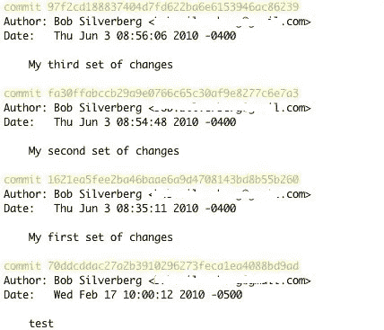
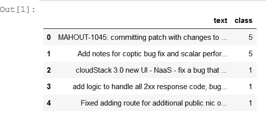
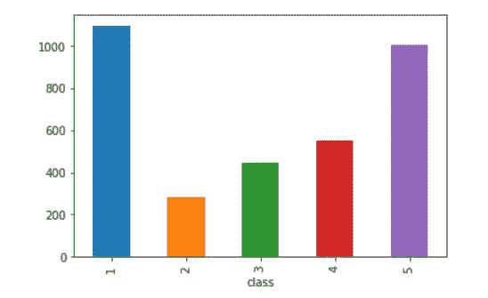
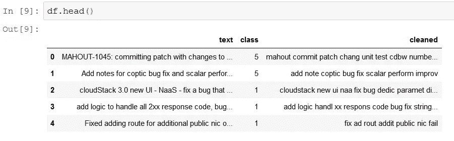
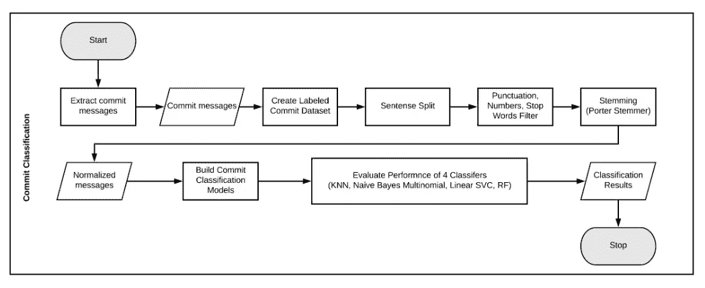

# 用 python 中的 SKlearn 和 NLTK 实现多类文本分类|一个软件工程用例

> 原文：<https://towardsdatascience.com/multi-class-text-classification-with-sklearn-and-nltk-in-python-a-software-engineering-use-case-779d4a28ba5?source=collection_archive---------1----------------------->


photo credit: unsplash

最近，我从事一个软件工程研究项目。该项目的主要目标之一是了解开发团队的工作重点。当软件项目的规模变大时，管理工作流和开发过程变得更具挑战性。因此，对于管理团队和主要开发人员来说，理解软件开发人员执行的工作类型是非常重要的。

更简单地说，在项目的不同阶段，任何开发人员都可以随时编写代码来实现以下目标之一:

*   添加新功能
*   设计改进
*   错误修复
*   改进非功能性需求

现在有人可能会问，以上四个类别是开发人员完成的软件开发活动的唯一类型吗？答案是:不。这里的目标是提出一些包含大部分开发任务的通用工作类别。

了解开发团队的工作是如何根据上述四个类别进行分配的，可以帮助管理层在持续开发软件功能的同时，在管理软件增长方面做出更好的决策。例如，如果开发团队的大部分工作都是为了修复 bug，那么管理层可以采取必要的措施来防止软件中的错误和缺陷，并为主要开发人员提供指导方针，让他们更加关注质量。

# 问题是:

## 所以主要问题是:**我们如何通过查看源代码来对开发人员的工作进行分类？**

答案是:我们可以查看提交消息；开发人员提供一个提交消息以及他们对存储库的每一次提交。这些提交消息通常使用自然语言编写，并且通常传达一些关于它们所表示的提交的信息。我们可以使用一些标记的数据构建一个分类器，然后自动对未来的提交进行分类。



if I had a dollar for every commit … !!!

# 数据工程:

我们从 github 上的几个开源 Java 项目中收集了大约 4000 条提交消息。我们使用基于每个类别的特定关键字的高级搜索标准来挑选提交消息。然后，我们将每一类提交消息分配给有经验的开发人员，让他们逐一检查提交是否属于他们的类别。之后，我们通过在开发人员之间交换提交消息的类别来交叉检查流程，以减轻手动标记带来的主观性。最后，我们得到了将近 3400 条提交消息，包括 282 条不属于任何类别的提交；我们决定在分类任务中添加一个标签，这样以后我们就可以检测到类似的提交消息。

# 分类:

让我们来看看数据:

```
import pandas as pd
import re
import numpy as np
import matplotlib.pyplot as plt
from nltk.corpus import stopwords
from nltk.stem import PorterStemmer
from sklearn.feature_extraction.text import TfidfVectorizer
from sklearn.pipeline import Pipeline
from sklearn.metrics import classification_report, confusion_matrix
from sklearn.model_selection import train_test_split
from sklearn.feature_selection import SelectKBest, chi2
from sqlite3 import Error
from sklearn.ensemble import RandomForestClassifier
import sqlite3
import pickle
%matplotlib inlinetry:
    conn = sqlite3.connect("training_V2.db")
except Error as e:
    print(e)#reading the data from the table that contains the labels 
df = pd.read_sql_query('SELECT * FROM filtered', conn)
df.drop(['id'], 1, inplace=True)
df.head()
```



如你所见，我们导入了如此多的包，我们将使用它们来实现我们的目标。查看数据帧的前五行，我们可以看到它只有两列:文本(提交消息)和类(标签)。

*   1 表示用于修复错误的提交消息。
*   2 表示不属于任何类别的提交。
*   3 代表设计改进的提交消息。
*   4 表示用于添加新特征的提交消息。
*   5 表示用于改进非功能性需求的提交消息。

让我们看看它们的分布情况:

```
df.groupby('class').text.count().plot.bar(ylim=0)
plt.show()
```



数据集中有一点不平衡是很自然的，因为提交是从随机的开源项目中随机收集的。

现在让我们建立我们的分类器。但是等等……我们的数据是自然文本，但是需要格式化成列结构，以便作为分类算法的输入。

**它是这样工作的:**

# 文本预处理:

*   首先，我们从每个提交消息中删除标点、数字和停用词。
*   其次，所有的单词都被转换成小写，然后使用 NLTK 包中的斯特梅尔进行词干分析。词干提取的目标是减少提交中出现的单词的屈折形式的数量；它将通过将诸如“performance”和“performing”这样的词简化为它们的基本词“perform”来使它们在句法上相互匹配。这有助于减少词汇空间的大小，并提高语料库中特征空间的容量。
*   最后，使用 Python 的 SKlearn 包中的 tf-idf 矢量器将每个语料库转换为向量空间模型(VSM)来提取特征。

所有这些都是用几行代码完成的，这就是 python 的魅力所在。

```
stemmer = PorterStemmer()
words = stopwords.words("english")df['cleaned'] = df['text'].apply(lambda x: " ".join([stemmer.stem(i) for i in re.sub("[^a-zA-Z]", " ", x).split() if i not in words]).lower())
```



```
vectorizer = TfidfVectorizer(min_df= 3, stop_words="english", sublinear_tf=True, norm='l2', ngram_range=(1, 2))
final_features = vectorizer.fit_transform(df['cleaned']).toarray()
final_features.shape(3377, 2389)
```

因此，在将文本转换成向量后，我们最终得到了 2389 个特征。现在，我们继续构建我们的模型，并用我们的数据拟合模型。这里我们应该问的另一个重要问题是**我们真的需要使用所有的 2389 特性吗？**当处理非常长的向量时，有时选择你的最佳特征可能比使用所有特征更好。为此，我们使用 SKlearn.feature_selection 包中的 SelectKbest 方法。然后，我们使用 Chi2 分数来选择具有最高值的 n_features 特征，以进行卡方检验。 **"** **卡方检验测量随机变量之间的相关性，因此使用此函数“剔除”最有可能与类别无关的特征，因此与分类无关。**引自 sklearn 文档。

在构建模型时，我们可以从广泛的分类算法中进行选择。我们测试了四种不同的算法: **KNN、多项式朴素贝叶斯、线性 SVC 和随机福里斯特**。我研究了每个分类器，并使用分类性能的常用统计方法(精确度和召回率)来比较每个分类器，得出结论，Random Forrest 似乎比其他分类器表现得更好。根据我自己的经验，当你有一个多类问题时，Random Forrest 做得更好。您可以测试其他分类算法，如果您发现一些提供更好结果的算法，请告诉我。



overall workflow

现在让我们把所有东西都放到一个管道里。这里我们执行一系列转换:首先我们转换 tfidf 矢量器，然后我们选择 K 个最佳特征，最后我们使用分类器来拟合数据。所以我们使用一个管道同时完成所有这些任务:

```
#first we split our dataset into testing and training set:
# this block is to split the dataset into training and testing set 
X = df['cleaned']
Y = df['class']
X_train, X_test, y_train, y_test = train_test_split(X, Y, test_size=0.25)# instead of doing these steps one at a time, we can use a pipeline to complete them all at once
pipeline = Pipeline([('vect', vectorizer),
                     ('chi',  SelectKBest(chi2, k=1200)),
                     ('clf', RandomForestClassifier())])# fitting our model and save it in a pickle for later use
model = pipeline.fit(X_train, y_train)
with open('RandomForest.pickle', 'wb') as f:
    pickle.dump(model, f)ytest = np.array(y_test)# confusion matrix and classification report(precision, recall, F1-score)
print(classification_report(ytest, model.predict(X_test)))
print(confusion_matrix(ytest, model.predict(X_test))) precision    recall  f1-score   support

          1       0.99      0.98      0.99       271
          2       0.91      0.91      0.91        47
          3       0.98      1.00      0.99       116
          4       0.99      0.99      0.99       143
          5       0.98      0.99      0.98       268

avg / total       0.98      0.98      0.98       845Confusion Matrix: 1    2   3   4   5
1[[266   1   0   0   4]
 2[  2  43   0   1   1]
 3[  0   0 116   0   0]
 4[  0   2   0 141   0]
 5[  0   1   2   1 264]] 
```

0.98 精度和召回…！！！嗯……这是我的第一反应。但是后来我查看了混淆矩阵，发现每个类都没有太多的错误分类，我认为我们的情况不错。我们甚至没有对分类算法进行任何参数调整就实现了高精度和高召回率！

**现在我真的想看看这是否适用于另一个数据集。此外，我想使用其他指标对此进行评估，如:AUC 得分，并查看 ROC 曲线，因为数据有点不平衡。为了有一个更完整的理解，还有两件事要做:首先是使用 gridsearch 来调整参数，看看它是否真的有助于改善结果。第二，每个类别最好有 5 个最重要的关键词，这样以后我们可以用这些关键词来进行搜索。但是这篇文章已经够长了，所以我将在下一篇文章中回答这些问题。敬请期待！**

**非常感谢您的反馈和问题。**

**我的**[**github**](https://github.com/nxs5899/Multi-Class-Text-Classification----Random-Forest)**上有这个项目的源代码、python 笔记本和数据集。**