# 时尚 MNIST 的多标签分类和类别激活图

> 原文：<https://towardsdatascience.com/multi-label-classification-and-class-activation-map-on-fashion-mnist-1454f09f5925?source=collection_archive---------2----------------------->

**时尚-MNIST** 是一个时尚产品图像数据集，用于对计算机视觉的机器学习算法进行基准测试。该数据集包括 60，000 幅 28x28 的训练图像和 10，000 幅 28x28 的测试图像，包括 10 类时尚产品。图 1 显示了所有的标签和一些图像在**时尚-MNIST** 。

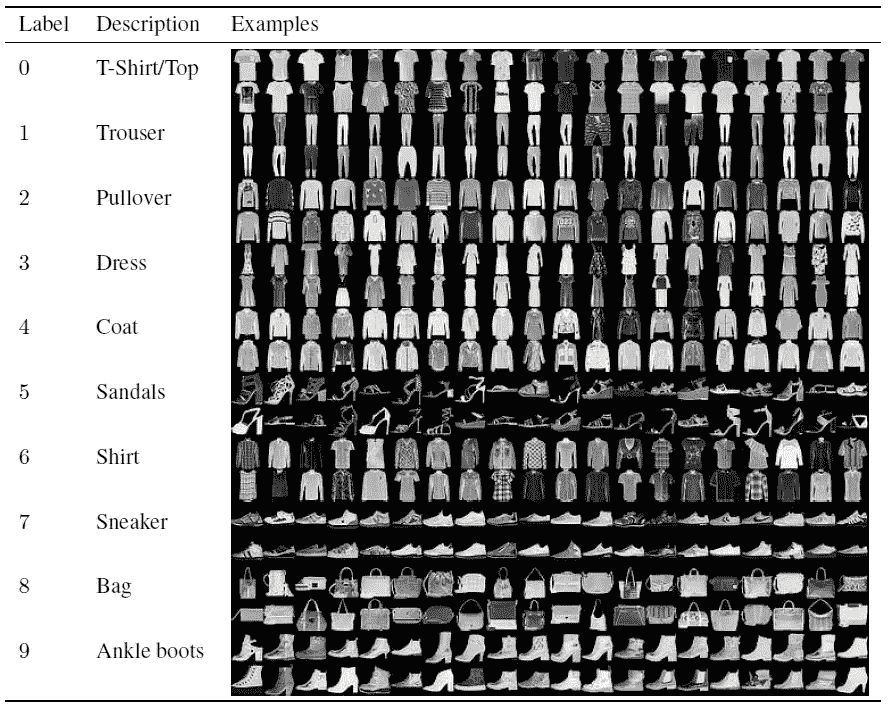

**Figure 1\. Fashion-MNIST dataset. [**[github](https://github.com/zalandoresearch/fashion-mnist) and [arxiv](https://arxiv.org/abs/1708.07747?context=cs)**]**

**有很多关于时尚的文章——MNIST[**[ref](https://medium.com/search?q=fashion%20mnist)**]。然而，这篇文章的目标是在多标签分类的背景下，而不是在多类分类的背景下，提出一项关于时尚 MNIST 的深度学习的研究。此外，这篇文章还研究了我们是否可以可视化卷积神经网络如何看待图像，并识别激活特定标签的区域。**

# 1.可视化，可视化，可视化

在进入所有细节之前，让我们想象一下我们能达到的一些结果。

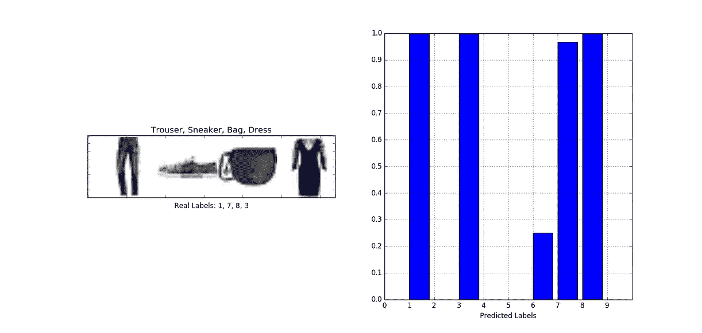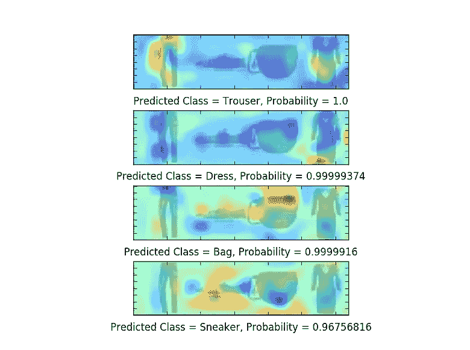

**Figure 2\. (a) A multi-label image, (b) The predicted probabilities over labels, (c) The class activation maps for the labels with higher probabilities.**

让我们逐一分解图 2 中的图表。

1.  第一个图显示了一个多标签图像，由来自**时尚-MNIST** 的四个时尚产品图像组成:*一条裤子*、*一双运动鞋*、*一个包*和*一件衣服*。与该多标签图像相关联的标签是 *1* 、7、8 和 3。请注意，实际上我们在这项研究中考虑的是标签的存在(例如 1/3/7/8)而不是标签的顺序(例如 1/7/8/3)。如果一个图像只包含两类时尚产品，那么只有两个标签会被分配给该图像。
2.  给出了多标签图像，第二张图显示了由我们训练的卷积神经网络计算的所有标签的预测概率。请注意，*标签 1* 、*标签 3* 、*标签 7* 和*标签 8* 的概率都接近 1，这表明我们训练的卷积神经网络在给定图像上标记正确标签方面做得很好。
3.  第三张图显示了与前四个预测标签相关的热图，即以较高概率激活标签的区域。突出显示热图(也称为类激活图)的目的是打开我们的卷积神经网络的黑盒，看看它是否真的精确定位了进行预测的关键区域。

再举两个例子:一个有 3 个标签(图 3)，一个有 2 个标签(图 4)。

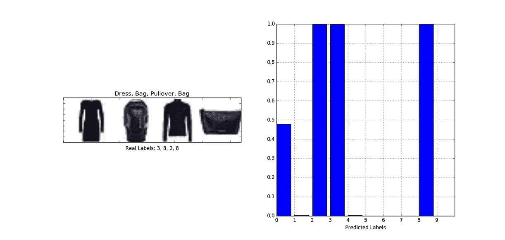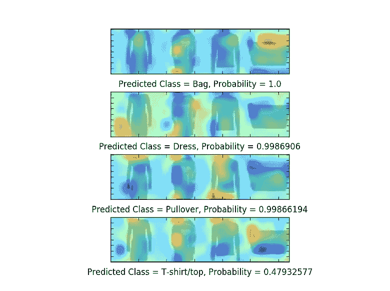

**Figure 3\. An image with 3 labels: 2, 3, and 8.**

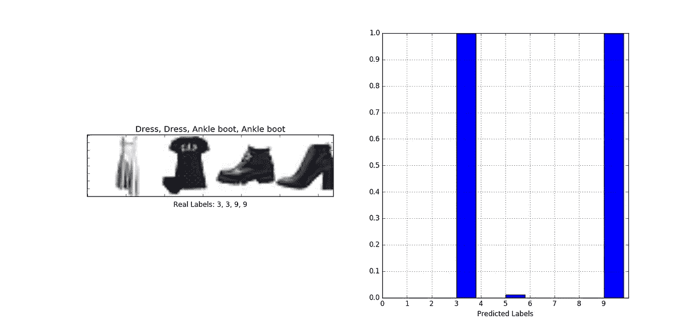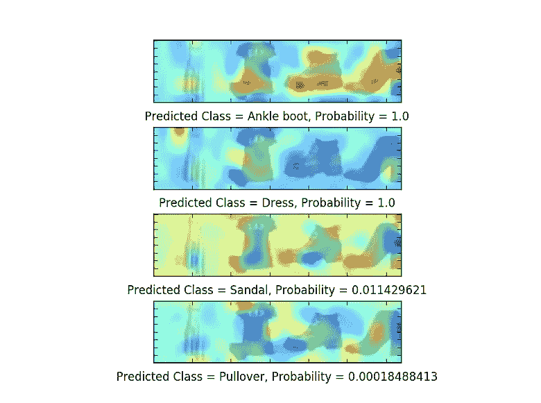

**Figure 4\. An image with 2 labels: 3 and 9.**

图 5 给出了超过 9000 幅用于训练的图像和 1000 幅用于验证的图像的总体训练历史。在 1000 张测试图像上的准确率在 95% ~ 96%左右。该程序是在 Keras 中实现的，后台是 Theano。

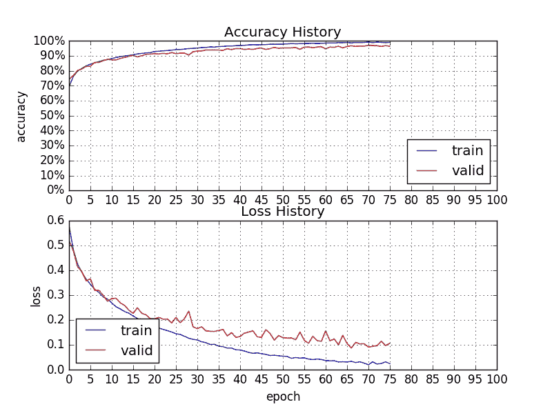

**Figure 5\. Training history on accuracy and loss.**

# 2.多标签时尚-MNIST

以下是我们用于多标签分类的新数据集的简介:

*   10000 幅 646×184 的训练图像和 1000 幅 646×184 的测试图像；
*   每张图片有四张从**时尚-MNIST** 中随机选取的时尚产品图片；
*   元数据文件保存了图像的有序标签，以及它的单主机编码方案。

图 6 显示了我们数据集中的一些图像，图 7 显示了元数据文件中的一些信息。

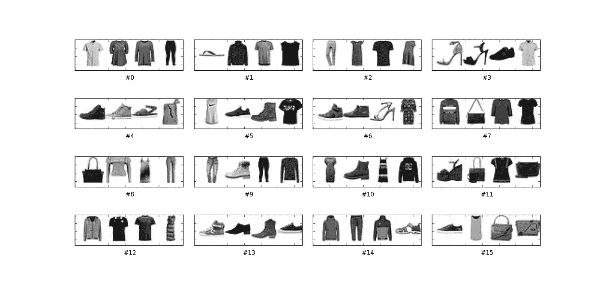

**Figure 6\. Sample images in Multi-Label Fashion-MNIST.**

**Figure 7\. Sample meta-data in Multi-Label Fashion-MNIST.**

# 3.神经网络体系结构

我们神经网络的重点是将**执行多标签分类**和**生成类激活图**的基本机制集成在一起。我们将遍历执行多标签分类的基本框架，然后检查生成类激活图所需的增强。

首先，让我们比较实现**多类分类**(其中一个图像仅属于一个类)和**多标签分类**(其中一个图像可以与多个标签相关联)的常见做法。)

*   用于图像分类的基本神经网络架构通常由用于特征提取的卷积层和最大池层的堆叠组成，随后是用于类别/标签预测的一些全连接层。
*   对于**多类分类**，模型中的最后一层使用 **softmax** 函数进行类预测，训练过程使用**category _ cross entropy**函数作为损失函数。
*   对于**多标签分类**，模型中的最后一层使用 **sigmoid** 函数进行标签预测，训练过程使用 **binary_crossentropy** 函数作为损失函数。

上述实践基于在深度学习中实现最后一层激活函数和损失函数的传统智慧，如图 8 所示。

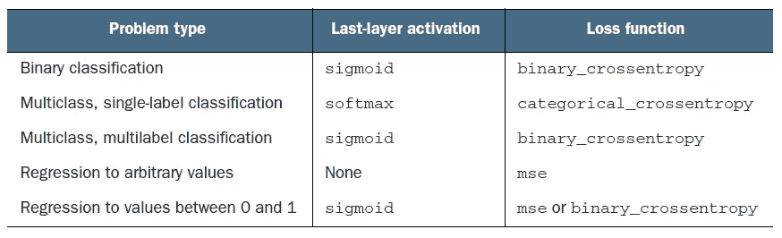

**Figure 8\. Summary of last-layer activation function and loss function. [**[Deep Learning with Python](https://www.manning.com/books/deep-learning-with-python), Ch4/Ch9**]**

现在，让我们考虑生成类激活映射的机制。有许多不同的方法来创建类激活映射。我们的想法和代码基于[用于对象本地化的全局平均池层](https://alexisbcook.github.io/2017/global-average-pooling-layers-for-object-localization/)。这种方法有两个要点。首先，给定类的类激活图被视为最后一个卷积层的特征图的加权和。其次，全局平均池图层用于将要素地图转换为单个值，并作为计算相关权重的粘合剂。原始论文中的图 9 展示了完整的过程。

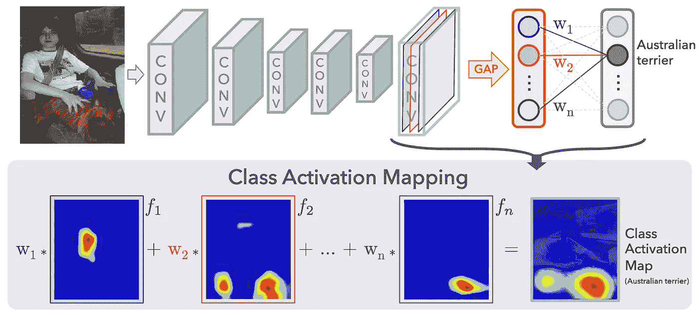

**Figure 9\. Class Activation Mapping. [**[ref](https://github.com/metalbubble/CAM)**]**

图 10 显示了 Keras 中用于构建和训练深度神经网络的代码。图 11 显示了整个模型的概要。

**Figure 10\. The code for building and training the deep neural network.**

**Figure 11\. The summary of the whole model.**

图 12 显示了创建类激活映射的代码。

**Figure 12\. The code for creating a class activation map.**

# 4.结论

这篇文章介绍了在**多标签分类**的背景下为**时尚-MNIST** 进行的深度学习研究。我们还试图打开我们的卷积神经网络的黑盒，以查看预测标签的**类激活图**。这项研究中最有趣但最具挑战性的问题是用全局平均池函数实现和验证类激活映射，特别是当一个映射看起来不正确时。最后，让我用两个数字来说明今后工作的方向。

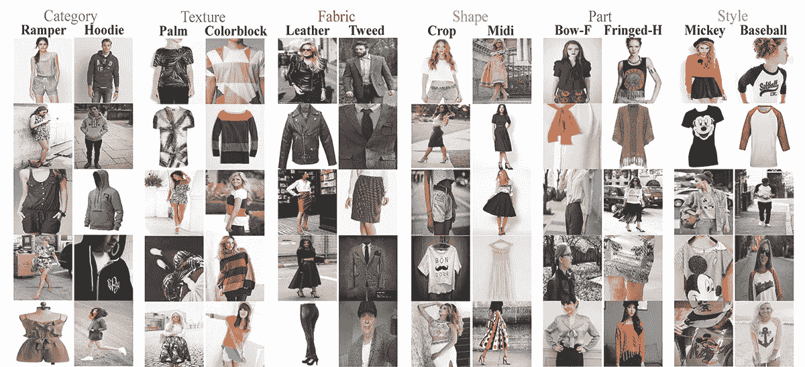

**Ref-1\.** [**DeepFashion**](http://mmlab.ie.cuhk.edu.hk/projects/DeepFashion.html)

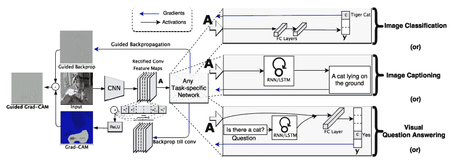

**Ref-2\.** [**Grad-CAM**](https://arxiv.org/abs/1610.02391)

还有一件事…你喜欢 MNIST 吗？

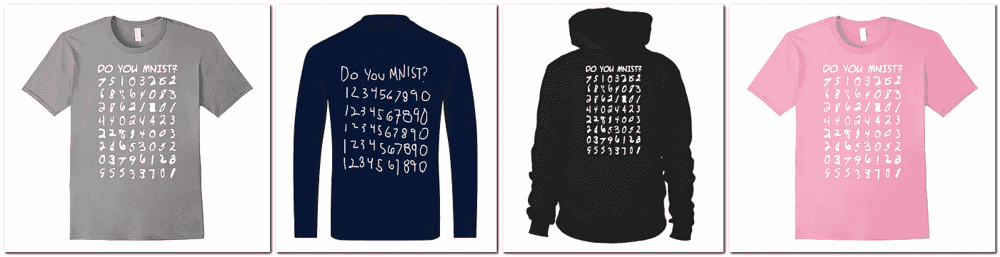

**Ref-3\. DO YOU MNIST from** [**anztee.com**](https://anztee.com/product/do-you-mnist-computer-data-science-machine-learning-t-shirt/) **and** [**teezily.com**](https://www.teezily.com/)