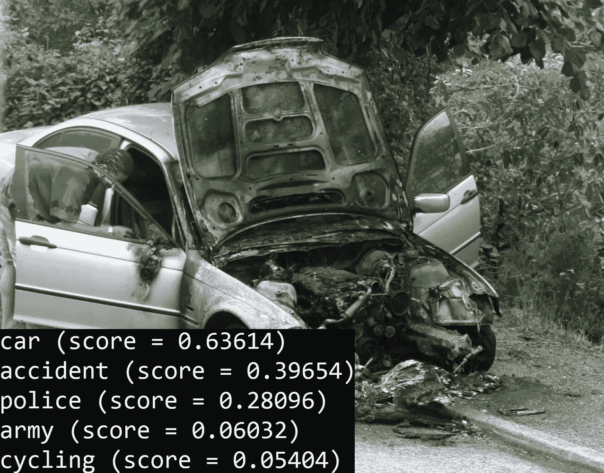
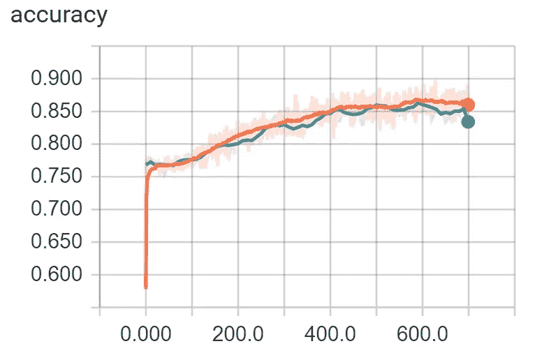

# 基于初始网的多标签图像分类

> 原文：<https://towardsdatascience.com/multi-label-image-classification-with-inception-net-cbb2ee538e30?source=collection_archive---------0----------------------->


Inception v3 architecture. ([source](https://github.com/tensorflow/models/tree/master/inception))

**更新:**本文已更新，修复了[特里萨·巴顿](https://medium.com/u/abf9181453af?source=post_page-----cbb2ee538e30--------------------------------)指出的精度计算可能存在的问题。 [git 回购](https://github.com/BartyzalRadek/Multi-label-Inception-net)也已经更新，你可以在那里找到所有的变化。

[Inception v3](https://github.com/tensorflow/models/tree/master/inception) 是一个深度卷积神经网络，在 [ImageNet](http://www.image-net.org/) 数据集上训练用于单标签图像分类。TensorFlow 团队已经准备了一个[教程](https://codelabs.developers.google.com/codelabs/tensorflow-for-poets)来重新训练它，根据我们自己的例子来区分一些类。我们将修改教程中的再训练脚本 **retrain.py** ，将网络改为多标签分类器。

如果你只是想跳转到结果代码，这里的[是](https://github.com/BartyzalRadek/Multi-label-Inception-net)所有必要的文件和信息，需要让它工作。从现在开始，我将假设您已经克隆了提到的存储库并引用了它的文件。

那么需要做些什么呢？首先，我们必须以某种方式告诉网络哪一个是每个图像的正确标签。然后，我们必须修改正在重新训练的最后一层和评估生成的预测的方法，以便实际上能够针对每个图像的多个可能的正确类别来训练它。

# 要求

*   [张量流 0.12.0-rc1](https://github.com/tensorflow/tensorflow/releases/tag/0.12.0-rc1)
*   JPEG 格式的训练图像
*   [修改后的源代码与示例](https://github.com/BartyzalRadek/Multi-label-Inception-net)

# 数据预处理

## 准备训练图像

1.  将所有训练图像放入**图像**目录下的一个文件夹中。
    尽量去掉所有重复的图像，它们可能会人为地夸大测试和验证的准确性。文件夹的名称并不重要。我用的是**多标**。

## 为每个训练图像准备标签

我们需要为每个图像准备带有正确标签的文件。将文件命名为**<image _ file _ name . jpg>。txt** =如果你有一张图片【car.jpg.txt】，附带的文件应该命名为 **car.jpg.txt** 。

将每个标签放在文件中的一个新行上，不要做其他事情。

现在将所有创建的文件复制到项目根目录下的 **image_labels_dir** 目录中。您可以通过编辑 **retrain.py** 中的全局变量 IMAGE_LABELS_DIR 来更改该文件夹的路径。

## 创建包含所有标签的文件

最初的 Inception net 使用一个文件夹结构来导出类的列表。在我们的例子中，所有的训练图像都在一个文件夹中，因此我们需要在一个外部文件中列出这些类。

在项目根目录下创建文件 **labels.txt** ，并用所有可能的标签填充它。每个标签在一个新的行上，没有别的。就像所有可能的类中的图像的 **image_label** 文件一样。

# 修改总管

main()方法最初将包含每个标签的图像的目录结构加载到单独的文件夹中，并通过以下方式为每个类创建了*验证*、*测试*和*训练*集合:

```
image_lists = create_image_lists(FLAGS.image_dir, FLAGS.testing_percentage,cFLAGS.validation_percentage)
```

我们现在在一个目录中有所有的图像，因此 **image_lists.keys()** 只包含一个元素，那就是我们所有图像的文件夹(例如多标签)。所有的训练图像被分成*验证*、*测试*和*训练*组，通过该键可以进入。

现在我们已经正确地分割了数据，我们只需要加载标签列表并计算类计数:

```
**with** open(ALL_LABELS_FILE) **as** f:
    labels = f.read().splitlines()
class_count = len(labels)
```

# 创建地面真实向量

1.  添加**get _ image _ labels _ path()**方法，该方法只是稍微编辑了一下 **get_image_path()** 方法返回包含正确图像标签的文件的路径=例如**image _ labels _ dir/car . jpg . txt**对于**car.jpg**。
2.  编辑**get _ random _ cached _ 瓶颈()**方法:

该方法创建包含每个返回图像的正确标签的 ground_truth 向量。最初它只是创建了一个零向量:

```
ground_truth = np.zeros(class_count, dtype=np.float32)
```

然后在正确的标签位置放一个 1.0，这是我们知道的，因为这是我们从中获取图像的文件夹的名称:

```
ground_truth[label_index] = 1.0
```

多标签分类没那么简单。我们需要从 image_label_file 中为给定的图像加载所有正确的标签。

获取带有正确标签的文件路径:

```
labels_file = get_image_labels_path(image_lists,label_name,image_index, IMAGE_LABELS_DIR, category)
```

从文件中读取所有行=标签，并保存到数组 **true_labels** :

```
**with** open(labels_file) **as** f:
   true_labels = f.read().splitlines()
```

用零初始化 ground_truth 向量:

```
ground_truth = np.zeros(class_count, dtype=np.float32)
```

用 1.0 表示 ground_truth 向量中的正确标签:

```
idx = 0
**for** label **in** labels:
   **if** label **in** true_labels:
      ground_truth[idx] = 1.0
   idx += 1
```

**标签**列表是添加到**get _ random _ cached _ bottoms()**方法的参数，包含所有可能的类的名称。

就是这样！我们可以通过缓存创建的*地面真相*来改进这个解决方案。这防止了每次我们为相同的图像请求时创建*地面真实*向量，如果我们为多个时期训练，这是必然发生的。这就是全局字典 CACHED_GROUND_TRUTH_VECTORS 的用途。

# 修改培训

**add_final_training_ops()** 方法最初添加了一个新的 softmax 和全连接层用于训练。我们只需要用一个不同的函数替换 softmax 函数。

为什么？

softmax 函数将向量的所有值压缩到[0，1]范围内，总和为 1。这正是我们在单一标签分类中想要的。但是对于我们的多标签情况，我们希望我们得到的类别概率能够表示汽车的图像属于类别**汽车**的概率为 90%,属于类别**事故**的概率为 30%,等等。

我们将通过使用例如 [sigmoid](https://en.wikipedia.org/wiki/Sigmoid_function) 函数来实现这一点。

具体来说，我们将替换:

```
final_tensor = tf.nn.softmax(logits, name=final_tensor_name)
```

使用:

```
final_tensor = tf.nn.sigmoid(logits, name=final_tensor_name)
```

我们还必须更新交叉熵的计算方法，以正确训练我们的网络:

同样，只需将 softmax 替换为 sigmoid:

```
cross_entropy = tf.nn.sigmoid_cross_entropy_with_logits(logits,ground_truth_input)
```

# 修改评估

方法 **add_evaluation_step()** 插入我们需要评估预测标签准确性的操作。最初看起来是这样的:

```
correct_prediction = tf.equal(tf.argmax(result_tensor, 1), tf.argmax(ground_truth_tensor, 1))
```

好吧，这是怎么回事？

**result_tensor** 和 **ground_truth_tensor** 都可以想象成 2D 数组:

```
|        | label1  | label2 | label3  |
| image1 |    0    |    1   |    0    |
| image2 |    1    |    0   |    0    |
```

因此这一行:

```
tf.argmax(result_tensor, 1)
```

返回每个**行**中最大值的索引。每一行因为(axis = **1** 参数。

我们将获得具有最高值的索引并比较它们，同时知道因为只有一个标签是正确的，所以**地面 _ 真相 _ 张量**在每行中只包含一个 **1** 。

为了使这种方法适应我们的多标签情况，我们简单地用 *round()* 替换 *argmax()* ，这将概率变成 0 和 1。然后，我们将**结果张量**与已经只包含 0 和 1 的**基础张量**进行比较:

```
correct_prediction = tf.equal(tf.round(result_tensor), ground_truth_tensor)
```

这就是我们为正确分类带有多个标签的图像所需要做的所有更改。

# 运行再培训

只需从项目根目录运行以下命令:

```
python retrain.py \
--bottleneck_dir=bottlenecks \
--how_many_training_steps 500 \
--model_dir=model_dir \
--output_graph=retrained_graph.pb \
--output_labels=retrained_labels.txt \
--summaries_dir=retrain_logs \
--image_dir=images
```

我建议调整训练步骤的数量，以防止过度适应你的模型。

# 测试重新训练的模型



运行:

```
python label_image.py <image_name>
```

我稍微修改了一下 **label_image.py** ，将得到的类百分比写入 **results.txt** 。

# 可视化培训



重新训练完成后，您可以通过运行以下命令来查看日志:

```
tensorboard --logdir retrain_logs
```

并在浏览器中导航至 [http://127.0.0.1:6006/](http://127.0.0.1:6006/) 。

# 结束了

我希望我尽可能清楚地解释了所有的变化及其背后的原因，希望你今天学到了一些新东西:)

如果你有进一步的问题，你可以在 [linkedin](https://www.linkedin.com/in/radek-bartyzal-7408b4121/) 上找到我或者[直接发邮件给我](mailto:rbartyzal1@gmail.com)。