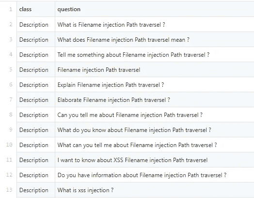
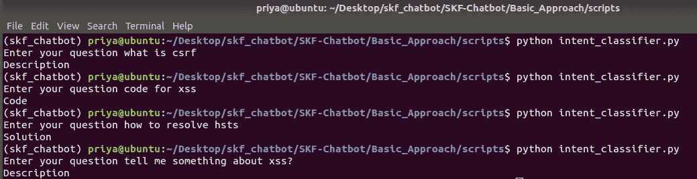

# 多标签意图分类

> 原文：<https://towardsdatascience.com/multi-label-intent-classification-1cdd4859b93?source=collection_archive---------5----------------------->

有很多应用需要文本分类，或者我们可以说意图分类。现在，所有的东西都需要分类，就像内容一样，产品也经常被分类。

但是网上绝大多数的文本分类文章和教程都是邮件垃圾过滤(spam vs. ham)、情感分析(正面 vs .负面)等二元文本分类。我们现实世界的问题要比这复杂得多。因此，这就是我要在这篇博客中解释的。将文本分类成多个类别。

**问题陈述:**

我为我的 GSoC 项目(Owasp SKF 聊天机器人)开发了这个分类器。问题陈述是针对不同漏洞的安全知识框架知识库。它提供了针对不同漏洞的描述、解决方案和代码示例。所以，我需要对用户的查询进行分类，无论他是要求描述、解决方案还是代码示例。

我使用了 [Python](https://www.python.org/) 和 [Jupyter Notebook](http://jupyter.org/) 来开发我们的系统，依靠 [Scikit-Learn](http://scikit-learn.org/stable/) 作为机器学习组件。

数据集的准备:

对于任何与分类或机器学习相关的问题，我们首先需要的是格式过于正确的数据。因此，首先我将解释我如何准备意图分类的数据集。

```
import json
import csv
with open("data.json",encoding='utf-8') as read_file:
        data = json.load(read_file)
```

可以在这里查看 data.json [。我将准备 CSV 格式的数据集，因为它很容易训练模型。](https://github.com/Priya997/SKF-Chatbot/blob/master/Basic_Approach/Scripts_to_prepare_dataset/data.json)

```
#For parsing the Json
a=data['items']
#Declaration of liststitle=[]
ques=[]
sol=[]
code=[]#For accessing the title from Json and storing it in the list.
for d in a: 
   title.append((d['title']))
```

我的文本分类是针对问答类系统的。因此，我需要生成问题，因为我提取了列表中的所有标题。

```
for t in title:
	ques.append("What is "+ t + " ?")
	ques.append("What does "+ t + " mean ?")
	ques.append("Tell me something about "+ t + " ?")
	ques.append(t)
	ques.append("Explain " + t +" ?")
	ques.append("Elaborate " + t +" ?")
	ques.append("Can you tell me about " + t + " ?")
	ques.append("What do you know about " + t + " ?")
	ques.append("What can you tell me about " + t + " ?")
	ques.append("I want to know about XSS " + t )
	ques.append("Do you have information about " + t + " ?")for t in title:
        sol.append("How to solve "+ t + " ?")
        sol.append("How to resolve "+ t + " ?")
        sol.append("How to mitigate "+ t + " ?")
        sol.append("Solution for "+ t)
        sol.append("Provide me some Solution for "+ t)
        sol.append("mitigation for "+ t)
        sol.append("How to stop "+ t + " ?")
        sol.append("How to defend "+ t + " ?")
        sol.append("How to get secured against "+ t + " ?")
        sol.append("Solution, "+t)

for t in title:
        code.append("Give me some sample code of "+ t )
        code.append("Code example of "+ t + " ?")
        code.append("Code of "+ t )
```

因此，问题需要根据描述、解决方案和代码进行分类。所以，我做了三个列表，每个列表存储一个问题。

```
file=open("intent_data.csv","x")
file.write('class,question\n')
for x in ques:
		x=x.replace(",","")
		file.write('Description, '+x+"\n")	 
for y in sol:
		y=y.replace(",","")
		file.write('Solution, '+y+"\n")

for z in code:
		z=z.replace(",","")
		file.write('Code, '+z+"\n")

file.close()
```



所以，现在数据准备好了。你可以在这里查看完整数据[。](https://github.com/Priya997/SKF-Chatbot/blob/master/Basic_Approach/datasets/intent_data.csv)

为了更好地理解如何准备数据集，您也可以查看这个 [jupyter 笔记本](https://github.com/Priya997/SKF-Chatbot/blob/master/Basic_Approach/notebook/intent_data_prepare.ipynb)示例。

现在，我们已经准备好数据😄...是时候用它变变魔术了。让我们看看如何对意图进行分类。

**让我们导入一些库:**

```
import pandas as pd
from io import StringIO
from sklearn.feature_extraction.text import TfidfVectorizer
from sklearn.model_selection import train_test_split
from sklearn.feature_extraction.text import CountVectorizer
from sklearn.feature_extraction.text import TfidfTransformer
from sklearn.naive_bayes import MultinomialNB
```

首先，我们将从 CSV 文件中提取数据，并将其存储在数据帧中。

```
def get_data():
    df = pd.read_csv('datasets/intent_data.csv')
    return df
```

在这一步中，我们将准备好数据以将其输入算法。首先，我们在**‘y’**中获得完整的数据，并使用

```
**y=[col]**
```

之后，使用' **pd.notnull'** 来检查问题列中的数据是否为空，如果为空，则将删除整行。

> 这一步对于获得高质量的干净数据非常重要。因为，如果我们有好的数据，我们就会有好的结果。😃

我们将创建一个新的列**‘category _ id’**，它将给出一个班级编号。类似于描述，它将是 0，解决方案 1 和代码 2。

删除重复后，我们将得到类似这样的东西

```
category_id_df = y[['classs', 'category_id']].**drop_duplicates()**.sort_values('category_id')
**print(category_id_df)****classs                category_id**
0       Description         0
2       Solution            1
5081    Code                2
```

可以查看下面 data_prepare 的代码片段。

```
def data_prepare():
    col = ['classs', 'question']
    y=get_data()
    y = y[col]
    y = y[pd.notnull(y['question'])]
    y.columns = ['classs', 'question']
    y['category_id'] = y['classs'].factorize()[0]
    category_id_df = y[['classs', 'category_id']].drop_duplicates().sort_values('category_id')
    category_to_id = dict(category_id_df.values)
    id_to_category = dict(category_id_df[['category_id', 'classs']].values) **#This will add the column in our dataframe**
    return y
```

我使用了多项式朴素贝叶斯算法进行预测，因为我发现它易于实现并且具有很高的准确性。

OneVsRest 策略可用于多标签学习，例如，使用分类器来预测多个标签。朴素贝叶斯支持多类，但我们处于多标签场景中，因此，我们将朴素贝叶斯包装在 OneVsRestClassifier 中。

> **OneVsRest 多标签策略**
> 
> 多标签算法接受多个标签上的二进制掩码。每个预测的结果将是一个由 0 和 1 组成的数组，用于标记哪些类标签适用于每个行输入样本。

为了更好地理解下面的代码片段和多项式 Naive_bayes，请尝试[这个](http://scikit-learn.org/stable/modules/generated/sklearn.naive_bayes.MultinomialNB.html)。

一个简短的概述是:在这里，我将我的数据分为测试数据和训练数据，然后将这些数据输入到模型中。

```
def naive_algo():
    tfidf = TfidfVectorizer(sublinear_tf=True, min_df=5, norm='l2', encoding='latin-1', ngram_range=(1, 2), stop_words='english')
    df=data_prepare()
    features = tfidf.fit_transform(df.question).toarray()
    labels = df.category_id
    features.shape
    X_train, X_test, y_train, y_test = train_test_split(df['question'], df['classs'], random_state = 0)
    count_vect = CountVectorizer()
    X_train_counts = count_vect.fit_transform(X_train)
    tfidf_transformer = TfidfTransformer()
    X_train_tfidf = tfidf_transformer.fit_transform(X_train_counts)
    clf = MultinomialNB().fit(X_train_tfidf, y_train)
    return clf,count_vect
```

我还尝试了其他算法或模型，如线性 SVC、逻辑回归和随机森林。你可以看看这里的那个。

这将给我们最终的预测。

```
def predict(question):
    clf,count_vect=naive_algo()
    intent=clf.predict(count_vect.transform([question]))
    intent=str(intent).strip("['']")
    return intent
```

最后，我们输入问题，并将其传递给 predict 函数，然后等待变魔术。😝

```
ques=input("Enter your question ")
x=predict(ques)
```



漂亮，准确，不是吗？

您可以查看本[笔记本](https://github.com/Priya997/SKF-Chatbot/blob/master/Basic_Approach/notebook/Intent_classifier.ipynb)以更好地了解意图分类。

> 感谢阅读！如果你喜欢它，请鼓掌，评论(评论或质疑)并分享它😄
> 
> 你可以在 [Github](https://github.com/Priya997) 、 [Linkedin](https://www.linkedin.com/in/priyanka997/) 、 [Twitter](https://twitter.com/priyankajain997) 上和我联系😄

更多内容，请点击下面的“给我买杯咖啡”图标支持我。

[](https://www.buymeacoffee.com/priyankajain97)