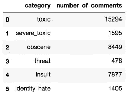
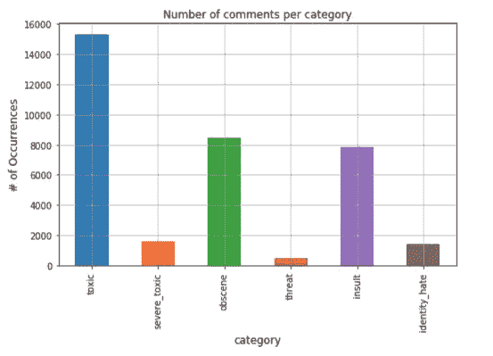
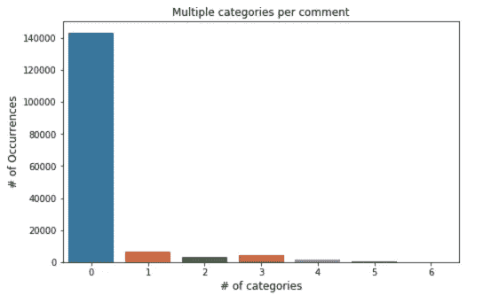
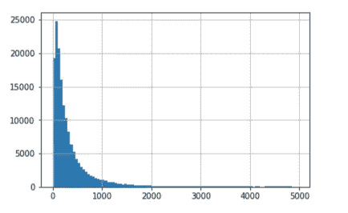

# 使用 Scikit-Learn 进行多标签文本分类

> 原文：<https://towardsdatascience.com/multi-label-text-classification-with-scikit-learn-30714b7819c5?source=collection_archive---------0----------------------->


Photo credit: Pexels

[多类分类](/multi-class-text-classification-with-scikit-learn-12f1e60e0a9f)指两个以上类的分类任务；每个标签都是互斥的。分类假设每个样本被分配给一个且仅一个标签。

另一方面，[多标签分类](https://en.wikipedia.org/wiki/Multi-label_classification)给每个样本分配一组目标标签。这可以被认为是预测数据点的属性，这些属性并不相互排斥，例如 Tim Horton 经常被归类为面包店和咖啡店。多标签文本分类在现实世界中有很多应用，比如对 Yelp 上的企业进行分类，或者将电影分为一个或多个类型。

# 问题定式化

任何在网上成为辱骂或骚扰目标的人都会知道，当你注销或关掉手机时，这种情况不会消失。谷歌的研究人员正致力于研究在线有毒评论的工具。在这篇文章中，我们将建立一个多标签模型，能够检测不同类型的毒性，如严重中毒，威胁，淫秽，侮辱，等等。我们将使用监督分类器和文本表示。毒性评论可能是关于毒性、严重毒性、淫秽、威胁、侮辱或身份仇恨中的任何一种，也可能不是以上任何一种。数据集可以在[卡格尔](https://www.kaggle.com/jhoward/nb-svm-strong-linear-baseline/data)找到。

(*来自数据源的免责声明:数据集包含可能被视为亵渎、粗俗或冒犯的文本。)*

# 探索

```
%matplotlib inline
import re
import matplotlib
import numpy as np
import matplotlib.pyplot as plt
import pandas as pd
from sklearn.model_selection import train_test_split
from sklearn.feature_extraction.text import TfidfVectorizer
from sklearn.naive_bayes import MultinomialNB
from sklearn.metrics import accuracy_score
from sklearn.multiclass import OneVsRestClassifier
from nltk.corpus import stopwords
stop_words = set(stopwords.words('english'))
from sklearn.svm import LinearSVC
from sklearn.linear_model import LogisticRegression
from sklearn.pipeline import Pipeline
import seaborn as snsdf = pd.read_csv("train 2.csv", encoding = "ISO-8859-1")
df.head()
```

**每个类别中的评论数量**

```
df_toxic = df.drop(['id', 'comment_text'], axis=1)
counts = []
categories = list(df_toxic.columns.values)
for i in categories:
    counts.append((i, df_toxic[i].sum()))
df_stats = pd.DataFrame(counts, columns=['category', 'number_of_comments'])
df_stats
```



Figure 1

```
df_stats.plot(x='category', y='number_of_comments', kind='bar', legend=False, grid=True, figsize=(8, 5))
plt.title("Number of comments per category")
plt.ylabel('# of Occurrences', fontsize=12)
plt.xlabel('category', fontsize=12)
```



Figure 2

# 多标签

**有多少评论有多重标签？**

```
rowsums = df.iloc[:,2:].sum(axis=1)
x=rowsums.value_counts()#plot
plt.figure(figsize=(8,5))
ax = sns.barplot(x.index, x.values)
plt.title("Multiple categories per comment")
plt.ylabel('# of Occurrences', fontsize=12)
plt.xlabel('# of categories', fontsize=12)
```



Figure 3

绝大多数评论文字都没有标注。

```
print('Percentage of comments that are not labelled:')
print(len(df[(df['toxic']==0) & (df['severe_toxic']==0) & (df['obscene']==0) & (df['threat']== 0) & (df['insult']==0) & (df['identity_hate']==0)]) / len(df))
```

***未标注评论的百分比:
0.8983211235124177***

**评论文本字数分布**。

```
lens = df.comment_text.str.len()
lens.hist(bins = np.arange(0,5000,50))
```



Figure 4

大多数评论文本长度在 500 个字符以内，有些异常值长达 5000 个字符。

注释文本列中没有缺失的注释。

```
print('Number of missing comments in comment text:')
df['comment_text'].isnull().sum()
```

***注释文本中缺失的注释数:***

***0***

先偷看一下第一条评论，文字需要清理。

```
df['comment_text'][0]
```

" ***解释\ r 为什么在我的用户名 Hardcore Metallica Fan 下所做的编辑被恢复？他们不是故意破坏，只是我在纽约娃娃 FAC 投票后关闭了一些煤气。请不要把模板从对话页面上删除，因为我现在退休了。89.205.38.27*** ”

# 数据预处理

创建一个函数来清理文本

```
def clean_text(text):
    text = text.lower()
    text = re.sub(r"what's", "what is ", text)
    text = re.sub(r"\'s", " ", text)
    text = re.sub(r"\'ve", " have ", text)
    text = re.sub(r"can't", "can not ", text)
    text = re.sub(r"n't", " not ", text)
    text = re.sub(r"i'm", "i am ", text)
    text = re.sub(r"\'re", " are ", text)
    text = re.sub(r"\'d", " would ", text)
    text = re.sub(r"\'ll", " will ", text)
    text = re.sub(r"\'scuse", " excuse ", text)
    text = re.sub('\W', ' ', text)
    text = re.sub('\s+', ' ', text)
    text = text.strip(' ')
    return text
```

清理 comment_text 列:

```
df['comment_text'] = df['comment_text'].map(lambda com : clean_text(com))df['comment_text'][0]
```

***解释为什么我的用户名 hardcore metallica fan 下所做的编辑被恢复，他们不是故意破坏，只是在我在纽约娃娃 fac 投票后关闭了一些气体，请不要从对话页面删除模板，因为我现在退休了 89 205 38 27***

好多了！

将数据拆分为定型集和测试集:

```
categories = ['toxic', 'severe_toxic', 'obscene', 'threat', 'insult', 'identity_hate']train, test = train_test_split(df, random_state=42, test_size=0.33, shuffle=True)X_train = train.comment_text
X_test = test.comment_text
print(X_train.shape)
print(X_test.shape)
```

***(106912，)
(52659，)***

# 分类器训练

## 管道

Scikit-learn 提供了一个管道实用程序来帮助自动化机器学习工作流。管道在机器学习系统中非常常见，因为有大量数据要操作，并且有许多数据转换要应用。因此，我们将利用流水线来训练每个分类器。

## OneVsRest 多标签策略

多标签算法接受多个标签上的二进制掩码。每个预测的结果将是一个由 0 和 1 组成的数组，用于标记哪些类标签适用于每个行输入样本。

## 朴素贝叶斯

OneVsRest 策略可用于多标签学习，例如，使用分类器来预测多个标签。朴素贝叶斯支持多类，但我们处于多标签场景中，因此，我们将朴素贝叶斯包装在 OneVsRestClassifier 中。

```
# Define a pipeline combining a text feature extractor with multi lable classifier
NB_pipeline = Pipeline([
                ('tfidf', TfidfVectorizer(stop_words=stop_words)),
                ('clf', OneVsRestClassifier(MultinomialNB(
                    fit_prior=True, class_prior=None))),
            ])for category in categories:
    print('... Processing {}'.format(category))
    # train the model using X_dtm & y
    NB_pipeline.fit(X_train, train[category])
    # compute the testing accuracy
    prediction = NB_pipeline.predict(X_test)
    print('Test accuracy is {}'.format(accuracy_score(test[category], prediction)))
```

***…处理有毒
测试精度为 0.9191401279933155
…处理严重 _ 有毒
测试精度为 0.9900112041626312
…处理淫秽
测试精度为 0.95148027877747584
…处理威胁
测试精度为 0.9971135033***

## 线性 SVC

```
SVC_pipeline = Pipeline([
                ('tfidf', TfidfVectorizer(stop_words=stop_words)),
                ('clf', OneVsRestClassifier(LinearSVC(), n_jobs=1)),
            ])for category in categories:
    print('... Processing {}'.format(category))
    # train the model using X_dtm & y
    SVC_pipeline.fit(X_train, train[category])
    # compute the testing accuracy
    prediction = SVC_pipeline.predict(X_test)
    print('Test accuracy is {}'.format(accuracy_score(test[category], prediction)))
```

***…处理有毒
测试精度为 0.9599498661197516
…处理严重 _ 有毒
测试精度为 0.9906948479842003
…处理淫秽
测试精度为 0.9789019920621356
…处理威胁
测试精度为 0.997417334***

## 逻辑回归

```
LogReg_pipeline = Pipeline([
                ('tfidf', TfidfVectorizer(stop_words=stop_words)),
                ('clf', OneVsRestClassifier(LogisticRegression(solver='sag'), n_jobs=1)),
            ])for category in categories:
    print('... Processing {}'.format(category))
    # train the model using X_dtm & y
    LogReg_pipeline.fit(X_train, train[category])
    # compute the testing accuracy
    prediction = LogReg_pipeline.predict(X_test)
    print('Test accuracy is {}'.format(accuracy_score(test[category], prediction)))
```

***…处理有毒的
测试精度为 0.9548415275641391
…处理严重 _ 有毒的
测试精度为 0.9910556600011394
…处理淫秽的
测试精度为 0.9761104464573956
…处理威胁的
测试精度为 0.999779395***

三个分类器产生了相似的结果。我们已经为有毒评论多标签文本分类问题创建了一个强大的基线。

这篇文章的完整代码可以在 Github 上找到。我期待听到任何反馈或意见。