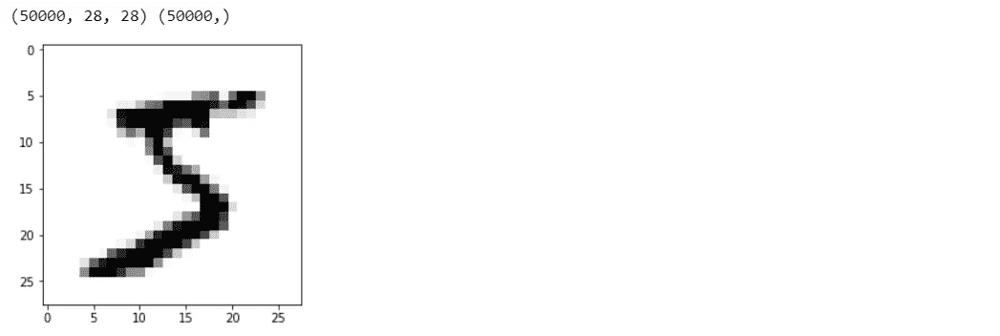
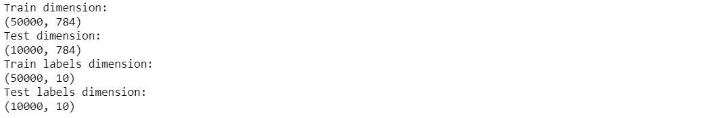
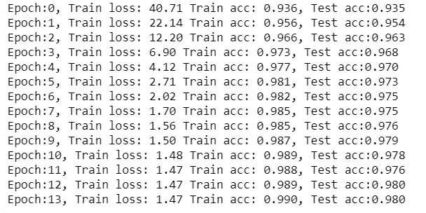
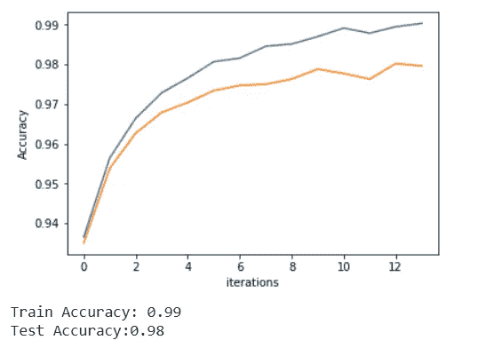

# 使用张量流的多层感知器

> 原文：<https://towardsdatascience.com/multi-layer-perceptron-using-tensorflow-9f3e218a4809?source=collection_archive---------4----------------------->

## 构建多层感知器和张量流的入门指南，用于构建数字识别系统。

在这篇博客中，我们将使用 TensorFlow 构建一个神经网络(多层感知器)，并成功训练它识别图像中的数字。Tensorflow 是由发布的非常受欢迎的深度学习框架，本笔记本将指导使用该库构建神经网络。如果你想了解什么是多层感知器，你可以看看我之前的博客，在那里我用 Numpy 从头构建了一个多层感知器。

让我们从导入数据开始。作为 Keras，一个高级深度学习库已经将 MNIST 数据作为其默认数据的一部分，我们只是从那里导入数据集，并将其分为训练集和测试集。

```
*## Loading MNIST dataset from keras*
**import** **keras**
**from** **sklearn.preprocessing** **import** LabelBinarizer
**import** **matplotlib.pyplot** **as** **plt**
%matplotlib inline**def** load_dataset(flatten=**False**):
    (X_train, y_train), (X_test, y_test) = keras.datasets.mnist.load_data() *# normalize x*
    X_train = X_train.astype(float) / 255.
    X_test = X_test.astype(float) / 255. *# we reserve the last 10000 training examples for validation*
    X_train, X_val = X_train[:-10000], X_train[-10000:]
    y_train, y_val = y_train[:-10000], y_train[-10000:] **if** flatten:
        X_train = X_train.reshape([X_train.shape[0], -1])
        X_val = X_val.reshape([X_val.shape[0], -1])
        X_test = X_test.reshape([X_test.shape[0], -1]) **return** X_train, y_train, X_val, y_val, X_test, y_testX_train, y_train, X_val, y_val, X_test, y_test = load_dataset()
*## Printing dimensions*
print(X_train.shape, y_train.shape)
*## Visualizing the first digit*
plt.imshow(X_train[0], cmap="Greys");
```



正如我们所看到的，我们当前的数据的维数为 N *28** 28，我们将从展平 N*784 中的图像开始，并对我们的目标变量进行一次性编码。

```
*## Changing dimension of input images from N*28*28 to  N*784*
X_train = X_train.reshape((X_train.shape[0],X_train.shape[1]*X_train.shape[2]))
X_test = X_test.reshape((X_test.shape[0],X_test.shape[1]*X_test.shape[2]))print('Train dimension:');print(X_train.shape)
print('Test dimension:');print(X_test.shape)*## Changing labels to one-hot encoded vector*
lb = LabelBinarizer()
y_train = lb.fit_transform(y_train)
y_test = lb.transform(y_test)
print('Train labels dimension:');print(y_train.shape)
print('Test labels dimension:');print(y_test.shape)
```



现在我们已经处理了数据，让我们开始使用 tensorflow 构建我们的多层感知器。我们将从导入所需的库开始。

```
*## Importing required libraries*
**import** **numpy** **as** **np**
**import** **tensorflow** **as** **tf**
**from** **sklearn.metrics** **import** roc_auc_score, accuracy_score
s = tf.InteractiveSession()
```

*tf。InteractiveSession()* 是一种无论何时我们想要运行一个模型，都可以直接运行 tensorflow 模型而无需实例化一个图的方法。我们将建立 784(输入)-512(隐藏层 1)-256(隐藏层 2)-10(输出)神经网络模型。让我们从定义初始化变量开始我们的模型构建。

```
*## Defining various initialization parameters for 784-512-256-10 MLP model*
num_classes = y_train.shape[1]
num_features = X_train.shape[1]
num_output = y_train.shape[1]
num_layers_0 = 512
num_layers_1 = 256
starter_learning_rate = 0.001
regularizer_rate = 0.1
```

在 tensorflow 中，我们为输入变量和输出变量以及任何我们想要跟踪的变量定义了一个占位符。

```
*# Placeholders for the input data*
input_X = tf.placeholder('float32',shape =(**None**,num_features),name="input_X")
input_y = tf.placeholder('float32',shape = (**None**,num_classes),name='input_Y')
*## for dropout layer*
keep_prob = tf.placeholder(tf.float32)
```

因为密集图层需要权重和偏差，并且需要使用零均值和小方差(1/要素数量的平方根)的随机正态分布进行初始化。

```
*## Weights initialized by random normal function with std_dev = 1/sqrt(number of input features)*
weights_0 = tf.Variable(tf.random_normal([num_features,num_layers_0], stddev=(1/tf.sqrt(float(num_features)))))
bias_0 = tf.Variable(tf.random_normal([num_layers_0]))weights_1 = tf.Variable(tf.random_normal([num_layers_0,num_layers_1], stddev=(1/tf.sqrt(float(num_layers_0)))))
bias_1 = tf.Variable(tf.random_normal([num_layers_1]))weights_2 = tf.Variable(tf.random_normal([num_layers_1,num_output], stddev=(1/tf.sqrt(float(num_layers_1)))))
bias_2 = tf.Variable(tf.random_normal([num_output]))
```

现在我们将开始编写图形计算来开发我们的 *784(输入)-512(隐藏层 1)-256(隐藏层 2)-10(输出)模型*。我们将把每一层的输入乘以其各自的权重，并添加偏差项。在权重和偏差之后，我们需要添加一个激活；我们将对隐藏层使用 ReLU activation，对最终输出层使用 softmax 来获得类概率分数。也是为了防止过度拟合；让我们在每个隐藏层后添加一些 drop out。辍学是在我们的网络中产生冗余的一个基本概念，这导致了更好的泛化。

```
*## Initializing weigths and biases*
hidden_output_0 = tf.nn.relu(tf.matmul(input_X,weights_0)+bias_0)
hidden_output_0_0 = tf.nn.dropout(hidden_output_0, keep_prob)hidden_output_1 = tf.nn.relu(tf.matmul(hidden_output_0_0,weights_1)+bias_1)
hidden_output_1_1 = tf.nn.dropout(hidden_output_1, keep_prob)predicted_y = tf.sigmoid(tf.matmul(hidden_output_1_1,weights_2) + bias_2)
```

现在，我们需要定义一个损失函数来优化我们的权重和偏差，我们将使用 softmax 交叉熵和 logits 来预测和正确的标签。我们也将增加一些 L2 正则化到我们的网络。

```
*## Defining the loss function*
loss = tf.reduce_mean(tf.nn.softmax_cross_entropy_with_logits_v2(logits=predicted_y,labels=input_y)) \
        + regularizer_rate*(tf.reduce_sum(tf.square(bias_0)) + tf.reduce_sum(tf.square(bias_1)))
```

现在，我们需要为我们的网络定义一个优化器和学习率，以优化给定损失函数的权重和偏差。我们将每五个时期对我们的学习速率使用指数衰减，以减少 15%的学习。对于优化器，我们将使用 Adam 优化器。

```
*## Variable learning rate*
learning_rate = tf.train.exponential_decay(starter_learning_rate, 0, 5, 0.85, staircase=**True**)
*## Adam optimzer for finding the right weight*
optimizer = tf.train.AdamOptimizer(learning_rate).minimize(loss,var_list=[weights_0,weights_1,weights_2,
                                                                         bias_0,bias_1,bias_2])
```

我们已经完成了模型构建。让我们定义准确性度量来评估我们的模型性能，因为损失函数是非直观的。

```
*## Metrics definition*
correct_prediction = tf.equal(tf.argmax(y_train,1), tf.argmax(predicted_y,1))
accuracy = tf.reduce_mean(tf.cast(correct_prediction, tf.float32))
```

我们现在将开始在训练数据上训练我们的网络，同时在测试数据集上评估我们的网络。我们将使用大小为 128 的批处理优化，并训练它 14 个时期，以获得 98%以上的准确性。

```
*## Training parameters*
batch_size = 128
epochs=14
dropout_prob = 0.6training_accuracy = []
training_loss = []
testing_accuracy = []s.run(tf.global_variables_initializer())
**for** epoch **in** range(epochs):    
    arr = np.arange(X_train.shape[0])
    np.random.shuffle(arr)
    **for** index **in** range(0,X_train.shape[0],batch_size):
        s.run(optimizer, {input_X: X_train[arr[index:index+batch_size]],
                          input_y: y_train[arr[index:index+batch_size]],
                        keep_prob:dropout_prob})
    training_accuracy.append(s.run(accuracy, feed_dict= {input_X:X_train, 
                                                         input_y: y_train,keep_prob:1}))
    training_loss.append(s.run(loss, {input_X: X_train, 
                                      input_y: y_train,keep_prob:1}))

    *## Evaluation of model*
    testing_accuracy.append(accuracy_score(y_test.argmax(1), 
                            s.run(predicted_y, {input_X: X_test,keep_prob:1}).argmax(1)))
    print("Epoch:**{0}**, Train loss: **{1:.2f}** Train acc: **{2:.3f}**, Test acc:**{3:.3f}**".format(epoch,
                                                                    training_loss[epoch],
                                                                    training_accuracy[epoch],
                                                                   testing_accuracy[epoch]))
```



让我们可视化训练并测试作为历元数的函数的准确性。

```
*## Plotting chart of training and testing accuracy as a function of iterations*
iterations = list(range(epochs))
plt.plot(iterations, training_accuracy, label='Train')
plt.plot(iterations, testing_accuracy, label='Test')
plt.ylabel('Accuracy')
plt.xlabel('iterations')
plt.show()
print("Train Accuracy: **{0:.2f}**".format(training_accuracy[-1]))
print("Test Accuracy:**{0:.2f}**".format(testing_accuracy[-1]))
```



正如我们所看到的，我们已经成功训练了一个多层感知器，它是用 tensorflow 编写的，具有很高的验证准确性！

我希望你喜欢阅读，并随时使用我的代码(也可以在 [jupyter 笔记本](https://github.com/aayushmnit/Deep_learning_explorations/blob/master/2_MLP_tensorflow/my1stNN.ipynb)中找到)来为你的目的进行测试。此外，如果对代码或博客有任何反馈，请随时联系 aayushmnit@gmail.com 的 [LinkedIn](https://www.linkedin.com/in/aayushmnit/) 或给我发电子邮件。