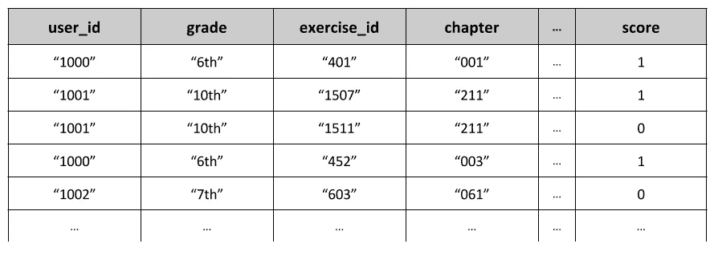
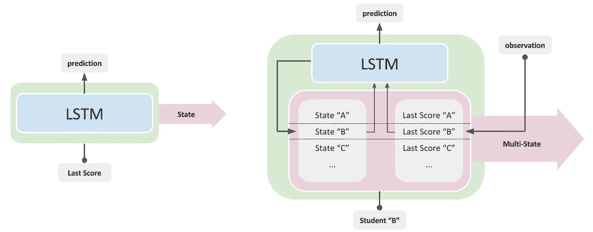
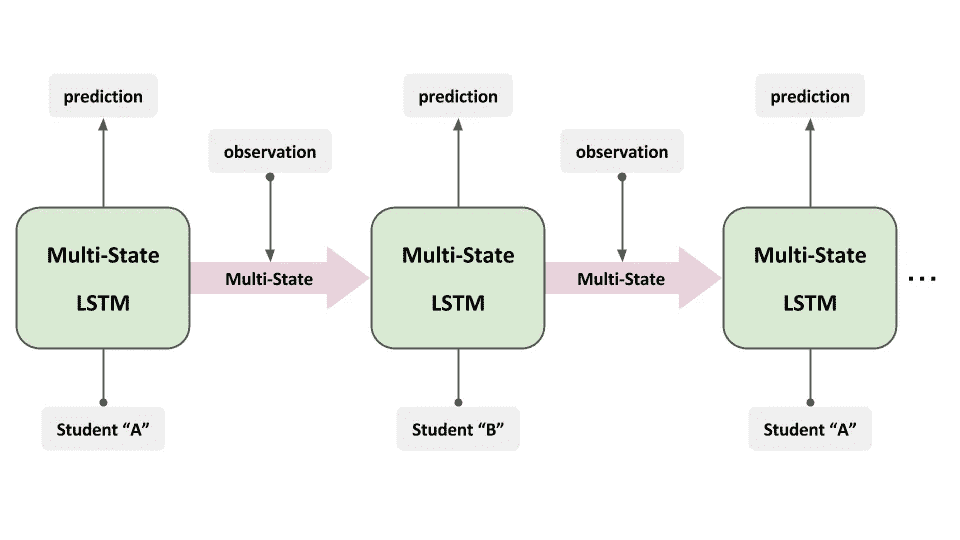
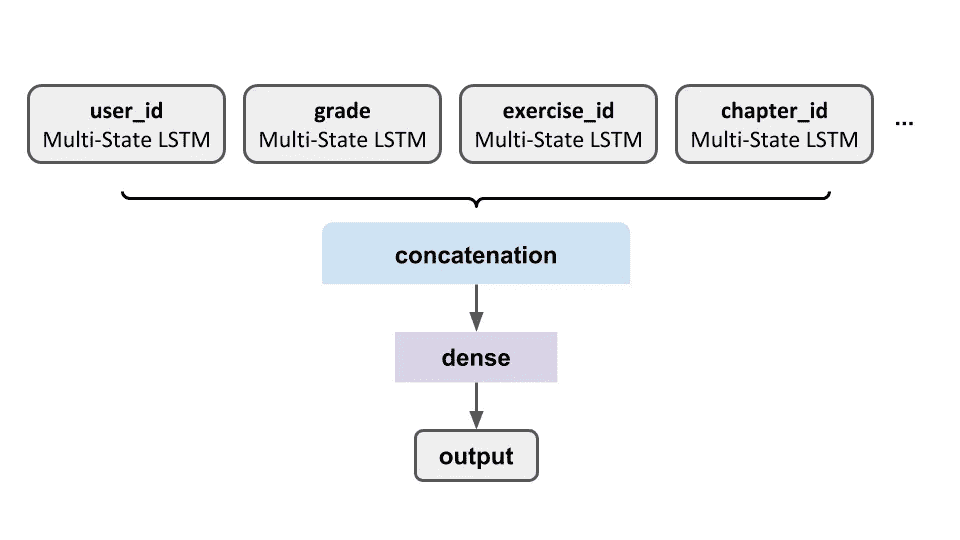
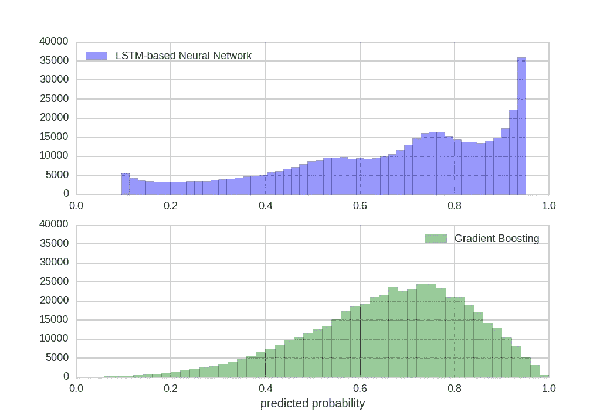

# 分类特征的多态 LSTMs

> 原文：<https://towardsdatascience.com/multi-state-lstms-for-categorical-features-66cc974df1dc?source=collection_archive---------2----------------------->

# 语境

**神经网络**现在在很多方面都有广泛的应用。从图像标题生成到乳房癌症预测，这种巨大的应用多样性是各种重要的**神经架构** ( **前馈**神经网络、**卷积**神经网络等)的自然结果。在所有这些架构中，**长短期记忆**(**LSTM**)——递归神经网络的一个特例——已经被证明在诸如[机器翻译](https://www.tensorflow.org/tutorials/seq2seq)、[时间序列预测](http://machinelearningmastery.com/time-series-prediction-lstm-recurrent-neural-networks-python-keras/)或任何数据为**顺序**的任务上非常成功。这主要是由于他们能够记忆相对的**长期相关性**，这是通过考虑先前的信息以进行进一步预测来实现的。

> 但是仅靠 LSTMs 是不够的。有时我们需要调整这些层，使它们适应手头的任务。

在 [**Kwyk**](https://www.kwyk.fr/) ，我们提供**在线数学练习**。每次回答一个练习，我们都会收集一些数据，然后使用网站为每个学生量身定制作业。为了确定哪些练习最有可能让学生进步，我们需要知道他/她在任何给定的时间点上成功完成每个练习的可能性有多大。通过正确预测这些**成功概率**，我们可以选择**最大化整体进度**的作业。

这篇文章旨在介绍我们改进的 LSTM 单元“**多态 LSTM** ”，我们的模型就是基于它来尝试解决这个问题的。

# 快速数据概述

当一个练习被回答时，我们保存关于学生(或“用户”)和练习的信息，以及一个额外的**分数**值，该值是(0)还是(1)取决于用户的成功。我们收集的信息以**分类特征**的形式告诉我们:“**是哪个练习？**“，”**是哪一章？**、**、**、**是什么学生？**、**、**、**他/她是哪个年级的？**“…这会产生具有几十到几千种形态的特征，我们用它们来预测“得分”变量并获得**成功概率**。

A sample of our data

# 基于 LSTM 的模型

选择 LSTM 模式背后有两个主要动机。

第一个原因是我们使用的所有特征都是绝对的。这就是我们想要学习的真正信息来源。通过手动烹饪特征，如之前得分的移动平均值，我们会因自己的主观选择而引入**偏差**。因此，我们选择依靠**神经网络，**直接反馈我们的数据，让特征自动形成****客观形成**。**

**第二个动机是在所有可用的架构中选择 LSTM。这仅仅是因为我们相信，对于每个学生来说，每次练习成功的概率**取决于所有之前的时间结果**，因此**是连续的**。**

> **考虑到这一点，我们想到了一种架构，其中对于每个分类特征，共享的 LSTM 将保存每个模态的先前结果的历史。**

**让我们以“ **user_id** ”特性为例。在这种情况下，我们需要改编一个 LSTM 细胞来即时记忆每个学生过去如何成功的历史。这是通过在基本的 LSTM 单元中添加我们称之为“T42”的多状态“T43”来实现的:**

****

****Left** : Basic LSTM cell / **Right** : Multi-state LSTM cell. Note : If you are not familiar with LSTMs you can refer to [this great post by Christopher Olah](http://colah.github.io/posts/2015-08-Understanding-LSTMs/).**

**每次一个学生的标签被馈送到多状态 LSTM 单元，它就开始查找相应的**状态**和**以前的分数**。然后，学生的状态被发送到**更新**一个**共享 LSTM 单元**。同时，先前的分数被馈送到这个 LSTM 单元，该单元产生一个**输出**。接下来，产生的**状态**返回到**更新**多状态中的学生数据。最后，一旦我们观察到实际的**分数**，这个值又被发送到**更新**学生在多状态中的先前分数。**

**这个基本 LSTM 单元的修改版本工作方式类似，但有一个额外的优势:它现在可以直接接受一系列学生标签作为输入:**

****

**An unrolled Multi-state LSTM.**

**在前面的例子中，我们考虑了“user_id”分类特性，但这实际上可以应用于我们所有的分类特性。事实上，举例来说，在“ **exercise_id** ”功能上使用多状态 LSTM 将导致它学习每个练习的**历史成功率**。从这里开始，我们使用的完整网络非常简单:**

****

**The complete graph we used to solve our problem.**

**总而言之，这种架构试图学习每个分类特征的每个模态的单独历史，然后使用 LSTM 的输出来预测给定学生在给定练习中的成功概率。**

# ****结果****

## **基线**

**为了评估我们基于 LSTM 的模型，我们需要一个基准。在尝试任何深度学习方法之前，我们曾经有一个 boosting 算法( [**梯度 Boosting**](http://scikit-learn.org/stable/modules/generated/sklearn.ensemble.GradientBoostingClassifier.html#sklearn.ensemble.GradientBoostingClassifier) )使用了一些手工特征。从所有的分类特征中，我们为每个特征的每个模态编造了一些先前得分的**快** [**移动平均值**](https://en.wikipedia.org/wiki/Moving_average#Exponential_moving_average) 。然后，我们将这些特征输入到梯度推进分类器中，让奇迹发生。**

## **比较**

**两个分类器都有相同的方法。事实上，基线模型使用手工移动平均线作为特征，基于 LSTM 的方法自动学习这些历史来预测分数。果不其然，两种算法得到了相近的准确率分数(基线:74.61%，LSTM 基网络: **75.34%** )。但预测的分布却大不相同:**

****

**We can see that the LSTM-based model is much better at segregating students.**

**事实上，基于 LSTM 的模型似乎将*分成了 3 到 4 个不同的人群*:**

*   **一个给不应该能答对的学生(概率<10%)**
*   **One for those who have a moderate to good chance to succeed (50<probability these="" can="" be="" students="" for="" whom="" we="" don="" have="" enough="" data="" or="" simply="" good-average="" students.=""></probability>**
*   **One for those who have a very important chance of succeeding (probability> 90%)。**

**相反，基线只预测了总体平均成功率周围的偏斜正态分布，没有特别的歧视。**

**但是，为了进一步研究这两种模型之间的差异，我们需要更详细地了解 MSE。事实上，单从 MSE 来看，这两种模型具有相似的性能:**

*   **基线:0.17**
*   **LSTM 网络: **0.16****

**但是正如我们在[之前的帖子](https://medium.com/towards-data-science/metrics-random-processes-in-classification-fd5bafa79505)中所讨论的，当真正的随机性与目标相关联时(这里，预测人类行为)，我们可以通过查看其**可靠性度量(REL)** 来更好地评估分类器的性能。**

**通过将数据分类到相似预测概率的箱中来计算可靠性。然后，我们针对箱中的平均目标计算每个箱的 MSE。最后，我们取一个总平均值来得到我们的 REL 值。**

**为每个模型获得的指标是:**

*   **基线:3.86 e-3**
*   **LSTM 网络: **2.86 e-4****

**事实上，我们看到基于 LSTM 的网络比梯度推进基线精确 10 倍以上，这可以解释我们在比较两种分布时观察到的更好的分离。**

# **结论**

**总而言之，我们已经在一个真实的例子上看到了 **LSTM** s 对于**序列数据**分类是如何有效的。但是我们也看到了我们的**LSTM 的修改版本**—**多态 LSTM**—*如何能够在没有任何预处理或特征工程的情况下达到更好的性能*。事实上，这种新的 LSTM 细胞可以直接接受一系列标签作为输入，这意味着它**只能用于分类特征**并且仍然产生良好的结果。**

**为了进一步改进多状态 LSTM 的 T1，下一步将会考虑多个标签之间的 T2 相关性。事实上，当预测一个学生在给定的一对相似练习中的表现时，预测的概率应该非常相似。尝试确保这种行为的一种方法是将一个嵌入到网络中的的[练习集成起来，让它**学习依赖关系**。](https://medium.com/towards-data-science/a-non-nlp-application-of-word2vec-c637e35d3668)**

***作者:***