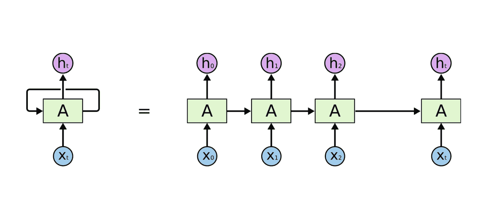
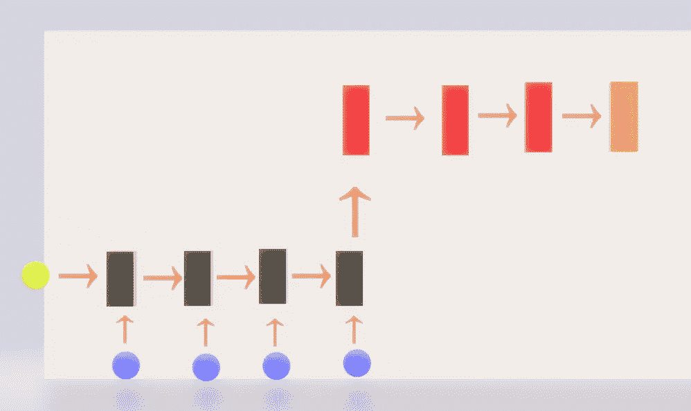
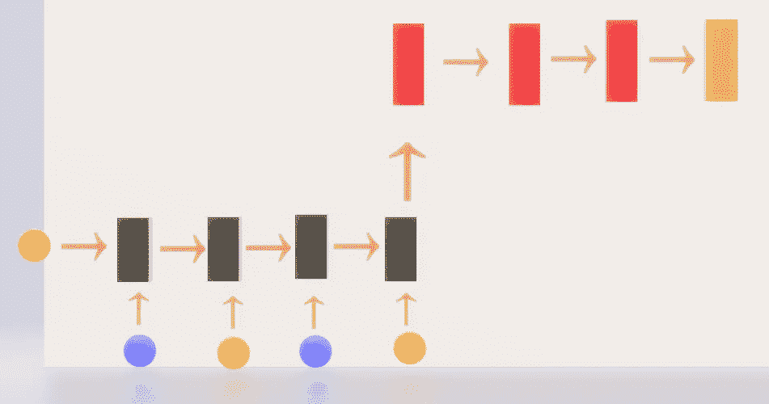
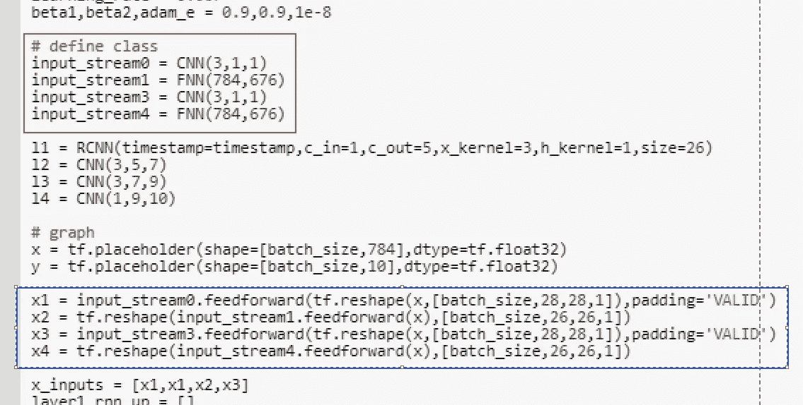
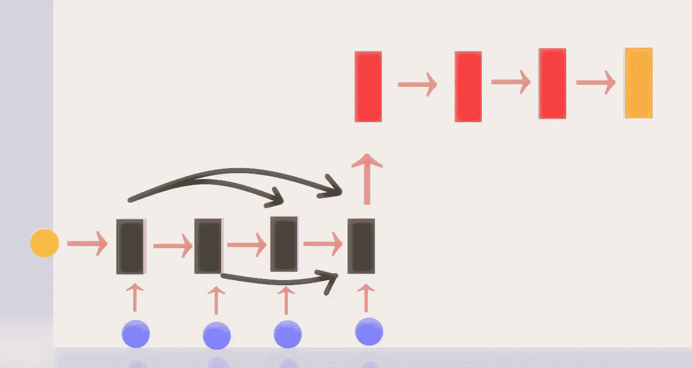
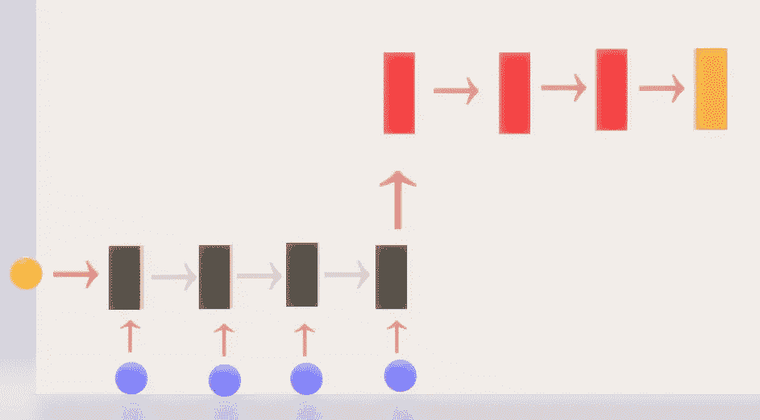
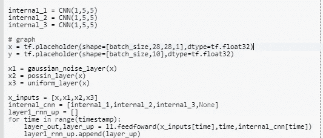
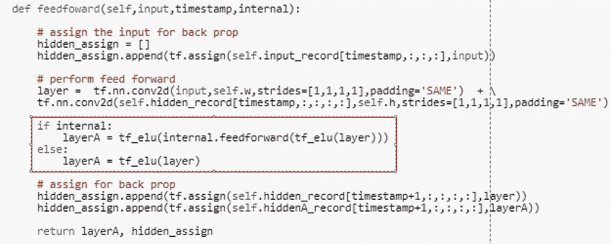
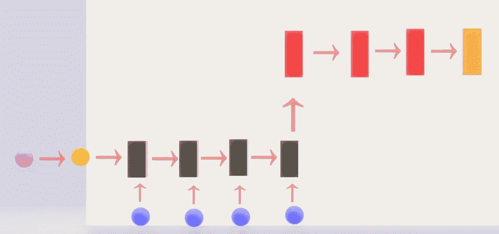
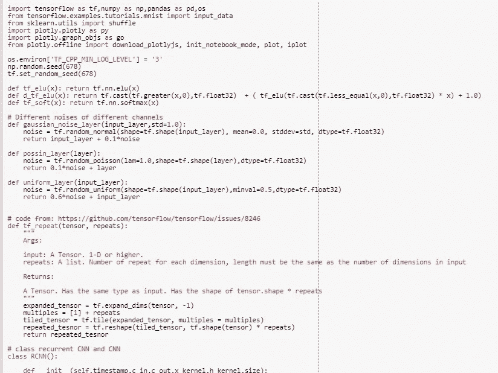

# 多流 RNN，串联 RNN，内部 Conv RNN，在 Tensorflow 中落后 2 RNN

> 原文：<https://towardsdatascience.com/multi-stream-rnn-concat-rnn-internal-conv-rnn-lag-2-rnn-in-tensorflow-f4f17189a208?source=collection_archive---------8----------------------->

GIF from this [website](https://giphy.com/stickers/parley-happy-4NkrKIHNO2fLtfxuWa)

在过去的两周里，我一直渴望实现不同种类的[递归神经网络](https://en.wikipedia.org/wiki/Recurrent_neural_network) (RNN)，最终我有时间实现它们。以下是我想尝试的不同 RNN 案例列表。

***案例 a:香草递归神经网络
案例 b:多流递归神经网络
案例 c:级联递归神经网络
案例 d:内部卷积递归神经网络
案例 e:滞后 2 递归神经网络***

> **请注意，所有这些模型只是为了好玩和表达我的创意。还有，我要在这篇文章中使用的基础代码来自我的旧文章“**[***OCR 的门控递归卷积 NN***](/nips-2017-tensorflow-gated-recurrent-convolution-neural-network-for-ocr-part-1-with-47bb2a8a7ab3)**”。**

**香草递归神经网络**

Image from this [website](https://machinelearning-blog.com/2018/02/21/recurrent-neural-networks/)

总共有 5 个不同的 RNN 案例我想执行。然而，为了完全理解所有的实现，最好对普通 RNN 有一个很好的理解(案例 a 是普通 RNN，所以如果你理解案例 a 的代码，你就可以开始了。)

如果有人想回顾简单的 RNN，请访问我的旧博客文章“ [*Only Numpy:香草递归神经网络通过时间实践推导反向传播*](https://medium.com/@SeoJaeDuk/only-numpy-vanilla-recurrent-neural-network-back-propagation-practice-math-956fbea32704) ”。

**案例 a:普通递归神经网络(结果)**

**红框** → 3 卷积层
→橙色 →全局平均池化和 SoftMax
**绿圈** →时间为 0 的隐藏单元
**蓝圈** →输入 4 个时间戳
**黑框** →带 4 个时间戳的递归神经网络

如上所述，基本网络是简单的 RNN 结合卷积神经网络用于分类。RNN 的时间戳为 4，这意味着我们将在每个时间戳向网络提供 4 种不同的输入。为此，我将在原始图像中添加一些噪声。

**蓝线** →一段时间内的训练成本
**橙线** →一段时间内的训练精度
**绿线** →一段时间内的测试成本
**红线** →一段时间内的测试精度

如上所述，我们的基础网络已经运行良好。现在的问题是其他方法表现如何，它是否能够比我们的基础网络更好地正规化。

**案例 b:多流递归神经网络(想法/结果)**

**红框** → 3 卷积层
橙框 →全局平均池化和 SoftMax
**绿框** →时间为 0 的隐藏单元
**蓝框** →卷积输入流
**黄框** →全连通网络流
**黑框** →带 4 时间戳的递归神经网络

这种 RNN 背后的想法只是为 RNN 提供不同的数据表示。在我们的基本网络中，我们有原始图像或添加了一些噪声的图像。

**红框** →增加四个 CNN/FNN 层来“处理”输入
**蓝框** →在每个不同的时间戳创建输入

如下图所示，我们的 RNN 使用[batch_size，26，26，1]将宽度和高度减少了 2 倍。我希望数据的不同表示可以作为一种正则化。(类似于数据扩充)

**蓝线** →一段时间内的训练成本
**橙线** →一段时间内的训练精度
**绿线** →一段时间内的测试成本
**红线** →一段时间内的测试精度

正如上面所看到的，网络做得很好，在测试图像上比我们的基础网络高出 1%。

**情况 c:级联递归神经网络(想法/结果)**

**红框** → 3 卷积层
→橙色 →全局平均池化和 SoftMax
**绿圈** →时间为 0 的隐藏单元
**蓝圈** →输入 4 个时间戳
→黑框 →带 4 个时间戳的递归神经网络
**黑弯箭头** →级联输入每个时间戳

这种方法非常简单，其思想是在每个时间戳上提取不同的特征，随着时间的推移，网络具有更多的特征可能是有用的。(对于循环层。)

**蓝线** →一段时间内的训练成本
**橙线** →一段时间内的训练精度
**绿线** →一段时间内的测试成本
**红线** →一段时间内的测试精度

可悲的是，这是一个巨大的失败。我猜空的隐藏值对网络的良好运行没有任何帮助。

**案例 d:内部卷积递归神经网络(想法/结果)**

**红框** → 3 卷积层
**橙框** →全局平均池和 SoftMax
**绿圈** →时间为 0 的隐藏单元
**蓝圈** →输入 4 个时间戳
**黑框** →带 4 个时间戳的递归神经网络
**灰色箭头** →在传递到下一个时间戳之前执行内部卷积

如上所述，这个网络与我们的基础网络接收完全相同的输入。然而，这次我们将在数据的内部表示中执行额外的卷积运算。

**右图** →声明 3 个新的卷积层
**左图(红框)** →如果当前内层不为无，我们将进行额外的卷积操作。

我实际上并没有在这个实现背后的理论原因，我只是想看看它是否工作 LOL。

**蓝线** →一段时间内的训练成本
**橙线** →一段时间内的训练精度
**绿线** →一段时间内的测试成本
**红线** →一段时间内的测试精度

如上所述，网络在融合方面做得很好，但是它无法超越我们的基础网络。(可悲)。

**情况 e:滞后 2 递归神经网络(想法/结果)**

**红框** → 3 卷积层
→橙框 →全局平均池化和 SoftMax
**绿圈** →时间为 0(或滞后 1)的隐藏单元
→蓝圈 →输入 4 个时间戳
**黑框** →带有 4 个时间戳的递归神经网络
**紫圈** →隐藏状态滞后 2

在传统的 RNN 设置中，我们仅依靠最早的值来确定当前值。有一段时间我在想，我们没有理由把回看时间(或滞后)限制为 1。我们可以将这个想法扩展到滞后 3 或滞后 4 等。(为了简单起见，我采用了滞后 2)

**蓝线** →一段时间内的训练成本
**橙线** →一段时间内的训练精度
**绿线** →一段时间内的测试成本
**红线** →一段时间内的测试精度

谢天谢地，这个网络比基础网络做得更好。(但是具有非常小的余量)，然而这种类型的网络将最适合于时间序列数据。

**交互式代码/透明度**

对于 Google Colab，你需要一个 Google 帐户来查看代码，而且你不能在 Google Colab 中运行只读脚本，所以在你的操场上复制一份。最后，我永远不会请求允许访问你在 Google Drive 上的文件，仅供参考。编码快乐！同样为了透明，我在 github 上上传了所有的训练日志。

要访问[案例的代码，请点击这里](https://colab.research.google.com/drive/1d4cKR1VxFsxyXAck1Mk-zQGvlVuWdOEw)，要查看[日志，请点击这里。](https://github.com/JaeDukSeo/Daily-Neural-Network-Practice-2/blob/master/NeuralNetwork/review_RNN/casea/casea.txt)
点击此处查看[案例 b 的代码](https://colab.research.google.com/drive/1U4zthQ9CmcwAi_mWrKVuTPqf88R0lxZz)，点击此处查看[日志。](https://github.com/JaeDukSeo/Daily-Neural-Network-Practice-2/blob/master/NeuralNetwork/review_RNN/caseb/caseb.txt)
要访问[案例 c 的代码，请点击此处](https://colab.research.google.com/drive/1oYvkITUp4WdfAx_xYw_Otg7dJr2rc2mz)，要查看[日志，请点击此处。](https://github.com/JaeDukSeo/Daily-Neural-Network-Practice-2/blob/master/NeuralNetwork/review_RNN/casec/casec.txt)
要访问[案例 c 的代码，请点击此处](https://colab.research.google.com/drive/1cQ48nzeBCGm5shW634TQmi9mYLIzP4JE)，要查看[日志，请点击此处。](https://github.com/JaeDukSeo/Daily-Neural-Network-Practice-2/blob/master/NeuralNetwork/review_RNN/cased/cased.txt)
点击此处查看[案例 c 的代码](https://colab.research.google.com/drive/1ahrQMwLMhpqQLjO7AHSL3707JdnMH-VN)，点击此处查看[日志。](https://github.com/JaeDukSeo/Daily-Neural-Network-Practice-2/blob/master/NeuralNetwork/review_RNN/casee/casee.txt)

**最后的话**

我想回顾 RNN 已经很久了，现在我终于可以这样做了。

如果发现任何错误，请发电子邮件到 jae.duk.seo@gmail.com 给我，如果你想看我所有的写作清单，请在这里查看我的网站。

同时，在我的 twitter 上关注我[这里](https://twitter.com/JaeDukSeo)，访问[我的网站](https://jaedukseo.me/)，或者我的 [Youtube 频道](https://www.youtube.com/c/JaeDukSeo)了解更多内容。我还实现了[广残网，请点击这里查看博文](https://medium.com/@SeoJaeDuk/wide-residual-networks-with-interactive-code-5e190f8f25ec) t。

**参考**

1.  【NIPS 2017/Part 1】用于 OCR 的带交互码的门控递归卷积 NN【手动反推…(2018).走向数据科学。检索于 2018 年 6 月 6 日，来自[https://towards data science . com/nips-2017-tensor flow-gated-recurrent-convolution-neural-network-for-ocr-part-1-with-47 bb 2 A8 a7 ab 3](/nips-2017-tensorflow-gated-recurrent-convolution-neural-network-for-ocr-part-1-with-47bb2a8a7ab3)
2.  带 Tensorflow 的软签激活功能【带 TF 的手动背道具】。(2018).走向数据科学。检索于 2018 年 6 月 6 日，来自[https://towards data science . com/soft-sign-activation-function-with-tensor flow-manual-back-prop-with-TF-5a 04 F3 c8 e9 c 1](/soft-sign-activation-function-with-tensorflow-manual-back-prop-with-tf-5a04f3c8e9c1)
3.  东格斯，V. (2018)。递归神经网络。machinelearning-blog.com。检索于 2018 年 6 月 6 日，来自[https://machine learning-blog . com/2018/02/21/recurrent-neural-networks/](https://machinelearning-blog.com/2018/02/21/recurrent-neural-networks/)
4.  唯一 Numpy:香草递归神经网络通过时间实践推导反向传播-部分…(2017).中等。检索于 2018 年 6 月 6 日，来自[https://medium . com/@ SeoJaeDuk/only-numpy-vanilla-recurrent-neural-network-back-propagation-practice-math-956 fbea 32704](https://medium.com/@SeoJaeDuk/only-numpy-vanilla-recurrent-neural-network-back-propagation-practice-math-956fbea32704)
5.  递归神经网络。(2018).En.wikipedia.org。检索于 2018 年 6 月 6 日，来自[https://en.wikipedia.org/wiki/Recurrent_neural_network](https://en.wikipedia.org/wiki/Recurrent_neural_network)