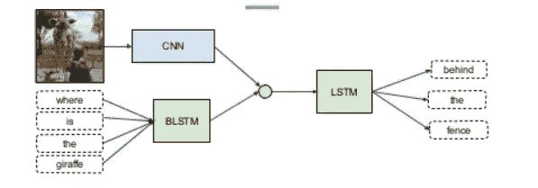
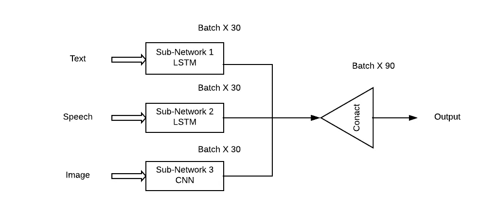
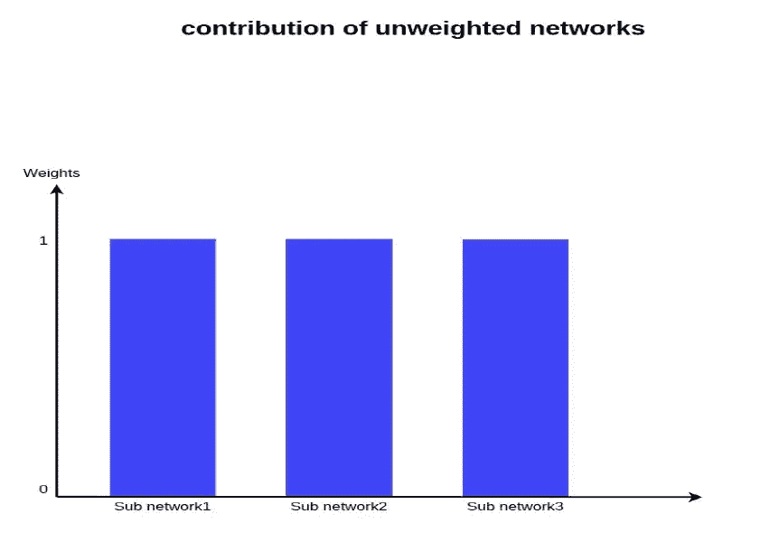
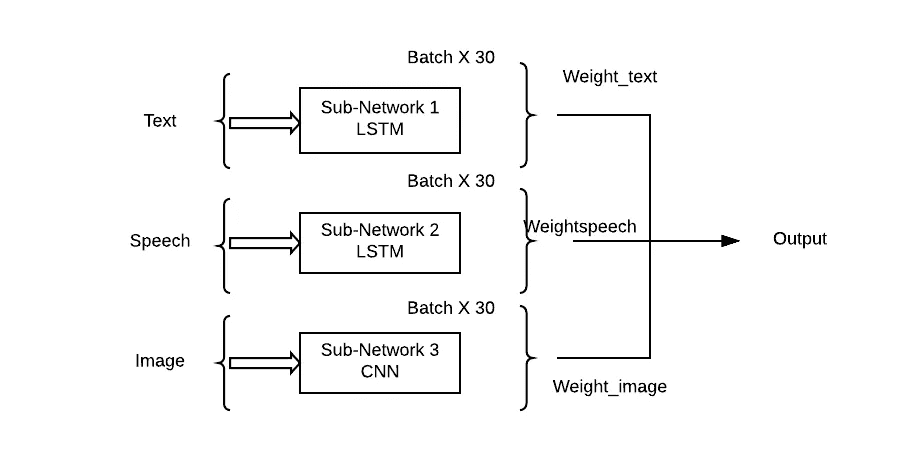
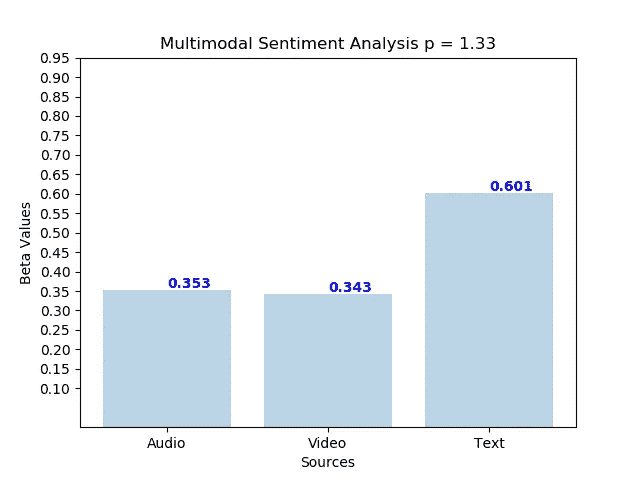
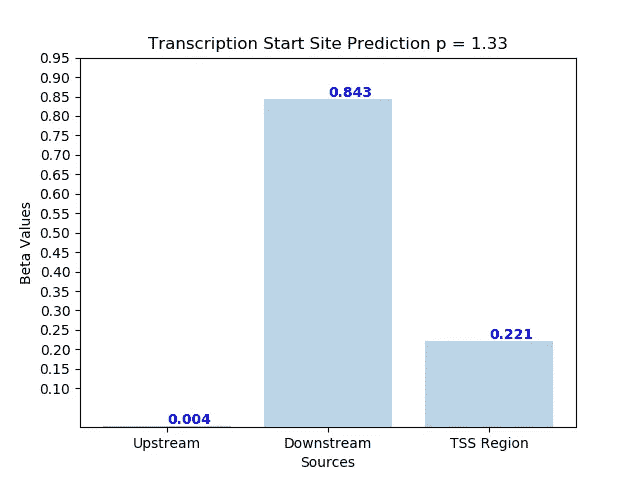

# 多模态深度学习

> 原文：<https://towardsdatascience.com/multimodal-deep-learning-ce7d1d994f4?source=collection_archive---------3----------------------->

## 使用深度学习的多模态融合

由于对深度学习的研究充满热情，我一直在寻找该领域未被探索的领域(尽管很难找到)。我之前做过 [*数学应用题*](https://medium.com/@purvanshimehta/can-computers-learn-maths-through-deep-learning-7ef714ca2cb3) 等许多类似的题目。

使用深度神经网络作为黑盒的挑战激起了我的兴趣。我决定更深入地研究“多模态深度学习中的可解释性”这个话题。以下是一些结果。

## 多模态数据

我们对世界的体验是多模态的——我们看到物体，听到声音，感受纹理，闻到气味，品尝味道。模态是指事情发生或经历的方式，当一个研究问题包括多个这样的模态时，它就被称为多模态。为了让人工智能在理解我们周围的世界方面取得进展，它需要能够一起解释这种多模态信号。

比如 ***图片通常会关联标签和文字说明；文本包含图像，以更清楚地表达文章的主要思想。*** 不同的模态以非常不同的统计特性为特征。

## 多模态深度学习

虽然组合不同模态或类型的信息以提高性能看起来是直观上吸引人的任务，但是在实践中，组合不同水平的噪声和模态之间的冲突是具有挑战性的。此外，模态对预测输出具有不同的定量影响。实践中最常见的方法是将不同输入的高级嵌入连接起来，然后应用 softmax。

Example of Multimodal deep learning where different types of NN are used to extract features

> 这种方法的问题在于，它会对所有子网络/模态给予同等的重视，这在现实生活中是极不可能的。

All Modalities have an equal contribution towards prediction

## **网络的加权组合**

我们采用子网络的加权组合，使得每个输入模态可以对输出预测具有学习贡献(θ)。

我们的优化问题变成了-

Loss Function after Theta weight is given to each sub-network.

The output is predicted after attaching weights to the subnetworks.

## 但是这一切的用处！！

言归正传，我开始吹嘘成果了。

***准确性和可解释性***

我们在两个真实的多模态数据集上取得了最先进的结果

*多模态情感强度语料库(MOSI)数据集—* 每毫秒视频注释音频特征的注释数据集 417。总共有 2199 个带注释的数据点，其中情绪强度被定义为从强负到强正，线性标度从 3 到+3。

模式是-

1.  文本

2.声音的

3.演讲

Amount of contribution of each modality on sentiment prediction

*转录起始位点预测(TSS)数据集—* **转录**是基因表达的第一步，其中 DNA 的特定片段被复制成 RNA (mRNA)。转录起始位点是转录开始的位置。DNA 片段的不同部分具有影响其存在的不同特性。我们把 TSS 分成三部分-

1.  上游 DNA
2.  下游 DNA
3.  TSS 区域

我们取得了前所未有的 3%的进步，超过了之前的最高水平。具有 TATA 盒的下游 DNA 区域对该过程影响最大。

我们还对合成生成的数据进行了实验，以验证我们的理论。

现在，我们正在起草一篇论文，准备提交给一本 ML 期刊。

如果你有兴趣了解多模态学习的数学细节或范围，一般来说，在 purvanshi.mehta11@gmail.com 上 ping 我。欢迎对作品提出意见。