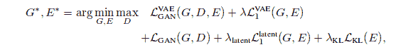
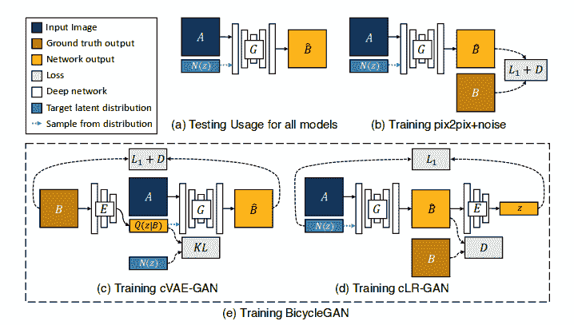

# 多模态图像到图像翻译

> 原文：<https://towardsdatascience.com/multimodal-image-to-image-translation-c1ffaa5d5928?source=collection_archive---------3----------------------->

在这篇博客中，我将解释图像到图像的翻译，这就是通常所说的[bicle gan](https://github.com/prakashpandey9/BicycleGAN)。图像到图像转换的任务可以被认为是每个像素的回归或分类。但是可以用来解决这个问题的更有趣的方法是生成对抗网络。通过使用 GANs 获得的结果更健壮并且在感知上更真实。

在论文“[走向多模态图像到图像翻译](https://arxiv.org/pdf/1711.11586.pdf)”中，目的是在给定输入图像的情况下生成输出图像的分布。基本上，它是使用条件生成对抗网络的图像到图像翻译模型的扩展。在 pix2pix 之前，许多人试图使用 GAN 无条件地解决这个问题，并且使用 L2 回归以输入为条件输出。除了变分自动编码器之外，我已经在我以前的[博客](/deep-generative-models-25ab2821afd3)中解释了条件 GAN。

在模型的第一部分，我们使用了一个条件变分自动编码器 GAN。想法是使用编码器网络学习目标图像的低维潜在表示，即，已经生成所有目标图像的概率分布，并且我们尝试该分布接近正态分布，以便在推断时间期间容易采样。接下来，我们使用一个生成器，使用编码表示 z 将输入图像映射到输出图像。

在图像的第二部分，我们使用了条件隐回归子 GAN。在这种情况下，从正态分布 N(z)中采样 z，除了输入图像 A 之外，该正态分布 N(z)还被馈送到生成器以获得输出图像。这个输出图像然后被馈送到编码器网络以输出 z ’,我们试图使它接近 N(z)。经过这两步，我们计算损失函数。最终损失函数如下所示:

其中 G、D 和 E 代表发生器、鉴别器和编码器。

在该模型中，从潜在向量(z)到输出图像以及输出图像到潜在向量的映射是双射的。整体架构由两个循环组成，B-> z-> B’和 z-> B’--> z’，因此得名 BicycleGAN。该图清楚地总结了该架构。

# 要点:-

*   我们有 3 个不同的网络:a)鉴别器，b)编码器，和 c)发生器。
*   cVAE-GAN(条件变分自动编码器-生成对抗网络)被用于将地面真实输出图像 B 编码为潜在向量 z，然后潜在向量 z 被用于重构输出图像 B’，即，B-> z-> B’。
*   对于逆映射(z-> B’--> z’)，我们使用 LR-GAN(潜在回归生成对抗网络)，其中使用生成器从输入图像 A 和 z 生成 B’
*   结合这两个模型，我们得到了自行车根。
*   发生器的架构与 U-net 相同，其中存在具有对称跳跃连接的编码器和解码器网络。
*   对于编码器，我们使用几个残差块对输入图像进行有效编码。
*   使用批次大小为 1 的批次规范化，使用 Adam optimizer 来训练该模型。
*   泄漏 ReLU 激活功能用于所有类型的网络。

# 履行

我在 TensorFlow 中实现了 BicycleGAN，你可以在我的 GitHub 个人资料中找到它。

 [## prakashpendey 9/自行车

### NIPS 论文“多模态图像到图像翻译”的 BicycleGAN - Tensorflow 实现

github.com](https://github.com/prakashpandey9/BicycleGAN) 

# 参考

[https://arxiv.org/pdf/1711.11586.pdf](https://arxiv.org/pdf/1711.11586.pdf)