# 用于文本分析的多项式朴素贝叶斯分类器

> 原文：<https://towardsdatascience.com/multinomial-naive-bayes-classifier-for-text-analysis-python-8dd6825ece67?source=collection_archive---------1----------------------->


机器学习最流行的应用之一是分类数据的分析，特别是文本数据。问题是，有很多关于数字数据的教程，但是关于文本的很少。考虑到我过去关于机器学习的大多数博客都是基于 Scikit-Learn 的，我决定通过自己实现整个事情来玩玩这个。

在这篇博客中，我将介绍如何为 [20 个新闻组](http://qwone.com/~jason/20Newsgroups/)数据集实现多项式朴素贝叶斯分类器。20 个新闻组数据集包含大约 18000 个关于 20 个主题的新闻组帖子，分为两个子集:一个用于培训(或开发)，另一个用于测试(或性能评估)。训练集和测试集之间的划分基于在特定日期之前和之后发布的消息。

## 图书馆

首先，让我们导入编写实现所需的库:

```
**import** **numpy** **as** **np**
**import** **pandas** **as** **pd**
**import** **matplotlib.pyplot** **as** **plt**
**import** **operator**
```

## 阶级分布

首先，我们计算每个类中文档的比例:


```
*#Training label*
train_label = open('20news-bydate/matlab/train.label')

*#pi is the fraction of each class*
pi = {}

*#Set a class index for each document as key*
**for** i **in** range(1,21):
    pi[i] = 0

*#Extract values from training labels*
lines = train_label.readlines()

*#Get total number of documents*
total = len(lines)

*#Count the occurence of each class*
**for** line **in** lines:
    val = int(line.split()[0])
    pi[val] += 1

*#Divide the count of each class by total documents* 
**for** key **in** pi:
    pi[key] /= total

print("Probability of each class:")
print("**\n**".join("**{}**: **{}**".format(k, v) **for** k, v **in** pi.items()))
```

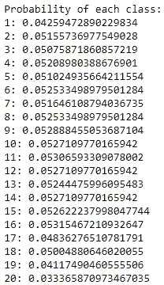

## 词汇的概率分布

让我们首先创建熊猫数据框架

```
*#Training data*
train_data = open('20news-bydate/matlab/train.data')
df = pd.read_csv(train_data, delimiter=' ', names=['docIdx', 'wordIdx', 'count'])

*#Training label*
label = []
train_label = open('/home/sadat/Downloads/HW2_210/20news-bydate/matlab/train.label')
lines = train_label.readlines()
**for** line **in** lines:
    label.append(int(line.split()[0]))

*#Increase label length to match docIdx*
docIdx = df['docIdx'].values
i = 0
new_label = []
**for** index **in** range(len(docIdx)-1):
    new_label.append(label[i])
    **if** docIdx[index] != docIdx[index+1]:
        i += 1
new_label.append(label[i]) *#for-loop ignores last value*

*#Add label column*
df['classIdx'] = new_label

df.head()
```

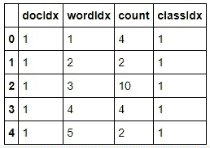

## 每类每个单词的概率

为了计算我们的概率，我们将找到给定类别中每个单词的平均值。

对于 j 类和单词 I，平均值由下式给出:


但是，由于一些单词的计数为 0，我们将使用 low 执行拉普拉斯平滑:

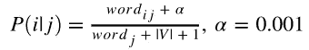

其中 V 是词汇表中所有单词的数组

```
*#Alpha value for smoothing*
a = 0.001

*#Calculate probability of each word based on class*
pb_ij = df.groupby(['classIdx','wordIdx'])
pb_j = df.groupby(['classIdx'])
Pr =  (pb_ij['count'].sum() + a) / (pb_j['count'].sum() + 16689)    

*#Unstack series*
Pr = Pr.unstack()

*#Replace NaN or columns with 0 as word count with a/(count+|V|+1)*
**for** c **in** range(1,21):
    Pr.loc[c,:] = Pr.loc[c,:].fillna(a/(pb_j['count'].sum()[c] + 16689))

*#Convert to dictionary for greater speed*
Pr_dict = Pr.to_dict()

Pr
```

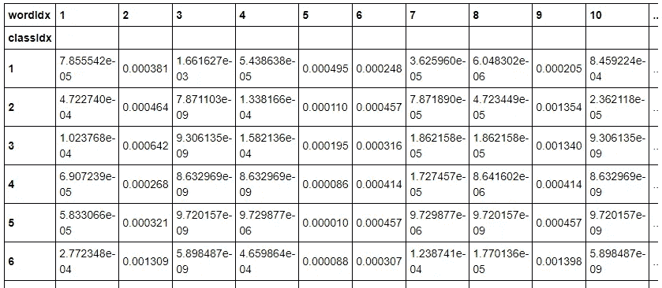

## 停止言语

停用词是在每个文档中出现很多的词(例如介词和代词)。

```
*#Common stop words from online*
stop_words = [
"a", "about", "above", "across", "after", "afterwards", 
"again", "all", "almost", "alone", "along", "already", "also",    
"although", "always", "am", "among", "amongst", "amoungst", "amount", "an", "and", "another", "any", "anyhow", "anyone", "anything", "anyway", "anywhere", "are", "as", "at", "be", "became", "because", "become","becomes", "becoming", "been", "before", "behind", "being", "beside", "besides", "between", "beyond", "both", "but", "by","can", "cannot", "cant", "could", "couldnt", "de", "describe", "do", "done", "each", "eg", "either", "else", "enough", "etc", "even", "ever", "every", "everyone", "everything", "everywhere", "except", "few", "find","for","found", "four", "from", "further", "get", "give", "go", "had", "has", "hasnt", "have", "he", "hence", "her", "here", "hereafter", "hereby", "herein", "hereupon", "hers", "herself", "him", "himself", "his", "how", "however", "i", "ie", "if", "in", "indeed", "is", "it", "its", "itself", "keep", "least", "less", "ltd", "made", "many", "may", "me", "meanwhile", "might", "mine", "more", "moreover", "most", "mostly", "much", "must", "my", "myself", "name", "namely", "neither", "never", "nevertheless", "next","no", "nobody", "none", "noone", "nor", "not", "nothing", "now", "nowhere", "of", "off", "often", "on", "once", "one", "only", "onto", "or", "other", "others", "otherwise", "our", "ours", "ourselves", "out", "over", "own", "part","perhaps", "please", "put", "rather", "re", "same", "see", "seem", "seemed", "seeming", "seems", "she", "should","since", "sincere","so", "some", "somehow", "someone", "something", "sometime", "sometimes", "somewhere", "still", "such", "take","than", "that", "the", "their", "them", "themselves", "then", "thence", "there", "thereafter", "thereby", "therefore", "therein", "thereupon", "these", "they",
"this", "those", "though", "through", "throughout",
"thru", "thus", "to", "together", "too", "toward", "towards",
"under", "until", "up", "upon", "us",
"very", "was", "we", "well", "were", "what", "whatever", "when",
"whence", "whenever", "where", "whereafter", "whereas", "whereby",
"wherein", "whereupon", "wherever", "whether", "which", "while", 
"who", "whoever", "whom", "whose", "why", "will", "with",
"within", "without", "would", "yet", "you", "your", "yours", "yourself", "yourselves"
]
```

现在，让我们创建词汇数据框架

```
vocab = open('vocabulary.txt') 
vocab_df = pd.read_csv(vocab, names = ['word']) 
vocab_df = vocab_df.reset_index() 
vocab_df['index'] = vocab_df['index'].apply(**lambda** x: x+1) vocab_df.head()
```

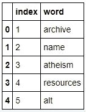

获取词汇表中每个单词的计数并将停用词设置为 0:

```
*#Index of all words*
tot_list = set(vocab_df['index'])

*#Index of good words*
vocab_df = vocab_df[~vocab_df['word'].isin(stop_words)]
good_list = vocab_df['index'].tolist()
good_list = set(good_list)

*#Index of stop words*
bad_list = tot_list - good_list

*#Set all stop words to 0*
**for** bad **in** bad_list:
    **for** j **in** range(1,21):
        Pr_dict[j][bad] = a/(pb_j['count'].sum()[j] + 16689)
```

**多项式朴素贝叶斯分类器**

将 P 的概率分布与属于每个类别的文档的分数相结合。

对于类 **j** ，字频为 **f** 的字 **i** :


为了避免下溢，我们将使用对数总和:

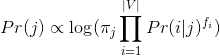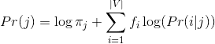

一个问题是，如果一个词再次出现，它再次出现的概率会上升。为了平滑这一点，我们取频率的对数:

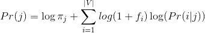

此外，为了将停用词考虑在内，我们将为每个词添加逆文档频率(IDF)权重:

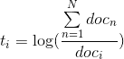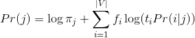

尽管对于这个特定的用例，停用词已经被设置为 0，但还是添加了 IDF 实现来一般化该函数。

```
*#Calculate IDF* 
tot = len(df['docIdx'].unique()) 
pb_ij = df.groupby(['wordIdx']) 
IDF = np.log(tot/pb_ij['docIdx'].count()) 
IDF_dict = IDF.to_dict()**def** MNB(df, smooth = **False**, IDF = **False**):
    *'''*
 *Multinomial Naive Bayes classifier*
 *:param df [Pandas Dataframe]: Dataframe of data*
 *:param smooth [bool]: Apply Smoothing if True*
 *:param IDF [bool]: Apply Inverse Document Frequency if True*
 *:return predict [list]: Predicted class ID*
 *'''*
    *#Using dictionaries for greater speed*
    df_dict = df.to_dict()
    new_dict = {}
    prediction = []

    *#new_dict = {docIdx : {wordIdx: count},....}*
    **for** idx **in** range(len(df_dict['docIdx'])):
        docIdx = df_dict['docIdx'][idx]
        wordIdx = df_dict['wordIdx'][idx]
        count = df_dict['count'][idx]
        **try**: 
            new_dict[docIdx][wordIdx] = count 
        **except**:
            new_dict[df_dict['docIdx'][idx]] = {}
            new_dict[docIdx][wordIdx] = count

    *#Calculating the scores for each doc*
    **for** docIdx **in** range(1, len(new_dict)+1):
        score_dict = {}
        *#Creating a probability row for each class*
        **for** classIdx **in** range(1,21):
            score_dict[classIdx] = 1
            *#For each word:*
            **for** wordIdx **in** new_dict[docIdx]:
                *#Check for frequency smoothing*
                *#log(1+f)*log(Pr(i|j))*
                **if** smooth: 
                    **try**:
                        probability=Pr_dict[wordIdx][classIdx]         
                        power = np.log(1+ new_dict[docIdx][wordIdx])     
                        *#Check for IDF*
                        **if** IDF:
                            score_dict[classIdx]+=(
                               power*np.log(
                               probability*IDF_dict[wordIdx]))
                        **else**:
                            score_dict[classIdx]+=power*np.log(
                                                   probability)
                    **except**:
                        *#Missing V will have log(1+0)*log(a/16689)=0* 
                        score_dict[classIdx] += 0                        
                *#f*log(Pr(i|j))*
                **else**: 
                    **try**:
                        probability = Pr_dict[wordIdx][classIdx]        
                        power = new_dict[docIdx][wordIdx]               
                        score_dict[classIdx]+=power*np.log(
                                           probability) 
                        *#Check for IDF*
                        **if** IDF:
                            score_dict[classIdx]+= power*np.log(
                                   probability*IDF_dict[wordIdx]) 
                    **except**:
                        *#Missing V will have 0*log(a/16689) = 0*
                        score_dict[classIdx] += 0      
            *#Multiply final with pi* 
            score_dict[classIdx] +=  np.log(pi[classIdx])                          

        *#Get class with max probabilty for the given docIdx* 
        max_score = max(score_dict, key=score_dict.get)
        prediction.append(max_score)

    **return** prediction
```

比较平滑和 IDF 的效果:

```
regular_predict = MNB(df, smooth=**False**, IDF=**False**)
smooth_predict  = MNB(df, smooth=**True**, IDF=**False**)
tfidf_predict   = MNB(df, smooth=**False**, IDF=**True**)
all_predict     = MNB(df, smooth=**True**, IDF=**True**)*#Get list of labels*
train_label = pd.read_csv('20news-bydate/matlab/train.label',
                          names=['t'])
train_label= train_label['t'].tolist()total = len(train_label) 
models = [regular_predict, smooth_predict, 
          tfidf_predict, all_predict] 
strings = ['Regular', 'Smooth', 'IDF', 'Both'] 

**for** m,s **in** zip(models,strings):
    val = 0
    **for** i,j **in** zip(m, train_label):
        **if** i != j:
            val +=1
        **else**:
            **pass**   
    print(s,"Error:**\t\t**",val/total * 100, "%")
```

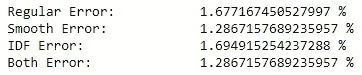

正如我们所看到的，IDF 几乎没有影响，因为我们删除了停用词。
然而，平滑使模型更加精确。

因此，我们的最佳模型是:


## 测试数据

现在我们有了模型，让我们用它来预测我们的测试数据。

```
*#Get test data*
test_data = open('20news-bydate/matlab/test.data')
df = pd.read_csv(test_data, delimiter=' ', names=['docIdx', 'wordIdx', 'count'])

*#Get list of labels*
test_label = pd.read_csv('/home/sadat/Downloads/HW2_210/20news-bydate/matlab/test.label', names=['t'])
test_label= test_label['t'].tolist()

*#MNB Calculation*
predict = MNB(df, smooth = **True**, IDF = **False**)

total = len(test_label)
val = 0
**for** i,j **in** zip(predict, test_label):
    **if** i == j:
        val +=1
    **else**:
        **pass**print("Error:**\t**",(1-(val/total)) * 100, "%")
```

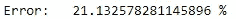