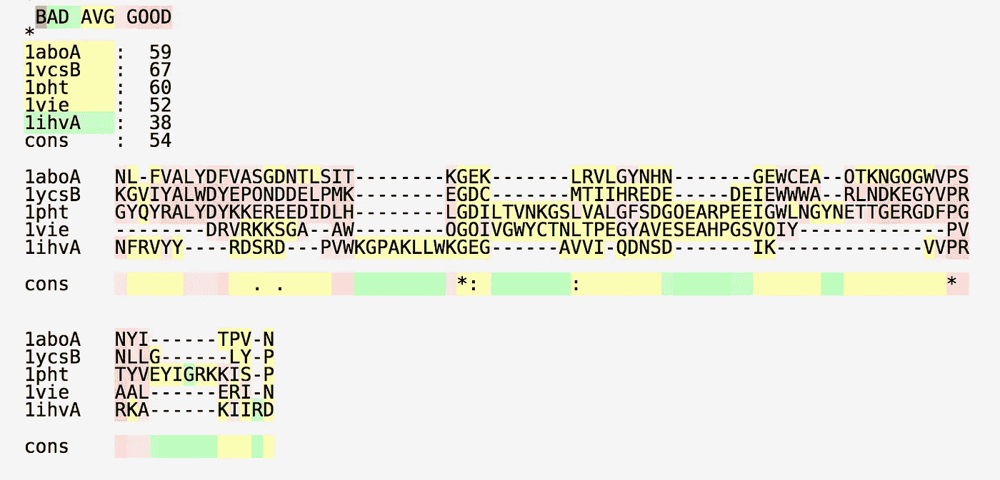
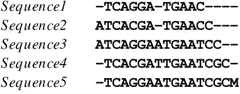
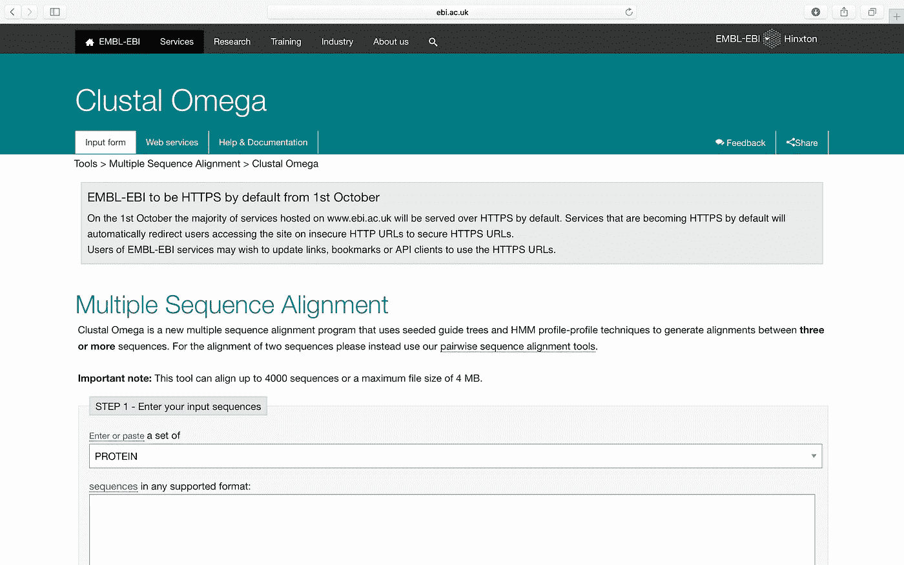
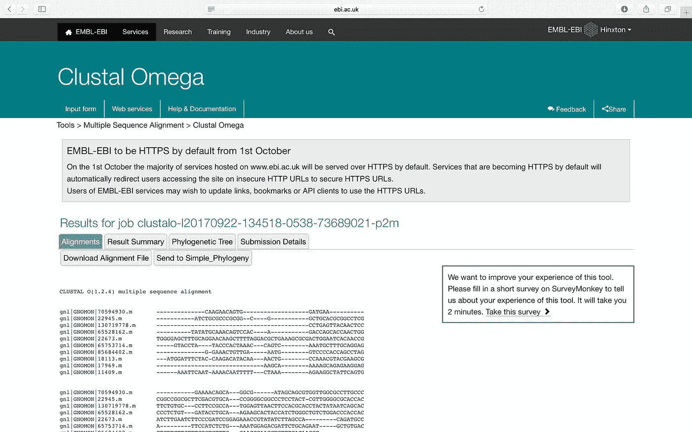
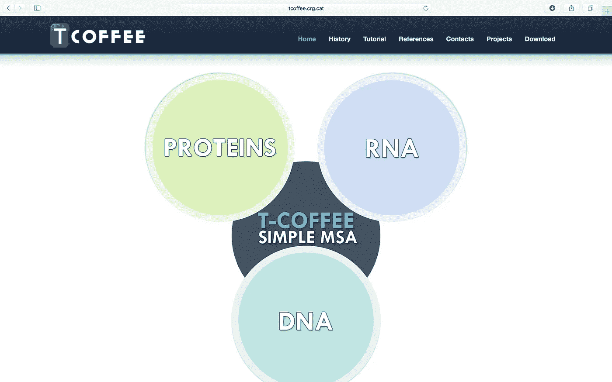
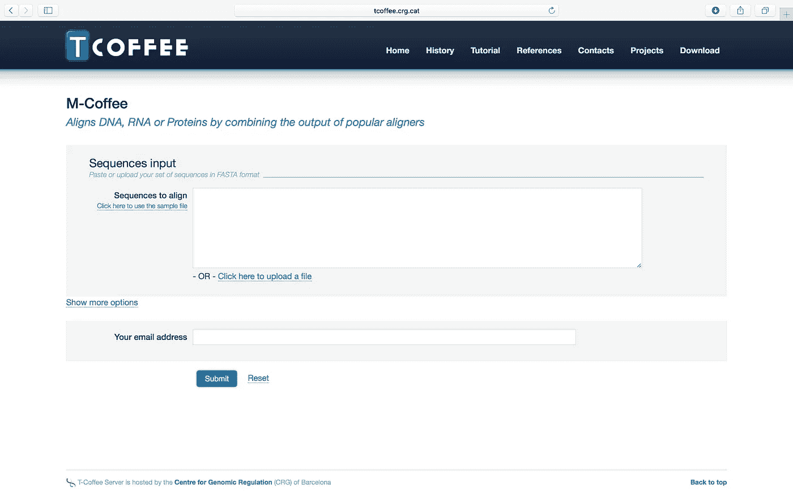
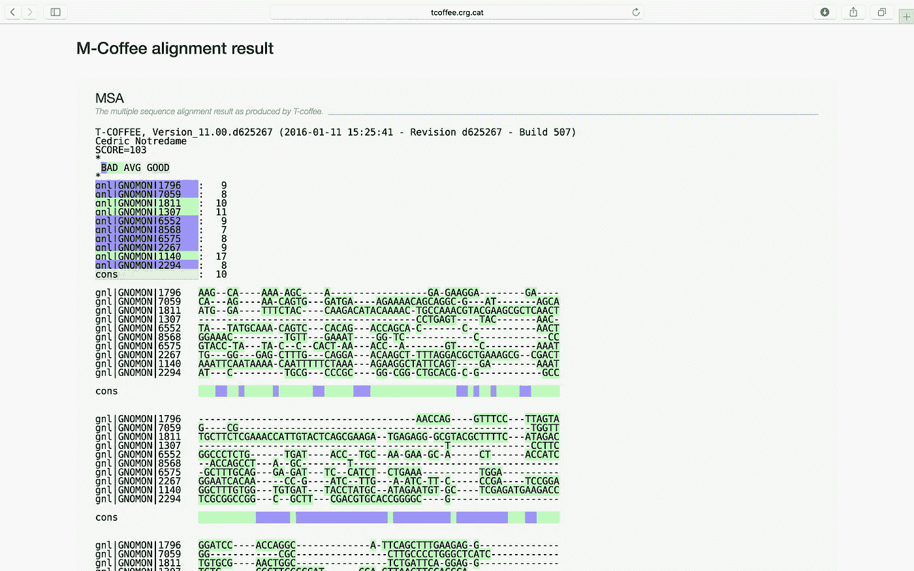
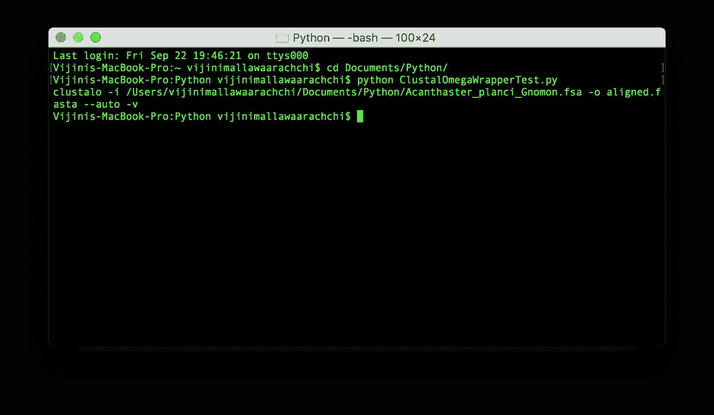
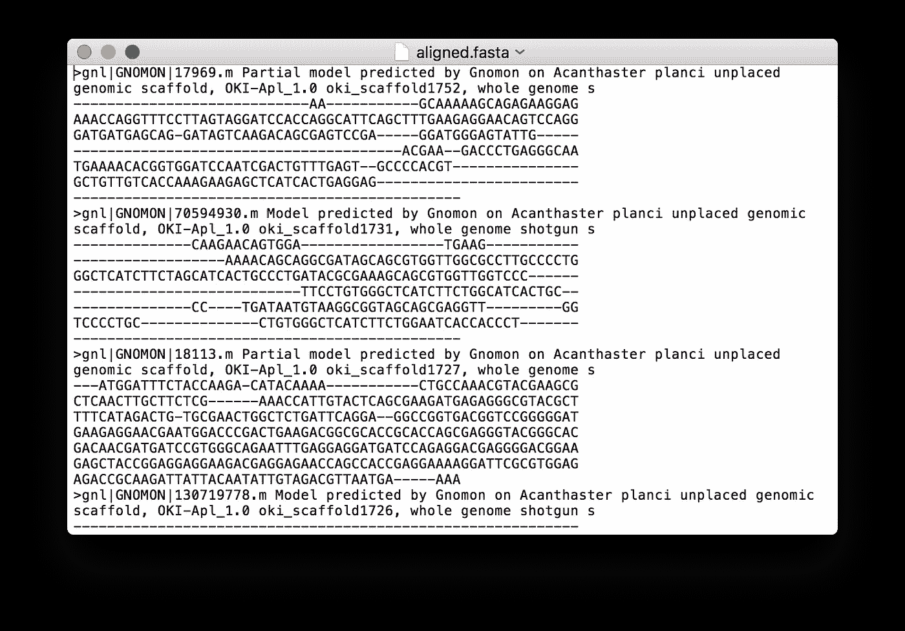

# 使用 Clustal Omega 和 T-Coffee 的多序列比对

> 原文：<https://towardsdatascience.com/multiple-sequence-alignment-using-clustal-omega-and-t-coffee-3cc662b1ea82?source=collection_archive---------1----------------------->

## 3 个或更多生物序列的序列比对

你想知道科学家如何识别三个或更多生物序列中的相似区域吗？正如我在[上一篇文章](https://medium.com/towards-data-science/dna-sequence-data-analysis-starting-off-in-bioinformatics-3dba4cea04f)中所描述的，**序列比对**是一种排列 DNA、RNA 或蛋白质序列以识别相似区域的方法。在我最近一篇关于生物信息学的文章中，我已经讨论了关于 [**两两序列比对**](https://medium.com/towards-data-science/pairwise-sequence-alignment-using-biopython-d1a9d0ba861f) 。一定要检查他们。多序列比对与成对序列比对非常相似，但它使用三个或更多个序列，而不是只有两个序列。

在本文中，我将带您完成**多重序列比对**。此外，我们将使用 **Clustal Omega** 和 **T-Coffee** 测试一些示例，这些示例将使用 **Biopython** 测试一些编码示例。



Figure 1: Results from T-Coffee

# 什么是多序列比对？

在**多序列比对(MSA)** 中，我们试图比对 ***三个或三个以上相关序列*** ，以达到它们之间的最大匹配。MSA 的目标是排列一组序列，使每个序列中尽可能多的字符根据某种评分函数进行匹配。



Figure 2: Image Source: [https://openi.nlm.nih.gov/detailedresult.php?img=PMC2921379_1756-0500-3-199-1&req=4](https://openi.nlm.nih.gov/detailedresult.php?img=PMC2921379_1756-0500-3-199-1&req=4)

# 得分

**MSA** 的评分过程是根据某个评分矩阵，基于多重比对中所有可能的序列对的得分之和。你可以参考我的[上一篇文章](https://medium.com/towards-data-science/pairwise-sequence-alignment-using-biopython-d1a9d0ba861f)来了解不同的评分矩阵以及如何匹配。

> 多重比对得分= ∑得分(A，B)

其中 score(A，B)= A，B 的成对比对分数。

## 例子

```
Sequence 1:    **G   K   N**
Sequence 2:    **T   R   N**
Sequence 3:    **S   H   E**
Sum of pairs: **-1 + 1 + 6 = 6**
```

第二列的和= score (K，R) + score (R，H) + score (K，H) = 2+0+-1 = 1

**MSA** 的目标是达到**对**的最大和。

# 多序列比对的类型

比对三个或更多个序列可能很困难，手动比对几乎总是很耗时。因此，使用计算算法来产生和分析这些比对。大多数 **MSA** 算法采用[动态规划](https://en.wikipedia.org/wiki/Dynamic_programming)和[启发式](https://en.wikipedia.org/wiki/Heuristic)方法。

下面给出了使用启发式方法的 **MSA** 技术。

1.  渐进式排列结构
2.  迭代比对构建
3.  基于块的对齐

这些方法可以在所有可能的解决方案中找到解决方案，但它们不能保证找到最佳解决方案。因此它们被认为是近似值，但是我们可以很容易地在短时间内找到接近实际值的解。

## **渐进式线形施工**

这种方法也被称为**分层**或**树形方法**，是由 **Paulien Hogeweg** 和 **Ben Hesper** 于 1984 年开发的。它通过组合从最相似的配对开始并前进到最远相关的配对的成对比对来构建最终的 **MSA** 。

目前使用的两种流行的渐进对准方法是，

1.  [**Clustal Omega**](http://www.ebi.ac.uk/Tools/msa/clustalo/)
2.  [**T-Coffee**](http://tcoffee.crg.cat/apps/tcoffee/index.html)

## **迭代线形施工**

该方法由一组产生**MSA**的方法组成，同时减少了渐进方法中固有的误差。它们的工作方式类似于渐进式方法，但会反复重新排列初始序列，并向不断增长的 **MSA** 添加新序列。

软件包 [**PRRN/PRRP**](http://www.genome.jp/tools/prrn/) 基于[爬山算法](https://en.wikipedia.org/wiki/Hill-climbing_algorithm)优化其 **MSA** 比对分数。

## 基于块的对齐

这种方法将序列分成块，并试图识别许多序列共有的无缺口比对的块。

[**DIALIGN2**](https://www.ncbi.nlm.nih.gov/pubmed/10222408) 是一种流行的基于块的比对方法。

# 练习时间到了

你期待的时刻到了。是时候尝试一些工具和例子了。我将用 [**Clustal Omega**](http://www.ebi.ac.uk/Tools/msa/clustalo/) 和 [**T-Coffee**](http://tcoffee.crg.cat) 向大家展示几个 MSA 的例子。你可以在网上试用这些工具。

## Clustal 欧米茄

转到[http://www.ebi.ac.uk/Tools/msa/clustalo/](http://www.ebi.ac.uk/Tools/msa/clustalo/)。



Figure 3: Clustal Omega

您将看到一个页面，选择数据类型(蛋白质、DNA 或 RNA)，输入序列(或上传支持格式的文件)并设置输出格式。

我将用下面的 10 个棘冠海星**(俗称 [**棘冠海星**](https://en.wikipedia.org/wiki/Crown-of-thorns_starfish) )的基因组序列(DNA)来做这个演示。你可以从 [*这里*](https://www.ncbi.nlm.nih.gov/guide/howto/dwn-genome/) 下载一个生物体的完整基因组。fsa 格式。**

> **一个 **FSA 文件(。fsa)** 是由 DNA 测序仪和分析仪创建的片段分析数据文件。**

**10 sequences from the genome of **Acanthaster planci** (commonly known as **Crown-of-thorns starfish**)**

**输入序列并选择参数后，您可以提交任务。可以按如下方式查看作业的结果。您可以从 [*点击*](http://www.ebi.ac.uk/Tools/services/web/toolresult.ebi?jobId=clustalo-I20170922-134518-0538-73689021-p2m) 查看该示例的结果。**

****

**Figure 4: Results of the job on Clustal Omega**

**您可以使用下载结果作为校准文件。aln 扩展名通过点击**下载对齐文件**按钮。**

## **t-咖啡**

**去 http://tcoffee.crg.cat/apps/tcoffee/index.html。**

****

**Figure 5: T-Coffee**

**在本次演示中，我选择了 **DNA** 部分下的*联合收割机常用对齐器(M-Coffee)* 。然后你会看到一个页面来输入序列(或者上传一个支持格式的文件)。**

****

**Figure 6: M-Coffee input page**

**我将使用我用来演示 **Clustal Omega** 的同一个文件。输入序列后，您可以提交作业。可以按如下方式查看作业的结果。你可以从 [*这里*](http://tcoffee.crg.cat/apps/tcoffee/result?rid=3666c6c4) 查看这个例子的结果。**

****

**Figure 7: Results for the job on T-Coffee**

## **Clustal Omega 和 T-Coffee 的 Biopython 包装**

**[**Biopython**](http://biopython.org) ，我曾在我的[上一篇文章](https://medium.com/towards-data-science/pairwise-sequence-alignment-using-biopython-d1a9d0ba861f)中介绍过，它由用于 **Clustal Omega** 、 **T-Coffee** 和许多其他工具的命令行包装器组成，如 **ClustalW** 和**diaign**。您可以在这里 查看 [*中的所有包装器和示例代码。在下一个例子中，我将展示如何使用 **Clustal Omega** 包装器。*](http://biopython.org/DIST/docs/api/Bio.Align-module.html)**

**要运行 *Clustal Omega 包装器*，首先您应该下载它的预编译二进制文件。你可以从 [*这里*](http://www.clustal.org/omega/) 下载。将下载一个二进制文件。您可以使用下面给出的命令使其成为可执行文件。根据您下载的二进制文件版本，二进制文件的名称可能会有所不同。在我的机器上，它被下载为**clus tal-omega-1 . 2 . 3-ma cosx**。**

```
**chmod 777 clustal-omega-1.2.3-macosx**
```

**我将使用相同的**。以前使用的 fsa** 文件，对于这个例子也是如此。**

**以下代码使用 Clustal Omega 包装器为给定输入开发 **MSA** 。fsa 文件。如果你有这种能力，那就容易了。fsa 文件，。py 文件和可执行二进制文件放在同一个位置。**

**运行完这段 python 代码后，您将得到一个命令作为输出。路径可能会根据您放置文件的位置而变化。**

```
**clustalo -i /Users/vijinimallawaarachchi/Documents/Python/Acanthaster_planci_Gnomon.fsa -o aligned.fasta — auto -v**
```

****

**Figure 8: Output command**

**现在用如下所示的命令执行下载的二进制文件。确保用**替换**离合器**。/clus tal-omega-1 . 2 . 3-ma cosx****

```
**./clustal-omega-1.2.3-macosx -i /Users/vijinimallawaarachchi/Documents/Python/Acanthaster_planci_Gnomon.fsa -o aligned.fasta --auto -v**
```

**您将会得到以下结果，表明已经进行了渐进式比对。**

****

**Figure 9: Final result**

**现在你可以看到一个名为 **aligned.fasta** 的文件已经在与你的文件相同的位置形成。一旦你打开它，你可以看到 FASTA 格式的排列。**

> ****FASTA 格式**是一种基于文本的格式，用于表示核苷酸序列或肽序列，其中核苷酸或氨基酸用单字母代码表示。该格式还允许序列名称和注释位于序列之前。该格式起源于 [FASTA](https://en.wikipedia.org/wiki/FASTA) 软件包，但现在已经成为生物信息学领域的标准。**

****

**Figure 10: Output file in FASTA format**

**希望你喜欢读这篇文章，并学到一些有用和有趣的东西。**

**因为我对这个领域还很陌生，所以我想听听你的建议。😇**

**感谢阅读…😃**