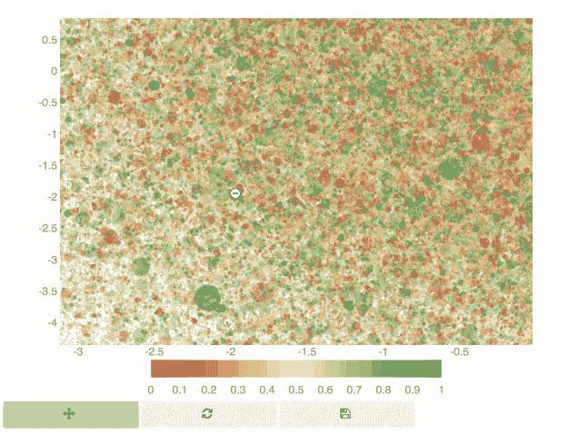
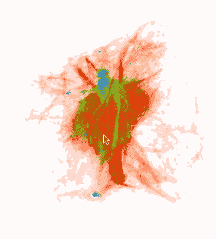
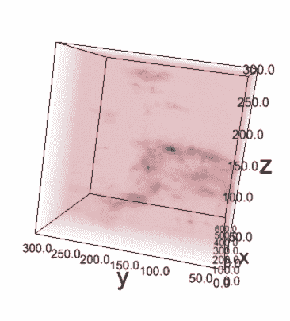
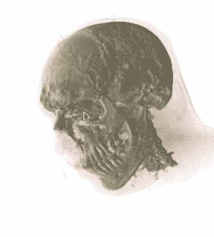
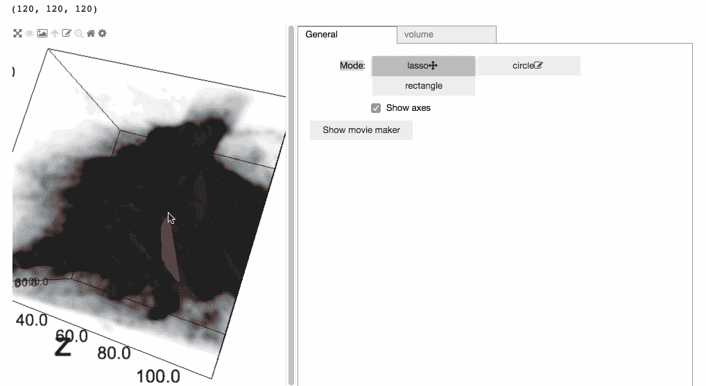
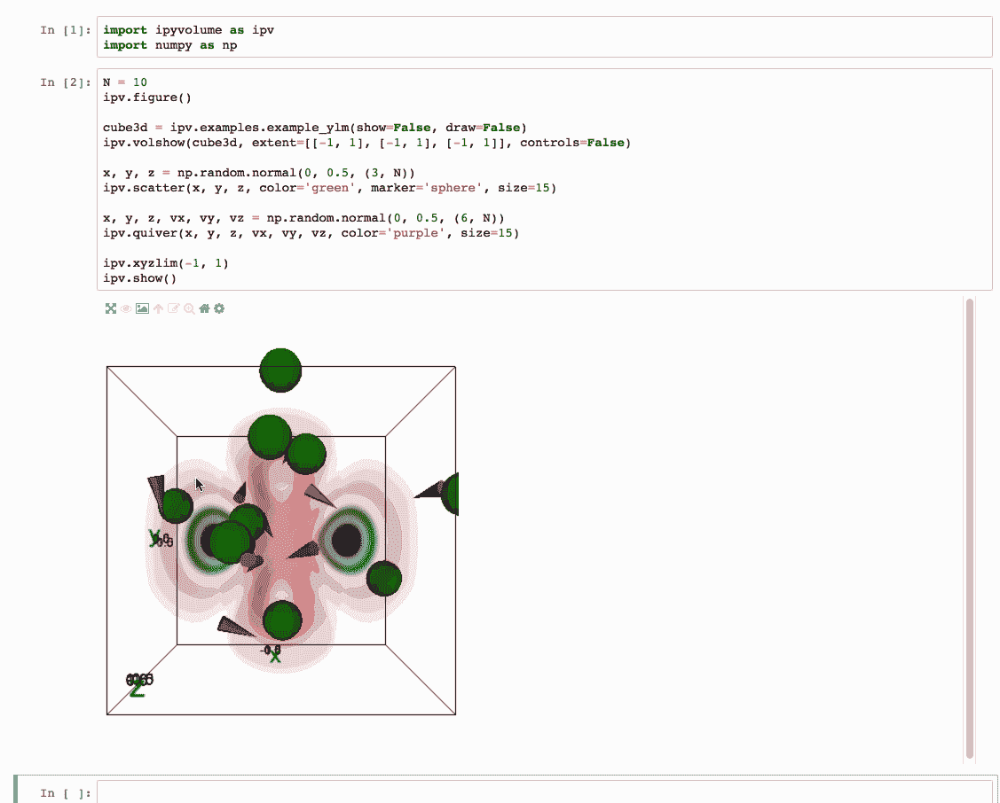
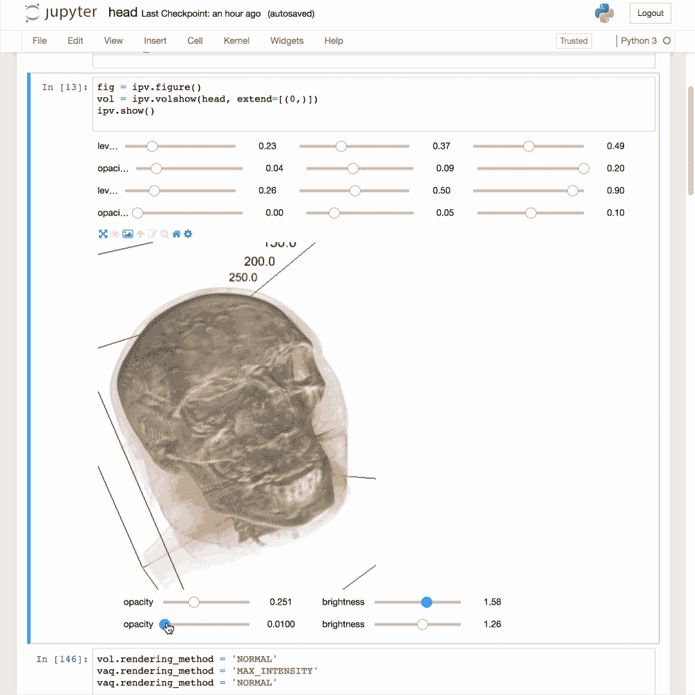
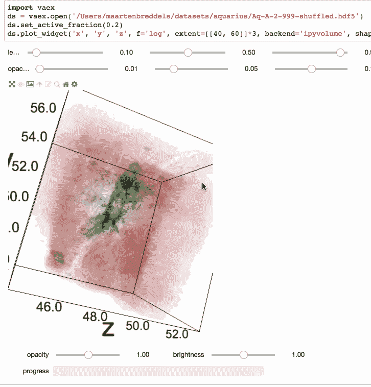

# 基于 ipyvolume 的 Jupyter 多体绘制:跨语言三维可视化

> 原文：<https://towardsdatascience.com/multivolume-rendering-in-jupyter-with-ipyvolume-cross-language-3d-visualization-64389047634a?source=collection_archive---------3----------------------->

Jupyter 笔记本正在成为许多领域中数据科学的标准环境，随之而来的是可视化的需求。二维可视化可以说是最重要的，并且有丰富的库可供选择。其中许多都建立在 Python 世界中可视化的主力工具之上:Matplotlib。其他一些，如 [plotly](https://plot.ly/) 、[散景](https://bokeh.pydata.org/)和 [bqplot](https://github.com/bloomberg/bqplot) 通过提供完全交互式的情节更好地利用浏览器，能够以高帧率和平滑过渡进行缩放、平移和选择。

尽管 3D 可视化不经常使用，但有时理解内在的 3D 数据集(例如，脑部扫描)或 2D 投影难以理解的复杂结构是必不可少的。

Transparency in 2d, not a problem. Here showing a million points in [bqplot](https://github.com/bloomberg/bqplot) (an [open PR](https://github.com/bloomberg/bqplot/pull/661)).

然而，三维可视化是困难的。虽然 2D 的透明度微不足道；它只需要混合操作，[几乎不可能以可接受的帧率在 3D](https://developer.nvidia.com/content/transparency-or-translucency-rendering) 中正确完成。事实上，这是一个活跃的研究领域。

对于 2D 的大型数据集，绘制每个单独的点没有意义。相反，使用数据的统计更有意义。datashader 和 [vaex](https://vaex.io/) 采用的方法是将数据简化为 2d 直方图(或任何其他统计数据),并将其可视化为热图。

Showing 150 million taxi pickup locations in NYC by showing a heat map instead of individual points, using [vaex](https://vaex.io/) with [bqplot](https://github.com/bloomberg/bqplot/)

# 体绘制

同样的技术可以用在 3D 中，除了 3D 立方体的渲染技术更加困难:它使用[体积渲染](https://en.wikipedia.org/wiki/Volume_rendering)，更具体地说是 v [体积光线投射](https://en.wikipedia.org/wiki/Volume_ray_casting)。使用这种技术，光线会针对场景中的每个像素投射到场景中，并累积 3d 体积立方体中每个像素的 RGB 和 alpha 值，然后将它们混合在一起。

**(left)** Big data: exploring 100+ million rows by volume rendering a 3d histogram. (**middle)** Astronomical data cube: Radio observations. (right): Medical data cube: Scan of a male head.

一些数据集本质上是体积立方体。在射电天文学中，两个轴是天空坐标，第三个轴是频率轴，形成(通常)发射的 3d 强度立方体。在医学成像中，三个轴通常只是空间维度。

# 多体绘制

有时，需要在同一个场景中渲染多个大型数据集或多个数据立方体。它们可以重叠、完全重叠、部分重叠或完全不重叠。让事情变得更加复杂的是，一种称为[最大强度投影](https://en.wikipedia.org/wiki/Maximum_intensity_projection)的不同体绘制技术以不同的方式工作，这使得在同一场景中组合它们变得不同。事实上，我认为这使得多体积渲染至少和 3D 透明技术一样困难。

[Glue-Jupyter](https://github.com/glue-viz/glue-jupyter) uses [ipyvolume](https://github.com/maartenbreddels/ipyvolume) for 3D rendering and also provides a richer UI and higher level data bookkeeping.

# 胶水对胶水-Jupyter

[Glue](http://glueviz.org/) 是一个用于多维链接数据探索的桌面应用程序，并在其 3D 可视化中使用多体积渲染，例如，可视化 3D 选择(如上面的截屏所示)。 [Glue-jupyter](https://github.com/glue-viz/glue-jupyter) (我正在进行的一个项目)旨在将 [glue](http://glueviz.org) 引入 jupyter 笔记本。因此，它需要一个在 Jupyter 笔记本中进行多体积渲染的解决方案。Glue-jupyter 仍处于早期开发阶段，但已经提供了一种简单的现代方法来交互式地探索(多个)数据集，同时提供了从笔记本进行编程访问的功能。

# [Ipyvolume](https://github.com/maartenbreddels/ipyvolume/)

[Ipyvolume](https://github.com/maartenbreddels/ipyvolume/) 是 Jupyter 笔记本最好的 3D 可视化软件包(免责声明:我是主要作者；).使用 ipyvolume，您可以在一个场景中进行散点图、颤动图和多体积渲染，只需几行代码，这并不容易！

Simple example showing volshow, scatter and quiver.

此外，ipyvolume 构建在 [ipywidgets](https://github.com/jupyter-widgets/ipywidgets/) (前端部分的 Jupyter 小部件)之上，为您提供它开箱即用的所有功能。示例渲染 **live** 在文档中，绘图很容易嵌入到静态 HTML 文件中，能够在前端(浏览器)或内核端(Python 进程)轻松地将属性链接在一起，并监听属性的任何更改(双向通信的副产品)。此外，ipyvolume 重用了[pytreejs](https://github.com/jupyter-widgets/pythreejs)，免费公开了大部分的 [threejs](http://threejs.org) API！使用 [ipywebrtc](https://github.com/maartenbreddels/ipywebrtc) ，我们可以录制电影，将它们传输到远程计算机或拍摄快照。

Multivolume rendering: male head scan and dark matter particle simulation in one scene.

从版本 0.5 开始， [ipyvolume](https://github.com/maartenbreddels/ipyvolume) 支持多体积渲染，允许您可视化两个相互叠加的数据集。在左边的例子中，我们展示了一个人头部的扫描，同时展示了暗物质模拟中粒子的 3D 直方图。任意数量的数据立方体可以放在同一个场景中，这是 Jupyter 生态系统中可视化的一大壮举！据我所知，它是第一个为 Jupyter 做多体渲染的包。

# 大型数据立方体呢？

如果您正在使用远程 Jupyter 笔记本，可能使用 [Jupyter Hub](https://github.com/jupyterhub/jupyterhub) ，您将拥有两个世界的优势:您的代码接近数据，可视化在您的笔记本电脑/台式机上是本地的。然而，这意味着数据需要传输到客户机/浏览器，对于大型数据立方体来说，这可能相当大(是的，任何 3 次方的东西通常都很大)。为了解决这个问题，ipyvolume 将在默认情况下向浏览器发送低分辨率数据立方体。如果放大，会检测到边界框坐标的变化(yay ipywidgets！)，并且放大的更高分辨率剪切版本将被发送到浏览器。

After zooming in, a new high-resolution cutout will be sent to the browser.

# 跨语言

乐趣还不止于此，因为 ipyvolume 的大部分代码都是在浏览器中运行的前端代码(JavaScript ),所以我们可以将它用于其他语言。两个适马的 BeakerX 团队已经展示了它可以在所有 JVM 语言中使用(Java，Clojure，Groovy，Scala 等等)。

现在和 [QuantStack](http://quantstack.net) 团队一起，我们正在构建 [xvolume](https://github.com/QuantStack/xvolume) ，一个绑定到 ipyvolume 前端代码的 C++程序(是的，我应该把它重命名为 jupyter-volume，对吗？).

这意味着，通过一个单一的代码库(加上一些每种语言的胶水)，我们可以在 Jupyter 笔记本上为许多语言提供一个严肃的 3D 可视化包( [ipyvolume](https://github.com/maartenbreddels/ipyvolume/) )。

# TL；灾难恢复版本/结论

从 ipyvolume 0.5 开始，我们为 Jupyter 生态系统提供了一个严肃的 3D 可视化包，它甚至可以使用混合渲染技术进行多体渲染，结合常规网格、散点和颤动图。重用前端代码，作为一个 Jupyter 小部件，我们可以在所有 JVM 语言和 C++中重用这个库。

*特别感谢*[*Casper van leeuw en*](https://twitter.com/blauwe_piet)*以及所有其他为此 0.5 版本做出贡献的人！*