# 一个可怕的数据故事的成分是什么？

> 原文：<https://towardsdatascience.com/murdering-a-legendary-data-story-what-can-we-learn-from-a-grammar-of-graphics-ad6ca42f5e30?source=collection_archive---------5----------------------->

Photo by [Caleb Woods](https://unsplash.com/photos/VZILDYoqn_U?utm_source=unsplash&utm_medium=referral&utm_content=creditCopyText) on [Unsplash](https://unsplash.com/?utm_source=unsplash&utm_medium=referral&utm_content=creditCopyText)

## 忽视图形的语法甚至会破坏传说中的数据可视化

> “狮子是属于猫科的哺乳动物”“吃是摄取食物为一个有机体提供能量”“长颈鹿是现存最高的动物”。

上面这句话有什么意义吗？写狮子的饮食习惯时，我强迫自己使用短语或句子，而不是传统的方式。同一个句子自然会变成:

> “狮子吃长颈鹿”

这很简洁，也更有意义。我们对任何语言的这种造句方式都习以为常，以至于在日常交流中，我们认为这是理所当然的。但是，为什么数据消费应该有所不同呢？

为什么我们要人为地使用单片图表来限制交流呢？在展示分析见解时，数据科学从业者会想到模板化的仪表盘和现成的图表。销售趋势变成顶部的*‘KPI 部分’*中的条形图，而产品组合是下面的饼图，以此类推。

这就像使用预设的句子，而不是将正确的单词串在一起，来传达一个优雅的信息。不幸的是，这种做法在今天太普遍了。每次出现这种情况，一个信息设计师的心都在滴血。

## 还不信服？

以防你还在疑惑，让我们来做一个有趣的实验。我们将选择一个优雅的视觉，被广泛认为是有史以来最好的。然后我们会发现如果我们使用模板化的方法来呈现完全相同的数据会发生什么。

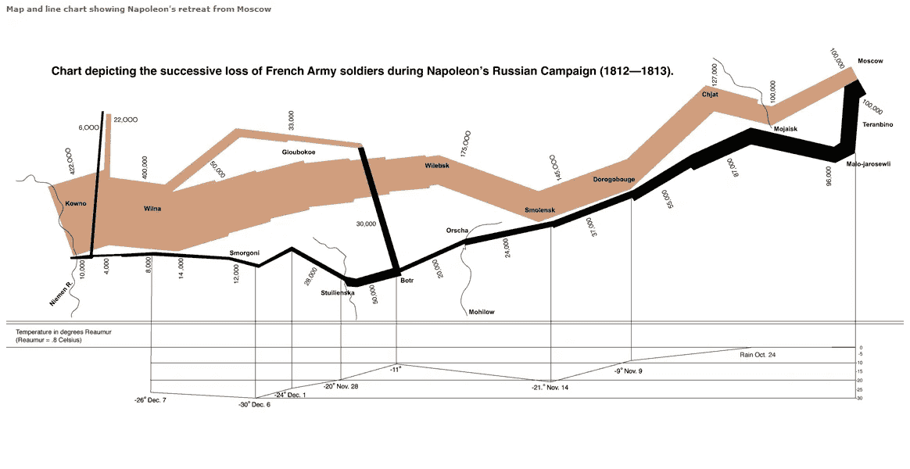

让我们以查尔斯·密纳德创作的《T2 拿破仑的俄罗斯战役》来做这个测试。这是一个经典的，永恒的可视化，被爱德华·塔夫特认为是有史以来最好的可视化。这张 1869 年手绘的图是通过自由地让数据讲述自己的故事，以正确的方式组成的。有了这次审判，我希望密纳德在九泉之下也不会翻身！

我首先选择了下面提供的数据。这是利兰·威尔金森从视觉上重新创造的，并发表在他的[书](https://www.amazon.com/Grammar-Graphics-Statistics-Computing/dp/0387245448)中。下面有三个数据集:第一个显示了拿破仑军队走过的城市，以及它们的纬度。

第二组显示了引用日期的经度和温度。这突出了军队撤退期间的严冬。第三个数据集显示了每个纬度上的士兵数量，他们行进的方向(前进或后退)，以及这是主要的队伍，还是分散的队伍。

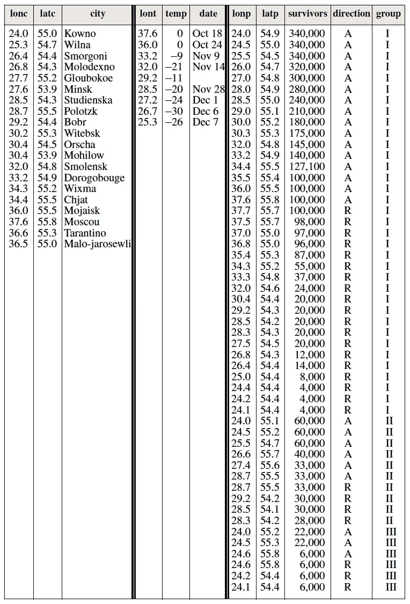

现在，让我们假设这些数据是从竞选前线用电子邮件发给我们的。然后，我们的经理给我们布置了一项任务，要求我们连夜创建一个可视化效果。一个直接的冲动是将它输入公司的仪表板装配线。数据从传送带的一端传入，机器人手臂使用预设的仪表盘布局模型和现成的图表来强制调整它们。从另一端出来一个闪亮的，互动的，彩色的垃圾。嗯，差不多了。

我试着用一种类似上面的粗糙的模板化方法来处理“*拿破仑的进行曲”。*让我们看看同样的数据是如何失去所有的优雅，并以使用预建图表的企业风格的仪表板结束的。以下是最终结果:

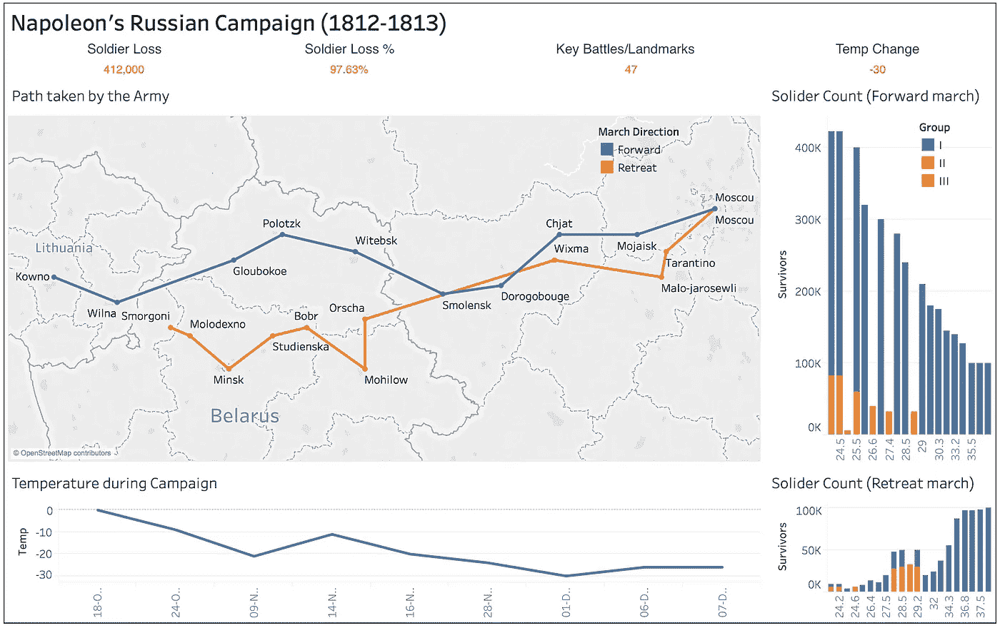

How we killed Charles Minard’s storytelling using the modern dashboarding assembly line

我们已经成功地摧毁了叙事，传奇的数据故事已经沦为一个琐碎的，无效的仪表板。我使用 Tableau public 将这些放在一起，但作为一个强烈的免责声明，问题不在于工具。Tableau 是一个很好的工具，市场上的许多其他工具也是如此。问题总是在于采用的方法和创作者缺乏想象力的处理。

## 图形的语法？

是的，图形确实有语法。选择合适的底层元素来构成优雅的视觉效果是可能的。我们不需要摸索僵化的、预先构建的图表。当我们拥抱这些信息设计的关键实体时，它赋予我们构建任何视觉的能力。

依靠 Leland Wilkinson 在他的书[《图形的语法](https://www.amazon.com/Grammar-Graphics-Statistics-Computing/dp/0387245448)》中建立的优秀基础，我们将理解优雅图形的流体结构。通过一个简单的例子，我们将看到如何用数据元素一层一层地构建一个优秀的视觉效果。我们还将证明并非所有图表都需要标准名称。

> 语法使语言富有表现力。一种只有单词而没有语法的语言只能表达和单词一样多的思想。—利兰·威尔金森

## 英语语法什么管用？

为了快速了解上下文，让我们看看我们是如何在英语中直观地构造句子的。约翰在操场上的动作是通过引入不同的词类并把它们串在一起来传达的。

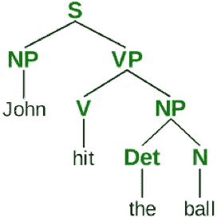

任何简单的措辞都会完全改变结构。例如，如果我们把最后两个单词和第一个互换，这个句子就变成了*“球击中了约翰”*。一个化妆品的变化，但结果是不太一样了！

## 介绍图形的语法

为了使图形或视觉表现具有表现力，我们必须理解它们的基本语法结构。《图形语法》提供了一套标准的指导方针，用于将数据转换成讲述其故事的有效可视化形式。

让我们假设我们有下面的数据要呈现。它显示了美国 6 个城市的销售业绩。

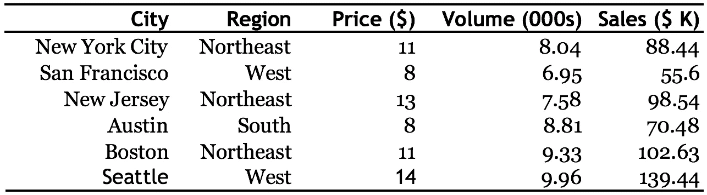

图形语法中有 7 种语法成分。让我们从底层开始逐一查看，并向上移动。这个概念最好用例子来说明。我们将使用 [ggplot2](https://www.rdocumentation.org/packages/ggplot2/versions/3.2.1) ，这是 R 上的一个高级图表包，也是受同一本书的启发。

如果你不懂代码，不用担心。下面显示的代码片段仅用于说明目的。一个人不需要知道编程就能跟上。只要扫一眼标签，就可以看到当每个单词被递增添加时，视觉效果是如何变化的。这只需要简单的英语理解。

## 组件 1–2–3:数据-美学-几何

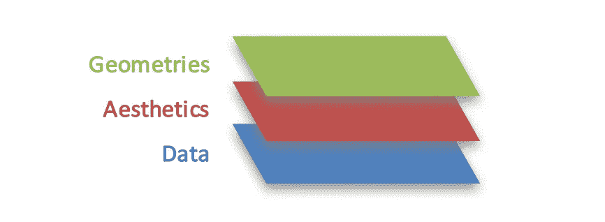

**数据**是基础组件，带有要绘制的元素。**美学**为数据提供轴和编码元素，而**几何**保存可用于表示数据的形状。

下面是一个简单的命令，使用上面显示的 3 个组件绘制每个城市的销售额和价格。注意每一个是如何被显式调用的， ***数据*** 被映射到输入数据帧， ***美学*** 将列关联到 x-y 轴，而 ***几何*** 要求将形状显示为点。

> ggplot( **数据**，**AES**(x =价格，y =销售额))+ **geom** _point()

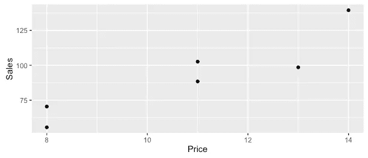

不，这不是创建*散点图*的语法。我们将看到如何通过编码更多的元素来处理这 3 个组件。现在让我们根据城市所属的*区域*给点着色(左图)。然后，我们通过将销售量显示为点的大小来区分城市(右图)。请注意，该命令只添加了两项内容，如下所述。

> ggplot(data，AES(x =价格，y =销售额，**color =地区**，**size =体积**)+geom _ point()

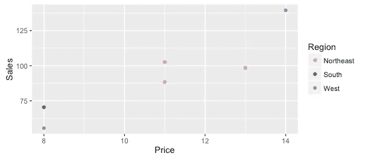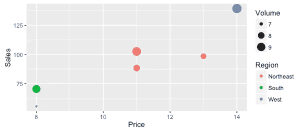

## 构成部分 4:方面

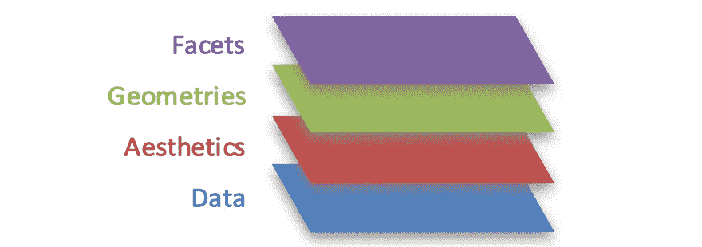

我们现在添加第四个组件，称为“**刻面**”。顾名思义，这是用来通过创建支线剧情将*刻面*出来的。有时，并排拆分和比较图是有帮助的，以便更清楚地突出差异。

对于上面的同一条命令，我们要求根据*‘区域’*拆分视觉效果，而不是在单个图表中显示所有内容。这需要一个简单的加法，如下所示:

> ggplot(data，aes(x=Price，y=Sales，color=Region，size = Volume))+geom _ point()+**facet _ wrap(~ Region)**

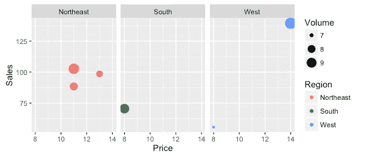

## 构成部分 5:统计

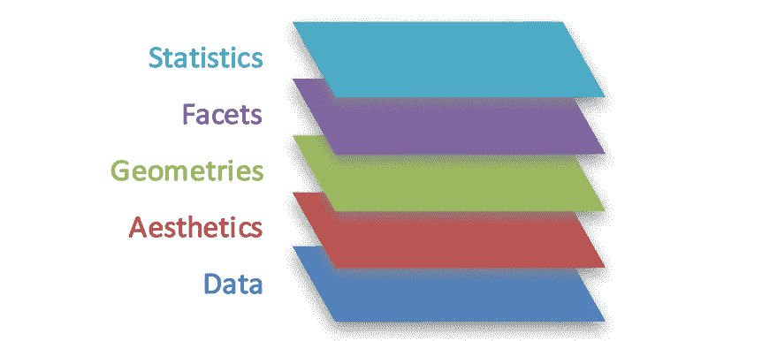

第五个组成部分是“统计”，它提供了一种引入统计模型和汇总的方法，如均值、中值、分布。显示基本的统计数据通常很有用。

假设我们想要计算每个*价格*点的平均*销售额*。我们可以通过在命令中再添加一个参数来动态地添加这一点。这导致具有相同价格点的城市被聚合。

> ggplot(data，AES(x =价格，y =销售额))+**stat _ summary _ bin**(fun . y =**" mean "**，geom = "bar ")

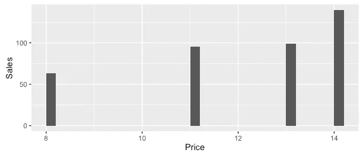

## 构成部分 6:坐标

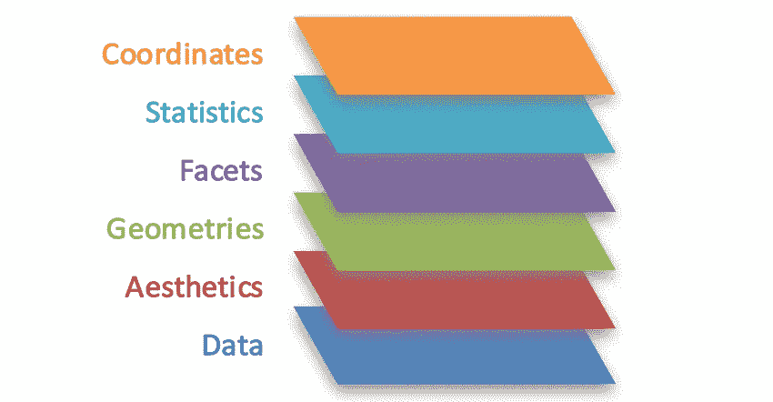

我们可能需要改变绘图的坐标系统。可以修改上面显示的默认笛卡尔坐标或 x-y 坐标图。我们可以将其转换为极坐标，这是(不)流行的饼图或圆环图的基础。

一个带有直观命名的命令的一个单独的添加就转换了整个视觉，而不必修改任何基本组件。尽管这种视觉效果不太适合我们的数据，但它展示了如何做到这一点。下图是*“蜘蛛或雷达图”*或*“圆形图上的气泡”*的变体吗？我们已经在发明表象了！

> ggplot(data，aes(x=Price，y=Sales，color=Region，size = Volume))+geom _ point()+facet _ wrap(~ Region)+**coord _ polar()**

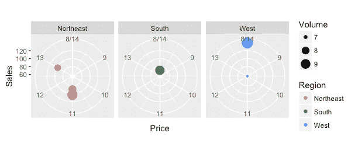

## 构成部分 7:主题

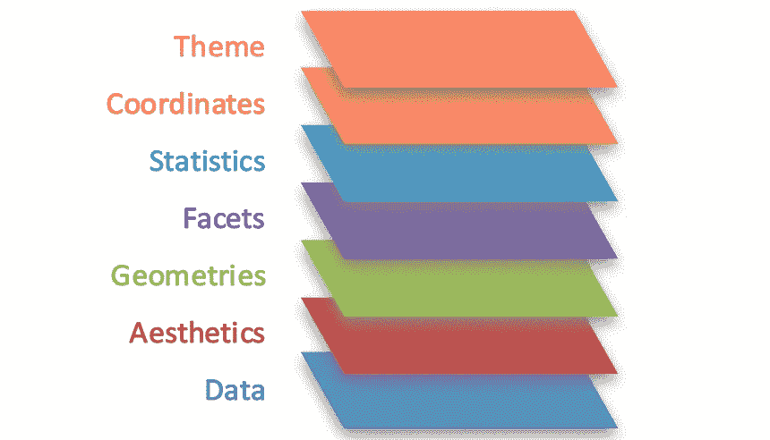

语法中的最后一个组件是“主题”,它可用于任何非数据墨迹。示例包括*图表或轴标题*、*标签*、*背景颜色方案*等。在这一层，可以通过混合非数据墨水和数据墨水来对故事进行注释。

与其他组件一样，在下面添加一个参数*‘theme _ bw’*会将前景-背景从之前的默认灰度转换为白底黑字主题。添加标题、标签、页边距或线条也有同样简单的方法。

> ggplot(data，AES(x =价格，y =销售额，color =地区，size =体积))+geom _ point()+**theme _ bw()**

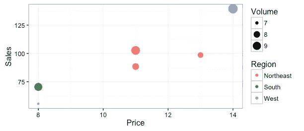

因此，我们已经看到了图形语法如何帮助无缝地将数据组合到最合适的元素上。这些组件一起形成一个层，一个地块可能有多个层交织在一起。

如果意图是比较两个产品的销售，将它们绘制为*条形* ***几何*** 的*长度* ***美观*** 。如果你想看看这些产品的增长如何变化，把这个作为*宽度* ***美观*** 带进来。不，请不要想条形图！相反，想象一下你如何能让数据发光。

想看看这些产品的利润吗？将它们编码为**。想比较不同公司的产品吗？ ***Facet*** 剧情将视图并排拆分，轻松对比两家公司。在与用户共享之前，使用 ***主题*** 组件添加必要的*文本*。**

**思考图表的问题是，随着需求的增加，思考过程总是停滞不前。一个只用僵硬的图表工作的头脑很快就会耗尽多才多艺的表现。**

## **摘要**

**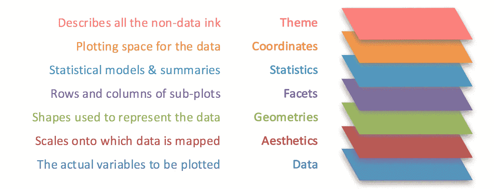**

**Grammar of Graphics: A layered approach to elegant visuals**

**我们已经了解了灵活表示数据的基本构件。这个概念的真正力量在于将数据从单一图表的局限中解放出来。给他们自由，让他们讲述自己富有表现力的故事。**

**尽管今天的许多可视化工具没有完全采用图形方法的语法，但这似乎是前进的方向。与此同时，人们有机会开始将此付诸实践。这一点非常重要，必须成为所有数据工作者的必修课，无论是数据翻译、分析师、设计师、数据科学家还是记者。**

**你使用一套固定图表的经验是什么？**

**如果你觉得这很有趣，你会喜欢我写的这些相关文章**

*   **[*让你在数据科学职业生涯中不可或缺的 4 种超能力*](/4-superpowers-that-will-make-you-indispensable-in-a-data-science-career-6571e8e7d504)**
*   **[*数据可视化项目失败的 6 个原因？*](/6-reasons-why-data-visualisation-projects-fail-1ea7a56d7602)**

***对数据科学充满热情？随意在*[*LinkedIn*](https://www.linkedin.com/in/gkesari/)*上加我，订阅我的* [*简讯*](https://gkesari.substack.com/) *。***

## **文章参考:**

1.  **利兰·威尔金森的《图形语法》**
2.  **Jacques Bertin 的书名为“[图形符号学:图表、网络、地图](https://www.amazon.com/Semiology-Graphics-Diagrams-Networks-Maps/dp/1589482611)**
3.  **ggplot2 上的 Wilke 实验室课程:[讲座 3-2017 年春季](http://wilkelab.org/classes/SDS348_spring_2017.html)**
4.  **用于 R 中交互图形的 [GGPlot2](https://ggplot2.tidyverse.org/reference/) 包**
5.  **Bret Victor 在斯坦福大学举办的名为“[绘制动态可视化](https://vimeo.com/66085662)的人机交互研讨会，讨论了如何设计一个使用数据驱动可视化的系统。**