# 通过人类选择的音乐

> 原文：<https://towardsdatascience.com/music-by-means-of-natural-selection-11934d7e89a3?source=collection_archive---------8----------------------->

## 深度学习遇上交互式进化计算

One of the examples from the paper discussed (shoe photos on this post are from the [UT Zappos50K](http://vision.cs.utexas.edu/projects/finegrained/utzap50k/) dataset)

深度生成模型的一个更有趣的问题是，模型如何在生成过程中考虑用户偏好？控制一个模型的输出可以通过输入一个条件来完成，但是样本本身目前并没有通过考虑用户的主观偏好并产生用户特别喜欢的样本而在任何有意义的意义上有机地“进化”。

能够做到这一点的模型将在广泛的创造性应用中非常有用，从产品设计和资产生成到绘画和音乐。一月份发布的一篇论文“深度互动进化”很好地解决了这个问题，这也是这篇文章将要讨论的内容。

## 遗传算法

我们理想中想要的系统，是一个从一批完全随机的样本开始，并要求用户 ***选择*** 他们喜欢的样本，一个带有*他们最终想要的输出的一些*属性的样本。基于所选样本，该模型生成更多样本，这些样本具有与所选样本相似的特征。重复该过程，直到产生具有所有期望属性的样本。

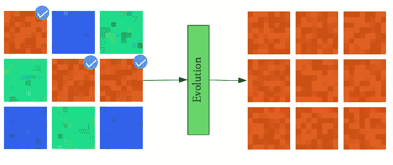

很明显，我们正在执行一个优化过程，在每个时间步生成更新、更好的样本。有趣的是，奖励/适应度函数(衡量一个样本有多“好”的函数)不是一个可微的数学函数。*是你*。您选择的选项可以简单地表示为 1 和 0 的向量，分别代表好的和坏的样本。

这种适合度函数的公式非常有用，因为它使我们不必定义(难以处理的)适合度函数来预测用户喜欢哪些样本。我们只是直接把控制权交给用户。然而，由于输出离散数字向量的函数显然是不可微的，所以我们不能在这里使用反向传播。

一类自然适用的优化方法是 ***遗传算法***【2】。目前，我们需要知道的是，它们的工作原理是将最佳样本的*与*的*特征*相结合，以产生更好的样本(交叉)，同时向特征添加一点随机噪声，以探索特征的变化(突变)。

样本不断“进化”以具有更好的特征，直到找到一个具有所有期望特征的样本。这种使用遗传优化来响应用户输入的方法被称为交互式进化计算(IEC)[【3】](https://en.wikipedia.org/wiki/Interactive_evolutionary_computation)。

## 什么是特色？

所以我们现在有一种方法可以进化我们的样本，但我们仍然有一个问题:什么是*特征？我们可以简单地将照片中的每一个像素定义为独一无二的特征。现在，我们要做的就是运行遗传算法，我们应该会得到很好的结果，对吗？*

*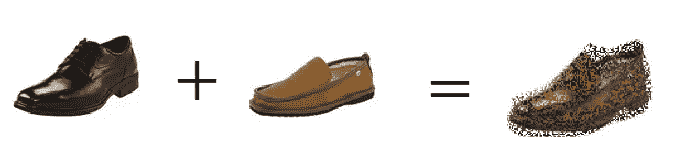*

*正如您所看到的，这种幼稚的方法几乎马上就会遇到问题。随机选取像素*而不是*不仅不能给我们*想要的*真实图像，而且也不能给我们真实图像。*

## *优化潜在向量*

*遗传算法的一个基本要求是用来表示信息的特征是独立的，或者至多是弱相关的。这使得特征可以被独立地组合和变异，并且仍然有希望获得离原始数据分布不太远的输出，也就是说，不太不切实际。*

*然而，对于大多数数据类型来说，不管领域(图像、文本、声音)， *raw* 特征往往彼此之间有很强的相关性。你不能随意优化一个特征，因为它是否真实强烈地依赖于它的邻居。*

*例如，拍摄一张树叶的照片，并从中选取任意三个相邻的像素。几乎可以肯定，三个像素的颜色都非常接近。毕竟，如果周围的像素都是绿色的，你不会期望只是随机看到一个红色的像素。事实上，如果您随机选取许多这样的像素三元组，并绘制其绿色通道的强度，您会发现几乎所有的三元组都位于整个 3D 空间的一个非常小的子集上，位于从 x，y，z = 0 到 x，y，z = 1 的对角线上，其中 x，y，z 是三个像素的绿色通道强度。这是因为，对于任何三重态，绿色强度彼此强烈相关。任何不在线上的三联体都不太可能是任何真实图像的一部分。*

*虽然上面的例子只使用了三个像素，但图像位于真实空间的一个小子集的核心思想适用于任何大小的图像。对于更大的空间，关系变得非线性，但是事实仍然是许多特征彼此高度相关。这个想法也适用于文本和音乐，句子中的单词显然依赖于它们的邻居，大多数随机产生的音乐听起来很糟糕，一点也不和谐。不考虑领域，大多数数据位于总空间的一个小的*子空间*中，用于表示数据，我们称之为*流形*。只有在这个*流形*上，数据才代表了人们认为*现实*的东西。*

*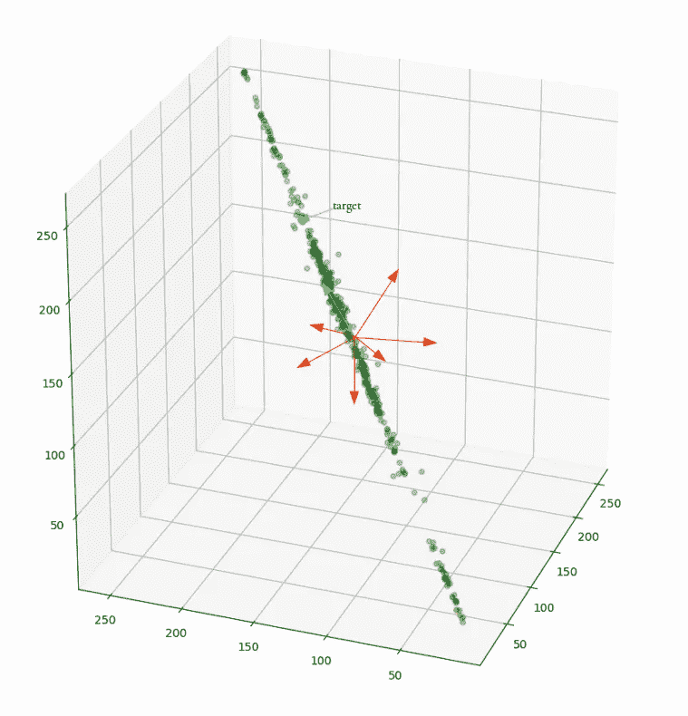*

*遗传算法本质上是随机优化算法，*随机地探索搜索空间。在流形上，它们的收敛很慢，因为它们生成的大多数样本一开始就不现实。你让*碰运气*通过时不时地生成一些像样的样本，沿着正确的方向缓慢前进，从而取得缓慢的进展。人类没有在真实的样本中给*打分，他们被迫给样本是否真实打分。*这种方法几乎肯定不会在任何合理的时间内收敛。**

**因此，通常还有其他的表现形式，比如 picbreeder.com 所使用的不断变化的函数组合，或者用几何形状来近似图像，等等。虽然这些方法确实极大地减少了搜索空间，其中局部结构保持了颜色的相似性，即没有随机噪声，但是从全局来看，大多数结构组合可能仍然没有意义或者不够真实。**

****

**While the pixel triplets here are realistic, the image at large is not (source: picbreeder.com)**

**搜索空间仍然太大，收敛太慢，因为即使在 picbreeder 上，你也需要数千次迭代才能生成一幅图像。**

## **这个想法**

**这就是这篇论文的发现所在，它真的可以总结为一句话:让我们优化生成模型的*潜在向量*而不是原始数据，以快速找到用户喜欢的样本。**

**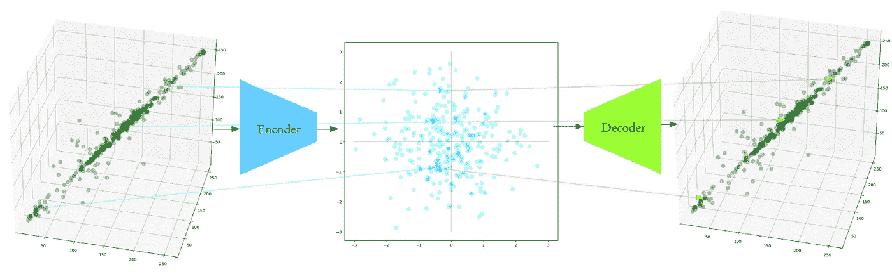**

**这是一个非常通用的解决方案，无缝融合了 IEC 方法和深度生成模型。许多生成模型通过使用潜在向量并将其传递通过解码器/生成器网络来创建真实样本。最重要的是，潜在向量通常是从 ***N*** (0 **，I** )分布中采样的，也就是说，每个分量是从随机正态分布中采样的，这些分量彼此独立(或者在 VAEs 的情况下，一个分量被迫非常接近它)。**

**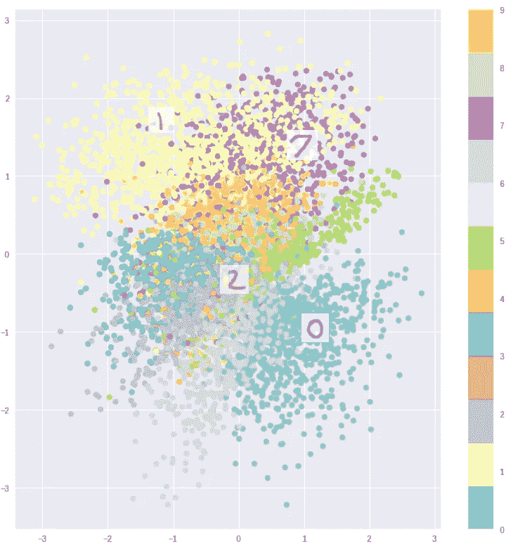**

**解码器然后学习将潜在空间的特定区域与特定种类的输出相关联。由于空间在较低维度的潜在空间中非常珍贵，解码器仅将潜在空间的区域“分配”给接近流形的相当真实的样本。简而言之，创建这些潜在向量是为了让*生成真实的样本*。在训练过程中，潜在向量的分量相互独立，解码器/生成器必须学会通过将*所有*这些向量与实际输出相关联来克服这一点。**

**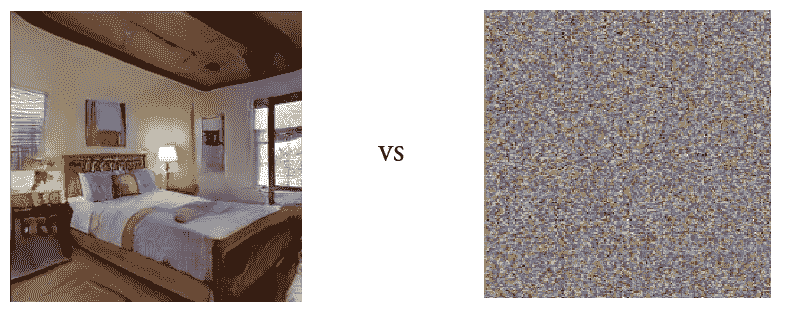**

**Sampling in latent vector space vs in input space (image on left from [Fig 6\. Karras et. al. (2017)](https://arxiv.org/abs/1710.10196))**

**通过随机采样并将潜在向量传递给生成器网络，您可以得到看起来稍微“不像”的样本，但它们仍然比真实输入空间上的随机采样更有可能接近真实，其中大部分只是纯粹的噪声。**

**由于潜在向量的分量在训练期间基本上彼此独立，现在人们可以自由地重新组合特征，同时在任何方向上随机添加噪声，并且仍然得到生成器“熟悉”的向量，从而产生真实的图像。**

**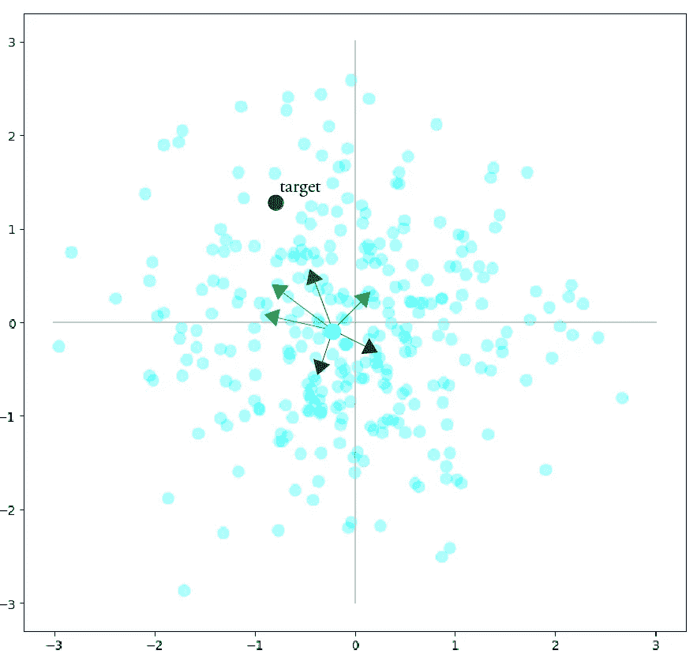**

**这确保了更快的收敛速度，因为我们可以更有效地探索低维空间的子集，而不是随机探索高维空间。换句话说，我们不是探索每一个可能的像素组合，而是探索产生真实图像的像素组合。**

## **该算法**

**最终的遗传算法适用于任何潜在向量生成模型。它假设您首先训练了一个创成式模型，然后继续执行以下操作:**

**A.**样本**:样本 *n* (为了便于说明，n=8) 与潜在变量的先验分布相同的随机向量(通常为*(0**，I** ))***

***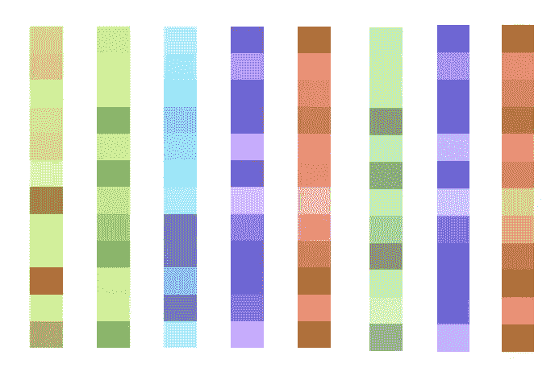***

***8 randomly generated latent vectors***

***B **。生成:**不断重复下面的步骤，直到用户找到一个拥有他想要的所有属性的样本，然后，终止这个过程。***

1.  *****选择**:要求用户选择样品，样品具有他们想要的一些属性。这些拟合样本的潜在向量被保留，而所有其余的被丢弃。***

***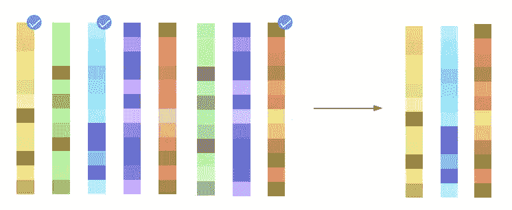***

*****2。交叉**:对于每批允许的 *n* 个总样本，除了分配给所选的和预定义数量的外来样本外，剩余部分用交叉样本填充。每个交叉潜在向量是通过选择任意两个所选潜在向量，并组合它们的向量分量而生成的，其中每个分量有 50%的机会来自任一父项。***

**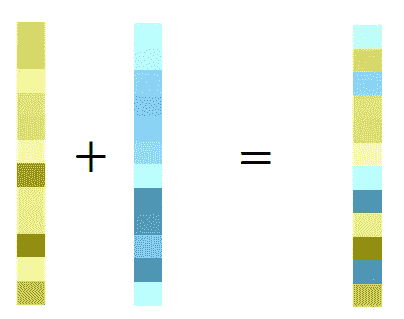**

****3。突变:**所有被选择和交叉的潜在向量现在都经历突变。每个潜在向量有 50%的机会经历突变，如果发生突变，向量的每个分量还有 50%的机会添加随机正态噪声，用户在每个时间步长设置标准偏差(σ) ϵ [0，1]，即突变的“强度”。σ = 0 对应于完全没有突变，而σ = 1 对应于矢量分量本身数量级的噪声。**

**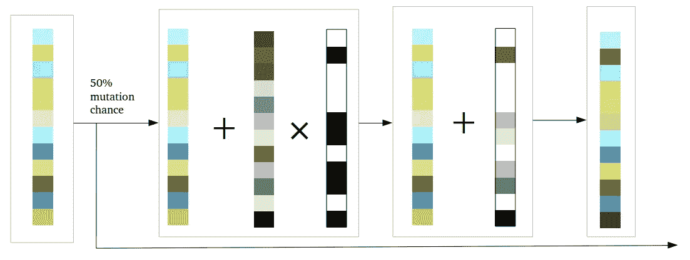**

****4。外来向量:**可能会出现没有一个样本具有用户想要的属性的情况。这可以通过突变慢慢收敛，但如果它是一个相当不同的属性，引入随机向量(与潜在变量先验分布相同)会更快，从而引入遗传多样性。用户可以将这些新样本与以前的样本进行交叉，以更接近所需的属性。**

**在一次优化的最后，我们得到一批这样的向量:**

**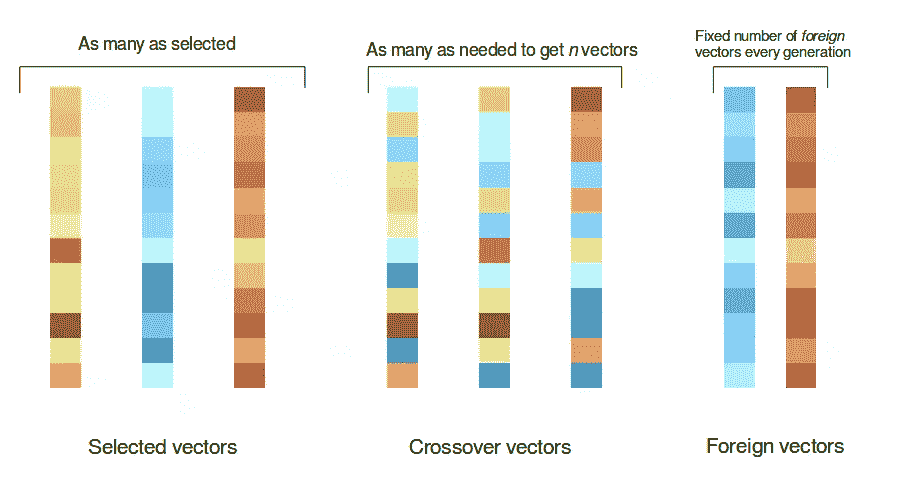**

**向量的总数在每次迭代中都保持不变(在我们的例子中是 8)，并且这批新的向量作为输入被传递回遗传优化过程的下一步，直到用户停止它。**

**这就是整个算法。收敛性要好得多，因为在论文中，当生成简单的图像时，用户通常只需 10 个生成步骤就可以获得他们喜欢的图像。**

# ****音乐一代****

**完成所有这些后，现在我们剩下要做的就是在音乐数据上训练一个生成模型，并执行上述进化过程。出于我们的目的，我们使用来自谷歌 Magenta 项目的预训练 VAE，music vae[【4】](https://nips2017creativity.github.io/doc/Hierarchical_Variational_Autoencoders_for_Music.pdf)2 小节旋律模型，并在其上测试潜在向量优化过程。**

**这个模型是一个 VAE，其中编码器是一个双向 LSTM，中间是一个采样层，末端是一个基于 LSTM 的解码器，产生单独的第 16 个音符事件。**

**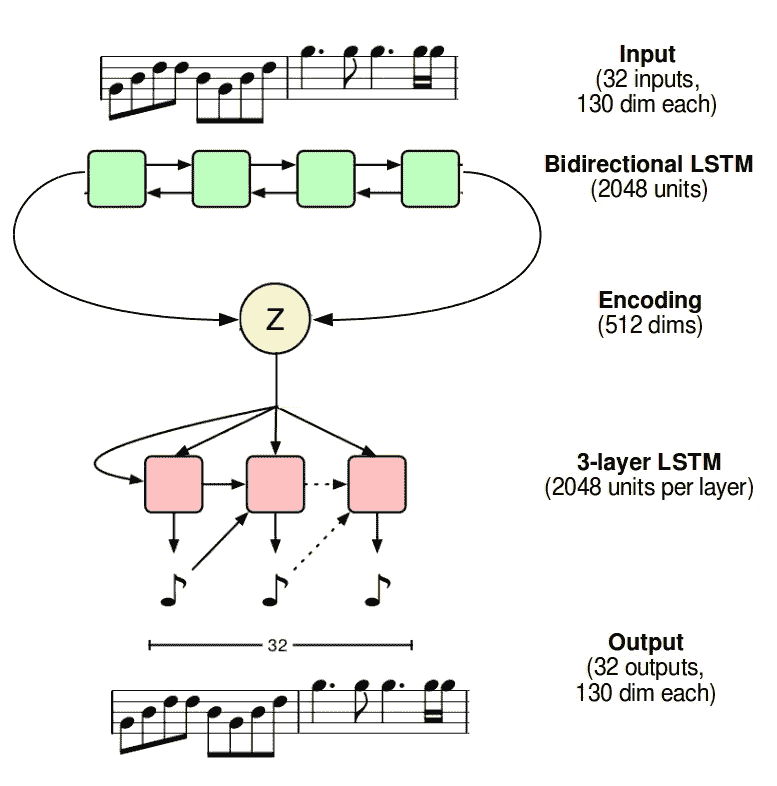**

**Structure of the 2-bar MusicVAE, linear layers omitted, modified from original paper**

**我们从 512 维的分布 *N* (0， **I** )中采样一些潜在向量，将其通过解码器，并对潜在向量不断执行遗传优化过程，直到我们得到我们所期望的结果。**

**我们从随机采样和解码潜在向量开始:**

**然后我们优化它。经过 8 代优化后，我们得到了这个:**

**没有人会认为这是一个突破，但仍然非常迷人。更重要的一点是，即使是音乐作品(尽管最初的领域是图像)的核心思想。对于更健壮的模型，仍然可以应用相同的方法来获得更好的结果。**

**另外，出于好奇，还有一本[合作笔记本](https://colab.research.google.com/drive/19AKhmNGVsLljpnQ9FoL858thZ9W_WrXX)可供选择。**

## **结论**

**我发现论文中概述的方法非常有趣，因为它最终似乎弥合了考虑人类偏好和深度生成模型之间的差距。深度学习不太可能*完全取代*人类在艺术领域的创造力，相反，它可能成为*增强*人类创造力的有力工具。关于插值已经取得了巨大的进步，本文也为探索方法提供了一种简洁的方法。随着每天都有更好的生成模型被发现，它必然会改进。**

**如果你在这篇文章中发现任何重大错误，请告诉我们，我会立即改正。如果你喜欢这篇文章，你可以在 Twitter [*这里*](https://twitter.com/irhumshafkat) *找到我。***

## **参考**

**1.[深度互动进化](https://arxiv.org/abs/1801.08230)**

**2.[遗传算法简介](/introduction-to-genetic-algorithms-including-example-code-e396e98d8bf3)**

**3.[交互式进化计算](https://en.wikipedia.org/wiki/Interactive_evolutionary_computation)**

**4.[分级变分音乐自动编码器](https://nips2017creativity.github.io/doc/Hierarchical_Variational_Autoencoders_for_Music.pdf)**